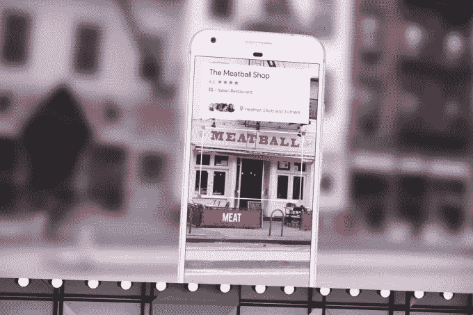

# 像谷歌镜头这样的视觉搜索产品可能会彻底改变网上购物

> 原文：<https://medium.com/hackernoon/visual-search-adoption-for-consumer-spaces-beyond-general-e-commerce-772d0e6ad322>

TechCrunch

8 月，谷歌宣布了其图片搜索中新的[徽章](https://techcrunch.com/2017/08/01/google-image-search-gets-more-like-pinterest-by-connecting-you-to-recipes-products-and-more/)，就在一天前，Pinterest 更新了其应用程序，将视觉搜索功能放在最前面。今年夏天的活动发生在 Pinterest 宣布 [Pinterest Lens](https://venturebeat.com/2017/02/08/pinterest-launches-lens-visual-search-in-beta-on-android-and-ios-in-the-u-s/) 的几个月之后，该产品允许用户用手机拍摄一个物体的照片，并在搜索结果中看到相关物体。它也紧随谷歌 5 月份宣布的[谷歌镜头](https://venturebeat.com/2017/05/17/google-lens-uses-computer-vision-to-see-the-world-around-you/)，该镜头使用机器[学习](https://hackernoon.com/tagged/learning)使用手机的摄像头进行实时视觉搜索。

尽管谷歌和 Pinterest 在视觉搜索领域处于领先地位，但其他专注于电子商务的科技公司也开发了视觉搜索，作为其搜索功能的一部分。今年 7 月，[易贝](http://www.businessinsider.com/ebay-is-looking-to-make-visual-search-the-future-of-shopping-2017-7)宣布计划为其移动应用推出两项人工智能视觉搜索功能，将于今年晚些时候推出。早在 2014 年，[亚马逊](https://techcrunch.com/2014/02/06/amazon-puts-image-recognition-into-its-main-ios-app-prepare-to-be-even-more-showroomed-retailers/)就在其移动应用中加入了图像识别功能。

到目前为止，视觉搜索最明显的用例是用于一般的电子商务目的。公司希望用户能够通过视觉搜索来搜索并最终购买产品。一些例子包括像谷歌或 Pinterest 这样的大型科技公司建立自己的视觉搜索功能，以及像 [West Elm](http://blog.clarifai.com/portfolio/west-elms-new-ai-tool-scans-pinterest-to-recommend-furnishings/) 这样的传统零售公司转向视觉搜索 API/服务初创公司，如 [Clarifai](http://clarifai.com/) 或 [Slyce](http://slyce.it/) 。

在一个一张照片胜过千言万语的世界里，很容易看到视觉搜索如何帮助用户找到一双新靴子或一个新沙发，以及这如何转化为消费者搜索的新时代。可以理解的是，普通电子商务，尤其是时尚和装饰，正在引领潮流。像这样的电子商务行业在其产品中具有最大的多样性和视觉细节。Slyce 的一项研究显示，39%的视觉搜索查询是关于服装的，31%是关于家居装饰的。

除了已经非常熟悉的一般用例之外，其他领域也可以从采用视觉搜索中受益。其中包括折扣服装行业、实体零售和艺术品市场。

## 折扣服装店

今年 5 月， [Wayfair](https://www.androidheadlines.com/2017/05/wayfair-debuts-visual-search-ai-backend.html) 推出了自己的视觉搜索工具(“带照片搜索”)，帮助购物者寻找家具。新功能背后的[战略](http://www.businessinsider.com/wayfairs-new-visual-search-feature-2017-5)的一部分是帮助 Wayfair 从折扣家具购物者那里获得更多销售。这些购物者现在可以将高端家具的照片上传到 Wayfair 上，看看网上商店是否提供类似但更便宜的替代产品。

传统折扣服装行业的公司也可以利用视觉搜索来帮助消费者找到他们的产品。这一领域的公司从设计师鞋仓库和 Burlington Coat Factory 等零售连锁店到 H&M 和 Forever 21 等快时尚电子商务公司不等。对于后一类产品，众所周知，它们是高级时装的复制品，比高档服装更快上市。采用视觉搜索似乎是帮助消费者以低价搜索高级时尚外观的自然之举。

## 实体零售商

在 Google I/O 2017 之后发布的一段 Google Lens 的[宣传视频](https://twitter.com/google/status/864891667723300864?lang=en)展示了用户从手机上对周围环境的实时视觉搜索。用户将手机指向一家店面，就会出现这家店面的谷歌地图结果。结果包含关于特定店面的信息，例如其名称、客户满意度、营业时间等。—很像目前谷歌地图中的搜索结果。

视觉搜索与地图的结合有可能将在线消费者吸引到线下的实体店面。它超越了前面提到的实时点击搜索的例子，可以用来增强付费搜索目前的运作方式。例如，一个零售品牌可以[调整它的付费搜索](http://www.geomarketing.com/how-bing-visual-search-can-promote-brick-and-mortar-discovery-and-deals)来提醒购物者它的一个产品在他们附近的商店有售。这是零售品牌扩展其全渠道战略的一种方式，包括在线和店内提货。它还可以让纯粹的实体小企业吸引更多的本地客流量。

## 美术画廊

用关键词描述一件艺术品可能相当困难——肯定比用关键词描述一件衬衫或一台咖啡机更具挑战性。5 月，视觉搜索 API/服务初创公司 [Visii](http://visii.com/) 与 [Artimage](https://www.artimage.org.uk/) 一起推出了一款视觉搜索工具，这是一个为英国视觉艺术空间提供的数字图像授权平台。Artimage 的新视觉搜索工具使用户能够在不到 [350 毫秒](http://www.create-hub.com/comment/first-artificial-intelligence-visual-search-for-uk-arts-sector/)的时间内梳理艺术品的 15，000 幅图像，以快速找到意想不到的宝石。

Artimage 并不是唯一一家在美术领域寻求将视觉搜索融入其业务的公司。总部位于伦敦的艺术市场初创公司 Artfinder 也有类似的雄心。在未来，很容易想象像 Artsy 这样的公司，它对超过 1800 个商业画廊进行分类，采用视觉搜索工具来帮助用户根据特定的视觉或风格偏好发现艺术品。

搜索的未来变得越来越可视化。当前视觉搜索的采用主要由大型科技公司主导，用于典型的电子商务用户案例。然而，这三个领域——折扣服装、实体零售和美术——可以真正受益于将视觉搜索作为其业务的一部分。那是值得留意的。

*此篇原载于*[*VentureBeat*](https://venturebeat.com/2017/09/15/visual-search-products-like-google-lens-could-revolutionize-online-shopping/)*。*