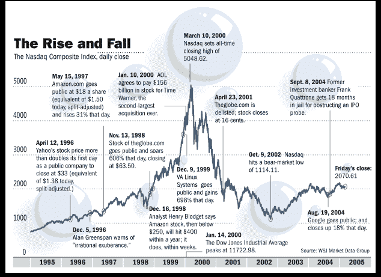

# [视觉 ICO 经济的指数繁荣、萧条和再生，即资金更少的互联网泡沫

> 原文：<https://medium.com/hackernoon/visual-the-exponential-boom-bust-and-rebirth-of-the-ico-economy-ie-dotcom-bubble-with-dumber-2429459d923e>

区块链的发展令人毛骨悚然地想起了互联网时代——缺乏经验、只有一个想法的创始人筹集了大量资金来制造产品并推向市场。

想法？你喜欢区块链吗？[比特币](https://hackernoon.com/tagged/bitcoin)？以太坊？你的加密硬币选择是什么？

请在下面的评论中自由讨论它的优点。这是泡沫吗？会爆吗？

Source: WriteOpinions.com

# **加密奖励:**

就此话题采访了几位密码专家。以下是他们的想法:

与[乔伊·克鲁格](https://medium.com/u/29c759230b77?source=post_page-----2429459d923e--------------------------------)、[吉尔·彭奇纳](https://medium.com/u/ca7d5a12c0ef?source=post_page-----2429459d923e--------------------------------)、安迪·布罗姆伯格——首席执行官[硬币清单](https://medium.com/u/88ecffe5cb1?source=post_page-----2429459d923e--------------------------------)和[卢·肯纳](https://medium.com/u/b01056393401?source=post_page-----2429459d923e--------------------------------)举行的加密货币的未来圆桌会议

欲了解来自思想领袖小组成员的更多见解，请查看以下内容:

[的乔伊·克鲁格预言了](https://medium.com/u/f4d568271227?source=post_page-----2429459d923e--------------------------------)和[潘迪拉资本](https://medium.com/u/d25fb22875fb?source=post_page-----2429459d923e--------------------------------)对 ico 和公开市场的未来

Hackernoon 的 Lou Kerner 谈加密货币和垄断的未来

吉尔·潘奇纳如何试图赔钱并击中 5 只独角兽以及加密货币的未来

# 在你走之前…

*如果你从这篇文章中得到了可操作的或有价值的东西，* ***点击👏下面的按钮*** *和* ***在脸书和推特*** *上分享文章，这样你的朋友也能从中受益。*