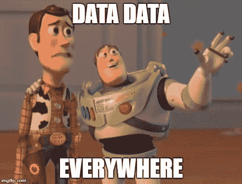
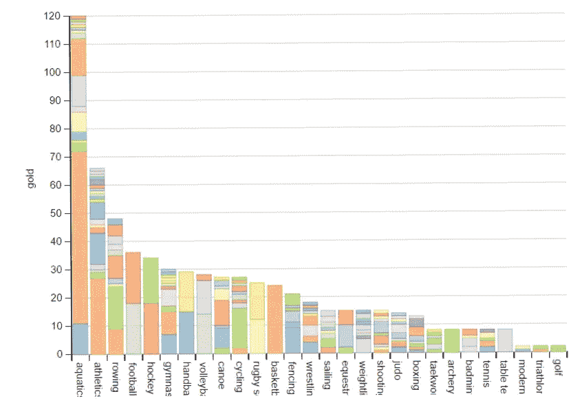

# 用 D3.js 和 dimple 在 JavaScript 中可视化数据

> 原文：<https://medium.com/hackernoon/visualizing-data-in-javascript-with-d3-js-and-dimple-7395681c4b74>

好的，这是另一篇关于数据可视化的文章(也是我第一篇关于媒体的文章)。嗯，这是因为这是一个非常重要的话题(也因为我没有别的东西可写:p)

那么，为什么是数据可视化，为什么是 D3.js 呢？如果您正在阅读这篇文章，那么您可能知道为什么数据可视化很重要，所以您可以跳过接下来的几行。现在，想象一下你有大量的数据，非常非常多，你必须找出一个模型来分析它。你看着数据，你感到困惑，你离开了你的工作，你失去了活下去的意愿……为了避免这种情况，你需要以更容易理解的形式来查看或*可视化*数据，比如图表、图形甚至地图。这就是数据可视化的用武之地。



但是为了这个，你需要编码一些东西来完成它，为此你需要库，而 [D3.js](https://d3js.org/) 是一个用 JavaScript 来完成它的库。JS 在数据科学中并不流行，但它是网络语言，可视化在这种媒体中是真正可展示和可移植的。此外，很多时候我们需要创建数据驱动的界面，如仪表板。

> **D3.js** 是一个基于数据操作文档的 JavaScript 库。

但是，为什么是酒窝？因为它将 D3.js 包装成非常简单的数据可视化。它用 svg、动画和其他东西为你做繁重的工作。

> dimple 的目标是向分析师开放 d3 的功能和灵活性。它的目标是给出一个温和的学习曲线和最少的代码来完成一些有成效的事情。它还公开了 d3 对象，这样你就可以拿起它们运行来创建一些非常酷的东西。

# **好了，我们开始吧**

好了，该动手了…我们将挑选一个数据集，并使用简单的酒窝图来可视化它。今天我们将使用来自 [Kaggle 数据集](https://www.kaggle.com/datasets)的 [*2016 年里约热内卢奥运会*数据集](https://www.kaggle.com/rio2016/olympic-games)。

现在，我们需要一个网页…让我们创建一个名为 rio.html 的 HTML 文件，并在头部标签，附加必要的脚本。

```
<script src="http://d3js.org/d3.v3.min.js"></script> 
<script src="http://dimplejs.org/dist/dimple.v2.0.0.min.js"></script>
```

好了，让我们用一个 id 为“chartContainer”的 div 作为占位符来显示图表。

```
<div id="chartContainer">...</div>
```

在…的地方，我们将有我们的脚本，加载数据并绘制图表。

首先，我们要创建一个条形图来显示不同国家不同运动项目的金牌分布情况。不同的民族会用不同的颜色表示。相信我，我们将用不到 10 行 JavaScript 代码完成所有这些工作。


当然，我们会的！

所以，看一下代码。

让我们抓住我写的东西。

首先，我为 div 创建了一个 SVG 来显示图表。dimple.newSvg 函数将 string 作为第一个参数，这是一个选择器字符串(与 CSS 选择器字符串相同),用于选择占位符 html 标记来显示图表。我们使用“#chartContainer”指向 id 为“chartContainer”的 div。其他参数指定维度。

接下来，我们加载我们的。csv 文件，d3.csv 函数有两个参数，第一个是。csv 文件，第二个是数据加载完成时要调用的函数，这个函数必须接受一个包含从 csv 文件中获取的数据的参数。

然后我们创建一个 *dimple.chart* 实例，将 svg 实例和我们获取的数据传递给它的构造函数，我们将使用这个图表实例来可视化数据。

然后我们用 addCategoryAxis 将轴相加，x 轴代表运动项目，y 轴代表获得的金牌数。当我们有离散的类别或类和 MeasureAxis 时，当我们有一个数值时，就会添加 CategoryAxis。还有更多类型的轴，您可以在文档中找到(最后的链接)。

然后我们将添加一个*系列*，它设置图表的系列属性，将两个轴连接在一起并呈现图表。在这里，我们的系列将是“国籍”。我们还提到了系列所需的情节类型，因此我们传递了 *dimple.plot.bar* ，因为我们需要一个条形图。您可以使用不同的图表添加多个系列。

我们可以有不同类型的图，像酒窝。图。面积，酒窝。图。气泡和酒窝。图。线，继续，尝试所有这些。

最后，我们调用 chart 实例的 *draw()* 函数来显示图形。

打开您拥有的目录。csv 和 HTML 文件，并使用 python 的 http.server 模块启动一个简单的 HTTP 服务器。(此处使用 Python3.5)

```
python -m http.server
```

然后在浏览器中转到 localhost:8000/rio.html。



Here’s what it renders.

将指针悬停在图表的各个部分上，会向您显示它所代表的国籍。

这张图表让我们对各国在不同体育项目上的表现有一个粗略的了解，例如，看看美国在篮球上的惊人表现，或者中国在乒乓球上的惊人表现。

是的，而且我们可以用如此少的工作做所有这些。


因此，人们更多地修补库，尝试各种图表，并使用各种来源的数据。

# 进一步学习

1.  [酒窝文档](https://github.com/PMSI-AlignAlytics/dimple/wiki)。
2.  [D3 文档](https://github.com/d3/d3/wiki)。
3.  [酒窝示例](http://dimplejs.org/examples_index.html)。
4.  [Siraj Raval 的这个超赞的 YouTube 视频](https://www.youtube.com/watch?v=sEpRzyPRH0s)。

各位，这是我第一篇媒体文章，小毛病见谅。如果你有任何问题，请点击评论，如果你用 D3 或酒窝做了一些令人惊讶的事情，请留下链接。请大家分享支持我；)

[***点击查看我的 Youtube 节目频道了解更多！！*🤓🤓*我需要你的爱***](https://www.youtube.com/channel/UCgY3bHW4qHKq9aC4i3nO-0g)

再见了。