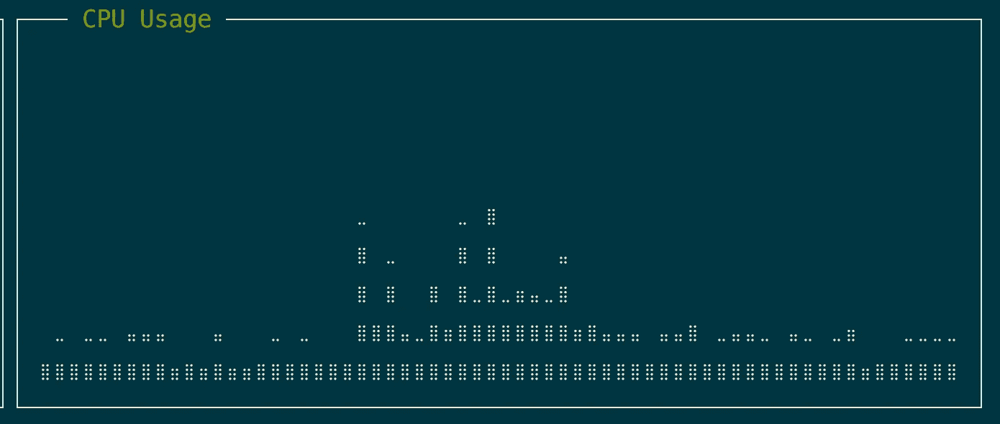
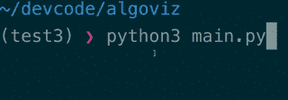

# 使用 lehar 可视化终端中的数据

> 原文：<https://medium.com/hackernoon/visualizing-data-in-terminal-using-lehar-7cfded09c1ad>

> 有时候，洞察力可以从数据的可视化中获得，而不是盯着它。

**TL；博士:**这篇文章是关于一个终端可视化工具 **lehar** ，它在 https://github.com/darxtrix/lehar[开源](https://github.com/darxtrix/lehar)

上周在黑 ptop 的时候，我想给它添加一个网络传感器，但是我一直在想如何把它呈现给最终用户。提醒一下， [ptop](http://darxtrix.in/ptop/) 是 [Python](https://hackernoon.com/tagged/python) 中的一个任务管理器，我在 2015 年的时候曾做过这个兼职项目。它继续冲击 GitHub 上的[趋势](https://github.com/trending)库列表。

网络传感器基本上会向用户显示网络上当前的传入/传出数据。例如，显示 CPU 信息的 [ptop](http://darxtrix.in/ptop) 的 **CPU 传感器**如下所示:

CPU usage info in ptop

我们可以从中得出的一个区别是，对于 CPU、内存等传感器，我们有一个[上限](https://en.wikipedia.org/wiki/Upper_and_lower_bounds)，但是对于网络传感器，我们没有上限。因此，可视化应该使用户明白，与点 **t2** 相比，点 **t1** 处的网络利用率更高，同时显示上行速度&下行速度，因此这里需要**数据的相对排序。**

我试着用标准的[排序](https://en.wikipedia.org/wiki/Sorting)问题打个比方，数据在某个时间点可以和网速一样随机(排序情况下的位置)。因此，我想想出一种方法来显示在标准排序算法的情况下的移动(交换),例如像这样的 GIF:

Spark 提供了一个 shell 命令来从 T2 数据中创建这样的可视化效果，但是我找不到任何 Python 库。所以我写了 [lehar](https://github.com/darxtrix/lehar) 。 [lehar](https://github.com/darxtrix/lehar) 可以作为 **Python2** 和 **Python3** 模块使用，同时也可以作为 shell 命令使用。代码在 [GitHub](https://github.com/darxtrix/lehar) 开源

[lehar](https://github.com/darxtrix/lehar) 用数据的**相对排序**来表示。例如，
数据= [1，2，3，4，5]将表示为▂▄▅▇█(增加高度)

要绘制这样的可视化效果，只需在你的 **Python** 代码中调用简单的 [lehar](https://github.com/darxtrix/lehar) API。例如，我用来绘制上述可视化效果的代码是对标准的[选择排序](https://en.wikipedia.org/wiki/Selection_sort)程序的一个小小的修改，其中不是将较小的元素移动到数组的前面，而是将较大的元素移向末尾。除此之外，我们只是在第 10 行打印部分排序的数据，并在第 21 行给出一个时间延迟，在下一行跟随一个[回车](https://en.wikipedia.org/wiki/Carriage_return)以在终端的同一行打印内容

是的，lehar 也支持颜色！

最后，网络传感器可以像这样与网络状态一起显示:

Network visualization ptop

你可以投稿到 [lehar](https://github.com/darxtrix/lehar/) ，在[https://github.com/darxtrix/lehar/](https://github.com/darxtrix/lehar/)找到使用说明

如果你喜欢这个故事，请击掌。对于任何评论/想法或任何在终端中显示此信息的替代方法，请在此评论。

**大家在 Twitter 上分享连线** [@darxtrix](https://twitter.com/darxtrix)