# 使用 Keras 和 Cats 可视化部分卷积神经网络

> 原文：<https://medium.com/hackernoon/visualizing-parts-of-convolutional-neural-networks-using-keras-and-cats-5cc01b214e59>

众所周知，卷积神经网络(CNN 或 ConvNets)是过去几年深度学习领域许多重大突破的来源，但对大多数人来说，它们相当不直观。我一直想分解 ConvNet 的各个部分，看看每个阶段后的图像是什么样的，在这篇文章中我就是这么做的！

## CNN 高层

首先，ConvNets 擅长什么？ConvNets 主要用于在图像中寻找模式。你通过对图像进行卷积并寻找模式来做到这一点。在 CNN 的前几层，网络可以识别线条和拐角，但我们可以通过我们的神经网络传递这些模式，并随着我们的深入开始识别更复杂的特征。这一特性使得 CNN 非常擅长识别图像中的物体。

# 什么是 CNN？

CNN 是一种神经网络，通常包含几种类型的层，其中一种是**卷积层**，以及**汇聚层**，和**激活层**。

## 卷积层

为了理解 CNN 是什么，你需要理解卷积是如何工作的。想象一下，你有一个 5x5 数值矩阵的图像，你拿一个 3x3 的矩阵，在图像周围滑动那个 3x3 的窗口。在 3x3 访问的每个位置，将 3x3 窗口的值乘以图像中当前被窗口覆盖的值。这将产生一个数字，表示图像窗口中的所有值。为了清楚起见，这里有一个漂亮的 gif:

如您所见，特征矩阵中的每一项都对应于图像的一部分。请注意，核矩阵的值是 gif 的角上的红色数字。

在图像上移动的“窗口”被称为**内核**。内核通常是方形的，对于小型图像来说，3x3 是相当常见的内核大小。窗户每次移动的距离称为**步距**。另外值得注意的是，当执行卷积时，图像有时会在周长周围填充零，这会抑制图像边缘周围卷积的值(通常照片的中心更重要)。

卷积层的目标是**滤波。**当我们在图像上移动时，我们会有效地检查图像中该部分的模式。这是因为**滤波器、**表示为向量的权重堆栈，它们与卷积输出的值相乘。当训练一幅图像时，这些权重会发生变化，因此当需要评估一幅图像时，如果它认为它看到的是以前见过的模式，这些权重会返回高值。来自各种过滤器的高权重的组合让网络预测图像的内容。这就是为什么在 CNN 架构图中，卷积步骤用方框表示，而不是矩形；第三维表示过滤器。

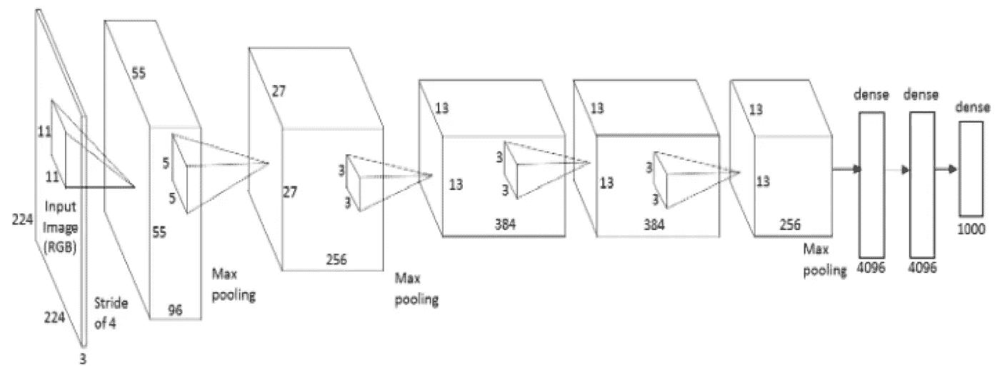

Architecture of AlexNet

## 需要注意的事项:

*   卷积的输出(在宽度和高度上)小于原始图像
*   在内核和内核下的图像窗口之间应用线性函数
*   过滤器中的权重是通过查看大量图像来学习的

## 池层

池的工作非常像卷积，我们用一个**内核**在图像上移动内核，唯一的区别是应用于内核的函数和图像窗口不是线性的。

**最大池**和**平均池**是最常见的池功能。最大池取内核当前覆盖的映像窗口中的最大值，而平均池取窗口中所有值的平均值。

## 激活层

激活层的工作方式与其他神经网络完全一样，一个值通过一个函数传递，该函数将该值压缩到一个范围内。这里有一堆常见的:

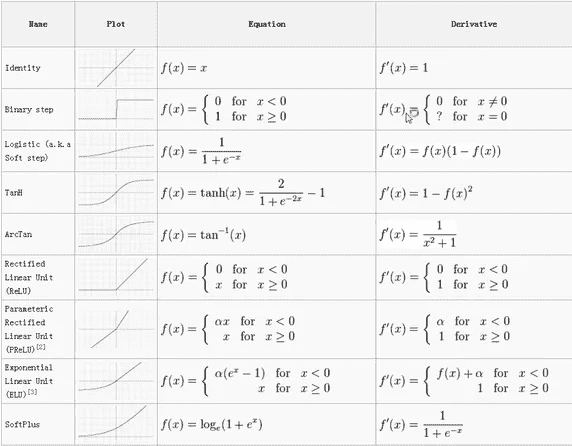

CNN 中最常用的激活功能是 relu(整流线性单元)。人们喜欢 relus 的原因有很多，但一个很大的原因是因为它们执行起来非常便宜，如果数字是负数:0，否则:数字。便宜使得训练网络更快。

## 概述

*   CNN 中三种主要类型的层:**卷积、汇集、激活**
*   **卷积层**将图像窗口乘以内核值，并使用梯度下降随时间优化内核权重
*   **池层**使用单个值描述图像的窗口，该值是该窗口的最大值或平均值
*   **激活层**将值压缩到一个范围内，通常为[0，1]或[-1，1]

# CNN 看起来像什么？

在我们进入 CNN 之前，先了解一点背景。90 年代 Yann LeCun 首次成功应用了 ConvNets，他发明了一种叫做 LeNet 的东西，可以用来阅读手写数字。自那以后，计算技术的进步和强大的 GPU 让研究人员变得更加雄心勃勃。2010 年，斯坦福视觉实验室发布了 ImageNet。 Image net 是 1400 万张图片的数据集，带有详细描述图片内容的标签。它已经成为研究界比较 CNN 模型的标准之一，当前最好的模型将成功检测 94%以上图像中的对象。不时有人进来打破 imagenet 上的最高分，这是一件大事。2014 年是 GoogLeNet 和 VGGNet，之前是 ZF 网。CNN 应用于 imagenet 的第一个可行的例子是 2012 年的 AlexNet，在此之前，研究人员试图使用传统的计算机视觉技术，但 AlexNet 在这一点上超过了其他任何东西约 15%。

不管怎样，让我们看看 LeNet:

LeNet architecture

该图未显示激活功能，但架构如下:

输入图像→conv player→Relu→max pooling→conv player→Relu→max pooling→隐藏层→Softmax(激活)→输出层

# 去找猫！

这是一只猫的图像:

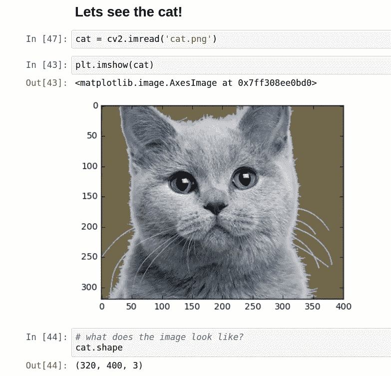

That’s a good looking cat

我们的猫的图片有 320 像素的高度，400 像素的宽度，和 3 个颜色通道(RGB)。

## 卷积层

那么一层卷积之后他是什么样子的呢？

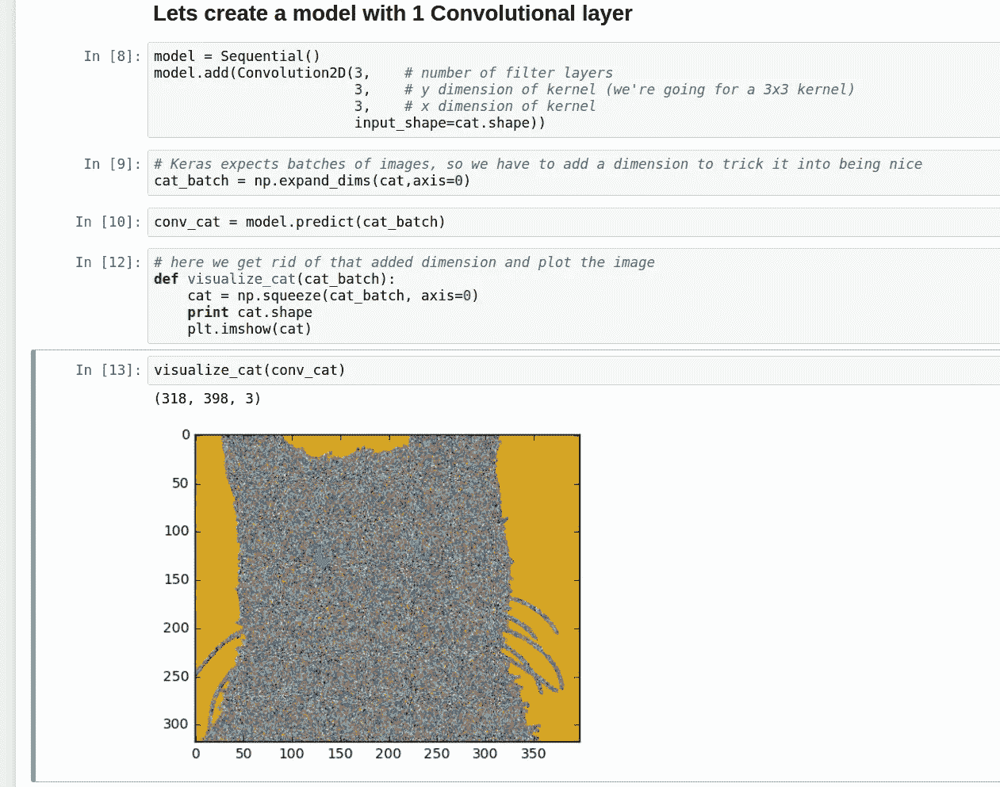

1 convcat

这是一只内核大小为 3x3 的猫，有 3 个滤镜(如果我们有 3 个以上的滤镜层，我们就不能绘制猫的 2d 图像。众所周知，高维度的猫很难对付。).

正如你所看到的，这只猫真的很吵，因为我们所有的权重都是随机初始化的，我们还没有训练网络。哦，它们都在彼此之上，所以即使每一层都有细节，我们也看不到。但是我们可以分辨出猫的一些区域，比如眼睛和背景的颜色是一样的。如果我们将内核大小增加到 10x10 会怎么样？

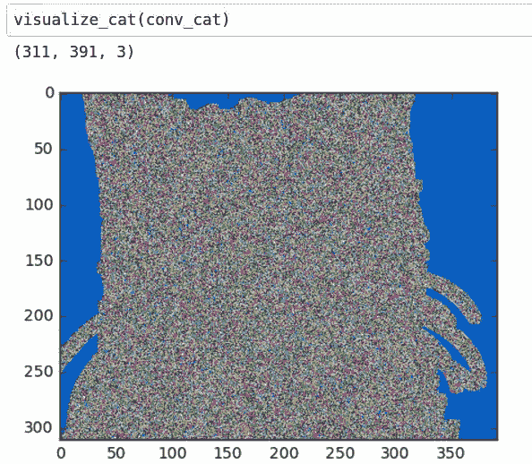

正如我们所见，由于内核太大，我们丢失了一些细节。还要注意图像的形状稍微小一点，因为内核更大，而且数学控制着一切。

如果我们把它缩小一点，这样我们可以更好地看到颜色通道，会发生什么？

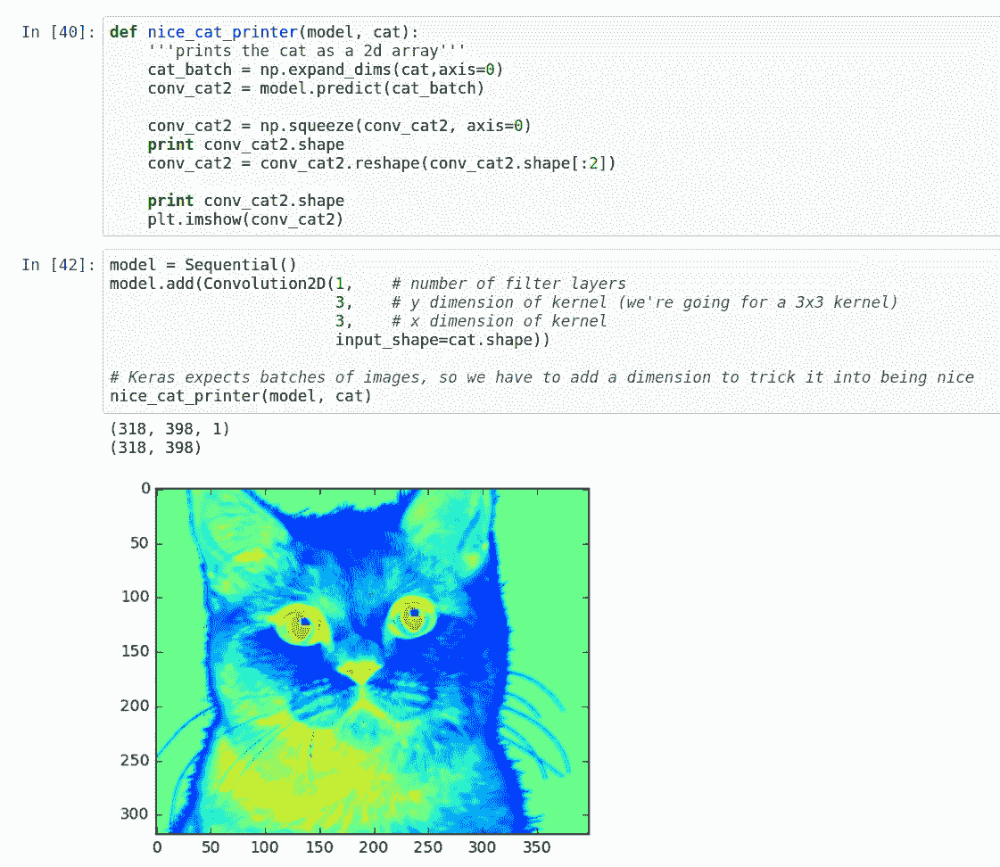

好多了！现在我们可以看到我们的过滤器看到的一些东西。看起来红色是真的喜欢黑色的鼻子和眼睛，蓝色是挖掘出猫轮廓的浅灰色。我们可以开始看到该层如何捕捉照片中一些更重要的细节。

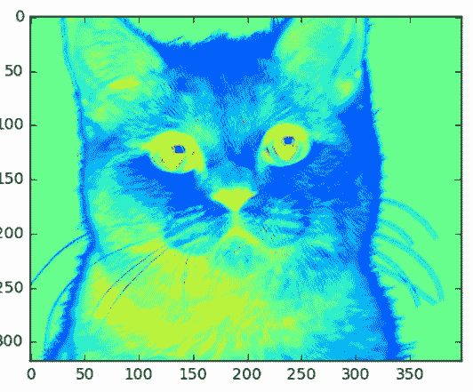

3x3 Kernel convcat

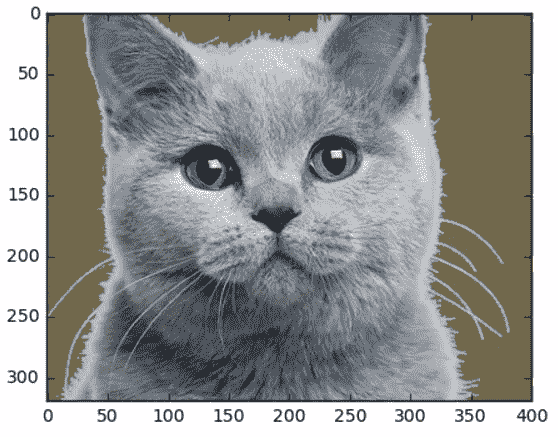

Original

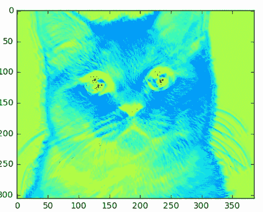

15x15 pixel kernel size

如果我们增加内核的大小，现在我们得到的细节更少了，但图像也比其他两个小得多。

## 添加激活层

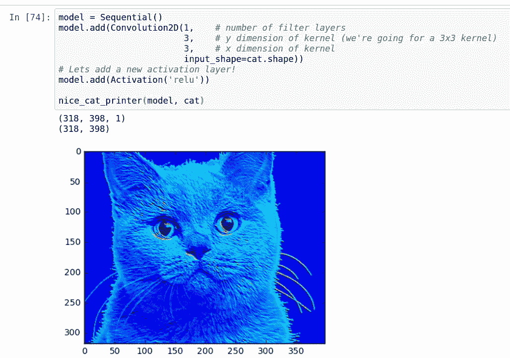

\reluCat

我们通过添加一个 relu 去掉了许多不蓝色。

## 添加池层

我们添加了一个池层(去掉了激活，使它更容易显示)

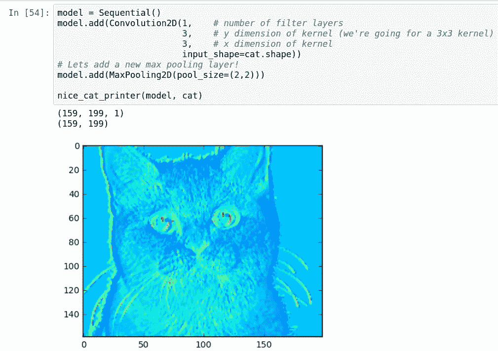

2x2 pool size

不出所料，这只猫块头更大，但我们可以走得更大！

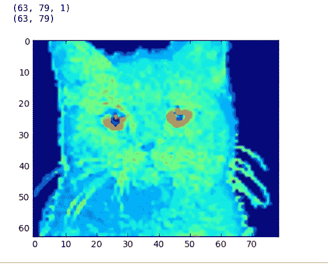

PoolCat with a 5x5 pool size. All your poolz belong to us

请注意，现在的图像大约是原来的三分之一大小。

## 激活和最大池化

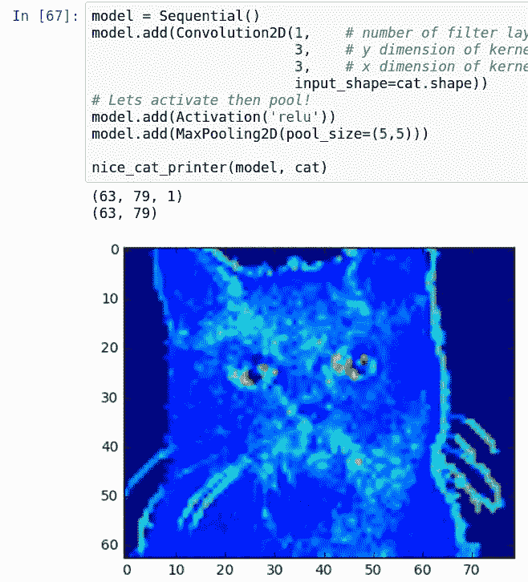

## LeNet 猫

如果我们让猫通过 LeNet 的卷积和池部分，它们看起来会是什么样子？

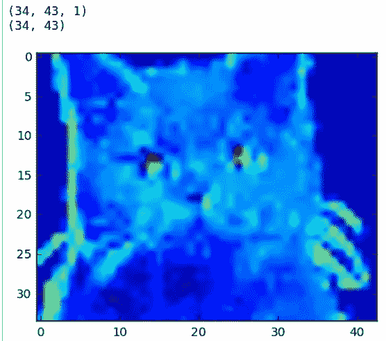

1 filter for each conv layer

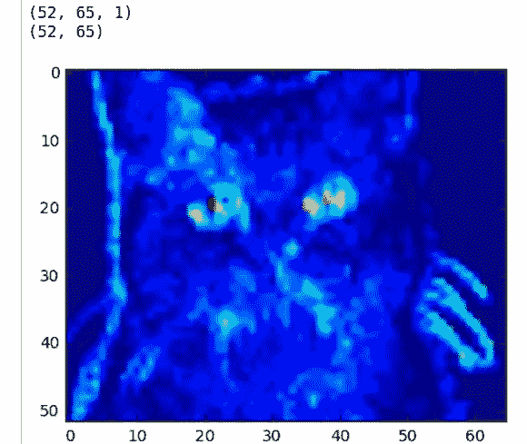

3 filters in first conv layer, 1 in second conv later

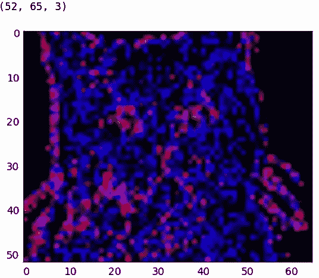

3 filter layers in each convolution

# 结论

ConvNets 功能强大，因为它们能够提取图像的核心特征，并使用这些特征来识别包含类似特征的图像。即使有了我们的两层 CNN，我们也可以开始看到网络对猫的胡须、鼻子和眼睛等部位给予了很多关注。例如，这些类型的特征将允许 CNN 区分猫和鸟。

CNN 非常强大，虽然这些可视化并不完美，但我希望它们能帮助像我这样仍在学习如何更好地推理 CNN 的人。

所有代码都在 Github 上:[https://github.com/erikreppel/visualizing_cnns](https://github.com/erikreppel/visualizing_cnns)

在 Twitter 上关注我，我是@ [程序员](https://twitter.com/programmer)(是的，说真的)。

## 更多资源

[安德烈·卡帕西的 cs231n](http://cs231n.github.io/convolutional-networks/)

文森特·杜默林和弗朗切斯科·维辛的深度学习卷积算法指南

> [黑客中午](http://bit.ly/Hackernoon)是黑客如何开始他们的下午。我们是 [@AMI](http://bit.ly/atAMIatAMI) 家庭的一员。我们现在[接受投稿](http://bit.ly/hackernoonsubmission)并乐意[讨论广告&赞助](mailto:partners@amipublications.com)机会。
> 
> 如果你喜欢这个故事，我们推荐你阅读我们的[最新科技故事](http://bit.ly/hackernoonlatestt)和[趋势科技故事](https://hackernoon.com/trending)。直到下一次，不要把世界的现实想当然！

