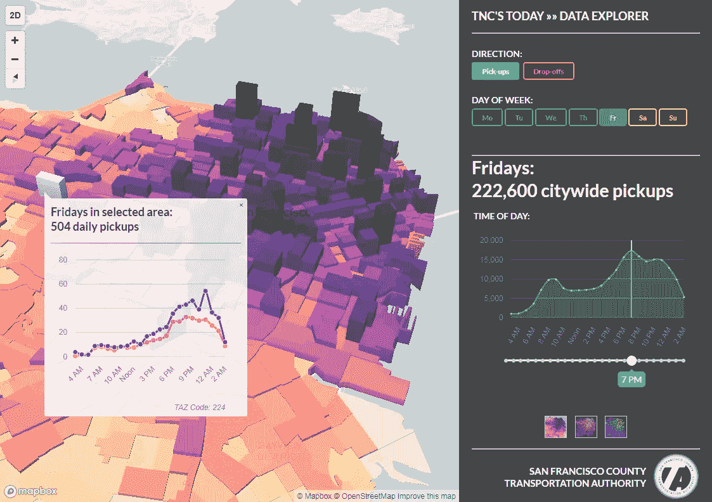
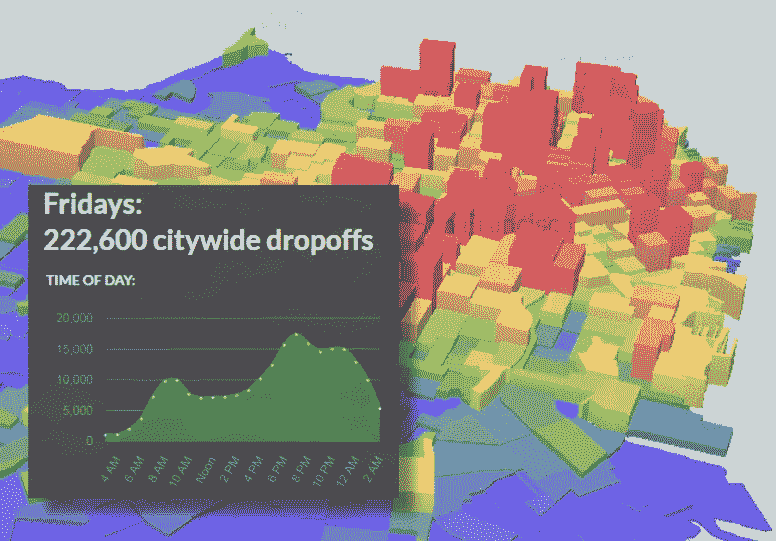
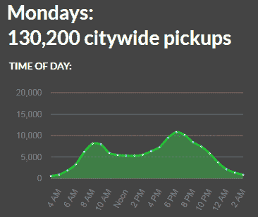
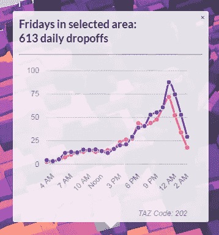

# 可视化优步和 Lyft 在三藩市的旅行:每天超过 200，000 次。

> 原文：<https://medium.com/hackernoon/visualizing-uber-and-lyft-usage-in-san-francisco-928208b1978a>

*最新数据，可视化！*

旧金山县交通局刚刚发布了一些[前所未有的数据摘要](http://www.sfcta.org/tncstoday)[的](https://hackernoon.com/tagged/uber)优步和 Lyft 在这个海湾城市的使用情况。这两个拼车服务加起来每天超过 200，000 次。！)在 2016 年秋季典型的周五——这还只是计算完全在城市范围内的出行。

我正在与运输管理局合作完成一些其他的数据可视化任务，当时他们问我们正在构建的平台是否也可以用来帮助探索这个新的数据集。这是我们想出来的。

## “今日跨国公司”数据浏览器

Click to explore more than 200,000 daily Uber and Lyft trips in San Francisco

在公共部门，拼车服务被称为运输网络公司，或“跨国公司”。官方报告和数据本身在国家食品药品监督管理局的网站上

[**或点击此处直接进入 SFCTA“今日跨国公司”数据浏览器**](http://tncstoday.sfcta.org) 。

有很多可看的:

*   您可以按一周中的某一天来选择视图，并且可以浏览全天的总量或关注特定小时内的行程。
*   点击地图上的任何一个街区，都会弹出该地区每日的接送图表。例如，您可以切换到一周中的不同日子，看看星期一和星期五有什么不同。
*   尝试一下 2D 和 3D 视图:3D 视图真实地显示了一周中不同日子 TNC 在城市中活动的惊人模式，而 2D 视图使点击和探索各个位置变得更加容易。

Fridays have the most daily trips on average. You can easily see the commute “humps” during the AM and PM rush hours — when traffic is already at its worst. You can also see a lot of evening and late-night trips, which aren’t as prevalent mid-week.

该数据是对跨国公司司机接送情况的估计。研究人员分析了每个*司机*宣布、*“我接受了一次旅行”*或*“我现在有空了”时的经纬度坐标和时间戳*这与乘客的始发地和目的地并不完全相同，但就跨国公司对道路交通和拥堵的影响而言，知道驾驶员的车辆何时何地开始和结束移动可能就足够了。作为一名骑自行车的人，我并不太在乎阻塞巴伦西亚街自行车道的汽车是让乘客上车还是下车:一样的区别。

注意:该数据集代表 2016 年秋季期间几周数据收集的平均值，按一周中的某一天总结为一个小时的时段。仅捕获两端都在旧金山市范围内的行程；因此，这可能是对优步和 Lyft 在该城市的总车辆出行量的低估计。

## 数据中值得注意的金块

*   周日和周一的跨国公司旅行次数最少，周二、周三和周四的旅行次数逐渐增加，周五和周六的旅行次数最多

Trips in Ubers and Lyfts go up and up as the week progresses.

*   工作日有一个可预测的通勤模式，在上午和下午高峰两个高峰。星期五和星期六比其他日子有更多的夜间旅行，延伸到深夜
*   优步和 Lyft 的出行在城市的东北象限更加频繁，基本上是在凯萨·查维斯以北和迪维萨德罗以东，全天和全天的所有时间
*   著名的旅游景点，如渔人码头、金门大桥和 GG 公园博物馆很容易看到，并且与市中心相比有非常不同的时间分布
*   周末热点出现在周五和周六晚上:卡斯特罗、米申/巴伦西亚、北海滩、棒球场和许多其他地方

Lots of late-night trips to and from the Castro on Friday nights. 🍸🍸

也有一些奇怪的事情。一些地区仅在一天中的特定时间出现疯狂的高峰，而其他地区似乎有很多跨国公司的旅行，尽管这些地方没有什么特别独特的地方。

也许你们中的一个能对这些热点提出一些解释；或者它们只是数据集中的噪音。

## 这一切意味着什么？

旧金山交通管理局很快指出:目前还没有对这些数据做出政策判断。数据现在简单地“摆在那里”。

# 在公共部门利用开源

我们已经选定了一套完全开源的技术，作为该机构即将开展的数据可视化工作的基础。这些不仅仅是“免费工具”——这些组件的组合产生了比我所能想象的任何现成产品更灵活、更强大的东西。

**后端。**数据库为 [PostgreSQL](https://www.postgresql.org/about/) 带 [PostGIS 空间扩展](http://postgis.net/)。对于这个项目，只提供了块级汇总(称为*“流量分析区域”*)，所以我们在这里不处理任何种类的“大数据”。任何数据库都足以存储，但 PostGIS 扩展允许我们做一些很酷的事情，如地理编码、空间缓冲区、路径和偏移。波斯特吉斯太棒了。

前端需要以某种方式与数据库对话；为此，我们选择了 [PostgREST](https://postgrest.com/en/v0.4/index.html) ，因为它有非常简单的 RESTful API 和简单的配置。PostgREST 位于该机构的 NGINX 反向代理之后，为分配 URL 端点提供安全性和灵活性。

**前端。**我们利用了尽可能多的预建库来快速启动和运行这个项目。此外，旧金山想要一个现代化的网络工具，便于员工维护，所以我不能选择任何深奥的利基产品。在尝试了一些替代方案后，我们决定:

*   [GitHub 页面](https://pages.github.com/)为静态站点服务。所有的代码都已经在 GitHub 上了，所以继续使用它们作为主机是有意义的。静态站点意味着没有服务器需要维护或被黑客攻击。如果从现在开始我可以为所有的东西建立静态站点，我会的。令人失望的是，在自定义域上获得 SSL 支持非常困难。
*   [Vue.js](https://vuejs.org/) 为模板和活性元素；学习和使用这个框架是一件多么愉快的事情。
*   用于交互式 2D/3D 地图的 Mapbox GL JS 。我原本想坚持完全开源的[传单](http://leafletjs.com/)，但是我们真的很喜欢 Mapbox 中的 3D 功能。如果我们的数据在 3D 中不是如此漂亮，我们会使用传单。
*   使用 [Morris.js](http://morrisjs.github.io/morris.js/index.html) 的交互式图表
*   [闪亮漂亮按钮的语义 UI](https://semantic-ui.com/)
*   [Modern es 2015](http://javascript.info/)[JavaScript](https://hackernoon.com/tagged/javascript)，通过 [webpack](https://webpack.js.org/) 和 [babel](https://babeljs.io/) 获得广泛的浏览器支持(但不是*所有的*浏览器:我们在 IE11 划清了界限)

在测试了最初的几次迭代后，我开始担心我们会从互联网上获得比我们最初设想的这个内部工具更多的关注。为了避免黑客新闻使我们的数据库服务器过载，我们进行了重构，加载一个包含主数据集的静态 zipfile，而不是在每次页面点击时从数据库中获取一个巨大的 GeoJSON 查询。我们将在接下来的几天里看看这种方法如何持续下去。

最终，这整个事情变成了不到 1000 行 JavaScript 代码。呜哇！

## 下一步是什么？

旧金山希望继续研究跨国公司对这座城市的影响，并拥有大量其他交通数据。我们将建立一个完整的数据门户，在接下来的几个月里探索几个不同的数据集。

同时，享受使用该工具的乐趣吧！

## *学分*

如果没有旧金山县交通局的员工和领导的远见和财政支持，这一切都不可能实现——这意味着*你*，如果你在旧金山缴纳销售税的话！谢谢你的慷慨支持。

我站在巨人的肩膀上，他们创造了这个巨大的生态系统，这个生态系统由奇妙的开源工具组成，免费获取。我写的所有代码都可以在 GitHub 上找到[——我希望你也能找到重新混合它并在你的城市使用它的方法。](https://github.com/sfcta/tncstoday)

## 关于我

嗨！我是比利·查尔顿，[因为有限责任公司](http://okbecause.com)的创始人，也是西雅图[普吉特海湾地区委员会](http://www.psrc.org)的前数据主管。我主要从事交通规划领域，因为它对我们的城市和日常生活有着如此直接的影响。我目前住在旧金山。我也可以为你的城市做数据可视化！

我的联系信息在[我的网站](http://okbecause.com/)上，我也在 [GitHub](https://github.com/billyc) 和 [Twitter](https://twitter.com/billyinsf) 上。

干杯！

> [黑客中午](http://bit.ly/Hackernoon)是黑客如何开始他们的下午。我们是 AMI 家庭的一员。我们现在[接受投稿](http://bit.ly/hackernoonsubmission)并乐意[讨论广告&赞助](mailto:partners@amipublications.com)机会。
> 
> 如果你喜欢这个故事，我们推荐你阅读我们的[最新科技故事](http://bit.ly/hackernoonlatestt)和[趋势科技故事](https://hackernoon.com/trending)。直到下一次，不要把世界的现实想当然！

