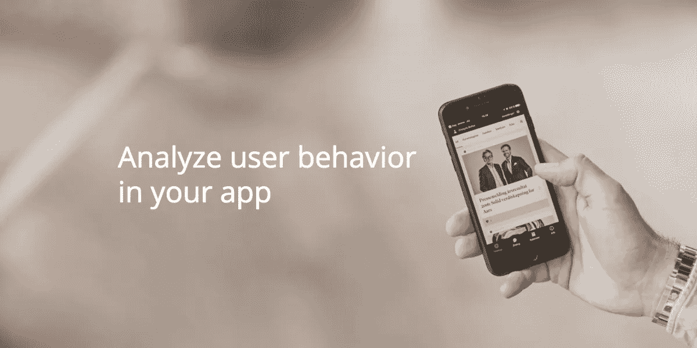
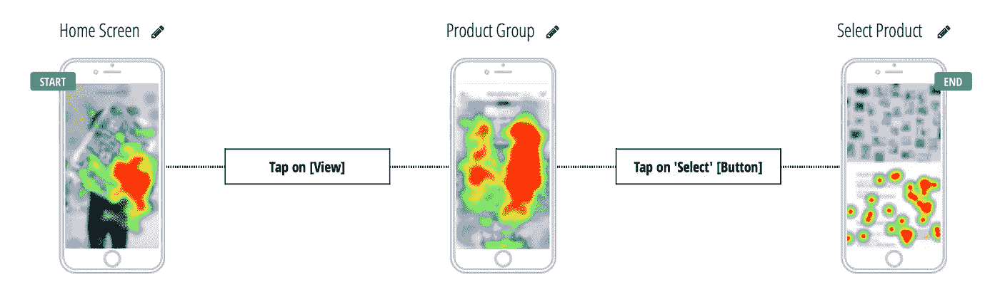
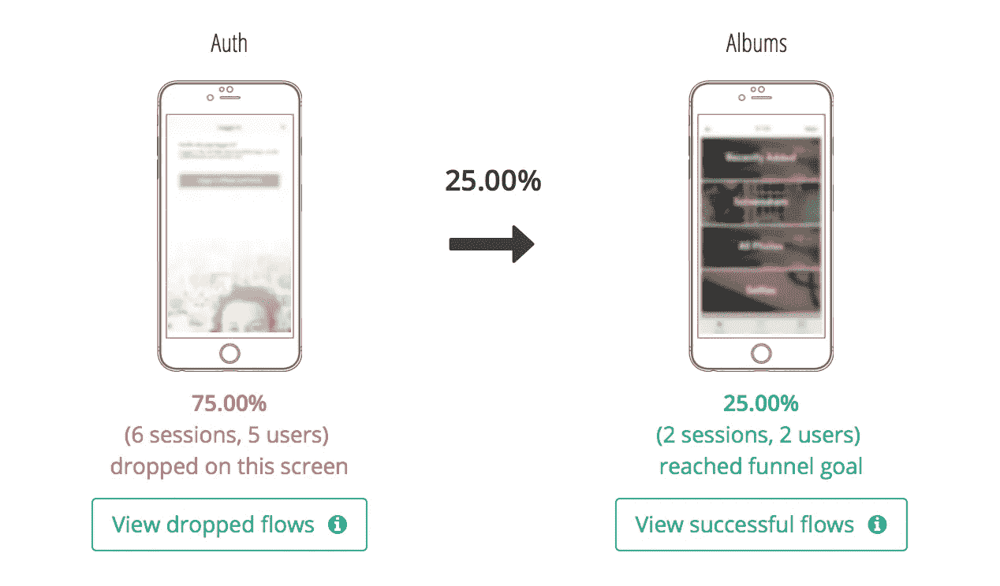
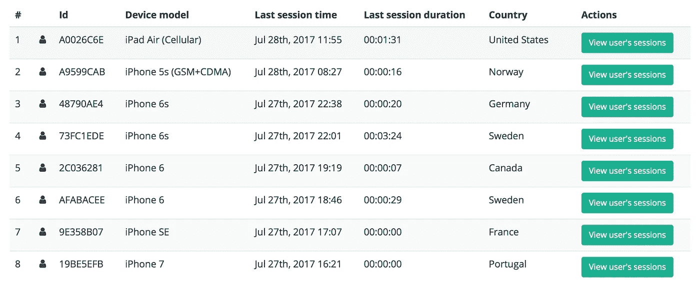
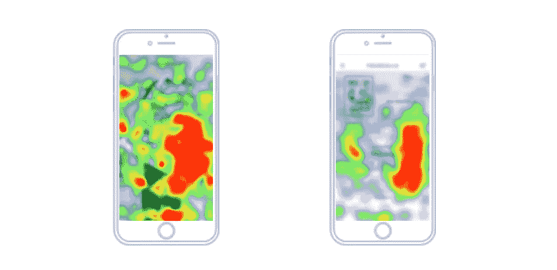
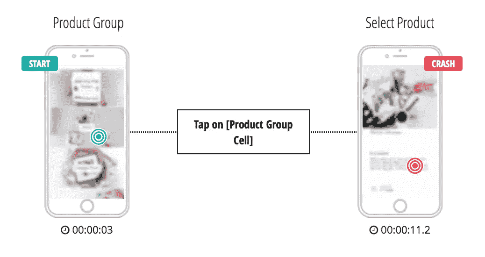
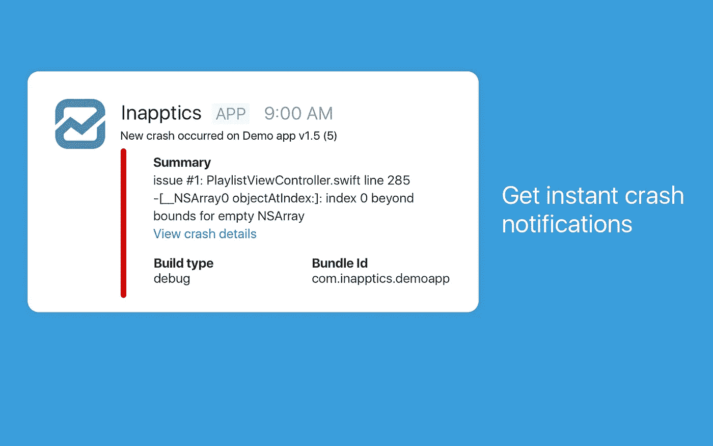

# 直观分析实际用户行为，提高应用的用户参与度和盈利能力

> 原文：<https://medium.com/hackernoon/visually-analyze-actual-user-behavior-to-improve-your-apps-user-engagement-and-profitability-c44815b99f6d>

[**Inapptics**](https://www.inapptics.com/) 帮助[移动应用](https://hackernoon.com/tagged/mobile-app)创作者直观地[分析](https://hackernoon.com/tagged/analyze)实际用户行为，并以前瞻性的见解改进他们的应用。它聚合了所有用户交互事件，并将其转化为简单的视觉流和热图，在这些视图中，用户可以看到用户在每个屏幕上执行的操作，他们点击的位置以及他们在应用程序中的导航方式。当它收集所有用户交互数据时，Inapptics 会自动检测崩溃并重放导致崩溃的步骤。它还提供了如何修复它们的建议。

凯文·威廉·大卫[采访了](https://medium.com/u/8ea7bd91b1a4?source=post_page-----c44815b99f6d--------------------------------)[蒂格兰·哈科比安](https://medium.com/u/abe62ab17935?source=post_page-----c44815b99f6d--------------------------------)，CMO 在 [**Inapptics**](https://siftery.com/inapptics) 了解更多。

## 嗨，Tigran，给我们讲讲 Inapptics 吧？

[inapptics](https://medium.com/u/a65b4babaab7?source=post_page-----c44815b99f6d--------------------------------) 帮助应用开发者分析移动应用中的用户行为。这种分析相当复杂，用 AI 很快就能简化。

您只需将我们的 SDK 添加到您的应用中，并添加一行代码。然后，我们会自动捕捉用户执行的所有操作，例如他们点击的位置和导航方式。然后对收集的数据进行分析，并可视化为屏幕流、视觉漏斗和触摸热图。另外，我们还可以检测崩溃，并重放导致崩溃的确切步骤。

## 告诉我更多关于你为什么要建立这个的信息？

Inapptics 背后的团队在 5 年多的时间里一直在为世界上一些最大的名字开发高知名度的应用程序。那些年，我们意识到我们的客户有多讨厌分析。除了复杂的设置，他们还抱怨用户在他们的应用程序中到底做了什么缺乏可见性。

使用当前的分析解决方案(例如 [**、谷歌分析**](https://siftery.com/google-analytics) 、 [Mixpanel](https://medium.com/u/d9ce9f6dba3e?source=post_page-----c44815b99f6d--------------------------------) 等)，应用程序创建者通常会获得一堆数字和图表，但应用程序创建者需要的是以下内容:

-他们的应用程序是否按预期/设计使用？

-有任何可用性问题吗？

-用户到底做了什么导致了他们无法重现的崩溃？

为了开始使用上述工具，开发人员需要花费数天时间对需要跟踪的每个事件进行编程。有时，它可能需要长达两周的时间才能完全启动和运行。

## Inapptics 与市场上已有的产品有何不同？

***智能应用 vs 传统分析工具***

传统的分析工具是纯粹基于指标的分析，应用程序开发人员对每个单独的事件进行编程，然后工具会告诉您每个事件被触发了多少次。

使用像 Google Analytics 或 Mixpanel 这样的传统分析工具，你必须知道你需要跟踪什么，这并不容易。Inapptics 不需要对任何事件进行编程，我们会自动捕捉所有事件，并在大多数情况下提供应用所有者从未想过的见解。

***Inapptics vs 会话记录工具***

还有会话录制工具(如 [**UXCam**](https://medium.com/u/79b6c2fccf4c?source=post_page-----c44815b99f6d--------------------------------) )在 app 中录制用户会话的视频。但是这些工具有一个很大的问题，因为你不能从视频中收集数据。因此，如果你有成千上万的用户，你很可能不会观看成千上万的视频记录。没有办法过滤这些视频，以了解哪些会议记录需要您的关注，哪些不需要。

我们解决了这个问题，因为我们不做视频记录，而是收集应用程序中每个用户交互的数据点，然后我们汇总这些数据。因此，如果 100 个人在应用程序中做同样的事情，我们将其显示为 100 个人执行的一个流程。当然，如果您愿意，您可以深入到单独的会话中，因为我们也提供这些信息。

## 谁会使用 Inapptics？您的客户在他们的公司中担任什么样的角色？

我们的客户是移动应用程序开发人员、UX 设计师和产品经理，他们关心用户体验，希望改进他们的应用程序。

有了 Inapptics，开发者现在只需点击一下鼠标，就能轻松重现应用程序中的任何崩溃，并快速修复。UX 设计师现在有能力看到人们如何使用他们设计的应用程序，并了解他们设想的导航流程是否真的如预期的那样使用。产品经理和营销人员可以在他们的应用程序中分析用户行为，并做出决定，从而提高参与度和收入。

## 您的客户如何使用 Inapptics？你能分享一些不同的使用案例吗？

首先，Inapptics 提供了如此多的应用程序开发者所需要的可见性。当你的应用程序的所有用户操作都直观地显示在你面前时，应用程序中的问题是什么以及你需要解决什么以提高用户参与度、留存率和最终收入就相当明显了。

例如，我们的一位早期客户发现他们的应用程序中有一个按钮没有人点击。他们将按钮移到屏幕的另一部分，并开始触摸它。

另一个例子是，我们的一个测试用户的应用程序崩溃了几个月，但他无法重现并修复它。有了 Inapptics，他花了大约 30 分钟才发现故障并修复。

## 有没有一些你没有想到或预料到的独特的应用案例？

我们的一个客户有一个很受欢迎的应用程序，里面没有广告。使用 inapptics，他们发现他们的应用程序被黑客攻击，被注入广告，并在第三方应用程序商店中提供。Inapptics 提供的详细程度使得发现此类问题成为可能。

## 太棒了。

## 有什么早期的“成长秘诀”或策略促成了你现在的成功吗？

在最初的几个月里，我们提供了 Inapptics 的测试版，每天获得新注册的方法之一是与我们的潜在客户(如开发人员、UX 设计师)花费时间的目标 Slack 社区建立联系。此外，在 Quora 上回答行业相关问题对我们获得新线索帮助很大。

## 在早期构建产品时，最大的挑战是什么？你是如何解决的？

其中一个挑战是，当客户添加一个拥有大量用户的新应用程序时，要保持基础架构稳定运行。我们通过切换到 Amazon Web Services 提供的自动可扩展服务解决了这个问题，并且可以专注于构建我们的产品，而不会被管理服务器所分心。

## 你加入的最有趣的整合是什么？有什么对你特别有影响的吗？

我们已经开始致力于第三方集成。第一个是与 Slack 的集成，已经可以在 Slack 应用程序目录中找到。Inapptics 用户可以将他们的帐户与他们的 Slack 团队联系起来，并在他们的应用程序中获得关于新崩溃的即时通知。关于此集成和设置的更多信息可在 [**此处**](https://inapptics.com/slack-integration.html.) 获得。

## 在我们总结之前，你运营公司所依赖的顶级产品是什么&你如何使用它们？

[**AWS**](https://siftery.com/company/amazon-web-services) —我们将其用于我们的后端，我们喜欢 AWS 的自动可伸缩性。

松弛时间—松弛时间通常不需要解释。

[**G Suite**](https://siftery.com/g-suite-formerly-google-apps-for-work)——我们用它来收发邮件、共享文件等。

[HubSpot](https://medium.com/u/8732e73183e5?source=post_page-----c44815b99f6d--------------------------------) —我们在销售过程中使用它。我们在 Hubspot 管理我们的联系人、交易和整体销售渠道。

[**MailChimp**](https://medium.com/u/772bf2413f17?source=post_page-----c44815b99f6d--------------------------------) —我们用它来更新时事通讯。这是我们最喜欢的电子邮件营销工具之一，使用起来非常简单。它还提供与不同服务的集成，例如 Slack。

**——这是我个人一直以来最喜欢的社交媒体管理工具。我们使用 Buffer 来安排我们的社交媒体帖子，并获得关于他们的表现和参与度的分析。**

**[**漂移**](https://medium.com/u/5a3bd01d25cc?source=post_page-----c44815b99f6d--------------------------------) —我们用它来进行我们的网站和仪表盘实时聊天。这是一个非常好用的工具。**

**[**Trello**](https://medium.com/u/fb5dd2d116a1?source=post_page-----c44815b99f6d--------------------------------) —我们用它来管理我们的任务。我们喜欢 Trello 中的可视板，它帮助我们在项目任务和截止日期上处于领先地位。**

***最初发表于*[*【siftery.com】*](https://siftery.com/stories/visually-analyze-actual-user-behavior-to-improve-your-apps-user-engagement-and-profitability)*。***