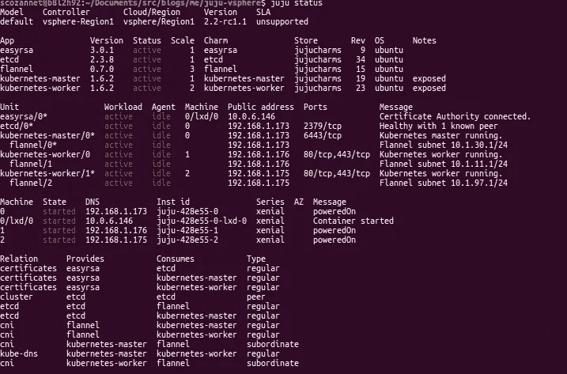
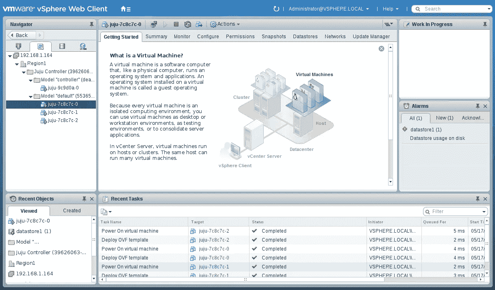
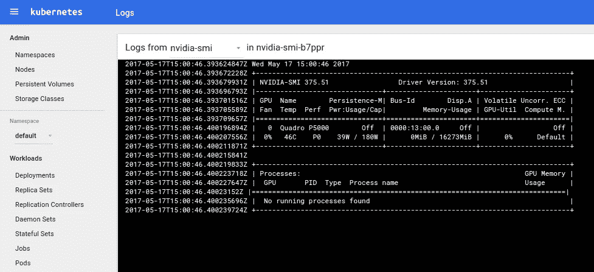

# VMWare vSphere、Kubernetes……当然还有 GPU

> 原文：<https://medium.com/hackernoon/vmware-vsphere-kubernetes-and-gpus-of-course-a7a06c87c51d>

我接下来要说的可能看起来显而易见，但很多人都在使用 VMWare vSphere 来虚拟化各种工作负载。当然，这意味着我会收到很多关于库伯内特公司(Kubernetes)的 T4 典范分布(standard Distribution)与 vSphere 整合的 T2 问题。

直到最近，公平地说，这并不容易。你可以这样做，但你必须花时间做一些手动调整，在这里或那里，调整每个虚拟机的主机名…大部分的障碍是由于一个简单的事情:VMWare 不支持 cloud-init，事实上的标准，以引导虚拟机在几乎所有其他多云的解决方案。

团队已经花了相当多的时间来改善 vs 球的 UX，我很高兴地说，它现在工作得相当好，包括激活 GPU(还有什么？)!！！

让我们看看 UX 现在是什么样子！

# 要求

要复制此帖子，您需要:

*   基本了解规范工具箱:Ubuntu 和 Juju
*   基本了解库柏内斯；
*   可以访问互联网(至少被代理)并且至少具有一个用于虚拟机的公共(可路由)网络的 VMWare vSphere 群集，其中创建了一个用于所有节点的 DNS(或者您需要对/etc/hosts 进行一些编辑)；
*   留在边缘的意愿:juju 2.2rc1

对于文件，克隆回购:

```
git clone [https://github.com/madeden/blogposts](https://github.com/madeden/blogposts)
cd blogposts/k8s-vsphere
```

# vSphere 安装程序

我不是 VMWare 专家，因此我没有更改默认设置:

*   已在 3 台 Dell T630 上安装最新 ISO 版本的 ESXi 6.5，每台都具有 12c/32GB RAM；
*   已在第一台主机上安装 vCenter 应用装置；
*   对于每台主机，我都使用[本指南](http://www.dell.com/support/article/us/en/4/SLN288103/how-to-enable-a-vmware-virtual-machine-for-gpu-pass-through?lang=EN)激活了 GPU 直通；
*   然后我在 vCenter 中创建了一个数据中心，我将其称为“regional 1”

就这样，这确实是所有其他事情的默认设置:我没有接触网络或存储。如果你有一个具体的设置，我很乐意谈论和审查生产系统，以验证集成。

# Juju 经验

## 正在连接到 vSphere

一旦你安装了 vs 球，你需要让 Juju 知道这件事:

```
juju add-cloud vsphere
Cloud Types
 maas
 manual
 openstack
 oracle
 vsphereSelect cloud type: vsphereEnter the vCenter address or URL: 192.168.1.164Enter datacenter name: Region1Enter another datacenter? (Y/n): nCloud “vSphere-test” successfully added
You may bootstrap with ‘juju bootstrap vsphere’
```

现在，您需要为此云配置凭据:

```
juju add-credential vsphere
Enter credential name: canonicalUsing auth-type “userpass”.Enter user: administrator@vsphere.localEnter password:Credentials added for cloud vsphere.
```

## 拔靴带

这是一个经典的 Juju 引导代码:

```
juju bootstrap vsphere/Region1 --bootstrap-constraints "cores=2 mem=4G root-disk=32G"
Creating Juju controller "vsphere-Region1" on vsphere/Region1
Looking for packaged Juju agent version 2.2-rc1 for amd64
No packaged binary found, preparing local Juju agent binary
Launching controller instance(s) on vsphere/Region1...
 - juju-9c9d0a-0 (arch=amd64 mem=4G cores=2)dk: 97.76% (26.2MiB/s)ases/xenial/release-20170330/ubuntu-16.04-server-cloudimg-amd64.ova
Fetching Juju GUI 2.6.0
Waiting for address
Attempting to connect to 192.168.1.165:22
Attempting to connect to fe80::250:56ff:fe87:d44c:22
Bootstrap agent now started
Contacting Juju controller at 192.168.1.165 to verify accessibility...
Bootstrap complete, "vsphere-Region1" controller now available.
Controller machines are in the "controller" model.
Initial model "default" added.
```

我在 src 文件夹中准备了一个小捆绑包，您可以使用以下内容进行安装:

```
juju deploy src/k8s-vsphere.yaml
```

然后可以等待模型收敛到稳定状态:

```
watch -c juju status --color
```



juju status fully converged

在 vSphere 中，这将转换为类似以下内容:



vSphere UI after bootstrap and deployment

然后你就可以下载凭据正在查询集群:

```
juju scp kubernetes-master/0:config ~/.kube/configkubectl get nodes --show-labels
NAME            STATUS    AGE       VERSION   LABELS
juju-428e55-1   Ready     1h        v1.6.2    beta.kubernetes.io/arch=amd64,beta.kubernetes.io/os=linux,kubernetes.io/hostname=juju-428e55-1
juju-428e55-2   Ready     1h        v1.6.2    beta.kubernetes.io/arch=amd64,beta.kubernetes.io/os=linux,kubernetes.io/hostname=juju-428e55-2
```

很好！！现在，您已经在 VMWare vSphere 上启动并运行了一个 Kubernetes 集群。不是很复杂吗？我们应该说它很无聊吗？


# 正在添加 GPU

## 关于 v scale

好了，现在是最酷的部分了。使用与之前相同的指南，将 GPU 添加到运行 Kubernetes 工作进程的虚拟机中。

您首先需要停止它们，然后添加 PCI 设备，并重新启动它们。

## 在库伯内特斯

在这一点上，Juju 应该拿起并发现 nVidia 板并安装 CUDA 驱动程序。出于某种原因，它没有，我们正在调查。

但是我们不会因为一个小故障就停下来。让我们手动安装它，这也将让我有机会回答我得到的关于管理 CDK 的问题，因为控制平面已经完全快照。

Google 有这个简单的脚本来安装驱动程序:

```
#!/bin/bash
echo “Checking for CUDA and installing.”
# Check for CUDA and try to install.
if ! dpkg-query -W cuda; then
 curl -O [http://developer.download.nvidia.com/compute/cuda/repos/ubuntu1604/x86_64/cuda-repo-ubuntu1604_8.0.61-1_amd64.deb](http://developer.download.nvidia.com/compute/cuda/repos/ubuntu1604/x86_64/cuda-repo-ubuntu1604_8.0.61-1_amd64.deb)
 dpkg -i ./cuda-repo-ubuntu1604_8.0.61–1_amd64.deb
 apt-get update
 apt-get install cuda -y
fi
```

只需在两个工人身上运行它(最终使用“juju scp”和“juju ssh”)

现在，在每个 worker 上，您需要激活几个标志。有一个新的程序来做到这一点，因为 GPU 现在是 K8s 中的“加速器”:

```
sudo snap set kubelet experimental-nvidia-gpus=1
sudo snap set kubelet feature-gates=”Accelerators=true”
sudo systemctl restart snap.kubelet.daemon.service
```

**注**:如果你读过我以前的帖子，也许你会记得我们用 sed、awk 和其他不错的文本版 foo 编辑文件。现在是一个*为快照设置*命令。T4 和 T5 有关系吗？突然，作为管理员，您不再负责管理代码的幂等性，而是将它委托给 snapd。它改变了游戏规则，让事情变得比以前琐碎多了。这还没有提到新的升级路径变得如此简单。

现在在主屏幕上，

```
sudo snap set kube-controller-manager feature-gates=”Accelerators=true”
sudo snap set kube-scheduler feature-gates=”Accelerators=true”
sudo snap set kube-apiserver feature-gates=”Accelerators=true”
sudo systemctl restart snap.kube-apiserver.daemon.service 
sudo systemctl restart snap.kube-scheduler.daemon.service 
sudo systemctl restart snap.kube-controller-manager.daemon.service 
```

好了，你可以走了，你现在已经在 K8s 中激活了 GPU

## 测试结果

一个经典的开始:

```
kubectl install -f src/nvidia-smi.yaml
```

你去那里，它只是工作:)



nVidia P5000, passthrough in vSphere

# 更多加密货币？

我注意到你们**喜欢**加密货币，所以我为 [Minergate](https://minergate.com) 写了一张新图表，你可以在[https://github.com/madeden/charts](https://github.com/madeden/charts)找到

它不是有史以来最快的采矿机，但还可以，它可以开箱进行 CUDA 采矿，这使得它非常适合测试。

看一下配置文件，在[https://minergate.com](https://minergate.com)上创建一个账户，然后开始玩游戏:

```
helm init
helm install path/to/charts/minergate — name minergate
```

您可以配置以下值:

*   **clusterName** :
*   **池** : (minergate)也有区别
*   **币** : (-qcn)你要挖掘的加密货币，前面加一个“-”。
*   **节点** : (2):集群中有多少节点欢迎矿工
*   **workersPerNode** : (1)您希望每个节点部署多少工作人员
*   cpusPerWorker : (1):您希望为每个矿工分配多少个 CPU 内核
*   **gpuComplexity** : (4):如果使用 GPU，给 GPU 施加多大的压力？如果只想进行 CPU 挖掘，请使用 0
*   用户名:([samnco@gmail.com](mailto:samnco@gmail.com))你的 Minergate ID

日志应该看起来像这样:

```
$ kubectl logs worker-ob-1-0-2045746350-h2dd7
Starting mining -qcn with 2 CPUs and 1 GPUs
[2017-05-17 15:43:38.333] [ info]  Pool parameters query...
[2017-05-17 15:43:46.592] [ info]  Loading miners...
[2017-05-17 15:43:46.593] [ info]  Miners loaded successfully
[2017-05-17 15:43:46.594] [ info]  CUDA: Initializing CUDA miner...
[2017-05-17 15:43:53.212] [ info]  CUDA: Device name: Quadro P5000
[2017-05-17 15:43:53.212] [ info]  CUDA: Total memory: 17063477248
[2017-05-17 15:43:53.213] [ info]  CUDA: Free memory: 16942891008
[2017-05-17 15:43:53.213] [ info]  CUDA: MP count: 20
[2017-05-17 15:43:53.213] [ info]  CUDA: MP threads count: 2048
[2017-05-17 15:43:53.213] [ info]  CUDA: CUDA version: 6.1
[2017-05-17 15:43:53.213] [ info]  CUDA: CUDA cores: 0
[2017-05-17 15:43:53.213] [ info]  CUDA: Threads per block: 1024
[2017-05-17 15:43:53.213] [ info]  CUDA: Dim size: 1024 | 1024 | 64
[2017-05-17 15:43:53.213] [ info]  CUDA: Grid size: 2147483647 | 65535 | 65535
[2017-05-17 15:43:53.213] [ info]  CUDA: Calculated threads per block: 8
[2017-05-17 15:43:53.213] [ info]  CUDA: Calculated blocks: 0
[2017-05-17 15:43:53.213] [ info]  CUDA: Total threads: 0
[2017-05-17 15:43:53.214] [ info]  CUDA: CUDA miner successfully initialized
[2017-05-17 15:43:53.215] [error]  PoolClient: ERROR: Trying to connect while connection is in progress
[2017-05-17 15:43:53.215] [ info]  Stratum client stopped
[2017-05-17 15:43:53.216] [ info]  Stratum client stopped
[2017-05-17 15:43:53.325] [ info]  Successfully connected to pool: stratum+tcp://qcn.pool.minergate.com:45570\. session_id="02ec69f8-1f5f-440f-9e9f-3b85a6febf84"
[2017-05-17 15:43:53.325] [ info]  New Job: job_id="25f7c926-e632-4ab3-b822-9d7abc0ed9c8" blob="0100aedff1c8057c6ea6d76a9920d1bf61c14b410a50d1ef216a293b0ea5e107b6c9d615d8abc3000000007cc70a356438f7d1cc3133d226a8b2b7c4adaf21286b3cf3ade0cee62acbf1cc01" target="e4a63d00"
[2017-05-17 15:43:53.325] [ info]  New difficulty: 1063
[2017-05-17 15:43:56.570] [ info]  QCN hashrate: 67.8947 H/s
```

尽情享受吧！当然，这是 Helm，因此您只受到 Kubernetes 的限制，而不会受到 VMWare 或任何其他平台的限制。

更严重的是，你的任何 GPU 工作负载:深度学习、物理计算、破解密码、视频转码……所有这些都将通过这样的设置得到大幅改善。


That’s right, we have Kubernetes AND GPUs

# 结论

过去几周，VMWare 的体验有了显著改善。现在，在 vSphere 上运行大型软件变得特别容易。

Kubernetes 的 [Canonical 发行版就是一个例子，但是 Canonical 的长期合作伙伴](https://jujucharms.com/kubernetes) [Spicule](http://spicule.co.uk/) 与 Pentaho 一起进行大数据咨询和集成，现在也可以利用 VMWare 作为目标。

还有一点值得一提的是， [MAAS](https://maas.io) 可以将 VMWare 集成为一个“裸机层”,因此您可以在 MAAS 中记录来自 VMWare 的虚拟机，并使用它来启动或停止它们。

我们即将完成在所有云、裸机等设备上激活 nVidia GPUs 的旅程。下一站:微软 Azure，循环就要结束了。

任何问题，我在 Twitter 上是@SaMnCo_23，在 Freenode 和 GitHub 上是#SaMnCo。随时 ping 我！

当然，如果你喜欢这个，觉得它有用，或者只是想帮忙，点击小心脏！感谢阅读！