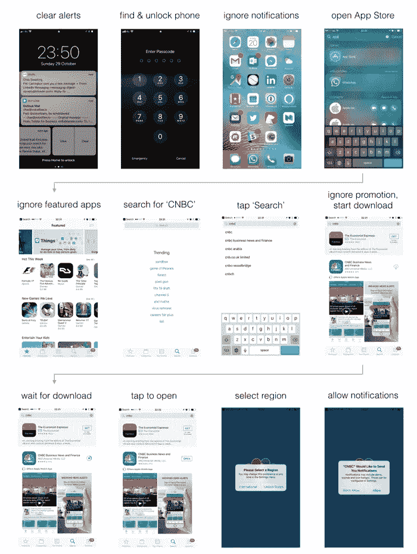
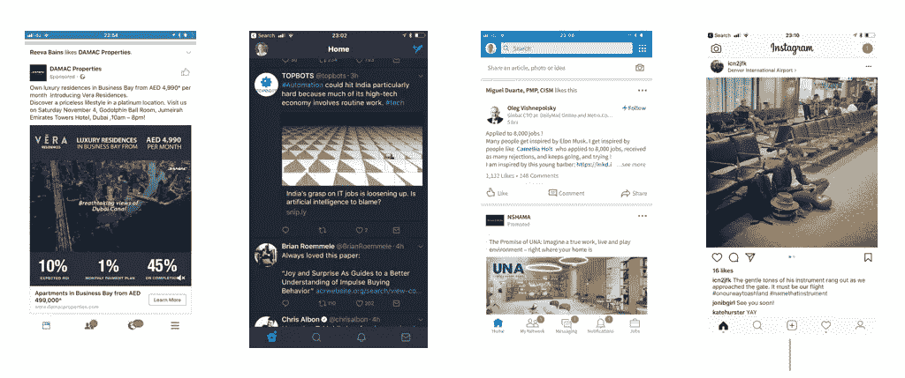
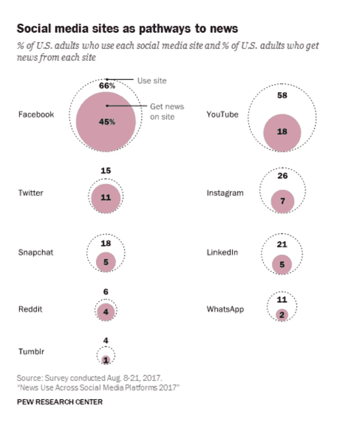
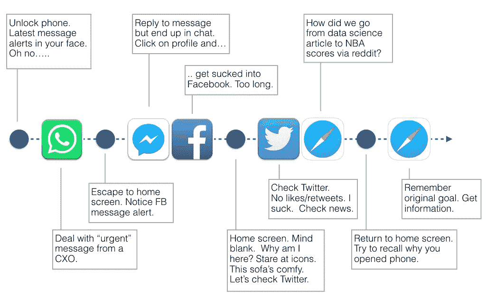
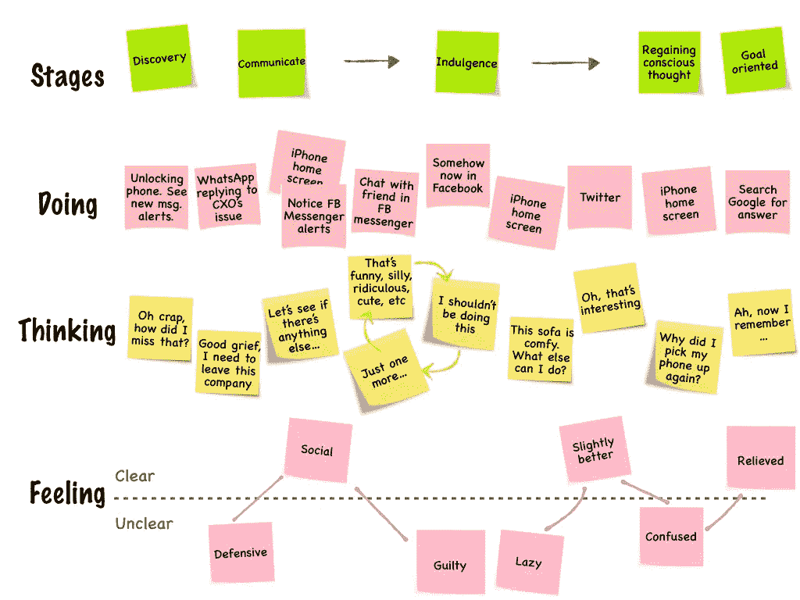

# 语音用户界面可以拯救我们自己。为什么我们需要声音。

> 原文：<https://medium.com/hackernoon/voice-user-interfaces-can-save-us-from-ourselves-why-we-need-voice-cacd982c163c>

声控服务减少了摩擦，速度也更快，这你是知道的。没有提到的是，这种摩擦有多少是自己造成的。或者来自语音用户界面的清晰度，以及它们将我们从分心中拯救出来的潜力。

为了证明这一点，让我们考虑几个常见用例的原样用户体验，并将它们与语音对等物进行比较。

# 安装移动应用程序与 Alexa 技能

好吧，我承认从这个开始是不公平的——就像拉塞尔·克罗的军团对抗野蛮部落，你知道谁会被打败。话说回来，这是一个伟大的开场序列，让我们开始吧。

安装移动应用程序获取每日商业新闻更新的原样体验:

请注意，这些步骤中有三分之一经常会忽略那些争夺我们注意力的项目——无论是其他应用程序、提醒通知还是推广/特色内容，它们都是从当前任务中分散注意力的东西。

将这个 3-4 分钟的过程与下面的进行比较:

消息传入，采取行动，确认传出。没别的了。

虽然我们不会每天安装新的应用程序，但这是大多数通过计算机执行的工作流程的代理用例，从安排与某人的约会到设置闹钟。这就是为什么当你准备晚上离开办公室时，你会发现早上写了一半的邮件和一半的预约。

(哦，我意识到 Siri 也可以在手机上快速跟踪其中的一些功能——“Siri，从 App Store 安装美国消费者新闻与商业频道”可以让你跳过上面的 5 个步骤——但它仍然需要物理触摸。此外，远场语音激活只是更具戏剧性。)

好了，够了。让我们考虑下一个用例…

# 消费内容:

现在你想得到最新的消息。以下是目前的现状:

45% of US adults get their news from Facebook, 11% from Twitter, 7% from Instagram, 5% from LinkedIn

等等，那是什么垃圾？是的，美国联邦调查局(脸书，Instagram，LinkedIn，Twitter)

我们刚刚安装的应用程序怎么了？你从不使用它。为什么？因为它在你的手机主屏幕的第五个面板上，即使你记得检查它，你甚至在看到美国消费者新闻与商业频道图标之前就会被别的事情分心。

因此，我们来到了 2017 年最有说服力的图表之一:

结果…正坐在白宫里。

相比之下，快讯质量上乘，是亚马逊 Echo 的最佳用例之一[。](/voiceflow/mornings-are-prime-time-for-voice-implications-for-news-content-providers-ab5b0caff879)

快速移动，像订购一些有用的东西怎么样。

# 排序

语音不太适合比较许多商品，或者购买外观是区分因素的商品。但是对于某些交易来说，它是完美的:

你已经明白了这件事的重要性。任何从事电子商务或提供易于重复订购的产品或服务的公司也应该如此。

所以让我们以网络用例的始祖……搜索来结束。

# 搜索信息。

考虑一下这个场景。

> 儿子:“嘿，爸爸，加拿大的首都是哪里？”
> 
> 爸爸:“蒙特利尔”
> 
> 儿子:“谢谢爸爸”
> 
> 爸爸(心想):“等等，可能是多伦多。我的手机呢？”

现在，谷歌搜索结果需要多长时间？10 秒钟？最多 30 分钟。

下面的一些排列出现的频率如何？

How 30-seconds becomes 30-minutes on a smartphone.

或者更好地用一个流行的场景图来说明:

或者，语音甚至可以让我们免于打开我们称之为智能手机的潘多拉盒子:

Alexa 和语音优先界面有巨大的潜力:让我们回到一个清晰的世界，摆脱杂乱的促销广告&无关紧要的广告都在争夺我们的注意力。

让这成为你在 UX 之声的目标。你**可以**让世界变得更好。

# 好吧，让我们现实一点

抛开理想主义，让我们面对它——即使是我，声音的支持者，也知道我们会把它搞砸。用不了多久，人们就会以保留和“监听”的名义滥用即将到来的警报/通知 API 直到我们在 Echo 上看到黄色的环，甚至不想和 Alexa 说话。

因此，与此同时，尽情享受语音界面吧。