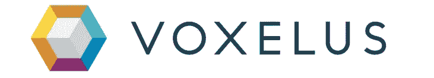
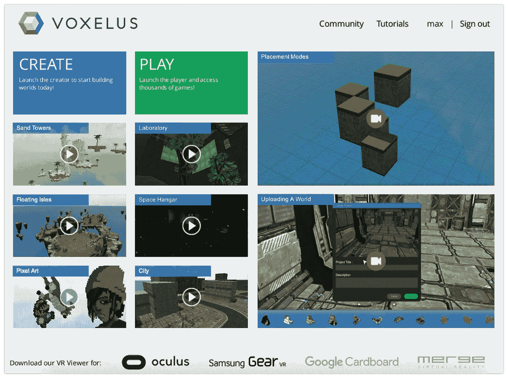
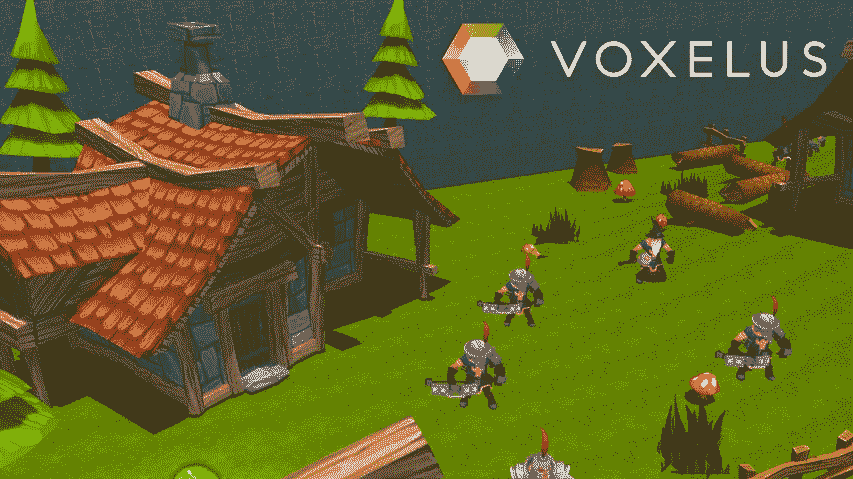
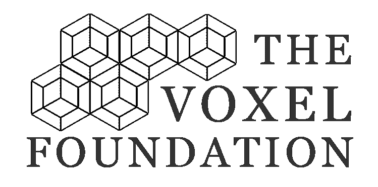
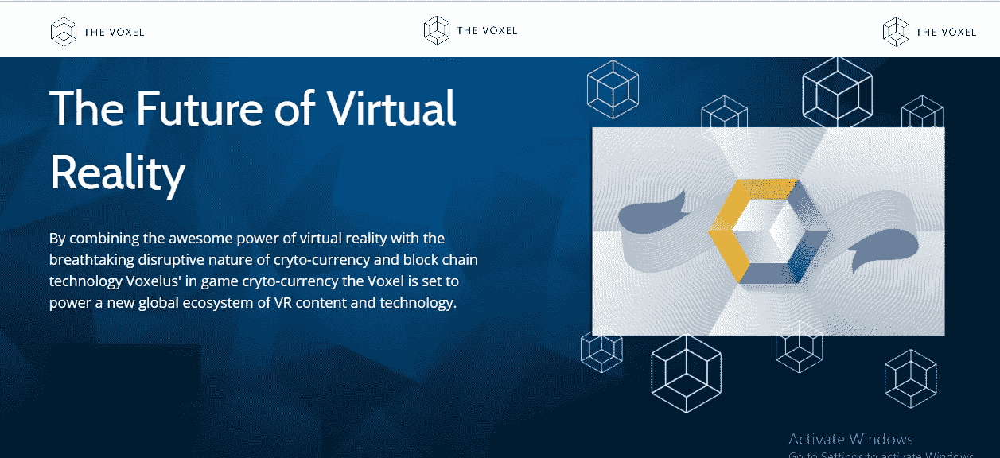

# 体素(VOX)——虚拟现实的未来

> 原文：<https://medium.com/hackernoon/voxels-vox-future-of-virtual-reality-e06e5e7dbe49>

想象一下，如果你能在一项投资中利用加密货币的爆炸式增长和虚拟现实的 T2 力量。你会对此感兴趣吗？我确实是。这就是为什么我买下了所有我能得到的**体素**，目前交易价格为**. 23 美元。当我说体素将成为虚拟现实的官方货币时，请相信我。这种加密货币是由 **Voxelus** 、一家**领先的虚拟现实世界构建商**和 **marketplace** 创造的，它与 Oculus Rift** 和**三星 Gear VR** 兼容。截至今天，Voxelus 是**世界上最大的虚拟现实内容**来源，拥有超过 **500 项独特资产**、 **50 个工作游戏**，以及**7000 项通过合作伙伴关系提供的额外内容**。我可以自信地说，在 2020 年，Voxels 的交易价格可能是每枚硬币 1.50 美元，因为这个团队由传奇企业家 Halsey Minor 领导，他们有战略合作伙伴关系，即将发布他们的第一款独立游戏，以及我将在下面概述的其他几个增长驱动因素。

# 基础知识:

1.  Voxelus 是一个允许任何人在任何地方创建和玩虚拟现实游戏的平台，而不需要写一行代码
2.  该平台由用于 PC 和 Mac 的 3D 设计应用程序 **Voxelus Creator** 组成； **Voxelus Viewer** ，可在台式 PC、Oculus Rift、三星 VR 设备上工作； **Voxelus Marketplace** ，它允许创作者出售和用户购买 Voxelus 生态系统的 VR 内容和游戏
3.  在这个生态系统中，**唯一的支付形式**是游戏中的加密货币**体素**
4.  **股票代码:VOX**
    价格:$ 0.23
    市值排名:70
    市值:4703.664 万美元
    流通供应量:2.1 亿 VOX
    最大供应量:2.1 亿 VOX
    平均交易量:831.6144 万美元
    共识:PoW

# 团队:

1.  领导 Voxels 团队的不是其他传奇企业家，正是 Halsey Minor。米纳尔先生是 CNET 的创始人，谷歌语音、Salesforce.com、OpenDNS、support 和 Rhapsody 的联合创始人。
2.  开发团队由阿根廷软件业资深人士**马丁·雷佩托**领导。雷佩托之前创建了视频游戏创作工具 Atmosphir，它是 2008 年 TechCrunch 50 强的亚军。他也是 Minor 工作室的首席执行官。
3.  业务开发和营销团队**位于洛杉矶**。开发和运营团队**位于罗萨里奥**，靠近阿根廷布宜诺斯艾利斯
4.  截至 2016 年，体素团队有 **10 个人**全职从事这个项目

# 增长驱动因素:

1.  简单来说就是团队。【Minor 先生可以说是我在加密货币领域遇到的**最令人印象深刻和经验丰富的领导者**。他将从这个项目中榨出每一分价值
2.  Voxels 团队即将推出他们的第一款独立游戏《皇家提取》。这款游戏将兼容 Oculus Rift、HTC Vive 和 Steam VR。这些都是大型 VR 平台，在整个 VR 市场份额中占有很大一部分
3.  体素最近与 Flatpyramid.com 达成了合作伙伴关系，这将使体素用户能够访问 7000 种数字资产，如动画角色和环境
4.  该团队建立了 **Voxel Foundation** 来帮助将 Voxel 的生态系统扩展到各种网络游戏、VR 平台和各种娱乐渠道。该团队已经为此投入了 500 万美元的体素，还可以选择追加 1000 万美元
5.  该团队目前正在进行品牌重塑，这将有助于提高他们的市场曝光率和公众认知度。他们还暗示，一旦品牌重塑完成，将引入一个新成立的合作伙伴
6.  Voxel 拥有适用于 MAC、PC 和 Linux 的多平台钱包
7.  据估计，2020 年虚拟现实的市场价值将超过 400 亿美元，而体素将处于爆炸式增长的中心。虚拟现实目前的市场价值约为 60 亿美元

# 逆风:

1.  虚拟现实和加密货币都是非常年轻、不断发展的技术类型，因此将会有很多成长的烦恼。然而，这个团队由可以说是最好的领导者领导，这将帮助他们度过动荡的时代
2.  由于监管总是会落后于创新，数字货币领域未来可能会受到新监管的约束
3.  截至目前，Voxels 的增长完全是通过口头传播实现的。目前还没有在这个项目上花费营销费用

# 总结:

由于这个项目是如此独特，我们将不得不做一些数学和一些假设，以达到我们的价格目标。VR 目前的市场价值约为 60 亿美元，体素的价格为:

1.  **价格:0.23 美元**
    市值排名:70
    市值:4703.664 万美元
    发行量:2.1 亿 VOX

正如我之前提到的，据估计，到 2020 年，虚拟现实的市场价值将达到 400 亿美元。因此，如果你将同样的增长率应用于体素的当前价格，它在 2020 年的价值将约为**1.5 美元一枚硬币**。然而，这是假设体素的市场份额在 2020 年保持不变，但我向你保证，它只会从这里增长。

**Voxels 团队**……让我们改变世界！！

