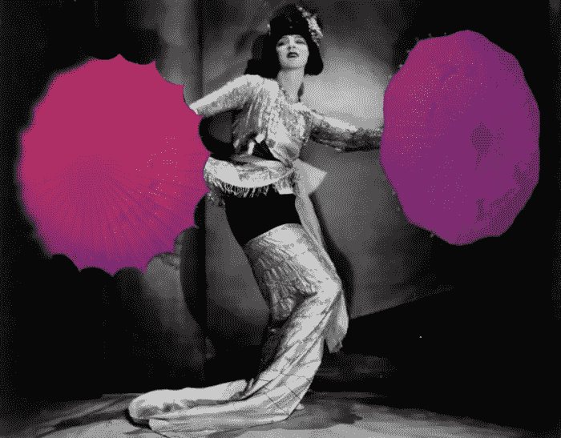
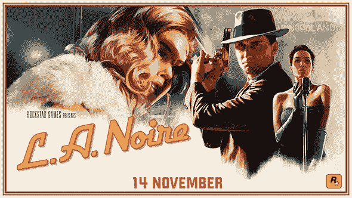
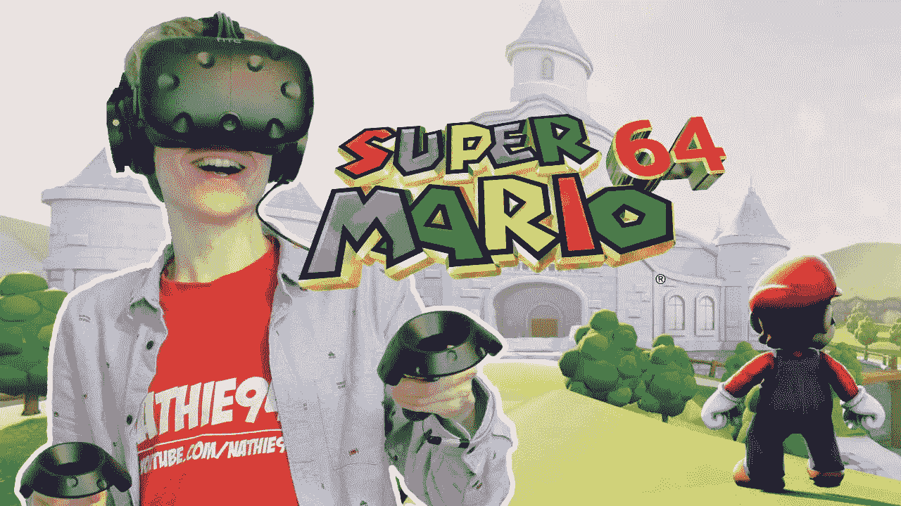

# 虚拟现实正在赋予死去的特许经营权以生命

> 原文：<https://medium.com/hackernoon/vr-is-giving-life-to-dead-franchises-93d73306e0c5>

# 但是怀旧是否有助于销售 VR，或者它是否让它感觉不如它可能(和应该)的那样创新？

摇滚明星游戏公司[宣布](http://www.thestar.com.my/tech/tech-news/2017/09/12/crime-thriller-la-noire-coming-to-ps4-xbo-switch-and-vr/)在首次亮相六年后，备受喜爱的侦探游戏《黑色》(LA Noire)将在 PS4、Xbox One 和《任天堂 Switch》上重新发布。但更有趣的是，他们已经创建了一个专门为虚拟现实重建的七任务汇编。

题目很适合 VR。从主题上来说，游戏是关于沉浸感和氛围的，这在虚拟环境中是最容易创造的。它还涉及大量的触摸和探索，非常适合最终学习如何做好触摸的虚拟现实系统。这是一个巨大的专营权，这意味着它带来了一群球迷；但它也长期被认为是一个死亡的专营权，这意味着一些全新的东西有机会充当其心脏的电流。

有很多证据表明，强大的、预先存在的 IP 正在帮助推动虚拟现实向前发展。采用率仍然很低；为一款未经测试的游戏在一个昂贵的系统上冒险是一个很大的要求，但告诉粉丝他们喜欢的东西现在会变得更好是一个容易的卖点。AAA 工作室正在利用品牌认知度将玩家带入虚拟世界；一个很好的例子是夏娃:瓦尔基里。其母游戏《EVE: Online》在 2013 年初拥有超过 50 万名用户。尽管自那以后活跃用户有所下降，但这款游戏仍然非常受欢迎，所有人都认为 VR 游戏紧随其后。CCP 没有公布销售数字，但是[估计](https://forums.evevalkyrie.com/t/how-many-copies-of-eve-valkyrie-have-been-sold-since-release/4538/28)的玩家数量在 50，000 左右。

夏娃并不孤单。还有摇滚乐队、《我的世界》，甚至[辐射](https://www.theverge.com/2016/6/15/11944142/fallout-4-virtual-reality-htc-vive-e3-2016)的 VR 改编。《侠盗猎车手》引起了轰动，当时人们质疑他们的虚拟产品是否会成为一个问题，因为虚拟现实能够完全沉浸在玩家中，而《生化危机》的速率如此之低，以至于许多玩家都感到恶心。尽管有一些失败，但互联网上充满了人们希望看到变成 VR 的梦想标题列表，从马里奥兄弟到外星人:孤立。

然而，虚拟现实最成功的作品仍然是那些不受以前做事方式限制的作品。他们利用虚拟现实所提供的优势来做一些真正独特的事情，观众会注意到。地精和妖精演示就是一个很好的例子。一部分是电影，一部分是游戏，这是一种真正的互动体验，让用户以自己的速度探索世界。遗憾的是，没有消息表明完整版将于何时发布，但早期评论非常强劲。前 10 名名单中包括一些像《星球大战》和《《我的世界》》这样的游戏，但大多数最好的游戏都在做一些全新的事情——比如神奇的新玩意儿，让你建造自己的机器，或者机器人回忆，让你与你战斗的机器人进行身体接触。

目前，怀旧可能会吸引那些不会冒险购买虚拟现实的用户。这是一个可靠的销售策略，对于想涉足 VR 的 AAA 游戏工作室来说是一笔不错的投资。但从长远来看，公司需要记住，虚拟现实有更多的能力——如果它不开始拥抱这种潜力，它永远不会走出沟壑，爬上山坡。

【鹪鹩手执】为【www.hammerandtusk.com】**所写的*。***