# Vue.js 文档绩效审计

> 原文：<https://medium.com/hackernoon/vue-js-docs-performance-audit-e89b11dfc43>


# 介绍

随着移动设备变得比桌面更加可用，web 面临着应用程序运行缓慢的问题。我们很多人在 Chrome 中测试应用程序，然后发布。没有多少开发人员尝试在真实设备和真实网络上测试他们的应用程序。


所以，我试着(部分地)遵循这些规则，并测试 [Vue.js](https://hackernoon.com/tagged/vuejs) 框架的开源文档—【https://vuejs.org/】T2

## 测试设置

*   **设备:** Nexus 5 设备仿真
*   **网络:** 1.6 Mbps [网络](https://hackernoon.com/tagged/network)节流
*   **网址:**[http**://**localhost:4000/v2/guide](http://localhost:4000/v2/guide)

## 工具:

*   Chrome 开发工具
*   [pwmetrics](https://github.com/paulirish/pwmetrics)
*   [时间线查看器](https://chromedevtools.github.io/timeline-viewer/)

# 问题:

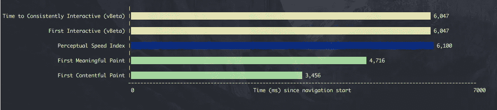

pwmetrics results for vue.js docs

**FCP**—*3.5 秒*

FMP—4.6 秒

**磅/平方英寸**—6.1 秒

TTFP—6.1 秒

**TTC**—6.1 秒

在[性能指标中了解有关这些指标的更多信息。这是怎么回事？第](https://codeburst.io/performance-metrics-whats-this-all-about-1128461ad6b)条。

还有一些不一致的行为 **FOIC** (不可见内容的闪现) **FOUC** (未样式化内容的闪现)。

> 不同的浏览器有不同的表现
> 
> FOIC *— Chrome、Firefox、Safari*
> 
> FOUC *—边缘，即*

**FOIC**

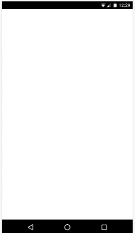

**FOUC**

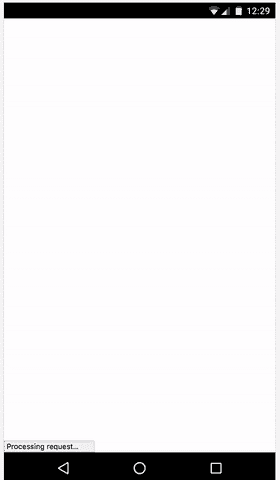

这将是很好的尽快显示回退字体，并添加[渐进增强策略](https://en.wikipedia.org/wiki/Progressive_enhancement)到网站。

# 推迟脚本

但是，首先，应该管理阻止首次绘制的脚本。

> 旧但金[文章](http://www.growingwiththeweb.com/2014/02/async-vs-defer-attributes.html)关于延迟和异步脚本行为
> 
> 仅供参考:默认情况下，ECMAScript6 模块被延迟

[时间轴轨迹](https://chromedevtools.github.io/timeline-viewer/?loadTimelineFromURL=drive://0B0c67TI7mLzERGUwRV9FNlhmVU0)

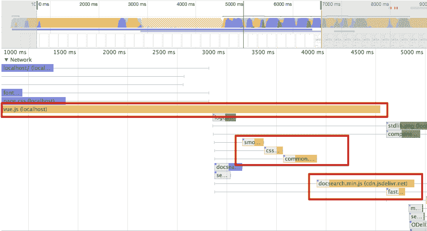

因此，将 [*defer*](https://www.w3.org/TR/html5/scripting-1.html#attr-script-defer) 属性添加到所有这些脚本(除了 vue.js，我们将在后面管理它)中，给我们带来了这个结果:

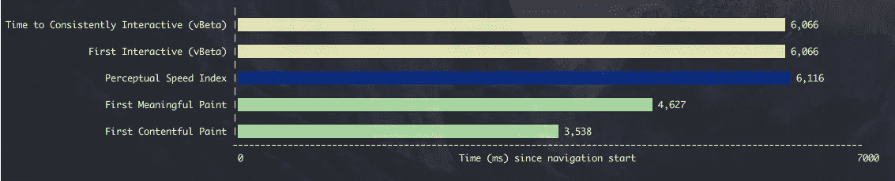

pwmetrics results after deferring scripts for vue.js docs

*100 毫秒*对于 **TTCI** 和 **TTFI** 指标不那么令人印象深刻，但也很了不起。

添加 defer 到 *vue.js* 可以节省更多的时间:

**FCP**—3.5 秒->1.9 秒

**FMP**—4.6 秒->3.4 秒

**PSI**—6.1 秒->4.9 秒

**TTFI**—6.1 秒->4.9 秒

**TTCI**—6.1 秒->4.9 秒

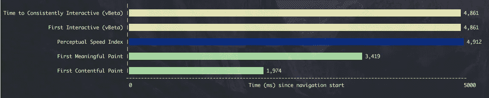

pwmetrics results after deferring vue.js

> 添加 defer 需要将示例代码扭曲到 DOM*content loaded*listener 中，但是我认为在“*hexo-renderer-marked*”fork 的范围内很容易做到。

# 管理字体

[时间轴轨迹](https://chromedevtools.github.io/timeline-viewer/?loadTimelineFromURL=drive://0B0c67TI7mLzEYWxSeEYyTlVxYWM)

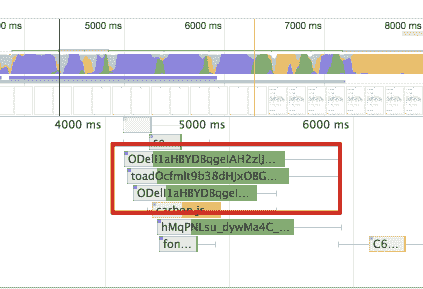

看一下[时间轴轨迹](https://chromedevtools.github.io/timeline-viewer/?loadTimelineFromURL=drive://0B0c67TI7mLzEYWxSeEYyTlVxYWM)可以注意到字体就像脚本一样阻挡了 **FMP** 。

因此，可以应用一些技术来处理它。

## 将字体移入正文

因为浏览器会在载入主体中的资源后重新绘制


字体可以移到那里。

[杰克·阿奇博尔德](https://medium.com/u/f87cd234b9d9?source=post_page-----e89b11dfc43--------------------------------)有一篇关于这种行为的很酷的文章——[加载 CSS 的未来](https://jakearchibald.com/2016/link-in-body/)。

结果

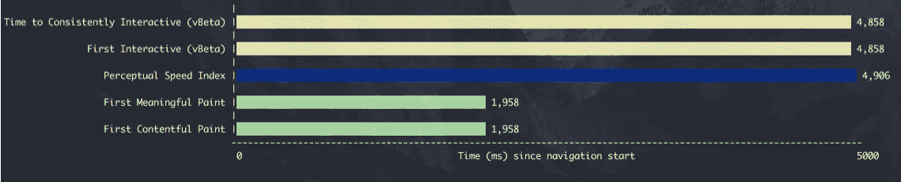

pwmetrics results for fonts resources in body for vue.js docs

**FMP** ，下**FCP**`**2 秒**

**TTCI** ， **TTCI** ， **PSI** 下` **5 秒**

**FOIC** 演示

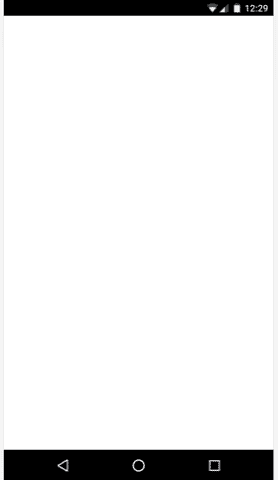

**FOUC**


统计结果很好，但用户体验并不好。

## 第三方图书馆

有几个库可以帮助监控加载字体:

*   [fontfaceobserver](https://github.com/bramstein/fontfaceobserver)
*   [webfontloader](https://github.com/typekit/webfontloader)
*   [fontfaceonload](https://github.com/zachleat/fontfaceonload)

我尝试了*font aface observer*by*[Bram Stein](https://medium.com/u/fe478cb14d5a?source=post_page-----e89b11dfc43--------------------------------)。*

*所以，结果是:*

*[时间轴轨迹](https://chromedevtools.github.io/timeline-viewer/?loadTimelineFromURL=drive://0B0c67TI7mLzEWVlFQjloeXRDeEE)*

*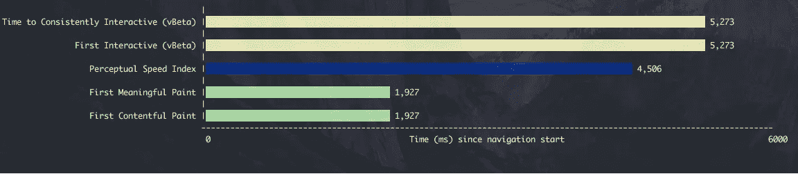*

*pwmetrcis results using *fontafaceobserver for* vue.js docs*

***FMP** ， **FCP** 下‘2 秒’，还是一样*

***TTCI** ， **TTFI** ， **PSI** 在“5.2 秒”下，而不是“4.8 秒”*

*在支持所有浏览器的情况下，~*400 毫秒*看起来是个不错的选择。*

*酪*

## *[**字体-显示**](https://developer.mozilla.org/en-US/docs/Web/CSS/@font-face/font-display)*

> *Chrome 支持，Firefox 也即将支持*
> 
> *在这种情况下，使用了`*字体显示:交换`**

*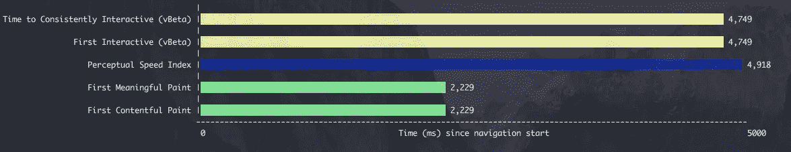*

**pwmetrics results using font-display: swap for* vue.js docs*

*FOIC 演示*

*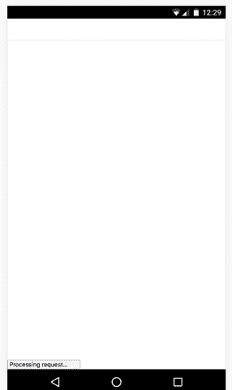*

*比较结果:*

```
*|      |     before     | fonfaceobserver |    font-display    |
|:----:|:--------------:|:---------------:|:------------------:|
| FCP  |       3,5      |        **2**        |         2,2        |
| FMP  |       4,6      |        **2**        |         2,2        |
| PSI  |       6,1      |       4,5       |         4,9        |
| TTFI |       6,1      |       5,3       |         **4,8**        |
| TTCI |       6,1      |       5,3       |         **4,8**        |* 
```

*对于 **FCP，FMP***【200 ms】*也有一些取舍但是对于交互时间更好。*

> *无论是开发新项目还是解决问题，都是一种权衡。我们不可能一直都有完美的场景。有时候我们应该做出牺牲。*

*那么如何管理这种情况呢？哪个选择会更好？*

*我使用 *fontfaceobserver* 将 [PR](https://github.com/vuejs/vuejs.org/pull/1057) 提交给 Vue.js org，因为我认为他们想要支持所有浏览器，所以使用*字体显示*的情况不会起作用。*

*结果:*

*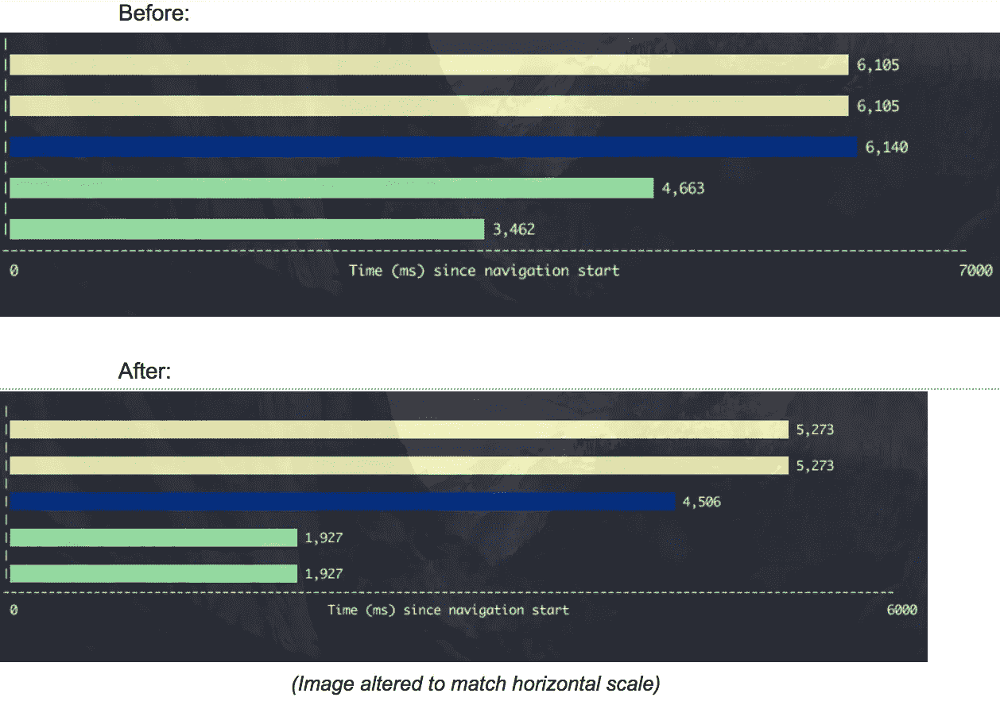*

*如果你正在使用 evergreen 浏览器，不要犹豫——使用本地支持的功能，使用*字体显示。**

*谢谢你的阅读。*

*附注:我写这篇文章是为了展示如何通过几个步骤来提高移动设备和慢速网络上的应用程序的速度。*