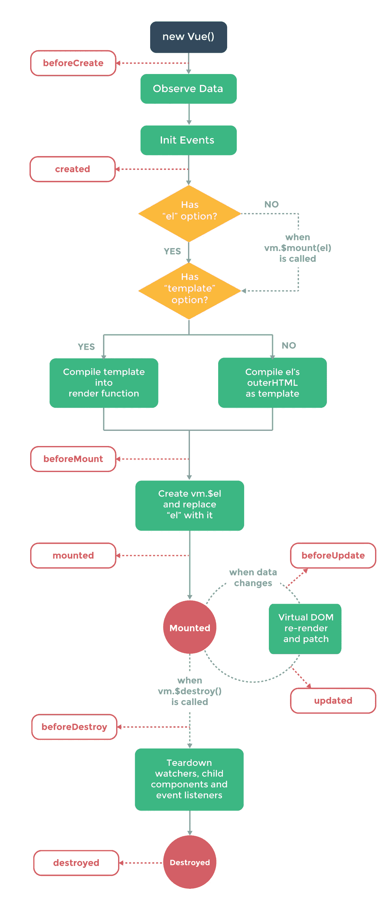

# Vue 与 React

> 原文：<https://medium.com/hackernoon/vue-vs-react-254a874d74ab>

作为一名新的开发人员，我发现要过滤噪音并理解哪些框架值得学习几乎是不可能的。人们不可避免地会推广他们正在使用的技术，因为这会让他们更有市场，因为我为什么要宣传我浪费了两周时间去学习一个比新奇小不了多少的东西呢？话虽如此，Vue 并不新奇。

对 Vue 的粗略研究发现了 Vue 2.o [发布以来的最新文章，证明 Vue 比 react](/the-vue-point/vue-2-0-is-here-ef1f26acf4b8#.mppjg5afe) 快 33%。Github 趋势显示，Vue 仍然排在 React 和 Angular 之后的第三位[，这是有道理的，因为脸书和谷歌支持这些事业。截至 2016 年 8 月，Vue 的使用量还不到 React 和 Angular 的一半。VueJs 凭借强大的国际认可度取得了进展。美国的*独角兽*使用 React 和 Angular，但中国的*独角兽*如百度和阿里巴巴使用 Vue。](https://www.quora.com/How-popular-is-VueJS-in-the-industry)

在使用 Vue with Electron 为图灵学校的一个项目制作了一个桌面 notes 应用程序后，我发现 Vue 比 React 更容易学习，原因有几个。在我解决这些差异之前，值得注意的是 React 是一个库而不是一个框架。Vue 的一些优势可归因于这一关键差异。

**首先，Vue 的结构很直观。**每个 Vue 组件都有一个*脚本标签*，您可以在其中导入所有的依赖项，通过数据方法维护 Vue 的等同状态，并定义从其他组件传递下来的继承属性。您也可以在 methods 对象中创建自己的方法。每个组件都有*一个模板*，相当于 React 组件的 render 方法。将函数或道具传递给孩子有一个简单、易于理解的语法。最后，每个组件都有自己的风格，这非常简单。

```
<script>
export default {
  components: {},
  data() {
    return {
      notes: [],
      activeNote: {},
      savedNote: {},
      search: '',
    };
  },
  created() {
    this.fetchNotes();
  },
  methods: {
    addNote(title, body, createdAt, flagged) {
     return database('notes').insert({ title, body, created_at: createdAt, flagged });
  },
};
</script><template>
  <div class="app">
    <header-menu
      :addNote='addNote'
      >
  </div>
</template><style scoped>
  .app {
    width: 100%;
    height: 100%;
    postion: relative;
  }
</style>
```

**其次，生命周期事件实际上是有意义的。下面的图表演示了这些事件挂钩，实现它们就像在脚本标签中插入一个 beforeCreate 方法一样简单。在上面的脚本标签中可以找到一个创建方法的例子。在我看来，可以对 React 提出的一个抱怨是，他们没有直观地使用那些生命周期挂钩。**



**第三，和 Angular 一样，它提供了双向数据绑定的训练轮**。如果你习惯使用 React，你会知道渲染状态也有同样的效果，但这需要对 [JavaScript](https://hackernoon.com/tagged/javascript) 和 [React](https://hackernoon.com/tagged/react) 有一定程度的适应。

Vue 和 ember 一样，有严格执行的惯例。因此，我认为你可以在不懂 Javascript 的情况下学习/使用 Vue。React 为开发人员提供了使用该库的自由，使其非常受欢迎，但在实现上也各不相同。如果 React 是前端工程师建造房屋的工具，Vue 就是你在 people farms(那些每栋房子都有完全相同布局的社区)中找到的模板房屋之一。

所以你该费心去学 Vue 吗？为什么不呢？与其他框架相比，它快速且易于采用。不幸的是，这里没有像 React、Angular、Ember、Elm、Backbone 那样的可用资源…你懂的。

你应该选择 Vue 作为你的技术堆栈的一部分吗？假设你渴望在美国市场取得成功，答案肯定是否定的。在挑选科技股时，你应该着眼于那些追随你的人。你应该选择一个通用的框架，让招聘、入职和创业进展变得更容易。

通过学习 Vue，它帮助我对 React 的延展性有了更深的理解。我建议花一个下午的时间在 Vue 中构建一个基本的单页应用程序，以加强现代前端框架的心智模型。每个框架都旨在解决相同的核心问题，看到绕过这些问题的不同途径有助于您更深入地理解前端工程，而不仅仅是框架的语法。

这里是[到](http://prying.io/technical/2016/12/13/vue-vs-react.html)[上原始帖子的链接](http://prying.io)。

[](http://bit.ly/HackernoonFB)[](https://goo.gl/k7XYbx)[](https://goo.gl/4ofytp)

> [黑客中午](http://bit.ly/Hackernoon)是黑客如何开始他们的下午。我们是阿妹家庭的一员。我们现在[接受投稿](http://bit.ly/hackernoonsubmission)并乐意[讨论广告&赞助](mailto:partners@amipublications.com)机会。
> 
> 如果你喜欢这个故事，我们推荐你阅读我们的[最新科技故事](http://bit.ly/hackernoonlatestt)和[趋势科技故事](https://hackernoon.com/trending)。直到下一次，不要把世界的现实想当然！

