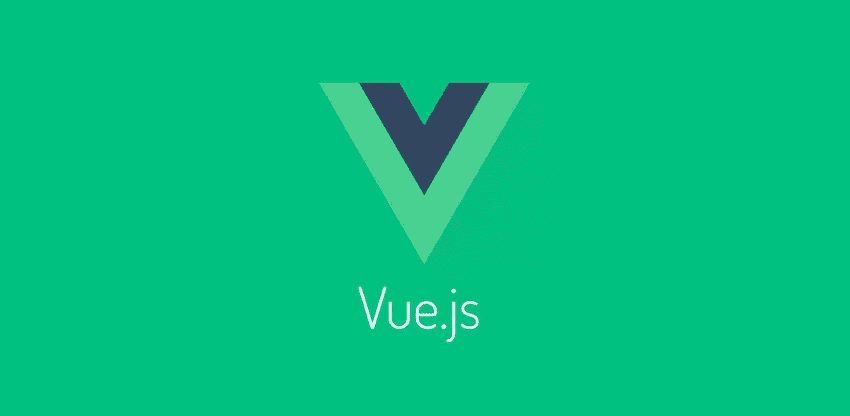

# VueJS:第一印象

> 原文：<https://medium.com/hackernoon/vuejs-first-impressions-ef59822e94e6>



有了这么多新的库和框架，很难跟上它们的步伐，如果你甚至能决定哪些值得花时间的话。在过去的一年多时间里，我接触了许多新的技术堆栈，包括 React for work 和 React-Native、Aurelia 和 Angular2。他们每个人都参与了一个新项目，部分原因是想尝试一下或者形成自己的观点。

之前我写过关于奥雷利亚的文章，在角 2 灾难之后，我印象非常深刻，如果你喜欢，你可以在这里阅读更多信息:

[](/@reme.lehane/aurelia-first-impressions-e72262e6e049) [## 第一印象

### 最近我有一个小的个人项目，我想重建，一个我很久以前就开始的项目…

medium.com](/@reme.lehane/aurelia-first-impressions-e72262e6e049) 

这一次，我决定一头扎进 [Vue。JS，](https://vuejs.org/)网上有很多关于它的好消息，它显然比 react 更快，它实现了 [Snabbdom，](https://github.com/snabbdom/snabbdom)一个简单而强大的虚拟 dom，专注于性能。最重要的是，它明显小于 React，大约 14kb。

在我多年来使用过的所有框架和库当中，有一件事让我对 Vue 印象深刻。JS 是文档，非常详细且易于理解，涵盖了多种用例以及适用于每个内置方法的各种选项。

现在来看一下代码，下面的例子是一个非常简单的组件，用非常简单的代码编写，只是为了让你对事物的结构有一个概念..

Vue。JS 使用一个包含模板主体和脚本部分的模板文件，这些文件用一个**保存。vue** 扩展。

Vue。JS 本身是完全与模板无关的，你可以像上面一样使用把手/指令模板，你也可以使用 **JSX** ，或者如果你喜欢，甚至可以使用 es5 或 es6 字符串插值手动构建它。

这个文件基本上处理了所有的事情，您将定义 HTML 结构以及相关的脚本逻辑，并定义一个`<style>`块或者导入一个样式表，就像示例中那样。

脚本标签是所有真正工作开始的地方，我们从导入 Vue 和我们打算在组件中使用的任何组件开始。

```
name: 'Events',
 components: {
    'header-bar': Header,
    'search-bar': Search,
    'list-data': List,
    'footer-bar': Footer,
 },
```

上面我们有一个默认导出对象的片段，我们从组件名开始，后面跟着一个`components`对象。这个对象定义了一个键，它是我们模板中 HTML 元素的标记名，它的值是我们前面导入的组件。

接下来，我们有一些控制初始逻辑和定义可用函数的方法。

```
data() {
  return {
    data: [],
    searchTerm: {},
  }
},
```

`data()`函数用于为组件的初始呈现设置默认数据，这里的数据关键字是将自身设置为空数组，因为稍后当我们获取数据时，它将变为对象数组，并且我们不想通过使用无效的数据类型来破坏呈现。

```
created() {
  // API/Service calls would go here
  return {
    data: [
      {},
      {}
    ],
  };
},
```

`created()`类似于 reactions`componentWillMount`生命周期方法，这是组件生命周期内去获取组件启动时不可用的任何数据的最佳位置，在这种情况下去获取实际的列表项。

```
methods: {
  search() {
    // Search method written here
  },
}
```

`methods()`是定义将在组件本身内部使用或传递给子组件作为道具的函数的地方，就像`search()`的情况一样，子`Search`组件将通过道具接收该方法，然后当用户与搜索组件交互时，该方法将被触发。

这个例子中没有特别包括但被引用的一件事是道具，比如 reaction，这个阶段可能还有许多其他的库，Vue。JS 还支持道具，像 react 一样，它们可以是子组件所需的任何东西，无论是静态文本、函数和需要循环的数据数组，还是具有用于简单动态显示的键值对的对象。

道具的定义非常简单，在`default export`中你可以添加另一个名为“道具”的密钥，其中包含了它期望收到的所有道具。

上面是搜索组件的一个例子，可以看到它包含两个支柱，submit 方法和 term，这是一个用于处理将被传递到函数中的搜索值的模型。

这只是一种尝试，看看 Vue 能做些什么。JS，通过访问他们在 [Vue 的文档，你会看到更多的例子。JS 文件](https://vuejs.org/v2/guide/)。
如果你想快速启动一个应用程序，然后开始和 Vue 玩。JS，我可以建议大家看看由 [FountainJS](https://github.com/fountainjs/generator-fountain-vue) 创建的 Yeoman 生成器。

和 Vue 一起工作。JS 是一个很大的乐趣，我发现学习曲线非常浅，然而，这可以纯粹基于我的经验，正如前面提到的，我曾经与一些在过去。

默认的模板结构感觉非常类似于它在 Angular 中的工作方式，因此来自该背景的开发人员可能会比他们的反应更快地获得它。我真的不能不做出反应，看看这是否会影响到接 Vue.JS 的难易程度。

[](https://www.monterail.com/blog/state-of-vuejs-report-summary) [## Vue.js 现状——报告的主要观点

### 这真的很令人兴奋:我们的团队刚刚完成了关于 Vue.js 状态的工作——这是一份为……

www.monterail.com](https://www.monterail.com/blog/state-of-vuejs-report-summary) [](https://www.monterail.com/blog/people-to-watch-if-youre-a-vue.js-developer) [## 如果你是 Vue.js 开发者，你应该关注的人[信息图]

### 你可能已经知道这一点:学习任何学科的第一步是承认你不知道…

www.monterail.com](https://www.monterail.com/blog/people-to-watch-if-youre-a-vue.js-developer) 

[推特](https://twitter.com/RemeJuan)|[insta gram](https://www.instagram.com/reme.lehane/)|[YouTube](https://www.youtube.com/channel/UCwIyQSCyWe9Ygg6xbYe9mdQ)

[](http://bit.ly/HackernoonFB)[](https://goo.gl/k7XYbx)[](https://goo.gl/4ofytp)

> [黑客中午](http://bit.ly/Hackernoon)是黑客如何开始他们的下午。我们是 [@AMI](http://bit.ly/atAMIatAMI) 家庭的一员。我们现在[接受投稿](http://bit.ly/hackernoonsubmission)并乐意[讨论广告&赞助](mailto:partners@amipublications.com)机会。
> 
> 如果你喜欢这个故事，我们推荐你阅读我们的[最新科技故事](http://bit.ly/hackernoonlatestt)和[趋势科技故事](https://hackernoon.com/trending)。直到下一次，不要把世界的现实想当然！

