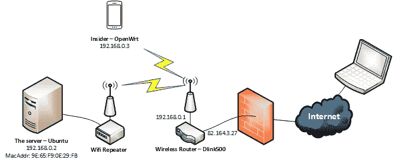

# 通过互联网进行局域网唤醒

> 原文：<https://medium.com/hackernoon/wake-on-lan-through-the-internet-491817e2dd41>

我的日常工作通常是从打开一个到服务器的 SSH 连接，运行一个 docker 镜像(上面有 RStudio Server 或者 Jupyter)，直接在浏览器上分析数据或者编程开始的。一直都很方便，直到上个月突然断线。突然所有的东西都停止工作了，我绝望地浪费了几个小时试图修好它。回家后我发现，由于楼上的一个小建筑，我公寓的电很不稳定。当然，一个简单的解决方案是获得一个 UPS(不间断电源),但我被这个想法迷住了，也许我可以通过互联网打开我的服务器。这就像服务器的电源开关一直在我身边。这太酷了，尤其是当我要离开很长一段时间，不想在能源账单上浪费钱的时候。这个故事是关于我是如何做到的。你可以先看看我最后的网络设置。



My Network with the Wifi Repeater to provide wired connection to the server, and an insider to help me wake the server through the internet

**第一步**:满足硬件要求

在大多数主板上，有一个功能叫做“局域网唤醒”(WOL)。WoL 的工作原理是向目标机器发送一个名为 Magic Packet 的数据包。当收到数据包时，目标机器的网络接口会唤醒计算机的其余部分。然而，我意识到我不能通过它的无线接口唤醒我的服务器(我使用的是 USB 无线适配器)。原来，这个神奇的数据包必须被发送到主板的内置以太网端口，因为它是整个机器关闭时唯一醒着的东西。我用一个 *Wifi 中继器*解决了这个问题，并通过以太网电缆将其连接到服务器。**如果你的机器使用有线连接，你可以跳过这一步。**

**第二步**:让局域网唤醒在局域网上工作。

顾名思义，WOL 旨在通过本地网络唤醒机器。所以你必须和你的目标设备在同一个网络中才能让它工作。在这一步中，我们将尝试这样做。
首先，你必须打开主板上的 WOL 功能。进入 BIOS 设置，寻找“PCI 事件唤醒”或“局域网唤醒”并启用它。
第二，在 Ubuntu 上，你要知道你的默认界面，检查它是否支持 WOL，开启该功能。整个过程可以如下进行:

```
$ route #Get name of the default interface, for example: **eth0**
$ sudo ethtool eth0 
#Look for "Supports Wake-on: g" line, which means WOL supported
$ sudo ethtool -s eth0 wol g  #Enable WOL
```

要使设置在重启后保持不变，您需要将上面的最后一条命令添加到 *etc/network/interfaces* 中的接口配置中。你可以在[这里](https://help.ubuntu.com/community/WakeOnLan)阅读更多内容。

现在，让我们来测试一下。你可以在 Android 中使用一款名为“Wake-on-Lan”的手机应用(iOS 也有类似的应用，但我没有测试过)。它可以自动扫描您的本地网络，并列出所有连接的设备。你只需搜索你的机器，添加它，然后你就可以随时向它发送神奇的数据包。试着关掉你的目标机，用手机唤醒它。

如果您知道设备的 mac 地址和广播地址，您可以手动添加设备。在我的例子中，它们是 9E:65:F9:0E:29:FB 和 192.168.0.255。您可以使用 *ifconfig* 命令来找出这些信息。请注意，您将需要您的 mac 地址来通过互联网唤醒您的机器。

**第三步**:通过互联网实现网络唤醒。

请注意，您的路由器必须有一个静态 IP(即 82.164.3.27 的**)才能完成这一步。有许多方法可以通过互联网发送神奇的数据包。我将它们从最简单到最难(有时是唯一的)的解决方案列在下面:**

****第一种解决方案**:如果你的路由器支持转发魔包(端口 7 或 9 UDP)，你很幸运。您可以将任何数据包从端口 7 或 9 UDP 转发到您的目标设备。有些路由器甚至允许转发广播数据包。你可以使用[这个网站](https://www.depicus.com/wake-on-lan/woli.)来唤醒你的服务器。但是，据我所知，大部分流行的商用路由器都不支持这个(我的情况)。记得为您的服务器预留 DHCP 地址，这样它的 IP 地址在重新连接后不会改变。**

****第二种解决方案**:你可以检查一下你的路由器是否可以安装一个更好的固件。出于营销目的，许多路由器生产商隐藏了产品的功能。您可以安装第三方固件来解锁所有这些。我强烈推荐 [OpenWrt](https://openwrt.org/) 。在这里检查你的路由器是否被 OpenWrt [支持。](https://wiki.openwrt.org/toh/start)**

****第三种解决方案**:如果你的路由器没那么好，你就需要一个内线。它是一种始终开启并连接到您的本地网络的设备。然后你可以通过互联网向你的内线发送 SSH，让它为你发送这个神奇的包。在我的例子中，我使用了一个便宜的 Raspberry Pi 3(我已经用它来控制其他东西)。我在上面使用 OpenWrt，运行如下的 etherwake 命令:**

```
$ etherwake 9E:65:F9:0E:29:FB eth0
```

**第一个参数是目标机器的 mac 地址，而第二个参数是将发送包的内部人员的网络接口。它应该是它的默认接口。您可以查看[此链接](https://wiki.openwrt.org/doc/uci/wol)了解更多详情。请注意，您的内部人员可以是运行任何操作系统的任何设备。只要你能通过网络 SSH 到它，它应该可以工作。记得为内部人员的 SSH 端口配置端口转发，这样您就可以从任何地方对其进行 SSH。**

**所以，就这样了。我希望你喜欢这个故事。如果有任何问题，请留下您的评论。**