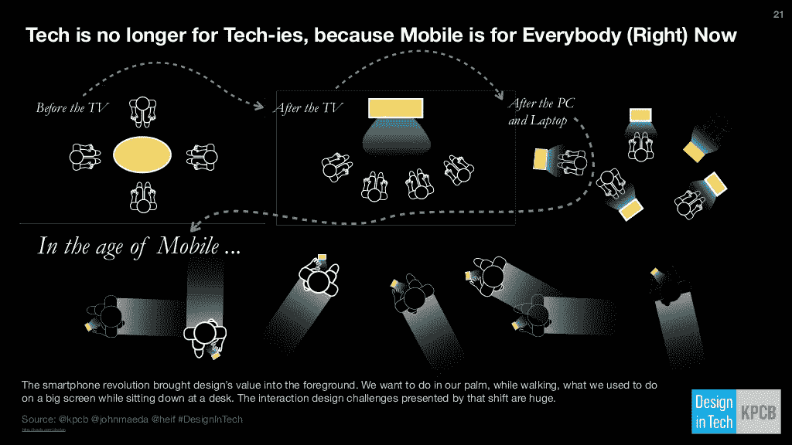
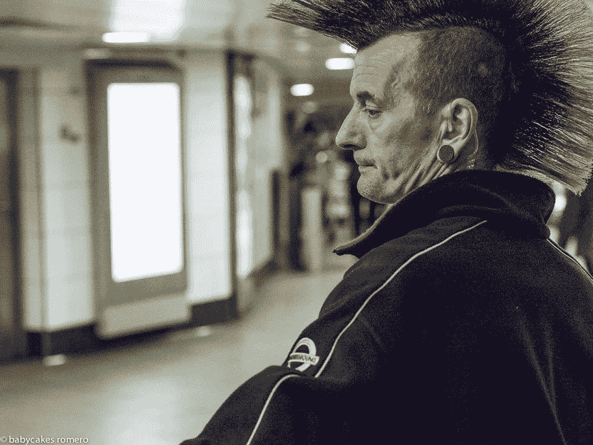
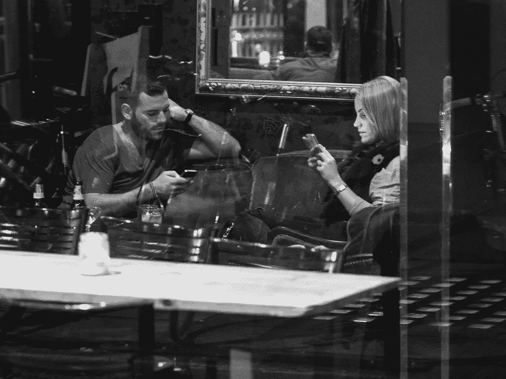
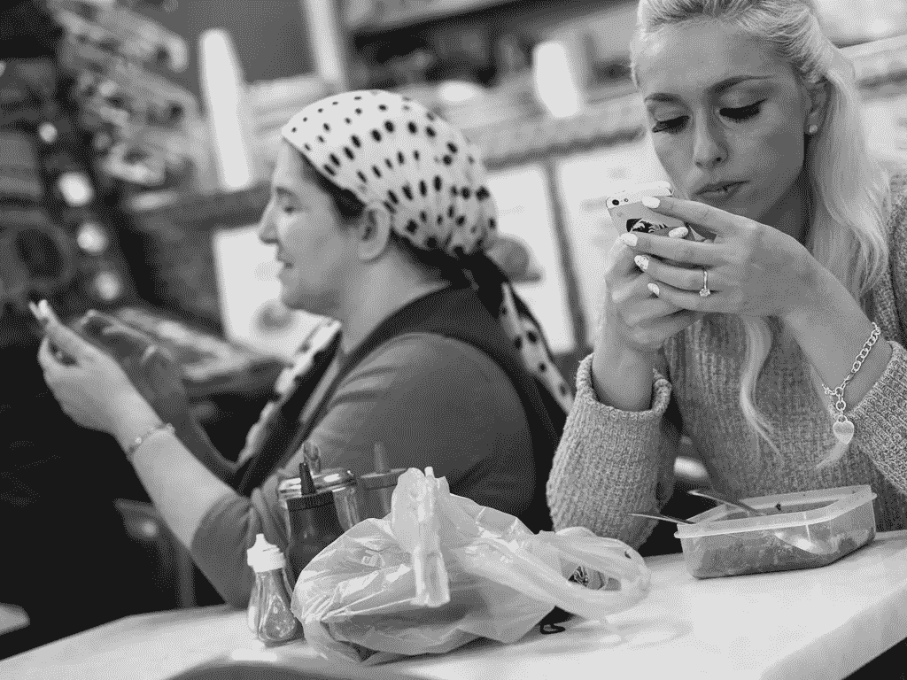
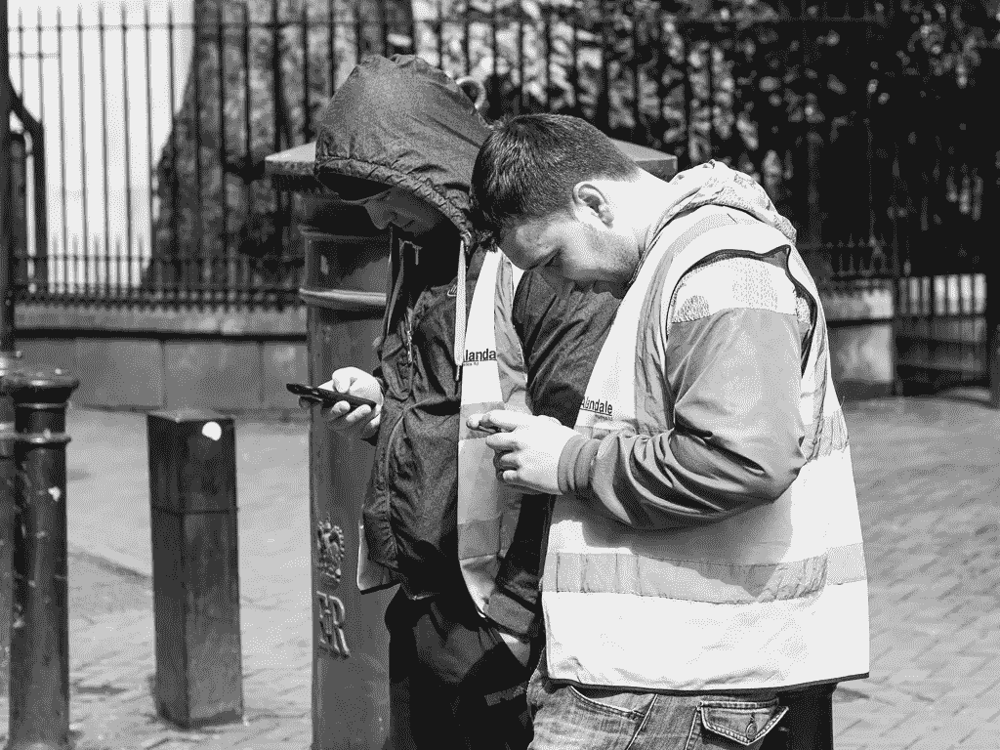
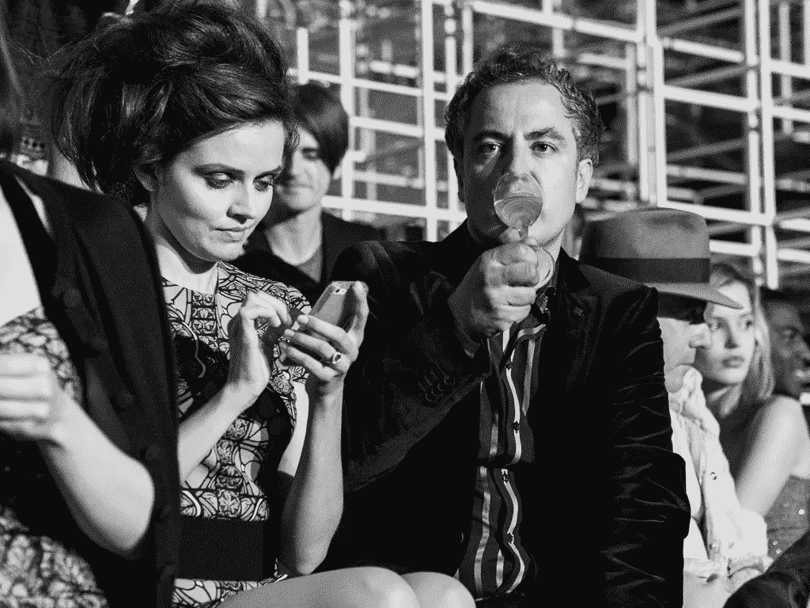
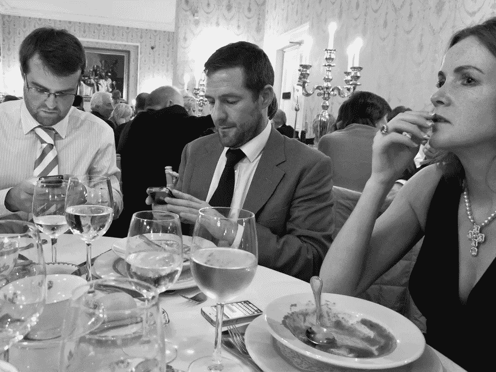

# 说到做到

> 原文：<https://medium.com/hackernoon/walk-the-talk-ce5e31ecc9ee>

> 毫不奇怪，由于他对互联网以及其他许多事情的怀疑，我们的主角化名为“Babycakes Romero ”,这个名字实际上很适合他，因为我已经开始欣赏 Babycakes(更容易放弃 Romero)是如何体现他的性格以及他的标志性工作。

# 电脑拥抱

他一生都在拍摄照片，和我一样，他对人和技术以及彼此之间的影响非常着迷。使用它或滥用它，享受它或持有不信任——智能手机不仅是我们认为理所当然的东西，而且我猜没有它我们将难以运转。

每次我们收到通知——一封电子邮件、一条短信、一条分享、一个赞或一条评论——我们的大脑都会受到轻微的多巴胺冲击。这种情况(或者依赖于你的依赖程度的上瘾)通常会在奖励驱动的行为周期中升级。

## 结果可能是每天 200 次以上不必要的查看你的智能手机，这是为了追求 Babycake 创造的一个新词:电脑拥抱 T2 T3 T4 T5。

我们对这些拥抱的痴迷程度可不是闹着玩的，因为最近一份来自剑桥大学的报告称，英国人现在每天花近 2 个小时通过智能手机上网。

然而，如果我们想一起避免诱惑，我们可以从一起扔掉我们的智能手机开始。事实上，随着**智能手机的流行，这种做法越来越流行。对于 Babycakes 来说，这很简单，因为他从来没有拥有过一个。**

# **永远在线**

****

**Courtesy of @kpbc @johnmaeda Design in Tech Report.**

**没有粘在屏幕上盲目地走在街上，也没有能够立即逃入一个联网的世界——这为 Babycakes 提供了一个独特的视角来看待智能手机的激增。事实上，它确实在世界上占据了主导地位:明年将有超过 20 亿部智能手机投入使用，预计到 2020 年将有多达 500 亿部联网设备投入使用。**

# **走红**

****

**Photo Courtesy of @BabyCakesRomero**

**在一个由智能手机推动的**永远在线的文化中，Babycakes 在日常摄影系列中发表了他的观察。****

********

****Photo Courtesy of @BabyCakesRomero****

********

****Photo Courtesy of @BabyCakesRomero****

********

****Photo Courtesy of @BabyCakesRomero****

****按照惯例，他最初发布了 [**的死亡对话**](http://babycakesromero.com/the-death-of-conversation/) 画廊，作为他日常 [**#MYLDN 街头摄影系列**](http://babycakesromero.com/blog/) 的一部分，以获得他谦虚但专注的订户群的赞赏。****

********

****Photo Courtesy of @BabyCakesRomero****

****六个月后，当 Babycakes 被提示在一个摄影网站上重新发布该图片库时，事情发生了变化。在**病毒式传播的魔力推动下——首先他们在哥伦比亚变得疯狂，几天之内就像传染病一样蔓延到了世界其他地方。******

************

******Photo Courtesy of @BabyCakesRomero******

************

******Photo Courtesy of @BabyCakesRomero******

************

******Photo Courtesy of @BabyCakesRomero******

******在一场完美风暴中，媒体拿起了画廊——转贴、抓取、分享、特写、采访和几乎任何你可以用如此强大的图像和如此多的人产生共鸣的主题做的事情。具有讽刺意味的是，从统计数据来看，大多数人在 150 多种出版物上浏览画廊，是的，是在智能手机上。最特别的是，在最近的一次谈话中，Babycakes 告诉我:******

> ********..有趣的是，我并不觉得除了看着它发生并继续我一直在做的事情之外没有什么可做的********

******总结起来，所有的喧嚣——从三位数的收视率到六位数的收视率——他的工作实践没有受到影响。这是一个项目。稍等一下。就像是一个信号，或者一条推特，小宝贝开始做下一件事。******

# ******英国广播公司的传奇******

******凭借惊人的生产力和无拘无束的坚持，Babycakes 一直把他的作品拿出来欣赏。几十年来，他一直是一个纯粹主义者，很少考虑财务回报。我想更深入地挖掘，因为我想知道一个人可能会利用 [**临时威权主义**](https://www.google.co.uk/search?q=death+of+the+conversation&es_sm=91&biw=1193&bih=539&source=lnms&tbm=isch&sa=X&ei=d6E7Veb7NtHvaMXVgdAD&ved=0CAcQ_AUoAg) 的自恋诱惑到底有没有诱惑他。******

****我知道的是，他只在乎一个瞬间。对他来说，成功的定义是登陆他的首选新闻来源 BBC 的主页。一个春天，这一切终于发生了，他对自己很满意。然而，这一时刻很快就成为了一次超越马斯洛巅峰的经历，他的新任务是在网站的“最受欢迎”部分排名第一。****

## ****可悲的是，这一传奇是短暂的 ，他因世界首例成功阴茎移植而脱离了其他头条新闻。****

****几十年来，正是这种无忧无虑的精神让 Babycakes 不断创新，通过摄影重塑自我，拓展创作的边界。他以轻松而谦逊的方式，继续做着自己的事情。尽管如此，我发现看到其他人注意到了这一点，这让我感到欣慰:****

> ******“baby cakes Romero 对于摄影就像班克斯对于涂鸦一样”
> - Klik 杂志******

********

****Photo Courtesy of @BabyCakesRomero****

********

****Photo Courtesy of @BabyCakesRomero****

# ******21 世纪营销******

****俗话说，好事情总是发生在等待的人身上。Babycakes 最近受邀在 [**TEDx**](https://www.youtube.com/watch?v=SKx2lfobPuU) 讲述他的故事。虽然许多人对这个话题发表了评论，但没有人用如此直观的方式记录下来。Babycakes 是我见过的最糟糕的自我推销者之一，当我向他提到这一点时，他轻松的回答是:****

> ****“你只需要相信，如果你继续创作好的作品，它会获得成功并找到自己的归宿。”****

## ****确实内容营销做得对，真实性做得简单 [**因为重要**](http://contently.com/strategist/2015/02/06/you-need-editors-not-brand-managers-marketing-legend-seth-godin-on-the-future-of-branded-content/) **。他创作了大量的作品，包括写剧本、制作短视频，还每天拍摄街头照片，很难想象 Babycakes 是如何找到时间做这些的。事实上并不是这样——毕竟你永远不会看到他盯着自己的智能手机。******

*****你可以在这里* *在线查看整个死亡对话图库* [*。*](http://babycakesromero.com/photography/the-death-of-conversation/)****

********************************

> ****[黑客中午](http://bit.ly/Hackernoon)是黑客如何开始他们的下午。我们是 [@AMI](http://bit.ly/atAMIatAMI) 家庭的一员。我们现在[接受投稿](http://bit.ly/hackernoonsubmission)，并乐意[讨论广告&赞助](mailto:partners@amipublications.com)机会。****
> 
> ****如果你喜欢这个故事，我们推荐你阅读我们的[最新科技故事](http://bit.ly/hackernoonlatestt)和[趋势科技故事](https://hackernoon.com/trending)。直到下一次，不要把世界的现实想当然！****

********