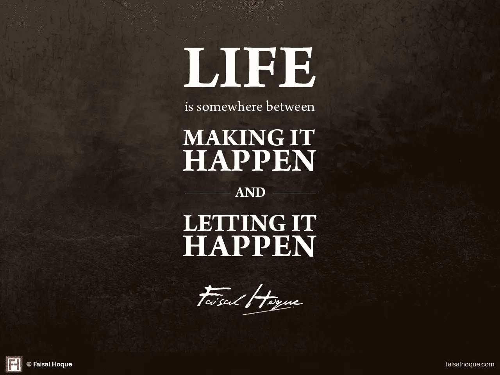
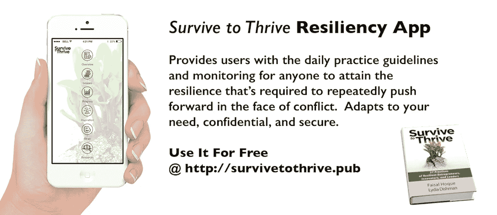

# 想要成功？宫廷奇遇

> 原文：<https://medium.com/hackernoon/want-success-court-serendipity-fdb206521b69>

[Photo by [Eutah Mizushima](https://unsplash.com/photos/2TlAsvhqiL0?utm_source=unsplash&utm_medium=referral&utm_content=creditCopyText) on [Unsplash](https://unsplash.com/?utm_source=unsplash&utm_medium=referral&utm_content=creditCopyText)]

## 关于机缘巧合、同步性和偶遇的对话永无止境，已经持续了数百年。那是因为生活中的大多数宝藏都是偶然出现的。

我一直在各种社交媒体上看到下面这个迷因:

**考虑以下论点**

*   青霉素、便利贴、x 光、微波炉、起搏器都是作为副产品被发明出来的。事实证明，许多[发明源于简单的弯路](http://www.fastcompany.com/3027450/dialed/how-taking-a-detour-can-actually-lead-to-greater-innovation)或人们在替代任务中犯的错误。
*   称之为神的干预，称之为宇宙——如果你对可能性持开放态度，“帮助”通常会在我们最需要的时候出现。当两个人或事件基于相似的意图被吸引到相同的时间和地点时，这种“奇迹”就会发生。通常这被称为同步性(如卡尔·荣格所定义的)。
*   我们中的大多数人都会遇到有意义的关系——无论是配偶、朋友、商业伙伴、导师，还是改变人生的个人关系——[通常来自偶遇](http://faisalhoque.com/2014/03/24/trusting-your-lifes-journey/)。

让我们来考察一下“serendipity”这个词的来源。它来源于古老的童话——[*塞伦迪普*](http://press.princeton.edu/chapters/s7576.pdf) 三王子。这是米歇尔·特拉梅兹诺于 1557 年在威尼斯出版的《热地夜游集》的英文版。Serendip 是斯里兰卡的波斯名字，取自梵语“Suvarnadweepa”或金岛，或最初来自泰米尔语“Seren deevu”。

## **故事是这样发展的**

很久以前，塞伦迪普的三个年轻的王子决定去世界上寻找荣耀和宝藏，以此来纪念他们的父亲并获得他的宠爱。

他们决定不像王子一样旅行，而是像普通人一样，这样就没有人会给他们任何特权。他们发现，通过这种方式旅行，他们发现了许多艰难困苦。

但他们也意外地发现，在最不可能的情况下，在最不可能的地方，在最不可能的人身上，会有更大的好处。经过多年的旅行后，他们回到家中，告诉他们的父亲和他的法庭他们所看到的和经历的一切，他们决定通过创造一个词来纪念找到有价值的和令人愉快的东西的经历。

塞伦迪普三王子创造的词是“意外之喜”

## **不劳而获**

俗话说:不入虎穴，焉得虎子。现在有很多研究表明偶然事件是如何相互联系的。当我们反复努力时，当我们留意选择和可能性时，秩序可以从混乱中出现。

探索——无论是什么——始于好奇和意图。

这一意图变成了一次专注的旅程。

只有当我们在旅途中曲折前行时，我们才能从意外发现、同步性和偶遇中发现我们的宝藏。

如果我们不尝试，我们就不会珍惜生命。也许最大的矛盾是，随着我们的努力，放手的能力会带来最大的不同。这就像开着车不担心到达目的地。我们越欣赏风景、场景和气味，我们就越能吸引生活的奇迹。

正如黛博拉·莫盖茨在 [*最好的异国金盏花酒店*](http://www.deborahmoggach.com/index.php/the-best-exotic-marigold-hotel/) 中写道:

> “唯一真正的失败是没有尝试。衡量成功的标准是我们如何应对失望。一如既往。我们来到这里，我们尝试。我们所有人，以不同的方式。我们会因为觉得自己太老而无法改变而受到责备吗？太害怕失望而不敢重新开始？我们每天早上起床，竭尽全力。其他都不重要。
> 
> 但是，不冒险的人什么也不做，这也是事实；一无所有。我们所知道的未来是不同的。但是，也许我们害怕的是它会是一样的。因此，我们必须庆祝这些变化。因为，就像有人说过的“最后一切都会好的”。如果还不行，相信我，这还不是结束。”

保持信心，我的朋友们，祝狩猎愉快…

***版权所有 2017 费萨尔·霍克。保留所有权利。***

我是一名[企业家和作者](http://faisalhoque.com/speaking/)。SHADOKA 等公司创始人。Shadoka 让抱负成为领导、创新和变革的动力。Shadoka 的加速器和解决方案汇集了管理框架、数字平台和思想领导力，以实现创新、转型、创业、增长和社会影响。

作者“ [*万物相连——如何在创意、创新和可持续发展时代转型和领先”*](http://www.amazon.com/Everything-Connects-Creativity-Innovation-Sustainability/dp/0071830758/ref=sr_1_1?ie=UTF8&qid=1376488798&sr=8-1&keywords=everything+connects%2Bfaisal+hoque) ”(麦格劳·希尔)和“ [*生存与繁荣:富有弹性的企业家、创新者和领导者的 27 种实践”*](http://survivetothrive.pub/) ”(励志出版社)。在推特上关注我[费萨尔·霍克](http://medium.com/u/66953a6e238f)。*免费使用* [*万物相连*](http://app.everythingconnectsthebook.com/login.php) *领导力应用程序和* [*生存致富*](http://app.survivetothrive.pub/login.php) *领导力应用程序。*

