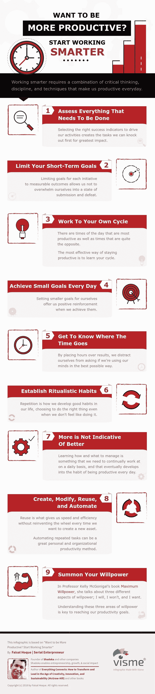

# 想要更有成效的新年吗？试试这些更聪明的习惯

> 原文：<https://medium.com/hackernoon/want-to-be-more-productive-start-practicing-these-smarter-habits-74e0398d76aa>

[Image: [Charlz Gutiérrez De Piñeres](https://unsplash.com/@charlz)]

## 进步当然来自于努力工作，但是努力工作是不够的。

不管我们的背景、位置或职业如何，有一种语言是相同的，那就是进步的语言。

为了达到我们想要的结果，我们每个人都需要找到自己更聪明的工作方式。更聪明地工作需要批判性思维、纪律和技术的结合，使我们每天都富有成效。

这是一个不断进步的问题。

我相信生产力和进步来自于我们的思维方式、习惯和周围环境的结合。正如彼得·德拉克的名言，

> “效率就是把事情做对；有效性就是做正确的事情。”

以下是一些我认为有助于推动我前进的技巧:

***Infographic made with*** [***Visme***](http://www.visme.co/)***.***

版权所有 2016 年由费萨尔霍克。保留所有权利。

我是一名[企业家兼作家](http://faisalhoque.com/speaking/)。 [SHADOKA](http://shadoka.com/) 等公司创始人。Shadoka 促进企业家精神、增长和社会影响。著有《 [*《万物互联——如何在创意、创新和可持续发展的时代进行变革和领导》》(McGraw Hill)和《*](http://www.amazon.com/Everything-Connects-Creativity-Innovation-Sustainability/dp/0071830758/ref=sr_1_1?ie=UTF8&qid=1376488798&sr=8-1&keywords=everything+connects%2Bfaisal+hoque) *[*生存并茁壮成长:弹性企业家、创新者和领导者的 27 种实践*](http://survivetothrive.pub/) 》(励志出版社)。在推特上关注我。*免费使用* [*万物互联*](http://app.everythingconnectsthebook.com/login.php) *领导力 app 和* [*生存茁壮*](http://app.survivetothrive.pub/login.php) *弹性 app。**

> [黑客中午](http://bit.ly/Hackernoon)是黑客如何开始他们的下午。我们是 [@AMI](http://bit.ly/atAMIatAMI) 家庭的一员。我们现在[接受投稿](http://bit.ly/hackernoonsubmission)，并乐意[讨论广告&赞助](mailto:partners@amipublications.com)机会。
> 
> 如果你喜欢这个故事，我们推荐你阅读我们的[最新科技故事](http://bit.ly/hackernoonlatestt)和[趋势科技故事](https://hackernoon.com/trending)。直到下一次，不要把世界的现实想当然！

