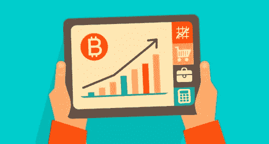
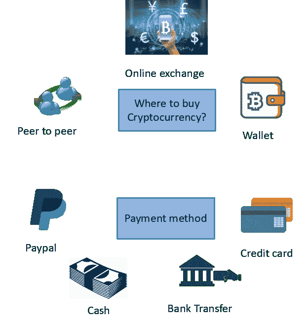

# 想买加密货币？你需要知道的！

> 原文：<https://medium.com/hackernoon/want-to-buy-cryptocurrency-what-you-need-to-know-1ad6caea5527>

在过去的 6 个月里，加密货币的世界非同寻常，创下了历史新高，在这段时间里，我收到了无数来自朋友和家人的消息和问题。问题多种多样，从“我如何开始？”、‘我如何购买比特币/以太坊，它们有什么不同？’，‘我会赢多少钱？’诸如此类。

我看到自己重复同样的答案，并决定写一篇关于如何开始的 101，以及提供在学习过程中有用的有价值的链接和资源。本文将阐述如何开始关注安全性、易用性以及您应该注意的事项，因为许多人不会关注加密货币的所有权和存储。

# 一点背景知识:

**什么是加密货币？**最简单的形式，它是一种使用加密技术来促进安全交易的数字货币。比特币于 2009 年发布，是最早的加密货币。

比特币是一种点对点支付系统。这是比特币的匿名创造者中本聪的话，他/她/他们(Satoshi 直到今天仍然不为人知)在 2008 年发表了一份白皮书，描述了比特币的工作原理。近 9 年来，比特币一直表现强劲，目前正在解决一些实际问题，如提供廉价汇款和给予人们财务自由。多年来，出现了许多其他加密货币/代币，以太坊是继比特币之后最知名的。现在，估计有 1000 多种加密货币在比特币之后被创造出来，据称，每一种都试图服务于不同的功能。人们可以创造自己可编程的“货币”、“资产”或“商品”，而不受政府或银行的控制，这是一件大事，他们已经开始注意到这一不可阻挡的趋势。

> *人们可以创造他们自己的可编程‘货币’、‘资产’或‘商品’，而不受政府或银行的控制，这是一件大事*

# 如何开始？！

让我们开始吧。你如何开始？

1.**读作**

希望在未来获得预期回报而购买加密货币被视为一种投资。传统上，在投资之前，你会阅读你实际投资的内容。你会问我在投资什么？有风险吗？预期收益如何？有规定吗？

每当我被问及如何投资加密货币时，我总是说首先 ***学习和阅读关于它们的*** ，不要只是阅读报纸或文章说比特币或另一种硬币将在今年年底成为 XXXX 美元。了解这种特殊的加密货币试图解决的问题，它的价值主张和机制。

我建议在了解其他加密货币的工作原理之前，先了解一下比特币，然后再了解其他加密货币的工作原理，因为:

A.**比特币提供了基础。每一份关于新数字货币/项目的白皮书都会提到比特币，并说明它们的不同之处。因此，如果你想了解不同的加密货币是如何运作的，比特币是一个很好的起点和基础。当银行和咨询公司做他们的研究时，往往是先从比特币开始，然后才开始钻研创建他们自己的[区块链](https://hackernoon.com/tagged/blockchain)项目**

B.**资源。**网上有很多解释比特币的资源，例如[这里](https://sites.google.com/site/bitcoinsig/resources)和下面

C.理解比特币让我们深入了解这些被称为区块链的东西实际上是什么

D.**更容易使用。**有更多的企业和公司提供与比特币互动的用户友好界面，而不是其他处于非常早期阶段的技术娴熟的加密货币。

学习比特币可能意味着试图在技术方面了解更多，但这没关系，因为许多非技术人员通过学习其机制、工作方式和一点耐心，已经理解并掌握了比特币背后的价值主张。

这里有非常好的解释和视频让你入门(我推荐这些，因为它们在理解比特币时对我帮助最大):

*   [比特币如何在幕后运作](http://www.imponderablethings.com/2013/07/how-bitcoin-works-under-hood.html)
*   [比特币的温和介绍](https://bitsonblocks.net/2015/09/01/a-gentle-introduction-to-bitcoin/)
*   [比特币类比——雅浦群岛](https://www.youtube.com/watch?v=Fy8BfVrj4dk)

如果你想挑战自己，可汗学院用简单的语言解释复杂的话题是一项了不起的工作。

2.**问**

大量阅读后，你会有相当多的问题。这很正常。网上有论坛，[这里](http://%20https://bitcointalk.org/)和[这里](https://www.reddit.com/r/Bitcoin/)，你可以在这里提问，或者你可以找到一些已经回答了你心中问题的帖子。

还有，在业内工作的都很平易近人。通过 meetup.com 或其他平台查看您最近的聚会，与这些专家交流。世界各地也有专门的区块链和加密货币会议，你可以在这里查看。

这些本地聚会和全球会议是认识业内人士的绝佳方式，因为你可以从他们过去的经验和知识中学到很多。记住，没有愚蠢的问题！

**3。购买你觉得合适的比特币数量，然后进行交易！**

这样你就可以放心，在弄清楚这种东西是如何工作的时候，你正在积极地进行在线和离线研究，无论是关于比特币还是不同的加密货币。

你也可以随时问我任何问题，在评论中提问或者私信我。

最好的学习方法是从做开始！让我们从比特币开始，因为它更容易使用。试着买一些比特币(你能接受的任何数量)并进行交易。

> 不要忘记:只投入你准备好失去的东西！

一旦购买(见**节如何以及在哪里购买比特币？下面的**)，使用比特币钱包**存储**和**交易**比特币的过程允许您:

a)了解比特币交易的工作原理

b)在区块链上实时查看正在处理和执行的交易[https://tradeblock.com/bitcoin/](https://tradeblock.com/bitcoin/)

c)熟悉如何使用比特币和相关钱包，然后你将能够使用支持不同加密货币的不同钱包

那么有哪些比特币钱包 app 值得推荐呢？

出于用户友好，很多人都用过 Blockchain.info 钱包(不要被名字迷惑，因为这是钱包的名字。区块链和比特币不是一回事)。这里可以用[。](http://%20https://blockchain.info/wallet/#/)

由于基本特征(我将在下面解释更多)，其他有用的应用程序是菌丝体和 Airbitz。为了增加安全性，Trezor 和 Ledger 等硬件钱包也是很受欢迎的选择。

您还可以选择支持不同设备的不同钱包[这里](https://bitcoin.org/en/choose-your-wallet)和[这里](https://www.cryptocompare.com/wallets/#/overview)，它们比较不同的功能并提供评级。

# 如何以及在哪里购买比特币？

购买比特币和加密货币的所有方式都将允许一种或多种支付方式。

**钱包**

“钱包”就像一个加密货币银行账户。它允许您接收加密货币，存储它们，并将其发送给其他人。大多数只支持一种密码，而这种密码就是比特币。

一些钱包提供从钱包本身购买比特币的服务，这将你引向第三方。例如，Blockchain.info 允许在应用程序内直接购买比特币。

**在线交流**

这是一个买家和卖家来到一个地方进行加密货币交易的市场。有许多交易所可以购买比特币和其他加密货币，这些货币支持主要的法定货币，如美元、欧元、英镑、人民币等。

您可以比较不同的交易所，并根据您的位置和货币需求选择一个[这里](https://www.cryptocompare.com/exchanges/#/overview)。

**点对点/柜台交易**

[LocalBitcoins](http://localbitcoins.com) 是一个很好的资源，你可以在当地购买点对点的比特币。这可能不合你的胃口，因为你面对的是一个你不认识的人，但本地比特币真正展示了比特币巨大的去中心化特征，即使没有交易所在场，你也可以购买比特币。

或者，如果你认识出售比特币的人，你可以直接从他们那里购买，他们可以将比特币直接发送到你的钱包，避免中间人(即比特币交易所和与之相关的相关费用)。

# 现在是非常重要的一点！

正如我上面提到的，当涉及到钱包和加密货币时，有一些基本特征是非常重要的。这些是**私有密钥的所有权**和**钱包类型**。

**私钥的所有权**

加密货币使用密码学中非常有趣的属性，即公钥和私钥。通过自动售货机的例子很容易理解这一点。

任何人都可以把钱放在机器里，但是他们不能取出钱，因为他们没有钥匙，他们只能把钱放在机器里。唯一能取出钱的人是拥有钥匙的机器主人。

在本例中，自动售货机是公共地址，任何人都可以通过它向您汇款。您是机器的所有者，并且您携带的密钥是您的私钥。使用这个私人钥匙，只有你可以访问你的钱，做你想做的事。这种类比应该归功于博客极客。

因此，公钥是一个公共地址，人们在这里向您汇款，而私钥用于访问这些钱并将其发送给其他人。因此，最重要的是，您保留私钥的所有权。

> *如果您没有自己的私钥，那么您就无法控制您的加密货币*

**钱包类型**

你储存比特币的方式是拥有一个比特币钱包，它会为你生成上述密钥。在购买和储存比特币或其他加密货币之前，你**必须**了解许多不同类型的钱包。

一些钱包**为你保存你的私人钥匙**(例如任何在线交易所的钱包)，一些钱包**让你完全控制你的私人钥匙**(例如 Mycellium 应用和硬件钱包)

为了了解这些钱包类型，这篇[文章](https://blockgeeks.com/guides/paper-wallet-guide/)很好地解释了这一切。这让我不用重复他们写的东西！

如果您阅读了上面的链接(我希望您阅读了)，您将会更好地理解不同的钱包类型是如何工作的，以及拥有创建钱包时提供的私钥和种子是多么重要。

那么现在你意识到了这一点，**如何才能轻松购买比特币并完全拥有它呢？**

a)在网上交易所开个账户，买些比特币

b)打开一个单独的比特币钱包(在那里你拥有私钥)

c)将比特币从“兑换钱包”转移到您新开通的比特币钱包中

d)现在，您完全拥有自己的比特币，并可以在世界任何地方进行交易！

**包装完毕**

请记住，这只是购买加密货币的一种方式，对于不同的加密货币，它遵循相同的模式。

我希望在开始学习 crypto 之前，这是一个有用的指南。FOMO(害怕错过)打击了很多人，促使他们关注这个领域。如果这项技术是真正创新的，类似于互联网，那么它只会变得更加主流。这是一个非常有趣的领域，因为不同的创新正在发生，几乎不可能跟上所有的变化。所以，不要着急，慢慢来，耐心一点，慢慢就有道理了。

我还想借此机会重申两个要点。永远记住:

*   只投入你准备失去的东西
*   如果您不拥有您的私钥，那么您就无法控制您的加密货币

非常感谢您的阅读！

*声明:* *所有观点均为本人观点。请将此信息视为严格的教育信息，并不代表具体的投资建议或推荐。公司提及和提供的链接不构成支持和认可。*

# 有什么问题或想法吗？把它们放在下面的评论里吧！

# 发现它有帮助或知道谁会？喜欢，分享，传播知识！

— — -

如果你想阅读我未来的帖子并讨论中国、区块链和金融科技的相关话题，请关注我或在我的 [LinkedIn](https://www.linkedin.com/in/ahmedalbalaghi/) 上添加我。

*原载于 2017 年 8 月 8 日*[*https://www.linkedin.com*](https://www.linkedin.com/pulse/want-buy-cryptocurrency-what-you-need-know-ahmed-al-balaghi-%E6%9F%8F%E4%BA%9A%E5%BE%B7)*。*