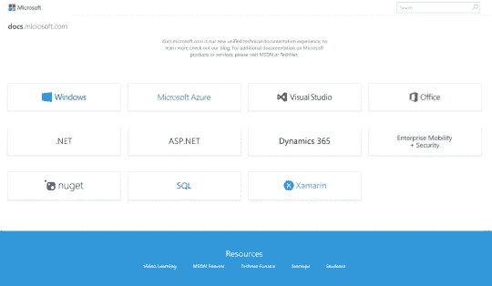
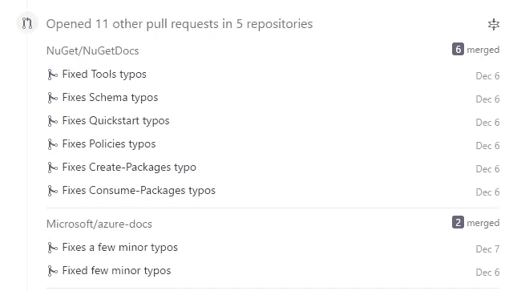
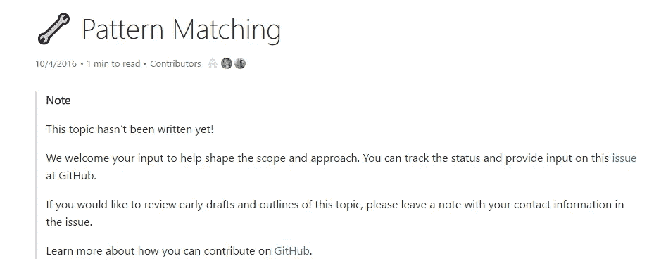
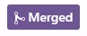

# 想有所作为吗？

> 原文：<https://medium.com/hackernoon/want-to-make-a-difference-ae4d87d9dc3c>

## 想为开源做出贡献，但是不知道从哪里开始？

你真的想*了解最新的开发者技术，同时为开源做贡献吗？想贡献点什么让你的很多码头受益？但是现在不知道从哪里开始？*

*O 一个最重要的软件，也是经常缺少的一个——***文档*** ！可悲的是，在一个发展速度越来越快的世界里，文档经常成为事后想起的东西，过时并被忽视。*

*M 微软已经意识到了这一点，因此推出了一个新的统一的 we 网站，用于他们的技术文档—[*docs.microsoft.com*](https://docs.microsoft.com)！*

**

*这就是你的机会所在，为什么？因为微软已经把他们的新文档开源了，可以在 GitHub 上获得，让每个人——不仅仅是员工——都可以通过问题和拉式请求做出贡献。*

**

*所有的贡献都是重要的，可以有各种大小，一个很好的方法是解决一些小问题，比如打字错误和语法错误。但是随着新事物的不断出现，也有机会贡献全新的文档部分。*

**

*想成为关于模式匹配的 C#参考文档的作者吗？在 GitHub [发布](https://github.com/dotnet/docs/issues/1114)，fork [储存库](https://github.com/dotnet/docs)买通，在[*pattern-matching . MD*](https://github.com/dotnet/docs/blob/master/docs/csharp/pattern-matching.md)开始黑！*

*我真的很喜欢微软的这一举措，以前的文档过程非常缓慢，给你反馈会让你有一种被忽视的感觉——而现在我经常看到拉式请求在同一天得到审查和部署。*

*也就是说，微软必须留住他们的技术作家，即使他们不再做所有的文档，也需要有人审阅、给出反馈，并在问题和拉式请求上指导人们。坦白地说，他们将会是社区不太感兴趣的领域，你将不得不付钱给某人去做:)*

*微软也需要学习开源是如何工作的，他们正在努力！但与此同时,“网络点”和社交方面与和员工打交道有很大不同。微软即使选择不合并一个提案— ***总是*** 一定要说:*

# *“感谢投稿”！*

********

> *[黑客中午](http://bit.ly/Hackernoon)是黑客如何开始他们的下午。我们是 [@AMI](http://bit.ly/atAMIatAMI) 家庭的一员。我们现在[接受投稿](http://bit.ly/hackernoonsubmission)，并乐意[讨论广告&赞助](mailto:partners@amipublications.com)机会。*
> 
> *如果你喜欢这个故事，我们推荐你阅读我们的[最新科技故事](http://bit.ly/hackernoonlatestt)和[趋势科技故事](https://hackernoon.com/trending)。直到下一次，不要把世界的现实想当然！*

**