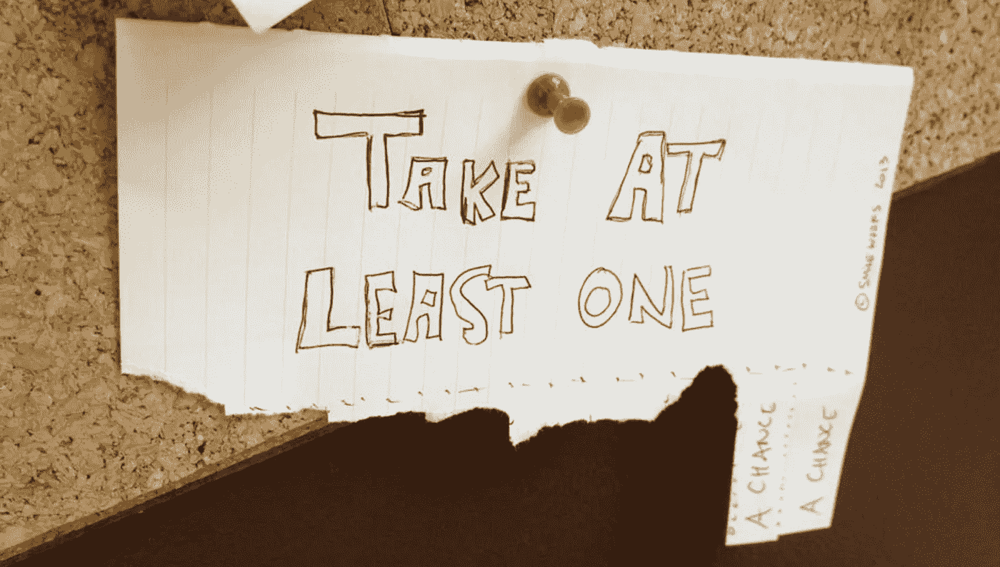

# 想要保存您的启动吗？以下是我犯过的 11 个错误。

> 原文：<https://medium.com/hackernoon/want-to-save-your-startup-heres-11-tips-from-mistakes-i-made-as-a-founder-c5f96ccb0ced>

> 如何忍受资金耗尽、建立正确的团队、管理投资者关系以及冒死冒险。

几年前，我接手了 [**涉猎**](http://www.dabble.co/pages/about) ，那是别人的创业公司，把它做成自己的。在喜爱该产品的顾客群体的帮助下；站在我身边的热情、敬业的团队成员；芝加哥和圣…