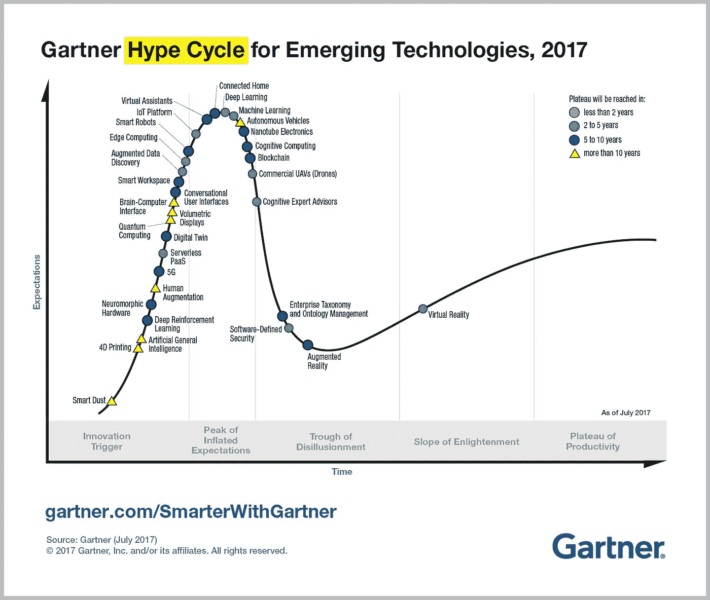

# 想了解区块链吗？开始实验

> 原文：<https://medium.com/hackernoon/want-to-understand-blockchains-start-experimenting-bdc5aeaf2d07>

## *一个简单的“以太坊”项目的经验教训*

Picture from the “Future Lawyer 2017" [event](https://futurelawyer.confetti.events) in Oslo (organized by [Shifter](https://shifter.no))

在数字时代，有一种压倒性的感觉，即我们必须创新并参与新兴技术，如区块链、机器人和人工智能。

无论我们做什么，这对每个人都是正确的。

但是知道*如何做到这一点就不那么明显了。*

我们如何参与新兴技术？我们如何理解这些创新的未来影响？我们从哪里开始呢？

最近一次区块链项目的经历让我找到了答案:

> **如果你想为数字时代做好准备，你需要*尝试新兴技术。***

*真实世界的实际参与是理解这些技术所带来的机遇和挑战的唯一途径。*

*当然，熟悉自己，写技术很重要。但是仅仅理解是不够的。*

*如果你不接受实验，你肯定会被甩在后面。*

*而且，最重要的是，这种“实验”的需求对每个人都是真实的:科学家、工程师和开发人员，但对“非技术人员”也是如此。*

*我以前写过关于[共同创造](https://hackernoon.com/co-creating-an-automated-future-together-b529b629964a)的重要性。我最近的经历告诉我，共同创造意味着“汇集不同的观点，一起尝试”。*

*我是这样得出这个结论的。*

# ***如何*而不是*参与新兴技术***

*过去几周，我一直在活动中谈论中介的未来。*

*人们对律师的未来特别感兴趣。但我注意到银行家、会计师和其他“中间人”之间也有类似的讨论。*

*最突出的事件是在奥斯陆举行的*未来律师* 2017 会议。*

*很明显，像区块链和人工智能这样的技术吸引了中介的大量注意力。例如，奥斯陆事件引起了极大的兴趣。*

*这并不奇怪。毕竟，这些技术有可能打破传统的工作方式，而那些最快释放这种潜力的个人和公司将会获得巨大的收益。*

*但令我震惊的是，有多少人完全误解了他们与新兴技术的关系。*

*我看到三种常见的态度:*

## ***#1 —** 许多人似乎将新兴技术视为某种**“没有目的的强制创新”。***

*他们不情愿地承认，他们必须为数字时代做准备。他们参与技术是出于一种责任感，而且往往是半心半意，注定要失败。*

*结果呢？*

*他们看不到技术创造的真正机会。他们以复杂的内部程序为借口，不做更多的工作。*

## ***#2 —** 其他人拥抱技术，但却从事**“无休止的讨论，没有真正的参与”**。*

*他们组织活动并撰写“白皮书”/讨论文件，概述新技术的利与弊。*

*但是，这种无休止的“技术对话”很容易脱离寻找技术的真实应用的实际现实，并导致缺乏明确的方向感。*

## ***# 3**——最后，有些人**“过度关注新技术的缺点”。***

*我发现这是最常见的，也是最具潜在破坏性的态度。*

*以区块链和智能合约为例。*

*以太坊(Ethereum)是一个总部位于区块链的计算平台，用于完全按照编程运行的应用程序(所谓的“智能合约”)，它经常受到批评，因为它托管的智能合约目前只涵盖非常简单的交易。*

* [## 智能合约仍然太愚蠢了

### 智能合约被认为是金融革命。然而，到目前为止，他们已经证明主要擅长帮助…

www.bloomberg.com](https://www.bloomberg.com/view/articles/2017-11-16/smart-contracts-are-still-way-too-dumb) 

所谓的“智能合同”被认为是“愚蠢的”。它们是不完整的，容易出错，而且通常会漏掉上下文。人们常说，它们的好坏取决于创建它们的开发者。

但是等一下。

这听起来很像传统的法律合同。律师倾向于起草不完整的合同。他们使用过于复杂的法律模板。我可以举出很多以灾难告终的合同的例子。

智能合约的另一个“问题”是，它们是“不可改变的”和“自我执行的”。这不同于“传统”合同，传统合同更加灵活，可以根据新的情况进行更改。

但是，这并不一定会降低区块链科技和智能合约的吸引力。

> 不应该孤立地看待区块链。

其他技术，如人工智能、传感器和数据分析，有可能极大地促进它们的“智能”。

过分强调新技术的局限性——专注于技术*不能*做的事情——常常会让人们看不到它*现在能*做什么以及在不久的将来可能能做什么。

这种消极的态度必然会导致错失良机。

那么，答案是什么呢？

# **我们能从“实验”中学到什么**

最近，我被邀请参加一个由开发人员、编码人员和律师参与的“区块链项目”。这是将新技术融入我们日常工作的持续努力的一部分。

我们尤其热衷于在国际和多方供应链中尝试区块链和智能合约。

毕竟，区块链只是一个记录，它维护着一个不断增长的谁“持有”什么(每个人都可以信任并且极其准确)的列表，并为不受信任的第三方提供了一种透明、可追踪和安全的交易方式。

区块链和智能合约之所以如此吸引人，是因为它们有潜力为这些供应链提供透明度。支付自动化被认为是一种更高效、更廉价的系统。

在我们的项目中，*以太坊*用于托管智能“供应链”合同，并为产品制造商、建筑公司(安装产品)、仓库、分销商和客户创建一个可信的环境。

自动化供应链的 1.0 版本过于简单。产品和支付可以被追踪，但是智能合同永远不能在现实生活中使用。例如，他们没有考虑保修，有缺陷的产品和保险问题。

回到绘图板，我们看着真实的合同，看看是否与“这些其他问题”相关的实际法律条款可以在守则中得到反映。基于这一经验，开发了 1.1 版。

> **简而言之，实验让我们发现问题，找到解决方案，揭示机会。**

这只是我们了解到的一些情况:

*   协议是极其复杂的法律文件。然而，当你真正仔细观察时，只有少数几个术语是真正重要的。对协议进行“编码”迫使我们将协议剥离到最基本的部分。
*   在透明和可追踪的区块链环境中，供应协议中包含的条款已不再必要。区块链将“信任”自动化，就像某些法律条款试图做的一样。然而，可以说，区块链有潜力提高效率，因为它可以自动处理信息不对称。科技让我们更加信任他人。
*   区块链的环境降低了协议的复杂性，使其能够更好地关注真正重要的问题。这里的明显优势是我们可以避免——或者至少大大减少——未来冲突的风险。
*   供应链协议的大多数条款都可以很容易地“编码”。即使是因特殊情况(地震、罢工等)而免除一方不履行义务的义务。)可以自动化，如果提供相关输入的话。这突出了传感器和其他数字信息源的至关重要性。
*   当开发人员和非技术人员(在我们的例子中是律师)继续进行这种类型的“共同创造”练习时，智能合同可以变得更加智能。律师充当技术开发者和技术最终用户(在我们的案例中是供应协议的双方)之间的“桥梁”。“中间人”不会很快消失，但他们的角色确实需要重新评估和重新发明。

> 但是，最重要的是，实验让我们能够识别新兴技术的“真实世界”潜力以及这些技术已经提供的具体新机会。

# **下一步是什么？**

将旧世界的供应链协议“翻译”成计算机代码的行为迫使每个人都关注关键问题。

正在进行的实验揭示了什么是真正重要的，什么只是“噪音”。在每一次迭代中，我们都能够识别核心挑战并努力寻找解决方案。

> 是的，区块链和智能合约仍然存在技术和设计问题。

根据 *Gartner 对新兴技术的炒作周期*，大多数“区块链”计划仍处于 alpha 或 beta 阶段(离主流采用还有五到十年)。

但这是否意味着我们应该停止实验，高枕无忧？

我们的实验表明这不是一个选项。随着更好的传感器和人工智能应用的出现，区块链和智能合同解决方案的采用可能会大大加快，为智能合同提供“可信”的输入。

帮助设计智能合同(检测缺陷和安全问题)的应用程序的开发将加速它们的接受。

当物联网应用、自动驾驶汽车和其他智能机器变得更加主流时，商业将对区块链技术的发展施加压力。

但最重要的是，技术专家和非技术专家之间的实验和共同创造将推动区块链和智能合同的发展和接受。

我参与的实验告诉我，没有时间可以浪费了。

> 很难做出预测，但我相信区块链和智能合约的接受和采用比我们想象的更近。

看到世界上最大的咨询公司已经在尝试新业务中的技术，这并不奇怪。

开放、参与和现实的实验代表了与技术的最佳关系。任何不接受这种实验的人都会发现自己被落在了后面。* 

**感谢您的阅读！请按住*👏*下面，还是留下评论吧。**

*每周都有新的故事。因此，如果你关注我，你不会错过我关于数字时代如何改变我们生活和工作方式的最新见解。*