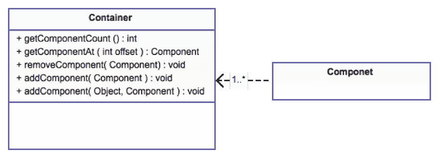

# 这是原创发明吗？

> 原文：<https://medium.com/hackernoon/was-this-an-original-invention-cd488b13d6da>

不久前，我“发明”了一种可能是定制组件创建的原始方法。我没见过它在其他地方被使用，所以我想我发明了它，但很可能有人首先想到了它。

十几岁的时候，我对自己的原创性非常有信心(这是在互联网普及之前，互联网的普及否定了这一点)，我总是有一个我正在努力的项目，无论是机器人还是我的 BBS 等等。在大多数情况下，我使用不同的品牌名称变体，我相信这是我独有的……
我把这种信念带到了我 20 岁出头的时候，那时我突然想到要把这个域名注册到我的企业中。不仅是我最初的域名(和所有的变体)在 20 年前就已经被占用了。运行第一个域名的人在网站上放了他的照片，他看起来很像我！

这就引出了我的观点:原创是罕见的。我发现缺乏创意令人欣慰。这意味着我可以专注于想法的高质量执行，而不是专注于原创想法。我发现很多企业家都认同我的原创观点，尽管不是所有人。

例如[代号一](https://www.codenameone.com/)是 LWUIT 的延续，它本身就从 Swing 和其他一些来源汲取了灵感。这意味着开发者有了一个共同的基础:巨人的肩膀。

# 这是原创的吗？

前几天我和一个朋友讨论这个问题，他的观点和我的相反。他声称原创想法比我通常认为的更普遍。他问我过去是否有一个想法，我认为是我发明的，但不确定。我个人对一个很好奇:铅成分。

所以我们都很好奇，这是在我想出它之前就存在的东西吗？

如果不是的话，它会适用于其他框架(我认为会的)。

# 所以这就是我们需要你帮助的地方…

除了代号一和 LWUIT，我还没见过这个概念在其他地方使用。我认为这是一个强大的 UI 设计范例，如果其他框架也采用它，我会非常高兴。但我想知道的是:“这是一个真正原创的想法，还是有人在我之前就想到了”？

我使用过很多 UI 框架，还没有见过像 lead component 这样的东西，但也许我看到了一些东西，然后忘记了，或者也许我完全错过了一些东西，然后重新发明了它。如果你知道类似这样的东西，如果可以的话，我会很感激有一个开始日期的链接。铅组件早些时候在 LWUIT 推出，但我找到的第一个参考资料是 2011 年的。现在很难看到 java.net 被移除的历史。

# 那么什么是铅成分呢？

当我们构建用户界面时，我们有组件(部件，视图等)。)和容器(视图组、集合、控制器等。).容器通常是组件的子类(复合的),因此允许层次结构。

Component Container simplified UML

因此，我们可以用两种基本方法创建一个全新的组件:

*   创建一个组件子类，并从头开始实现组件
*   创建一个包含多个组件的容器，以组成一个独立的复杂组件

第二个选项是我想讨论的…假设我想创建一个按钮组件，在左侧有一个图标和两行文本，所以我创建一个容器并将组件放入其中。我可以让容器看起来像一个按钮，但是现在我有问题了:

*   事件由每个组件分别处理，所以当按钮被按下时，我如何知道整个按钮都被按下了？
*   样式—按下按钮时，文本可能会改变颜色。两个独立的标签如何适应共享状态的变化？

这些都是大问题。这些问题可以通过大量的手工工作逐一解决，但需要细致入微的方法。

Lead 组件允许我们将容器状态和事件委托给层次结构中的一个组件。这意味着层次结构中的所有组件将立即将“领导”委派给该组件。

因为该组件自然已经知道如何处理状态、事件等。你不需要写任何代码，只需要“跟随领导”。所以在上面的例子中，我们没有使用两个文本行标签，而是使用一个按钮和一个标签，然后委托按钮。然后，您可以将事件侦听绑定到内部按钮侦听器，因为它们将接收所有事件回调。

如果你想要更多的细节和样本，在我们的[开发者指南](https://www.codenameone.com/manual/components.html)中有一节是关于它们的。

# 优点是否适用于其他框架？

我也这么认为

这可能不适用于一些 web 框架，在这些框架中，UI 和事件可能不会像上面那样映射。

然而，对于大多数本地框架和一些 web 框架，这应该提供代码重用和简单性的优势。这背后的动机之一是在 GUI 生成器中容易组合/重用。lead 组件可以完全在 GUI 中组装，而不需要任何代码来生成非常复杂的定制 UI。

例如，在 Android 上，Google 可以添加一个 setLeadView，允许一个视图控制一个视图组中的整个层次结构。

有人可能会在框架外部实现这一点，但这很难以通用的方式实现，因为主要组件需要内部框架状态和事件控制，这两者都很重要。

即使你不知道一个实现了这个的框架，但是非常熟悉一个特定的框架，如果你认为这个框架没有这个或者有类似的东西，请告诉我。我对未来改进复合材料组件的一些想法很感兴趣。

> [黑客中午](http://bit.ly/Hackernoon)是黑客如何开始他们的下午。我们是 [@AMI](http://bit.ly/atAMIatAMI) 家庭的一员。我们现在[接受投稿](http://bit.ly/hackernoonsubmission)，并乐意[讨论广告&赞助](mailto:partners@amipublications.com)机会。
> 
> 如果你喜欢这个故事，我们推荐你阅读我们的[最新科技故事](http://bit.ly/hackernoonlatestt)和[趋势科技故事](https://hackernoon.com/trending)。直到下一次，不要把世界的现实想当然！

