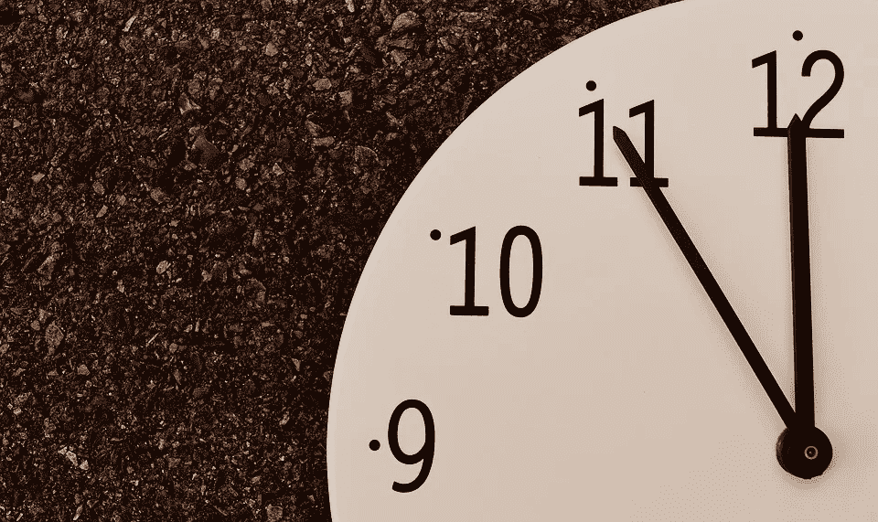

# 今天是一个警钟吗？对大多数人来说，可能不是，但对你来说可能是

> 原文：<https://medium.com/hackernoon/was-today-a-wakeup-call-for-most-probably-not-but-it-could-be-for-you-28575ea07aef>

对于今天美国的许多人来说，这可能是一个巨大的痛苦，也有点迷人。希望这也是可怕的；针对 Dyn 托管 DNS 的大规模 DDoS 攻击导致许多主要互联网服务在一天中停机数小时，这无疑只是即将到来的的先兆。

但引起我注意的不仅仅是 DDoS——推测是由物联网设备触发的，比最近的其他攻击造成了更广泛和更长时间的中断——而是结合了最近新闻中的相关事件。似乎每周我都会收到这样或那样的公司发来的电子邮件，要求我更改密码，因为数据泄露，有时这是几年前发生的事情，只是最近才被发现。当然还有 DNC 邮件泄露，几乎可以肯定是俄罗斯所为(我们将看到谁是今天攻击的幕后黑手)。其他引起我注意的值得注意的事件包括 [EFF 给 DOJ](https://www.eff.org/deeplinks/2016/10/memo-doj-facial-recognitions-threat-privacy-worse-anyone-thought) 的备忘录，关于面部识别技术的广泛部署的潜在噩梦，以及特斯拉宣布你不能让你的自动驾驶汽车在竞争的共乘网络中运行。正如联合广场投资的[阿尔伯特·温格所指出的，这是一个很好的例子，说明我们实际上并不拥有我们所拥有的许多东西，或者至少我们在没有阅读一份冗长乏味的 PDF 格式的条款和条件后，在检查一个方框时，完全不知道我们真正同意的是什么。](http://continuations.com/post/152115358205/the-problems-with-eulas-are-infecting-hardware)

再加上具有根深蒂固的网络效应的主要科技公司的市值和实力，会出现什么样的局面？随着软件和互联网继续渗透到我们生活的几乎每一个方面，我们已经将多少数据和控制权交给了它们，这是令人瞩目的。软件确实正在吞噬这个世界，但是如此信任和依赖那些远非完美且越来越容易被滥用的东西是危险的，而且在情况好转之前会变得更糟。

以一种更积极的方式结束——巨大的危险伴随着巨大的机遇。是的，在过去的几年里，网络安全公司投入了大量的现金，但我怀疑大多数人在网上并没有感到更安全。[区块链很可能在这一领域大有可为](https://www.ted.com/talks/don_tapscott_how_the_blockchain_is_changing_money_and_business?language=en)，但要将它们变成现实，仍有大量的工作要做。谁将领导让个人回到所谓的驾驶员座位所需的范式和平台转变，即使是联网软件在进行实际驾驶？

*作为跟进，即使你没有领导革命也有* [*的具体步骤*](https://medium.freecodecamp.com/tor-signal-and-beyond-a-law-abiding-citizens-guide-to-privacy-1a593f2104c3#.jw7pxq7jf) *你现在可以采取来帮助保护自己。*

> [黑客中午](http://bit.ly/Hackernoon)是黑客如何开始他们的下午。我们是 AMI 家庭的一员。我们现在[接受投稿](http://bit.ly/hackernoonsubmission)并乐意[讨论广告&赞助](mailto:partners@amipublications.com)机会。
> 
> 如果你喜欢这个故事，我们推荐你阅读我们的[最新科技故事](http://bit.ly/hackernoonlatestt)和[趋势科技故事](https://hackernoon.com/trending)。直到下一次，不要把世界的现实想当然！

