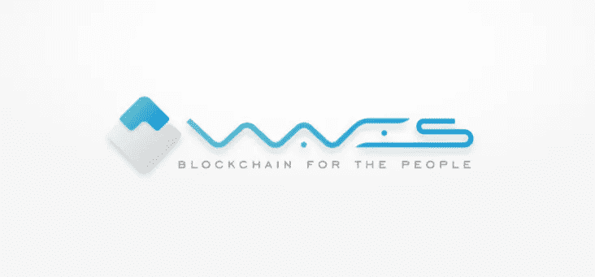
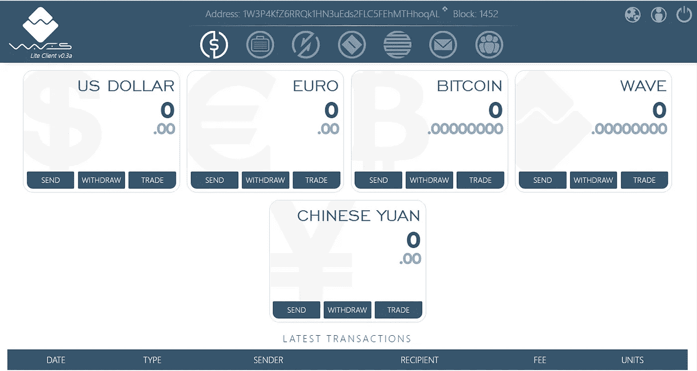
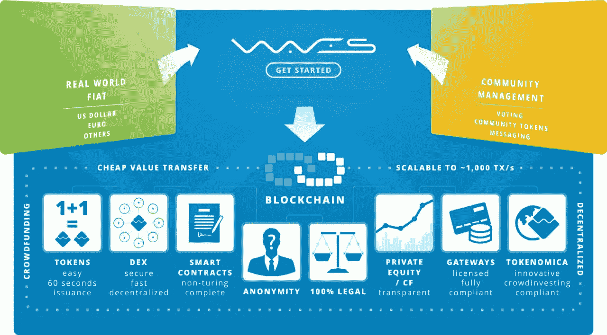
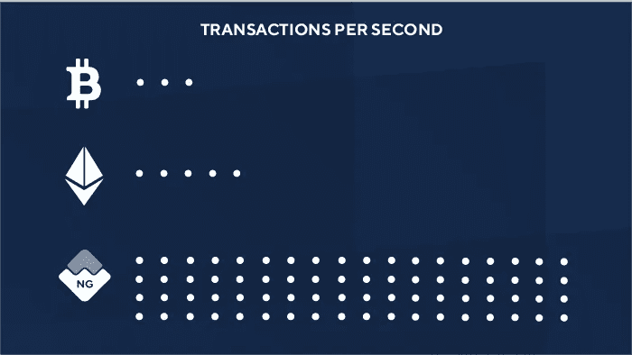
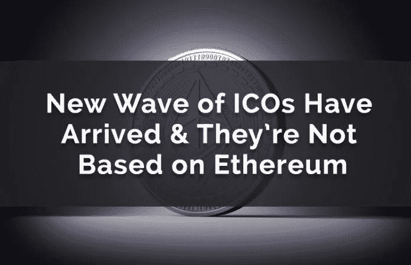

# WAVES(WAVES)——一分钟搞定你的区块链令牌

> 原文：<https://medium.com/hackernoon/waves-waves-your-blockchain-token-in-one-minute-9733dfef98c8>

到目前为止，我相信你们中的许多人已经听说过**首次公开募股(ICO)** ，这是一种年轻的初创公司能够在没有风险资本家帮助的情况下为他们的企业获得资金的巧妙方法。我还假设这些 ICO 中的大部分都是基于以太坊协议进行的。然而，有一个小浪潮正在积累市场份额和恶名。请允许我向**介绍波**，俄罗斯物理学家萨沙·伊万诺夫的大脑产物。如今，Waves 的交易价格为 **$7.21** ，但由于他们最近推出的分散交易所(DEX)，他们与德勤的合作关系，用户创建定制令牌的**极端**便利性，用户租赁其 Waves 的能力，以及我将讨论的其他驱动因素，我们可以看到 Waves 在 12 个月内交易价格为**每枚 40 美元。**

# 基础知识:

1.  Waves 于 2016 年 6 月推出，是一个基于 Scala 的开源区块链平台，允许用户推出自己的**定制加密货币令牌**，并为他们提供**去中心化交换**
2.  分散式交易所 DEX 允许用户交易区块链上的任何令牌对，该交易所目前的交易量接近 150 万美元
3.  Waves 让用户能够在几分钟内启动 ico 来资助来自世界各地的项目，而无需进行密集编码。Waves 平台上过去成功的 ico 是 PrimalBase 和 MobileGO
4.  **股票代码:WAVES**
    价格:7.21 美元
    市值排名:20
    市值:718，476，000 美元
    流通供应量:100，000，000 波
    最大供应量:100，000，000 波
    平均交易量:2，821，733 美元
    阻塞时间:30 秒(正在努力将其缩短到 1 秒)【T27

# 团队:

1.  领导 Waves 团队的是俄罗斯物理学家 Sasha Ivanov，他在职业生涯中一直参与支付系统软件开发。他推出了第一个即时加密货币交易所 coinomat.com
2.  Waves 团队目前有 8 名额外的开发人员全职为这个项目工作
3.  该团队还有 **7 名额外的社交媒体经理和社区经理**
4.  该团队的其他成员包括 **2 名业务发展专家**和 **1 名产品经理**

# **增长的驱动因素:**

1.  Sasha Ivanov 明确表示， **Waves 团队的重点是大规模采用**，特别针对两个市场:区块链的菲亚特转让和区块链的众筹。Waves 提供插件的使用，而不是像以太坊协议那样使用复杂的合同编码，这基本上是让主要的最终用户客户端从 Chrome 下载插件
2.  **DEX**上的交易没有交易限制，预购基础上的小额固定佣金，资金存放在安全的钱包里，而不是在交易所交易，自今年推出以来，交易量已飙升至 150 万美元。与市场上的其他交易所相比，DEX 提供了更加无缝的体验
3.  Waves 平台允许用户创建、发布、转移和交换资产和自定义令牌。该平台非常容易使用，你可以**在不到 5 分钟的时间内创建自己的令牌**
4.  Waves 与德勤有合作关系，这让 Waves 有机会接触德勤的客户
5.  Waves 还与微软 Azure 的合作伙伴合作，将区块链作为一种服务，将为企业开发者提供无数的区块链解决方案
6.  Waves 与国家结算存管机构(NSD)合作，帮助开发数字区块链平台，为数字资产服务
7.  Waves 与该知名银行的数字部门 Gazprombank Digital**合作，为客户提供全面的初始硬币发行(ICO)服务和定制的区块链解决方案，专门为俄罗斯金属和采矿行业量身定制**
8.  Waves 团队计划让他们的**平台符合 KYC &反洗钱**，以便与银行建立**合作关系。这将为 Waves 用户提供一种能力，让银行作为一个网关，无缝地将法定货币存入他们的账户或从账户中取出**
9.  Waves 允许用户将钱包里的代币出租给不同的节点以获取利息
10.  Waves 目前有适用于 IOS 和 Android 的**钱包**
11.  Waves 团队计划通过引入智能合约、区块链信使、新的法定货币和加密货币网关来扩展他们目前的能力

# 逆风:

1.  大多数其他基础设施硬币，如 ETH 和 ETC，比 Waves 更成熟，有更长的跟踪记录，但这个项目背后的团队非常有能力使这不成问题
2.  由于监管总是会落后于创新，数字货币领域未来可能会受到新监管的约束

# 总结:

基于**类似 WAVES** 项目的当前估值:

## 以太坊:

价格:462.80 美元
市值:44500478479 美元
排名:2
发行量:96,154,464 ETH

## 以太坊经典:

价格:30.33 美元
市值:2975279282 美元
排名:11
发行量:98109202 等

如果不考虑增长率，我对 WAVES 的 **12 个月目标价是**:

## 当前:

价格:7.21 美元
按市值排名:20
市值:71847.6 万美元
流通供应量:1 亿波

## 12 个月价格目标:

**价格:40 美元**
市值排名:9
市值:40 亿美元
发行量:1 亿波

考虑到 20%的复合平均增长率，我的 12 个月目标价格将接近每枚硬币 48 美元。

我希望你喜欢今天的报道，因为这枚硬币即将闪亮。**海浪队……**我知道 2018 年将是你的一年！！

