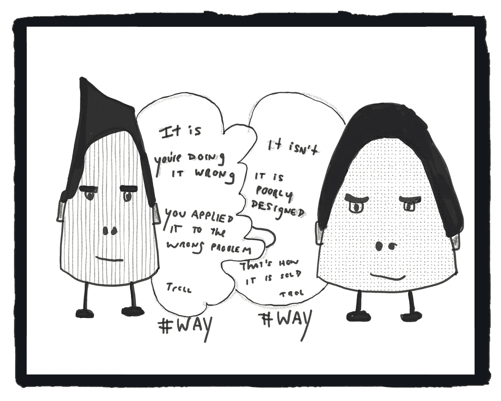

# 方法

> 原文：<https://medium.com/hackernoon/ways-25e73079f2b0>

最近我一直在思考*方式*，主要是因为我似乎有*方式*——在 Twitter 上一天多次辩论/对话/误解。我也开始意识到使用某些*方式*——比如敏捷、开发、精益等名称。会导致非常无益的交流。很少有人分享相同的心智模式，有些人极度既得利益于特定的诠释。

Talking Ways

我也非常热衷于*方式*和文字的可用性(这与学习和服务设计高度相关)。许多“思想领袖”的喋喋不休和策略对用户群和更好的结果完全没有影响。这是理论上的自慰、高人一等的个性、领土标记和几乎不加掩饰的营销。

因此，为了更好地理解这些动态，我就*方式*进行了一点头脑风暴。

# 关于方法的一些想法

**方式:**工具、方法、方法论、框架、实践、技巧等。

1.  任何*方式*都可能被有意/无意地滥用、误用和/或误用。
2.  一种*方式*是如何设计、教授和引入的，可以提高/降低其可用性和影响。
3.  每一个应用*方式*的实例都变成一个新的(高度局部的)方式。
4.  *方式*是建立在许多隐性和显性的假设和事实之上的。围绕这些假设和事实的环境会发生变化。
5.  参与和受影响的人经历的方式。经历各异。这些经历是*方式*的延伸。
6.  *方法*适用于部分探索过的宇宙环境。
7.  衡量一种*方式*对特定情境的适用性，通常会涉及到*方式*。一些*方式*用于(主要)选择“正确”*方式。*
8.  大多数*方式*都是追溯编纂的。实践先于标签。
9.  大多数*方式*来自于多个更早的*方式*。
10.  *方式*在不断进化，并催生/激发新的*方式*。
11.  什么时候一个大幅度调整/修改的*道*成为一个新的*道*？这可能是一个很难(也很有争议)回答的问题。
12.  随着*方式*的进化，它们生长、分裂、吞噬其他*方式*，经历熵，并改变最初的边界。*方式*可能不再有用、相关或可理解/可描述。
13.  *方式*“实际上”可能与*方式*“理论上”不同(对于正面和负面效果)。理论和实践之间一直存在矛盾。
14.  *实践“信”的方式*可能与*实践“神”的方式*不同。不同的行为者可能不清楚可接受/鼓励/预期的修改程度。
15.  学习一种*方式*，通常从学习一种*方式*的简单/规范版本开始。对于*方式*的介绍性版本可能会有限制。
16.  对于有经验的实践者来说，*方法*的简单/规范版本会感觉过于简单/规范。简化论者的观点也倾向于主导主流观点。
17.  改进我们使用*的方式*包括适应和即兴创作。
18.  我们混合、匹配并发明*方法*来解决复杂的问题。
19.  为了成功地使用*方式*，并不总是需要理解*方式*如何/为什么工作。但是当事情不像预期的那样发展，或者我们达到一个局部最大值时，这些知识会有所帮助。
20.  两种*方式*在应用于同一个问题时可以达到同样的影响/效果。
21.  学习、教学和采用*方式*往往涉及*方式*。
22.  大多数*方式*需要一些先决知识和/或先决状态。
23.  *途径*重叠、包含、属于、被共享、引用、依赖其他途径。
24.  很难捕捉到一种特定方式的“艺术状态”。在某处，*路*已经升级(经常与其他*路、*结合，有时是偶然)。
25.  生态系统以*的方式*出现。这些生态系统中的参与者有一系列互补、相邻和竞争的需求。生态系统也重叠、互补和竞争。
26.  当需求很高时，就会有销售、重塑品牌、重新包装、重新发明、过度简化、过度销售和控制的财务激励。引导关于出处、血统和“信用”的讨论也是有利可图的。
27.  围绕特定的*方式*来安排职业生涯的个人，会偏向于使用那些特定的*方式*来解决问题
28.  我们寻找*方法*为我们的挑战提供某些“简单”的解决方案。容易解决的问题很少会给购买者/用户带来竞争优势(但可能会立即带来改进)
29.  广泛销售和包装的方式需要一定程度的标准化和简化。
30.  完美执行的*方式*仍然可能导致失败。执行不好的*方式*可能会导致疯狂的成功。

这就是我想到的。我肯定我错过了很多。感谢任何帮助。