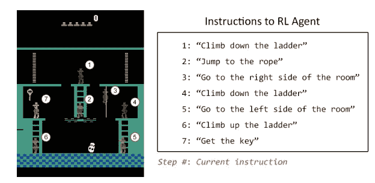

# 机器学习的方式

> 原文：<https://medium.com/hackernoon/ways-in-which-machines-learn-b1824464dd5f>

> 最初发表于[安德森·霍洛维茨](http://a16z.com/)的[人工智能剧本](http://aiplaybook.a16z.com/)。

深度[学习](https://hackernoon.com/tagged/learning)网络的训练方式主要有四种:*有监督*、*无监督*、*半监督*、*强化学习*。我们将解释这些方法背后的直觉。在此过程中，我们将在括号中分享您将在文献中读到的术语，并为数学爱好者提供更多资源。顺便说一下，这些类别跨越了传统的机器学习算法和更新、更好的深度学习算法。

对于数学爱好者，请参见[这篇斯坦福教程，它涵盖了监督和非监督学习](http://ufldl.stanford.edu/tutorial/)并包括代码样本。

# 监督学习

**监督学习**使用我们已经知道正确答案的例子来训练网络。想象一下，我们有兴趣训练一个[网络](https://hackernoon.com/tagged/network)来识别你的照片库中有你父母的照片。这是我们在假设场景中采取的步骤。

# 步骤 1:数据集创建和分类

我们会从浏览你的照片(数据集)开始这个过程，找出所有有你父母的照片，给它们贴上标签。然后我们会把整叠照片分成两堆。我们将使用第一堆来训练网络(训练数据)，第二堆来看看模型在挑选我们父母的照片时有多准确(验证数据)。

一旦数据集准备好了，我们就把照片输入模型。在数学上，我们的目标是让深度网络找到一个函数，它的输入是一张照片，当你的父母不在照片中时，它的输出是 0，当他们在照片中时，它的输出是 1。

这一步通常被称为分类任务。在这种情况下，我们训练的结果是是-否，但监督学习也可以用来输出一组值，而不仅仅是 0 或 1。例如，我们可以训练一个网络来输出某人偿还信用卡贷款的概率，在这种情况下，输出是 0 到 100 之间的任何值。这些任务被称为回归。

# 第二步:培训

为了继续这个过程，模型通过遵循规则(激活函数)对每张照片进行预测，以决定是否照亮作品中的特定节点。这个模型从左到右一层一层地工作——我们暂时忽略更复杂的网络。在网络对网络中的每个节点进行计算后，我们将得到最右边的节点(输出节点),它点亮或不点亮。

既然我们已经知道哪些照片里有你的父母，我们就能够告诉模型它的预测是对还是错。然后我们会把这个信息反馈给网络。

算法使用这种反馈，这是一个函数的结果，该函数量化了“实际答案与模型预测的距离有多远”。这被称为*成本函数*，也被称为*目标函数*、*效用函数*或*适应度函数*。由于信息从结果节点“向后”传播，函数的结果随后被用于在称为*反向传播*的过程中修改节点之间的连接强度和偏差。

我们对每张图片重复这个过程，在每种情况下，算法都试图最小化成本函数。

有多种数学技术可以将模型是对还是错的这一知识应用到模型中，但一种非常常用的方法是梯度下降法。 [Algobeans](https://algobeans.com/2016/11/03/artificial-neural-networks-intro2/) 用通俗易懂的方式解释了它的工作原理。迈克尔·尼尔森[增加了数学](http://neuralnetworksanddeeplearning.com/chap2.html)，其中包括微积分和线性代数(还有一个友好的恶魔！).

# 第三步:验证

一旦我们处理完第一批照片，我们就可以测试这个模型了。我们会抓住第二叠照片，用它们来看看训练过的模型能多准确地捕捉到你父母的照片。

步骤 2 和 3 通常会通过调整模型的各种事情(超参数)来重复，例如有多少个节点，有多少层，使用哪个数学函数来决定节点是否点亮，在反向传播阶段训练权重的力度如何，等等。这个 [Quora 答案](https://www.quora.com/What-are-hyperparameters-in-machine-learning)对你可以转动的旋钮有很好的解释。

# 第四步:使用

最后，一旦有了准确的模型，就可以将该模型部署到应用程序中。您将模型公开为一个 API 调用，比如`ParentsInPicture(photo)`，您可以从您的软件中调用该方法，使模型做出一个推断并给出结果。

我们稍后将通过这个过程来编写一个识别名片的 iPhone 应用程序。

获取带标签的数据集可能很难(也就是说，代价很高)，因此您需要首先确保预测值与获取带标签的数据和训练模型的成本相符。例如，获得可能患有癌症的人的标记 X 射线是昂贵的，但是产生很少假阳性和很少假阴性的精确模型的价值显然非常高。

# 无监督学习

**无监督学习**是针对你有数据集但没有标签的情况。无监督学习获取输入集，并试图在数据中找到模式，例如通过将它们组织成组(聚类)或找到异常值(异常检测)。例如:

*   想象你是一个 t 恤制造商，你有一堆人的身材尺寸。您需要一个聚类算法，将这些尺寸分组到一组聚类中，这样您就可以决定 XS、S、M、L 和 XL 衬衫的尺寸。
*   您是一家安全初创公司的首席技术官，您希望在计算机之间的网络连接历史中发现异常情况:看起来不寻常的网络流量可能会帮助您找到一名员工正在下载他们所有的 CRM 历史记录，因为他们即将辞职，或者有人将一大笔异常的资金转移到一个新的银行帐户。如果你对这类事情感兴趣，你会喜欢这个[对无监督异常检测算法的调查](http://journals.plos.org/plosone/article?id=10.1371/journal.pone.0152173)。
*   你是谷歌大脑团队的一员，你想知道 YouTube 视频里有什么。这是“YouTube 猫发现者”研究的真实故事，[点燃了公众对人工智能](https://www.wired.com/2012/06/google-x-neural-network/)的热情。在这篇论文中，谷歌大脑团队与斯坦福大学的研究人员郭乐和吴恩达一起描述了一种算法，该算法将 YouTube 视频分成一系列类别，其中包括一个包含猫的类别。他们并没有开始寻找猫，但该算法在没有任何显式训练数据的情况下，自动将包含猫(以及 ImageNet 中定义的 22，000 个对象类别中的数千个其他对象)的视频分组在一起。

你将在文献中读到的一些无监督学习技术包括:

*   [自动编码](http://ufldl.stanford.edu/tutorial/unsupervised/Autoencoders/)
*   [主成分分析](https://www.quora.com/What-is-an-intuitive-explanation-for-PCA)
*   [随机森林](https://en.wikipedia.org/wiki/Random_forest)
*   [K-均值聚类](https://www.youtube.com/watch?v=RD0nNK51Fp8)

要了解更多关于无监督学习的知识，请尝试[这个 Udacity 类](https://www.udacity.com/course/machine-learning-unsupervised-learning--ud741)。

无监督学习中最有前途的最新发展之一是 Ian Goodfellow(他当时在 Yoshua Bengio 的实验室工作)提出的一个名为“生成对抗网络”的想法，其中我们让两个神经网络相互对抗:一个网络称为生成器，负责生成旨在尝试和欺骗另一个网络的数据，称为鉴别器。这种方法正在取得一些惊人的成果，例如人工智能可以从[文本字符串](https://arxiv.org/abs/1612.03242)或[手绘草图](https://arxiv.org/pdf/1611.07004v1.pdf)中生成照片般逼真的图片。

# 半监督学习

**半监督学习**在训练阶段将大量未标记数据与少量标记数据结合起来。与使用所有标记数据相比，从该训练集得到的训练模型可以是高度准确的，并且训练成本更低。例如，我们在人工智能咨询公司 [Joostware](http://joostware.com/) 的朋友 Delip Rao 使用半监督学习构建了一个解决方案，每类仅使用 30 个标签，其准确性与使用监督学习训练的模型相同，监督学习每类需要约 1360 个标签。这使得他们的客户能够非常快速地将其预测能力从 20 个类别扩展到 110 个类别。

为什么使用未标记的数据有时有助于使模型更准确，这背后的一个直觉是:即使你不知道答案，你也在了解可能的值是什么以及特定值出现的频率。

数学迷:试试朱小金的[史诗般的 135 张幻灯片教程](http://pages.cs.wisc.edu/~jerryzhu/pub/sslicml07.pdf)和[附带的论文，该论文调查了 2008 年的文献](http://pages.cs.wisc.edu/~jerryzhu/pub/ssl_survey.pdf)。

# 强化学习

**强化学习**适用于同样没有标记数据集，但你有办法判断你是否正在接近你的目标(奖励函数)的情况。经典的儿童游戏《更热或更冷》(是[胡茨克勒扣豆茎](https://en.wikipedia.org/wiki/Huckle_buckle_beanstalk)的变种)很好地诠释了这个概念。你的工作是找到一个隐藏的物体，你的朋友会大声说出你是变得“更热”(更接近)还是“更冷”(更远离)这个物体。“更热/更冷”是奖励函数，算法的目标是最大化奖励函数。你可以认为奖励函数是一种延迟的稀疏形式的标记数据:而不是通过每个数据点得到一个具体的“正确/错误”答案，你会得到一个延迟的反应，只有一个关于你是否在朝着正确方向前进的提示。

*   DeepMind [在 Nature](https://deepmind.com/blog/deep-reinforcement-learning/) 上发表了一篇论文，描述了一个结合强化学习和深度学习的系统，以学习玩一系列雅达利视频游戏，有些非常成功(如 Breakout)，有些非常糟糕(如 Montezuma 的复仇)。
*   Nervana 团队(现在在英特尔)发表了一篇出色的解释性博客文章，详细介绍了这些技术。
*   由 Russell Kaplan、Christopher Sauer 和 Alexander Sosa 完成的一个非常有创意的斯坦福学生项目展示了强化学习的一个挑战，并提出了一个聪明的解决方案。你会在 DeepMind 的论文中看到，算法没有学会如何玩蒙特祖马的复仇。原因是，正如斯坦福大学的学生所描述的，“强化学习代理人仍然难以在回报稀少的环境中学习。”当你没有得到足够的“更热”或“更冷”的暗示时，你很难找到隐藏的钥匙。斯坦福大学的学生基本上教会了该系统理解和响应自然语言提示，如“爬下梯子”或“拿到钥匙”，使该系统成为 OpenAI 健身房中得分最高的算法。观看算法运行的视频。

*   看一个[学玩超级马里奥世界像个 boss](https://www.youtube.com/watch?v=L4KBBAwF_bE) 的强化学习系统的视频。

理查德·萨顿和安德鲁·巴尔托写了一本关于强化学习的书。查看第二版的[草稿。](http://incompleteideas.net/sutton/book/the-book-2nd.html)

> 最初发表于[安德森·霍洛维茨](http://a16z.com/)的[人工智能剧本](http://aiplaybook.a16z.com/)。

> [黑客中午](http://bit.ly/Hackernoon)是黑客如何开始他们的下午。我们是 [@AMI](http://bit.ly/atAMIatAMI) 家庭的一员。我们现在[接受投稿](http://bit.ly/hackernoonsubmission)并乐意[讨论广告&赞助](mailto:partners@amipublications.com)机会。
> 
> 如果你喜欢这个故事，我们推荐你阅读我们的[最新科技故事](http://bit.ly/hackernoonlatestt)和[趋势科技故事](https://hackernoon.com/trending)。直到下一次，不要把世界的现实想当然！

