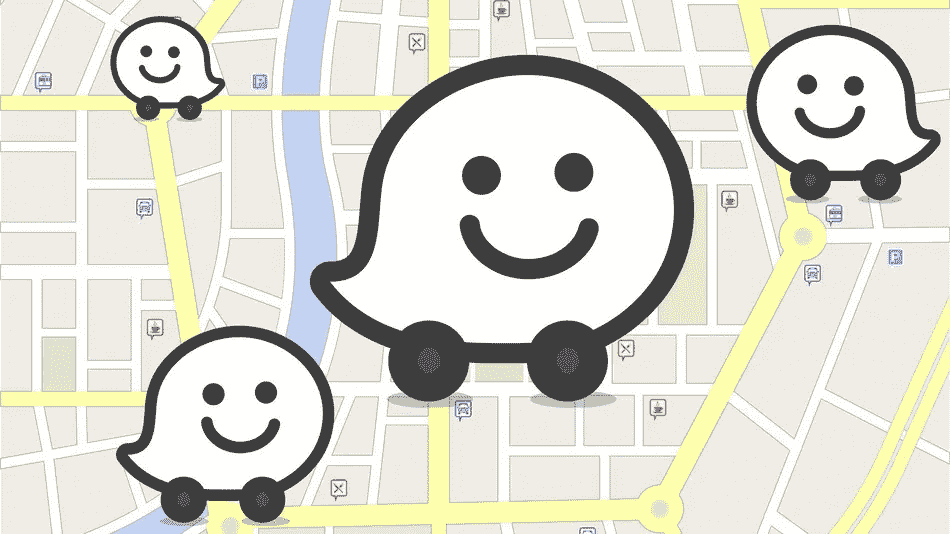

# Waze 使我们的道路更危险，而不是更安全

> 原文：<https://medium.com/hackernoon/waze-makes-our-roads-more-dangerous-not-safer-5a737824d937>

争论是这样的:通过流行的汽车导航应用 [Waze](https://hackernoon.com/tagged/waze) 指定一名警察的位置，其他司机将在该地区开得更慢，因此 Waze 比警察自己更好地执行驾驶规则。但事实并非如此——这让危险行为合法化了。

想象一下，作为一个不那么典型的自由意志主义者，相信当**和**能开车时，速度限制并不重要。当你在地图上发现一个警察巡逻图标时，你会怎么做？为了避免被开罚单，你在那个特定的转弯时减速，但随后你又加速，不用担心任何随后的[控制，因为 Waze 告诉你它是安全的。或者更好:你加快速度，在平行的道路上抄近路，笑着说你如何智胜那些愚蠢的警卫，以每小时 120 公里的速度穿过乡下村庄。](https://hackernoon.com/tagged/subsequential)

最后，Waze 将司机自私(和破坏性)的行为合法化，这些司机忘记了他们并不在一个充满像他们一样完美车手的理想世界中，使过于自信的司机对他人更加危险，从而实际上驳斥了最初的论点。

限速是有原因的，Waze 让人们很容易忘记它。

> [黑客中午](http://bit.ly/Hackernoon)是黑客如何开始他们的下午。我们是 [@AMI](http://bit.ly/atAMIatAMI) 家庭的一员。我们现在[接受投稿](http://bit.ly/hackernoonsubmission)并乐意[讨论广告&赞助](mailto:partners@amipublications.com)机会。
> 
> 如果你喜欢这个故事，我们推荐你阅读我们的[最新科技故事](http://bit.ly/hackernoonlatestt)和[趋势科技故事](https://hackernoon.com/trending)。直到下一次，不要把世界的现实想当然！

