# 我们已经知道区块链的杀手级应用

> 原文：<https://medium.com/hackernoon/we-already-know-blockchains-killer-apps-f2d443eba35>

就在不久前，硅谷还对加密货币嗤之以鼻。在山景城和门洛帕克的所有咖啡店，你都会听到同样的对话:“当然，这是很酷的技术，*但是我们什么时候才能看到杀手级应用*？

2014 年，一些商家尝试接受比特币。但是领养在很大程度上减少了。我记得在奥斯汀见过几台比特币自动取款机，然后就不见了。比特币违背了它取代现金的承诺，因此大多数风险投资家认为它一问世就寿终正寝。如果没有一个杀手级应用来推动消费者的采用，加密货币似乎只会成为密码学家和偏执狂的好奇心。

去年，人们对加密货币的兴趣直线上升。加密货币的公开市值已飙升至逾 1700 亿美元的高点。随着 2017 年通过 ICOs 筹集了超过 15 亿美元，超过 70 家加密交易所开业，加密对冲基金和风险投资公司不断涌现[左](https://next.autonomous.com/thoughts//how-many-crypto-hedge-funds-can-you-count)和[右](https://www.cnbc.com/2017/10/27/there-are-now-more-than-120-hedge-funds-focused-solely-on-bitcoin.html)，似乎每个人都在争抢火箭船上的席位。

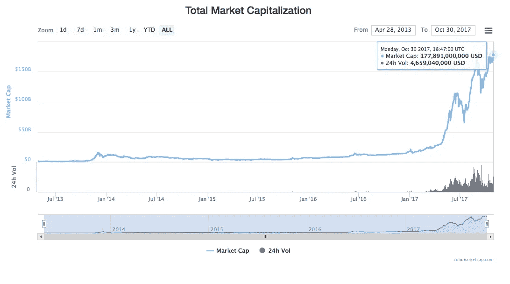

在这种狂热中，没人再问杀手级应用了。

我认为这是一个错误。

作为一种消费技术，加密货币是一团乱麻。购买它们极其困难，网络速度慢，交易费用高，社区中充满了巨魔、黑客和骗子，你的资金很容易丢失或被盗，即使你赢得了保护资金的战斗或使用了像比特币基地这样的托管服务，商家的接受度也很低。

开发者工具更差。加密货币生态系统是分散的和区域性的。工具、文档和开发人员教育是粗制滥造的，甚至不存在。

加密货币对用户和建设者来说都很糟糕。然而，尽管有这些突出的问题，需求和炒作只会上升。

这应该会让你感到震惊。如果没有，你已经在方向盘上睡着了。

## 这是什么意思？

为了理解这种现象，你不得不做出两种可能的结论。

首先，加密的价值完全在于投机。

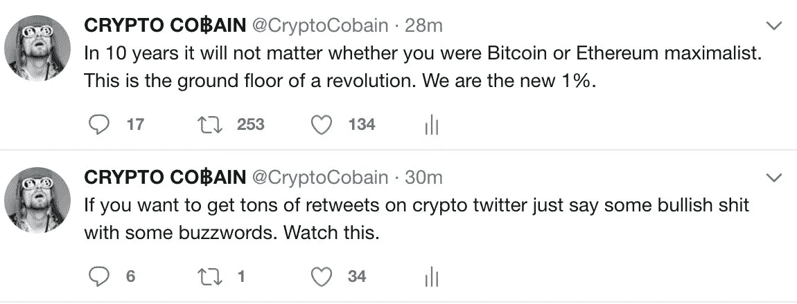

毫无疑问，加密货币市场存在许多毫无根据的投机。我的许多密友认为加密货币完全是一个泡沫。在一个充满泡沫的市场中，这种怀疑是一种健康的观点，但我要说这种说法太宽泛了。

另一种可能性是，crypto 的潜在价值在于用户体验之外的其他东西。但这似乎掩盖了我们所知道的关于技术价值创造如何发生的一切。

以太坊的创始人维塔利克·布特林(Vitalik Buterin)认为，crypto 根本不会有杀手级应用:

> *…区块链科技不会有“杀手级应用”。原因很简单:低挂水果的教义。如果存在某个特定的应用，区块链的技术比其他任何技术都优越……那么人们可能已经在大声谈论它了。…到目前为止，还没有任何一个应用程序能够真正脱颖而出，主宰其他领域。”*
> 
> *Vitalik Buterin (* [*区块链技术的价值*](https://blog.ethereum.org/2015/04/13/visions-part-1-the-value-of-blockchain-technology/) *)*

Vitalik 否定了“杀手级应用”框架。他相信，区块链将因其所带来的众多长尾应用而变得有价值。

我不同意。

**我认为“杀手级应用”框架是正确的。虽然有许多前沿应用会让技术专家(包括我自己)感到兴奋，但区块链价值的主要驱动力相对狭窄。**

在 ICOs 的大肆宣传中，“互联网去中心化”，胡说八道的艺术家试图将他们能想到的一切都提升到区块链上，这是有教育意义的，采取 1000 英尺的观点，并提醒我们自己大图。

我认为区块链有四个杀手级应用:

1.  **暗网和黑市支付**
2.  **数字黄金**
3.  **支付(宏观和微观)**
4.  **标记化**

# 黑仔应用#1:暗网和黑市支付

**市场规模(大约)**:几十亿到几十亿美元

什么阻碍了这一点？隐私-硬币开发、缩放

比特币已经做了一件体面的工作，远离了它的根源。但加密货币的首要杀手级应用一直是作为那些要求匿名和抵制审查的人的支付层。这些人主要是黑暗网络的用户。

暗网指的是互联网的角落，只能通过特殊的匿名协议访问，如 Tor、I2P 和 Freenet。通过暗网市场进行的交易范围很广，从相对无害的交易，如购买处方药，一直到黑客入侵的凭证转储、数字赎金、枪支，以及著名的[暗杀](https://www.wired.com/2015/02/read-transcript-silk-roads-boss-ordering-5-assassinations/)。

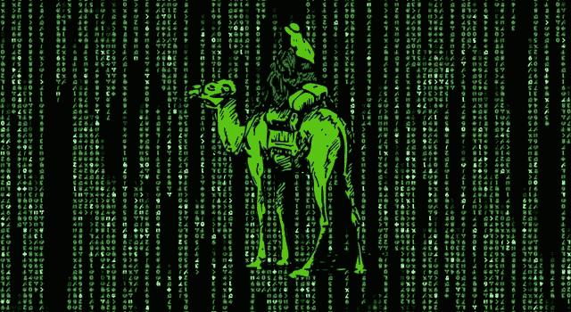

在比特币出现之前，暗网市场有一个突出的问题。当世界两端的匿名暗网买家和卖家互不信任，也不想让任何人知道他们是谁时，你怎么能在他们之间进行支付呢？

比特币非常合适。它是全球性的、不可信的、假名的，并且(大部分)不会受到国家行为者的攻击。比特币开始成为黑暗网络市场的非官方货币，如丝绸之路、AlphaBay 及其继任者。

比特币的大部分使用现在相对良性，但比特币欠暗网一大笔债。所有加密货币都需要一个启动阶段，在此之前它们不会提供太多安全性。黑暗网络带来了比特币的第一波用户和矿工，并为生态系统注入了活力。

据大多数人估计，暗网的 GMV 每年超过 1.5 亿美元。当然，暗网只是全球黑市的一小部分。但随着加密货币的采用和可用性增加，我们将看到更多的黑市采用加密货币作为标准的支付媒介。

尽管比特币是第一种扮演这一角色的货币，但具有更强匿名保护功能的新货币，如 Monero 和 ZCash(也许最终会有 [Mimblewimble](https://scalingbitcoin.org/papers/mimblewimble.txt) )更有可能成为暗网事实上的货币。

# 黑仔应用#2:数字黄金

**市场规模**:万亿+美元

**什么阻碍了这一点？**波动性，消费者意识

视你问谁而定，将比特币描述为“数字黄金”可以被视为一种侮辱，也可以被视为一种胜利宣言。

这个术语经常被使用，但是什么是数字黄金呢？

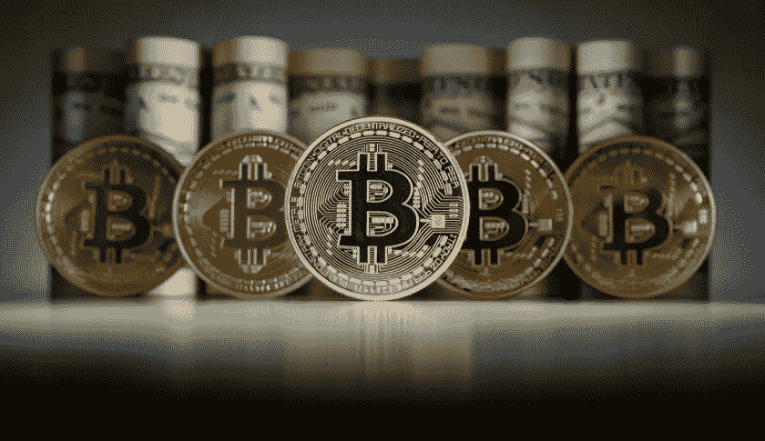

## 模拟黄金的力量

黄金作为一种材料本身并没有什么用处。所有开采的黄金中只有不到 10%用于工业或制造业。尽管如此，人类还是一致认为黄金非常有价值。

为什么？

抛开人类被黄金吸引的原始原因不谈，黄金有几个很好的经济属性。黄金很难开采，新的矿藏也很少被发现，所以黄金的供应相对来说几乎没有通货膨胀。黄金也不会失去光泽或被腐蚀，所以现存的黄金仍然可以销售。这导致最小的价格波动，使其作为一种稳定的价值储存手段具有吸引力。此外，没有哪个市场或国家垄断黄金，因此黄金的涨跌与任何国家都无关。出于这些和其他原因，人类同意将黄金作为静态价值储存的谢林点。

作为这种静态的价值储存手段，黄金可以用来对冲全球经济波动。即使经济有起有落，黄金依然是黄金，其走势在很大程度上是独立的。因此，在过去的几千年里，黄金一直是我们全球分散的价值储存手段。它很有价值，因为我们都同意这样使用它。

但事实证明，黄金与理想的价值储存手段(T2)相去甚远。金条又大又重。存放和保护黄金的费用很高。很难运输。它可以被窃取和操纵。你可以轻易地谎称自己拥有黄金，或者黄金的纯度。

然而，一个第一世界的公民可能会问——这有什么大不了的？如果需要的话，我可以买一些黄金，如果我非常想保证我的钱的安全，我可以把我的钱存入银行。

## 为什么数字黄金如此重要

大多数第一世界的公民不知道世界上有多少地方既没有 1)安全的银行基础设施，也没有 2)正常运转的黄金市场。当你的货币由于政府的不稳定而膨胀时，当货币管制阻止你从不稳定的当地货币中撤资时，当银行基础设施太弱而不信任当地银行时，当政府腐败或无能时，保护你的财富的少数方法之一就是投资黄金。在很多地方，很难做到安全。

对于我的许多只在美国生活过的软件开发朋友来说，很难想象对一个人的政府或经济有如此深的不信任。

如果你用[人类发展指数(HDI)](https://en.wikipedia.org/wiki/List_of_countries_by_Human_Development_Index) 作为世界上高度发达地区的代表，联合国将大约 50 个国家列为“非常高的人类发展”类别，包括美国、欧洲大部分地区、日本、南韩、沙特阿拉伯和俄国。目前科威特是这些高度发达经济体中最不发达的。高度发达国家总共只占世界人口的 15%。

换句话说，世界上 85%的人口生活在不如科威特发达的地方。在美国，拥有像美元这样稳定的货币，强大的金融基础设施和技术层(Visa、Paypal、Venmo 等)。)，很难想象比特币的增值会是多少。但比特币的大部分价值将交付给世界上另外 85%的人。

技术专家长期以来一直在追逐数字黄金。已经尝试了许多方案，包括[电子黄金](https://en.wikipedia.org/wiki/E-gold)和[电子金条](https://en.wikipedia.org/wiki/E-Bullion)(都有黄金支持的储备)，或[数字现金](https://en.wikipedia.org/wiki/DigiCash)，旨在成为一种中央数字货币。

都失败了。比特币是第一种真正成功的数字货币。

## 比特币不是波动太大无法替代黄金吗？

你可能会说，一种在平常日子里波动 15%的货币不可能取代黄金。这是一个公平的观点。比特币还不能作为稳定的价值储存手段。但比特币并不需要立即取代黄金。目前，它只需要补充它。

稳定性只是黄金在市场中的众多属性之一。对于那些需要稳定性的人来说，像 Tether、BitUSD 或即将推出的 [Basecoin](http://www.getbasecoin.com/) 这样的稳定硬币可以满足这一需求。从现在起的五年或十年后，当炒作和投机降温，比特币成为一种令人厌烦的众所周知的金融资产时，其价格将会稳定下来。

事实上，正如 Chris Burniske 指出的那样，比特币已经和石油一样不稳定，而且比许多标准普尔 500 股票的波动性要小。

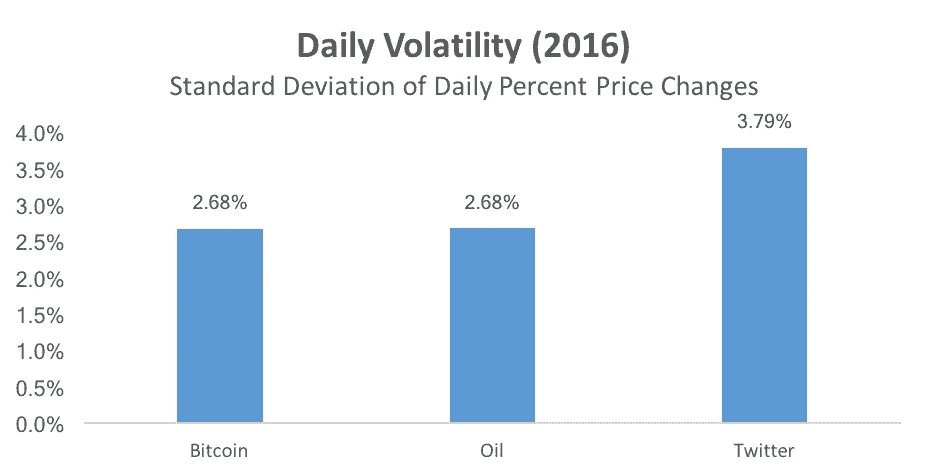

比特币现在的波动性是黄金的 5-6 倍，差距正在逐渐缩小。

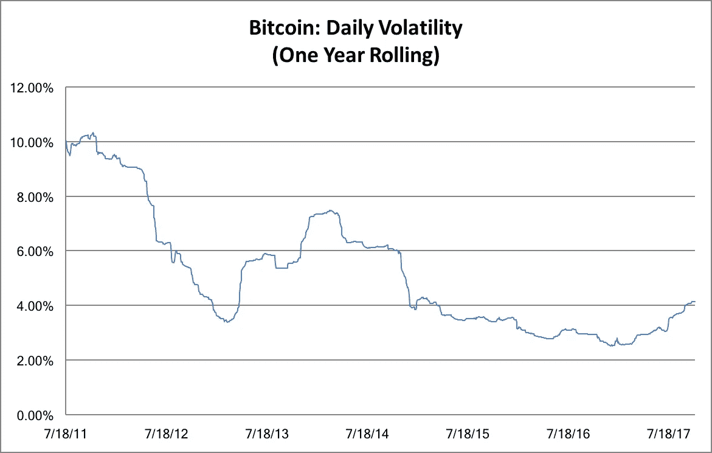

尽管如此，你可能会听到这个，并认为这是投机。比特币还不能充当数字黄金，但人们正在购买它，希望有一天它能充当数字黄金。

我认为有几个原因可以解释为什么尽管比特币具有波动性，但它已经是一种非常有效的数字黄金形式。

## 比特币为何充当数字黄金

首先，比特币的价值不依赖于任何民族国家或任何经济体。事实上，比特币已经被证明与任何其他资产类别几乎完全不相关，包括黄金本身。

第二，比特币可以从世界任何地方获得和交易，不受当地市场和银行基础设施的影响。这是成为资本外逃有效目的地的关键。

前两点可以描述大多数加密货币，但第三点也是更大的一点特别有利于比特币:**和黄金一样，比特币非常抗拒变化。**

与其他加密货币不同，自 2008 年由中本聪发明以来，比特币出人意料地几乎没有创新或发展。虽然以太坊和 Ripple 等协议在其路线图中经历了重大而有意义的转变，但比特币及其社区在意识形态上致力于保持接近其最初设计的东西。

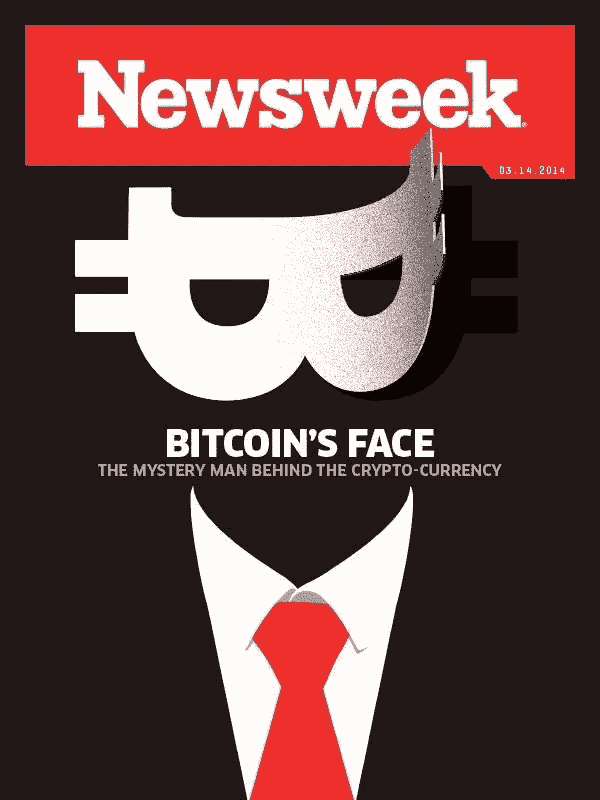

以比特币的光谱创造者[中本聪](https://en.wikipedia.org/wiki/Satoshi_Nakamoto)为例。在一手发明并编写了第一版比特币协议后，Satoshi 于 2010 年从比特币世界消失了。他的缺席让人们对这项技术的最初规格充满了近乎宗教般的崇敬，许多比特币人致力于其技术的不变性。矿工、开发商和用户之间的政治僵局进一步加剧了这一点，他们都反对其他任何一方改变权力平衡。

比特币也有稳定的通胀路线图，并以可预测的速度开采。它总是平均每十分钟产生一个块。几乎在所有方面，比特币都是可以预测的。这是充当“数字黄金”的理想选择黄金，就其本质而言，是可预测的，不会改变。

比特币的哈希能力最强，最安全的加密货币也是如此。它是所有加密货币中最通用、最具流动性、最普遍、价格波动最小的(除了一些稳定的货币)。它也是最简单的，也是最有品牌认知度的——两者都是黄金的绝佳属性。

作为一个支付层，比特币速度慢、价格高且不可扩展。*但如果比特币要充当数字黄金，那没关系。*比特币难以移动，这促使人们像对待黄金一样对待它。比特币几乎所有的政治和经济特征都使其成为填补这一空白的天然加密货币。

它已经发生了。在许多司法管辖区，如果有人想对冲当地经济，逃避货币管制，从崩溃的货币中撤资，或者只是进行一些老式的逃税，比特币是最自然的方式。

## 超越经济学

我经常听到这样的说法:但黄金不仅仅是其经济属性的总和。围绕黄金有一个叙事价。黄金是国王、传奇宫殿和古代财富的金属。

与比特币不同，没人需要解释黄金为什么有价值。你不需要召集银行家参加昂贵的会议，给他们做[演讲，解释为什么黄金是很好的价值储存手段](https://twitter.com/nwoodfine/status/921488217358118912)。黄金很简单。比特币很复杂。因此，从长远来看，这种观点认为，比特币永远无法取代黄金。

**这是废话。**

我们讲述的故事确实很重要。但是这些故事可以改变。在雅浦岛，雅浦人认为大型石盘是他们的价值储存手段。最终，在引入现代货币后，T2 拉伊石头大部分不再使用，它们现在主要用美钞交易。故事并不能战胜一切。最终，原始效用取代了传统。

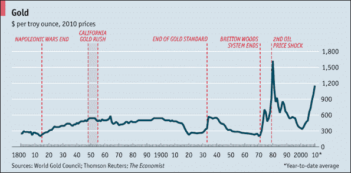

此外，黄金并不总是像现在这样稳定或有价值。石油曾经有着和黄金一样的物理光环和叙事价，但随着其他商品开始超越它的效用，它变得不那么值钱了。

如果比特币是对黄金的重大改进，并开始取代它的角色，市场将做出相应的反应并重新定价。

我承认这一点:黄金的简单是一个伟大的特点。但比特币同样是最简单的加密货币。你可以[向任何一个对概率有基本了解、注意力持续时间适中的高中生解释比特币](https://www.youtube.com/watch?v=bBC-nXj3Ng4)背后的直觉。比特币也很简单，因为它不能做很多事情。它的可编程性充其量是发育不良，但这对于价值储存来说是很好的。

但这种反对技术上复杂的货币的观点最终是一种谬误。拿信用卡。

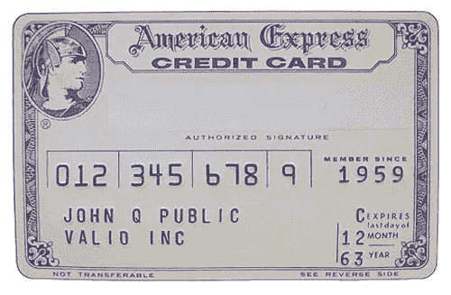

第一张塑料信用卡发行于 1958 年。磁条于 1970 年推出。到了 70 年代中期，信用卡在美国社会已经完全普及，无处不在。有多少用信用卡交易的人能解释一下 [*甚至是*](https://www.youtube.com/watch?v=lFabsRFnWy0) 是什么磁性？忘记了解他们的信用评分如何工作。

如果一项技术能充分改善现状，人们就会习惯它。2007 年，智能手机是新奇的未来玩意。十年后，它们只是现代生活的日常必需品。如果比特币更便宜、更容易、更普遍，它将遵循同样的路线——人们将对它不屑一顾，就像他们对智能手机或信用卡中的所有令人惊叹的技术不屑一顾一样。

对于未来的数字本地人来说，比特币钱包可能会比装满从地下精心钻出来的无用金属的金库更自然。

## 目前比特币在黄金市场上的规模如何？

[黄金是一个 3-6 万亿美元的市场](https://schiffgold.com/commentaries/just-how-big-is-the-gold-market/)取决于你如何计算，其日交易量在 700-2000 亿美元之间。让我们使用最保守的 3T 市值规模，每天 700 亿美元。

今年 1 月 1 日，比特币处于黄金市值的 0.5%，交易量为黄金交易量的 0.1%。如今，按市值计算，比特币占黄金的 3.3%，交易量的 3.1%。

这一趋势可能会继续下去。我怀疑，一旦比特币开始严重依赖黄金，将会发生四种情况。

1.  民族国家将会恐慌，并加大对加密货币的抵制。
2.  黄金市场将开始下跌。
3.  监管比特币以保护黄金持有者利益的努力将会增加。
4.  比特币将不再被认真视为区块链支付层的竞争者。

(当然，我的猜测和其他人一样好，我也不是专家，所以请接受这一切，并吃一份健康的盐。)

# 黑仔应用#3:支付(宏观和微观)

**市场规模** : [数千亿美元](https://www.mckinsey.com/~/media/McKinsey/Industries/Financial%20Services/Our%20Insights/Rethinking%20correspondent%20banking/Rethinking-correspondent-banking.ashx)

**什么阻碍了这一点？**采用、易用、可扩展

只要加密货币要求用户拥有无懈可击的密钥管理，区块链就无法解决点对点支付问题。黑暗网络的常客也许能够花时间和风险来驾驭所有的技术复杂性。但是，为了让区块链在地上经济中运作，你需要的不仅仅是理论上的安全——你需要实际的、在野外的安全。钱需要很容易使用，以至于街上的普通人不会搞砸它，让自己暴露在危险之中。

现在，大多数人都远远低于这个技术水平。在这种情况发生之前，或者我们能够找到一个好的抽象层之前，加密货币对于消费者点对点支付系统来说是站不住脚的。

与此同时，许多经济体在传统支付的便利性方面取得了巨大进步。看看美国的 Venmo，非洲的 M-Pesa，或者中国的支付宝和微信支付。传统金融科技的发展速度足够快，在这方面，中短期内它的进步将轻松超过区块链。

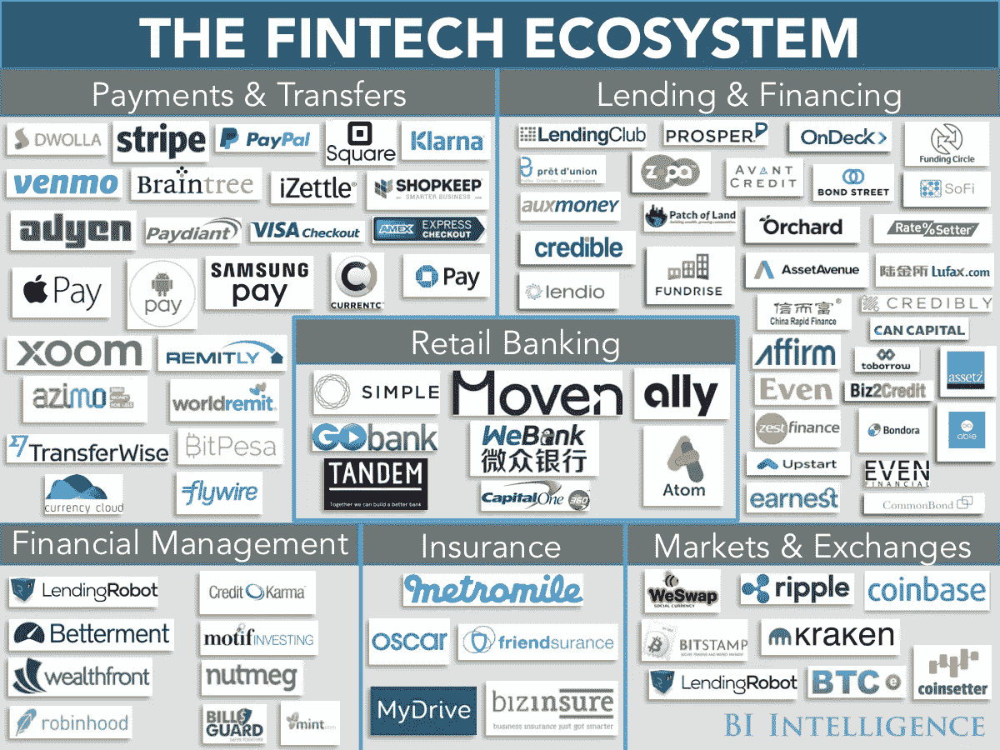

在采用和易用性方面，加密货币都远远落后于传统银行系统。但是有两个加密货币遥遥领先的用例。

## 国际支付

假设我想向印度的一个供应商汇款 20，000 美元。为了转移这笔钱，我需要进行一次银行电汇(费用通常为 50 美元左右)，等待几天，让银行基础设施的所有齿轮完成交易，直到它最终到达印度。除此之外，我们各自的银行可能会对不同货币之间的兑换收取不合适的费用。这是假设一切都按预期运行。

或者，我可以在区块链以太坊的一次交易中向供应商发送价值 20，000 美元的以太。一般来说，在区块链上，不到 10 分钟就可以完成交易，交易费用大约为 50 美分。请注意，以太坊不是一个为支付而优化的区块链，因此延迟和交易费用都可以低几个数量级。

就简单性、速度和交易费用而言，区块链在国际支付方面无与伦比。仍然有监管和技术问题阻碍着大规模采用，但阻碍的因素很多只是知识、信任和加密货币交易的光学。

区块链遥遥领先于竞争对手的另一个支付领域是微支付。

## 小额支付

在传统的金融网络中(以 Visa 为典型例子)，任何货币转账都会产生至少 20 美分的费用。这意味着任何低于 20 美分的交易都是不可行的，如果是 50 美分，卖家将会牺牲 40%的收入给 Visa。

这使得大多数微支付方案在传统支付网络上难以为继。许多创新的商业模式被简单地排除在外。如果你想创建一个博客服务，收取 25 美分的阅读费用，会怎么样？运气不好——在支付处理费后，它的价值将不如印刷它的 HTML。

对此有一个名义上的解决方案:即维护一个内部分类账。这就是广告公司做的事情。谷歌可能会为点击你网站上广告的人支付你一分，但它不会直接支付给你这一分——相反，它会在其内部数据库中记录这一分，然后每月与你结算一次。

这真的只是微观核算。真正的微支付意味着我不需要《纽约时报》的账户，我可以直接为一篇文章付费，而无需登录或长期订阅。

区块链可以解决这个问题。以 Dash 为例，这是一种为支付而优化的加密货币。它目前的交易费用中值为 1-3 美分，平均阻塞时间为 3 秒。对于 Dash 来说，每篇文章 25 美分的费用意味着只有 10%的收入是交易费。(我对 Dash 有很多保留，但它确实展示了一种支付优化货币的潜力。)

有了比特币或以太坊，闪电网络和国家渠道可以让我们更接近真正微支付的梦想。让这些工作变得更加复杂，所以我们可能至少需要几年的时间来构建所有必要的基础设施和开发工具。关于闪电网络及其工作原理的更多信息，[请看这篇博文](https://bitcoinmagazine.com/articles/understanding-the-lightning-network-part-building-a-bidirectional-payment-channel-1464710791/)。

## 防守中的银行

这个领域正在进行许多实验，我们还需要一段时间才能知道它们是如何摆脱困境的。但不要搞错了:银行是害怕的。他们可以看到掠夺者从山那边过来，投石器被慢慢地推到他们身后。

如果采用区块链，银行或许能够保护自己的市场份额。[许多银行已经在试验 Ripple、R3、Hyperledger 和其他区块链解决方案，以缩短清算时间并降低费用](https://www.finextra.com/pressarticle/70823/sixty-seven-percent-of-central-banks-are-experimenting-with-blockchain-technology---study)。但加密货币正准备对传统银行的市场份额发起全面进攻，银行已经意识到了这一点。一场战斗即将来临，而且不会不流血。

接下来的几年将会很有趣。

# 黑仔应用#4:标记化

**市场规模** : [？？？](https://i.imgur.com/jfL2nbJ.png)

**什么阻碍了这一点？**法规、法律框架

Nick Szabo 在 1996 年首次创造了“智能合约”这个术语。19 年后，在以太坊，第一个[图灵完成的](https://en.wikipedia.org/wiki/Turing_completeness)智能合约平台，智能合约将发挥其潜力。

许多以太坊的支持者声称，随着智能合约的出现，传统商务的前景不妙。据推测，一切都将变得分散化，寻租寡头将被废除，在我们知道这一点之前，整个世界将被智能合同所调节。

现在，你可以放心这是科幻小说。智能合同方案几乎可以用于任何事情，但是在大多数领域仍然存在明显的问题。用户不在那里，UX 不在那里，规模不在那里，激励不在那里，监管不在那里，即使他们都在那里，在大多数情况下，价值主张是脆弱的。大多数人只是不关心智能合同或去中心化的好处。对大多数问题来说，区块链与其说是帮助，不如说是阻碍。

虽然这个领域有很多创新，但都是高度实验性的，智能合约的杀手级用例尚未得到证明。

一个例外是标记化。

## 令牌化是以太坊的杀手级 app

以太坊是第一种使 ico 民主化的货币([最初的硬币发行](https://en.wikipedia.org/wiki/Initial_coin_offering))。创建新的数字令牌已经变得像复制和粘贴智能合同一样简单，只需修改一些变量，然后将其部署到区块链中。

(有人说，如果你听得足够仔细，你可以听到每分钟都有新的屎币诞生。)

AWS 之于 web app，如同以太坊之于令牌。虽然这使得技术投机的伟大复兴成为可能(阅读:ICO 泡沫)，但明智的做法是将媒介与信息分开。

支持代币的论点有些微妙，它有许多诽谤者。让我首先列出这个案例，然后是最好的反对理由(看着你，普雷斯顿·伯恩)。

首先，我们所说的记号化是什么意思？

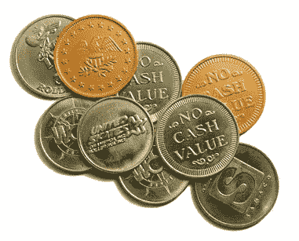

令牌化有两种:协议令牌化和资产令牌化。

## 协议标记化

考虑 BitTorrent。

我猜你们大多数人以前都用过 BitTorrent。需要澄清的是，BitTorrent 不是一个应用程序，而是一个协议，所有 BitTorrent 客户端都实现了这个协议。具体来说，BitTorrent 是一种[点对点协议](https://en.wikipedia.org/wiki/BitTorrent#Operation)，允许用户从一群其他对等点获取文件。当你下载文件时，你也上传了你已经下载的文件。如果你是一个好用户，在你完成下载后，你会继续上传，这将把带宽支付给其他用户。

这个协议有一个明显的弱点——[搭便车问题](https://en.wikipedia.org/wiki/Free-rider_problem)。有人可以下载少于他们上传，并拒绝支付转发。BitTorrent 对此的解决方案是…

…嗯，它实际上没有。它试图抑制免费搭车者的下载速度，但这并不太奏效。一些 torrenters 试图通过创建具有持久声誉的仅限邀请的社区来解决这个问题，但大多数用户更喜欢在完全匿名的情况下使用 BitTorrent。没有任何围绕带宽交换的激励，BitTorrent 很容易受到公地悲剧的影响。如果 BitTorrent 运行良好，那只是因为它的公民碰巧表现良好。

## 善意不成比例

托马斯·霍布斯很久以前就预言，要让一个社会大规模运转，你需要适当的激励。

传统上，我们使用利维坦来实施这些激励措施。通过支持一个中央权威(通常是国家，或者在 BitTorrent 的情况下，是一个集中的身份服务)，你可以迫使系统中的每个参与者都行动起来——当然，除了利维坦本身。

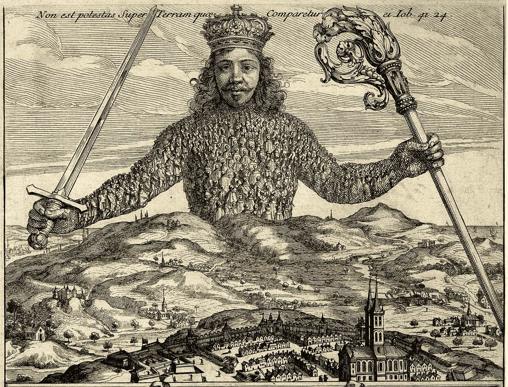

现代民主理论正是为了应对这个问题而兴起的:鉴于你需要一个中央权威来实施激励，你如何防止这个权威本身变得腐败和行为不当？默认情况下，每个参与者的动机都是利用自己的权力。所以我们发明了选举，我们发明了宪法，我们发明了制衡和弹劾程序。我们所做的一切都是为了笼络这个庞然大物，防止中央政府不可避免地走向腐败和寻租。

到目前为止，中央政府是解决这个问题的最佳方案。

但是协议令牌现在可能会改变这一点。它们可能为我们提供一种新的解决激励匹配问题的方法。

协议令牌，如 Filecoin，是一种协议内激励机制。通过校准激励以及它们如何与令牌保持一致，你可以创建一个类似 BitTorrent 的协议，而不仅仅是希望用户做正确的事情，你*付钱给*让他们做正确的事情。你不是希望用户不是混蛋，而是*向他们收钱*让他们成为混蛋。

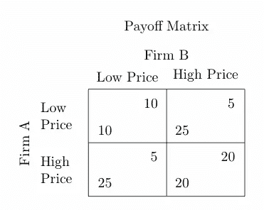

通过有计划地调整激励并创建正确的[回报矩阵](https://en.wikipedia.org/wiki/Normal-form_game)，协议可以使用经济学和博弈论来激励用户实现期望的协议行为。设计正确的激励机制，几乎奇迹般地，一切都到位了，经济平稳运行。不需要中央权威，没有制衡，没有选举或弹劾，没有法律或法院。没有他们，激励机制就无法发挥作用。

(我在付费播放的 BitTorrent 和 Filecoin 之间做的类比并不严谨，但仍然具有指导意义。)

## 分散监管

大多数监管的目的是调整激励机制，使系统以全局最优的方式运行。但是正常的规则是由人类执行的，因此是可变的。如果一家公司贿赂或哄骗其监管者，监管者通常会睁一只眼闭一只眼。如果一家公司有足够的资金或政治影响力，它可以游说推翻这些规定。

分散监管不受监管俘获或政治压力的影响。正常的监管者可能会被垄断势力收买或欺负，但分散监管已成为准则的一部分。

至关重要的是，可以从数学上检验分散监管的合理性。现实世界的监管更难分析——其规范模糊不清，其数以千计的边缘案例必须在法庭上进行昂贵的裁决。

经济学家长期以来一直梦想着可以通过市场机制解决的问题。实验室已经开放，只需发行一枚硬币和几条规则，你就可以自由运行自己的[密码经济实验](https://softwareengineeringdaily.com/2017/10/28/cryptoeconomics-with-vlad-zamfir/)。

所以这是第一种记号化。它是真实的，几乎每个了解它的人都能看出这是一个很大的想法。在它成为主流之前，可能还有很长的路要走。但是很有可能网络的继承者将通过数字令牌来访问。

## 资产令牌化

第二种形式的令牌化，即资产令牌化，是将传统的非流动性资产转化为区块链上的可替代股票的过程。这些股票可以在不可信的市场上交易，以增强其流动性。

听到这里，你应该是持怀疑态度的。正如 [Preston Byrne 指出的](https://prestonbyrne.com/2017/08/19/token-liquidity/)，你已经可以做到所有这些了——这叫做首次公开募股，然后在证券交易所发行股票。在区块链上这样做的附加值是什么？

显然，像纽约证券交易所这样的集中交易市场已经存在，可以进行“令牌化资产”的交易，即公司股票的交易。

也就是说，在纽交所上市非常昂贵([普通公司上市需要大约 370 万美元](https://www.pwc.com/us/en/deals/publications/assets/pwc-cost-of-ipo.pdf))。外国投资者不得不通过昂贵的关卡投资美国资产，反之亦然。这里存在巨大的监管和法律障碍，阻碍了资本的自由流动。(诚然，这些障碍大多存在是有充分理由的。但在大多数这些过程中，也出现了层层浪费和寻租。)

(一个明显的例子是 GBTC，一个公开交易的比特币投资工具——本质上是一个持有比特币的信托机构——购买比特币的成本是直接购买等值比特币的两倍。)

还有许多类型的资产不能通过这些交易所进行交易。在股票市场，我们发明了将一家公司分成可互换股份的方案，并在市场上公开交易。但我们还没有对房地产、艺术品或其他通常被认为有价值或能产生价值的资产这样做。

[普雷斯顿·伯恩认为](https://prestonbyrne.com/2017/08/19/token-liquidity/):嗯，实际上你说的是“区块链的符号化允许你违反证券法。”与其说那是创新，不如说是规避。

我同意这一点。但是，令牌化资产还有其他好处，对此*去中心化是先决条件*。

## 分散代币市场的好处

第一个好处是，在一个分散化、令牌化的市场中，你不再需要信任任何中央中介。如果你生活在一个国家，那里的国家机构和金融基础设施薄弱或腐败，那么只要你能访问互联网，你就能参与一个强劲、流动性强的令牌化资产全球市场。

第二个原因是，创建一个运转良好的市场需要大量的启动成本。

这里有一个玩具的例子:考虑 FarmVille。FarmVille 有许多游戏内资产——金钱、游戏内物品等等。这些资产直接存在于 Zynga 的数据库中。想必 FarmVille 玩家看重这些资产，所以买家和卖家会愿意为它们进入市场。

然而，要实现这个市场，Zynga 必须投资建设和管理一个与它的数据库集成的交易所。事实上，Zynga 出于公关和监管原因并不希望这样——但让我们暂时忽略这一点。即使他们想建造它，创建这个功能齐全的交易所也将是一项重大的工程工作。

那只是法姆维尔。有成千上万个这样的游戏对游戏内资产有着强烈的需求，但要让每个游戏都有一个正常运行的市场，每个游戏公司都必须加倍努力，建立一个安全、功能齐全的交易平台。如果任何这样的公司不安全地建立他们的交易所，或者决定维护它不再符合公司的利益，交易所就会关闭，资产持有人最终将承受流动性不足的代价。

区块链解决了这些问题。如果你一开始就以区块链代币的形式发行你的资产，那么你就继承了一个管理和维护市场的巨大共享基础设施。假设您使用像 ERC20 这样的通用令牌规范，那么您可以使用智能合约轻松创建跨不同令牌的金融交易或工具，可信地自动交换它们，创建简单的托管合约，或者使用像 [Bancor](https://www.bancor.network/) 这样的自动价格发现机制来提高流动性。交易所可以无缝地列出你的代币，并允许任何人用其他代币购买，只需几行代码。有了区块链的保险公司，最终你可以根据你的数字资产组合贷款买车。

我们可以将这一整套能力称为**金融基础设施即服务**，发行方无需支付任何成本即可创建，完全由区块链维护。

这些好处进一步提高了流动性和市场深度。当用户相信你的交易所不会被关闭或审查(无论是被一个国家还是被一个不再符合其利益的公司)时，买卖双方都会对交易该资产充满信心，用户也会更有动力去购买它。

当彼得·麦肯在[的文章](https://hackernoon.com/traditional-asset-tokenization-b8a59585a7e0)中提出这些观点时，他注意到大多数资产从流动中获得 25%的增值。对于全球经济中的许多非流动性资产来说，这是一笔巨大的收益。

资产令牌化是一件大事，协议令牌也是如此。当然，在我们实现这一目标之前，还有许多问题需要解决(包括技术和监管方面的)，所以我们可能需要几年时间才能取得全面成果。但是，如果有足够多的建设者联合起来推动他们前进，这两种形式的符号化将带来巨大的价值创造。

## 总结

我认为加密货币的四个杀手级应用是 1)暗网和黑市支付，2)数字黄金，3)宏观/微观支付，以及 4)令牌化。如果最近加密货币市值飙升至 1700 亿以上让你感到难以置信，我希望在阅读本文后，它会变得更有意义。

也就是说，我不想忽视这个领域中其他令人兴奋的想法。有许多有前途的应用程序可能会被证明是区块链的杀手级应用程序——向参与者支付费用的社交网络([Earn.com(我现在正在工作——以前是 21.co](http://earn.com))、 [Steemit](http://steemit.com/) )、去中心化预测市场(Gnosis、Augur)、去中心化存储网络(Filecoin、Maidsafe、Sia)，等等。

这个领域充满了创新，发展速度极快。但如果历史有所启示的话，对区块链来说，最大的杀手级应用可能会是目前还没有人预料到的东西。

那都是我送的。继续建设。

哈塞克