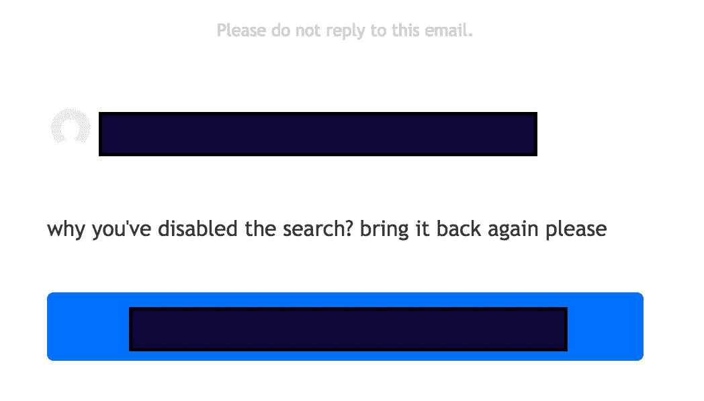
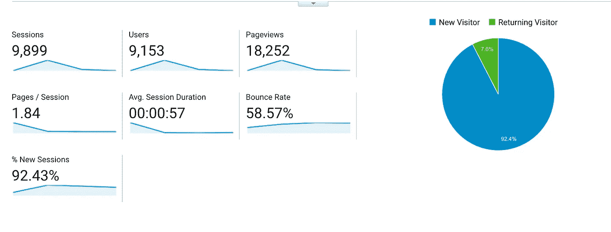

# 我们正在恢复 GitLeaks.com

> 原文：<https://medium.com/hackernoon/we-are-resuming-gitleaks-com-d93cf73824e3>

我们最近开发了一个小工具[来分析 Android 应用程序的秘密泄露](https://android.fallible.co/),这在 infosec 社区中得到了赞赏。这启发我们创造了[**【GitLeaks.com】**](https://gitleaks.com/)，一个在 GitHub、Bitbucket、Android 应用程序客户端以及后来的整个网络上搜索暴露秘密的搜索引擎。我们在[黑客新闻上发布了它的测试版，以获得初步反馈](https://news.ycombinator.com/item?id=13667386)。反馈是混合的，很少有人反对搜索功能和我们的帐户升级功能，而其他人认为这是一个很酷的工具。我们暂时关闭了搜索功能，因为我们感到无法更好地传达我们的意图。

HN 论坛上的一些人建议我们应该通知用户一个密钥被泄露了。我们不可能通知数百万用户而不因为滥用而被禁止使用 GitHub。如果有人能做得最好，那就是 Github 这个揭露秘密的平台，有了一大群工程师，做这件事只需几天时间。如果 GitHub 想让秘密泄露检测成为他们平台上的一个功能，我们愿意与 GitHub 合作。

另一个讨论点是我们“揭露人们的秘密”,这很有趣，因为数据是公开的，秘密可以通过 GitHub 界面搜索到。我们只是优化了搜索，把重点放在秘密上，并提供了一种方法来检查你自己的 GitHub 帐户是否有漏洞。开放端口的流行搜索引擎被视为一个伟大的信息安全工具，即使它可以被用于他们付费账户的不良目的。 [Insecam](https://www.insecam.org/) 列出了全球数千个开放 IP 摄像头的实时流。有人写或宣传一个网站不使用 HTTPS 并不意味着他们是罪犯。像 Shodan、Insecam 或 GitLeaks 这样的产品最终会让世界变得更加安全。

现在来看付费账户。我们将登录的免费用户的查询次数限制在每月 30 次。如果你没有登录，我们将只显示第一页，而不是之前的两页。维护和开发搜索基础设施花费了我们大量的金钱，而付费账户只是一种弥补成本的方式。如果你觉得慷慨，请联系我们在 gitleaks@fallible.co 和捐款，以支付我们的年度费用，我们将停止支付帐户。

下一点是关于罪犯的虐待。如果认为坏人会坐等 GitLeaks 这样的产品出现，以便他们利用，那就太天真了。最好的方法是不断创造意识，而不是掩盖事实。我们已经将匿名账户的搜索结果限制在一页之内，并且会拒绝新创建的 GitHub 账户(GitHub 发布后创建的账户)的使用，因为它们现在没有任何价值。

2 月 17 日，大约 10000 人试图使用 GitLeaks.com。他们中的大多数人在收到我们禁用搜索的消息并指向讨论后失望地离开了。我们很抱歉。GitLeaks 现已开放，我们将会添加新的来源、功能，并随着时间的推移更新数据。

> [黑客中午](http://bit.ly/Hackernoon)是黑客如何开始他们的下午。我们是 [@AMI](http://bit.ly/atAMIatAMI) 家庭的一员。我们现在[接受投稿](http://bit.ly/hackernoonsubmission)，并乐意[讨论广告&赞助](mailto:partners@amipublications.com)机会。
> 
> 如果你喜欢这个故事，我们推荐你阅读我们的[最新科技故事](http://bit.ly/hackernoonlatestt)和[趋势科技故事](https://hackernoon.com/trending)。直到下一次，不要把世界的现实想当然！

