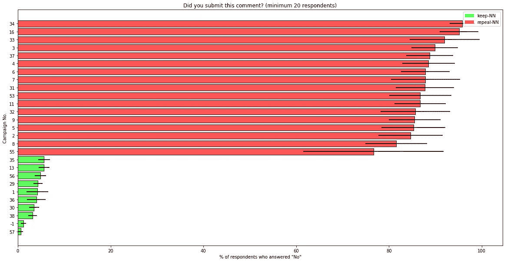
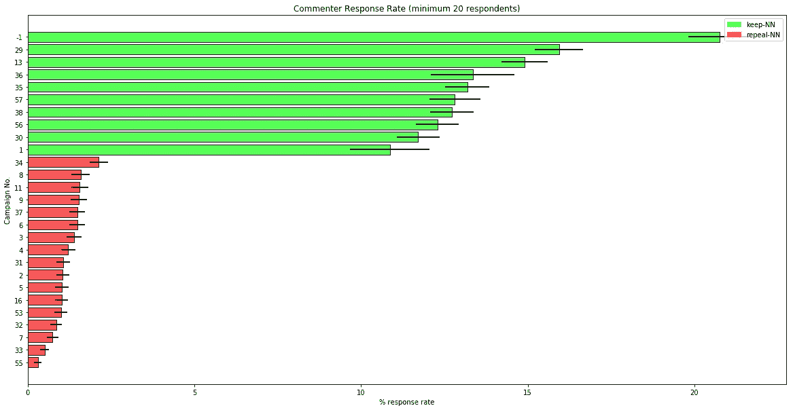
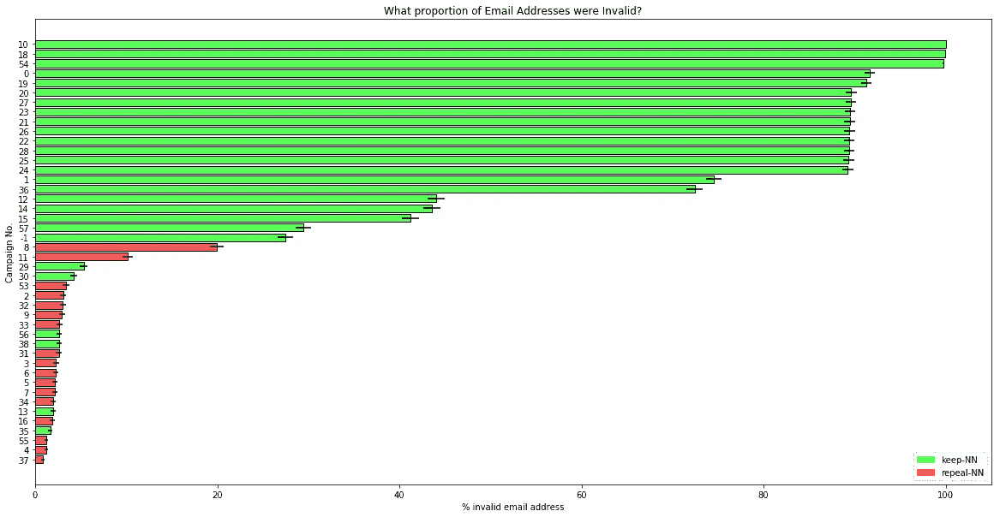

# 假的支持废除网络中立评论者的回应暗示美国人的 id 被大规模盗用

> 原文：<https://medium.com/hackernoon/we-are-uncovering-more-fake-pro-repeal-net-neutrality-comments-that-suggest-large-scale-244c900f5043>

## 我们一开始是根据直觉行事，但我们正在收集的调查结果开始让人感觉更加不祥。

你好。你可能还记得我上一篇关于 FCC [网络中立](https://hackernoon.com/tagged/net-neutrality)程序中虚假评论的博文，那是我在 [Metis](https://www.thisismetis.com/) 做的一个项目。在那篇文章发表后的几个星期里，我作为旧金山[创业政策实验室](https://www.startuppolicylab.org/truth-in-public-comments)公众意见真相(TiPC)项目的一员，夜以继日地工作。

我们想在许多人提出的怀疑背后发现更多的事实。最好的方法是采取尽可能直接的测量——调查提供电子邮件地址的评论者，并询问他们是否在第一时间提交了评论。⁴

以下是截至 10:⁵时间 12 月 8 日晚 8 点的调查结果图表

The pro-repeal campaigns shown comprise most of the 8 million pro-repeal comments in the record.

我们仍在努力撰写最终报告，但我只想与您分享我们在每项活动中的初步成果。⁵

12 月 14 日，FCC 将举行(敷衍的)投票来废除网络中立规则，为了及时向公众发布信息，SPL 已经同意发布这些初步图表。这是他们关于这个问题的新闻稿。

更多关于回应率和反弹率的图表。

Huge discrepancy in response rates.

The pro-net neutrality spam campaigns feel a lot less ‘planned’, e.g., no procurement of fake IDs.

请继续关注——随着更多结果的收集、分析和结论的确认，SPL 将发布一份初步报告。

我自己的看法。虽然我是一名志愿者，在创业政策实验室领导这个项目的数据和调查工作，但我是以个人身份在我的博客上发言的。

毫不惭愧地说，周日晚上我在梅蒂斯堡的午睡室睡了四个小时。

SPL 在市政技术和其他法律、政策和技术交叉的问题上做了一些伟大的工作。在这么短的时间内把所有的事情组织起来是很困难的，但是他们一直是暴风雨中的一艘稳定的船。抱歉，查尔斯和吉娜，我疯狂的深夜/清晨垃圾邮件。

⁴不是最迷人的数据科学工作，但有时老学校的方法可以完成工作。

⁵的竞选细节和谷歌电子表格的汇总数据。

⁶我应该补充一个巨大的警告，这是没有详细的方法和假设的书面资料提供的信息。也就是说，我很震惊地看到支持废除和支持网络中立运动之间的巨大差异。我们的报告将给出我们的方法和假设。我们将公布我们使用的电子邮件调查文本，还将公布相关代码和去标识数据以供公众验证。