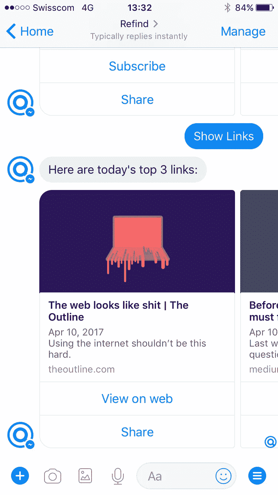

# 我们在几个小时内构建了一个简单的聊天机器人。以下是方法。

> 原文：<https://medium.com/hackernoon/we-built-a-simple-chatbot-in-a-few-hours-heres-how-b9a5b302b4dd>

机器人是所有的炒作。克里斯·梅西纳，一个活跃的 [Refind](https://refind.com) 用户，一个机器人超级大师，推动我们建造了一个。有一天，我们终于喜欢上了它:我们想用一个简单的机器人来试水。

# 为什么？

Refind 是网络上最好的链接之家。人们用它来发现、保存和阅读真正值得他们关注的东西。机器人可以向用户发送前 3 个链接的摘要，作为每天早上的简报——在她经常使用的平台和设备上。

# V1 规格

*   用户可以订阅一些主题:设计、UX、编程等。
*   每天早上 8 点(当地时间)，该机器人都会发送由我们的潮人、黑客和皮条客社区管理的前 3 个链接。
*   用户可以改变频率:每天，每周三次，每周。

# 零到机器人

几个小时之内，我们就把[机器人准备好了](https://m.me/refindcom)。如果你是机器人新手，想自己造一个，这里有一个我们步骤的快速纲要:

1.  在谷歌文档中写下(商业)目标。
2.  阅读一些关于机器人的文章，从这个列表:[https://refind.com/chrismessina?q=bots](https://refind.com/chrismessina?q=bots)
3.  记下几个问题/潜在的阻碍(例如，机器人可以在第一次交互几天后给用户发送消息吗？).
4.  玩过几个机器人(我们第一次和聊天机器人互动):MessinaBot，CNN，WSJ，TechCrunch。
5.  快速研究平台:FB Messenger，Slack，iMessage，…
6.  决定从 FB Messenger 开始。
7.  到目前为止，大多数问题都已得到解答(例如，在 FB 上，您可以在 24 小时后使用*page _ messaging _ subscription*发送)。
8.  从头开始构建还是使用开发工具？浏览了 FB 平台文档，研究了一些开发工具。
9.  决定用[聊天燃料](https://chatfuel.com)。
10.  创建了一个 Hello World bot(这很简单！).
11.  在谷歌文档中勾画了机器人:入职、流程、关键信息。
12.  问题:和 Refind 的接口是什么？API？
13.  发现 RSS 可能是最简单的开始界面。
14.  在 Chatfuel 上找到了 TechCrunch 的模板。
15.  使用 Chatfuel 上的 TechCrunch 模板创建了一个新的机器人。
16.  为热门话题创建了 [RSS 源](/@refind/rss-json-feeds-6ee22a255449)。
17.  使用了 W3C 验证器来验证我们的提要。
18.  使用了机器人中的端点。
19.  改编的信息。
20.  发布了这个机器人。
21.  一天后测试:机器人在当地时间早上 8 点准时回来了，带着我们的前 3 个链接的摘要。酷！
22.  做了些小改动，改进了流程。
23.  写了这个帖子。

# 试一试

[https://m.me/refindcom](https://m.me/refindcom)(不需要 Refind 账户)

# 下一步是什么？

显然，这是一个非常简单的机器人。如果它变得受欢迎，我们将扩展它的功能，以保存 Refind 的链接或处理您的阅读列表。

给我们发送反馈:hello@refind.com！

顺便说一句，作为副作用，我们也迈出了向开发者开放 Refind 的第一步:https://refind.com/developers

请[为 Slack](https://refind.com/developers) 造一个 Refind 机器人好吗？:)

> [黑客中午](http://bit.ly/Hackernoon)是黑客如何开始他们的下午。我们是 [@AMI](http://bit.ly/atAMIatAMI) 家庭的一员。我们现在[接受投稿](http://bit.ly/hackernoonsubmission)并乐意[讨论广告&赞助](mailto:partners@amipublications.com)机会。
> 
> 如果你喜欢这个故事，我们推荐你阅读我们的[最新科技故事](http://bit.ly/hackernoonlatestt)和[趋势科技故事](https://hackernoon.com/trending)。直到下一次，不要把世界的现实想当然！

