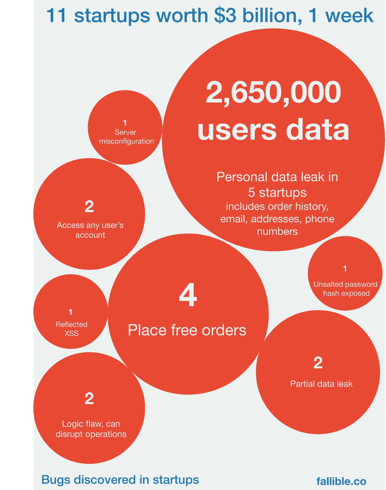
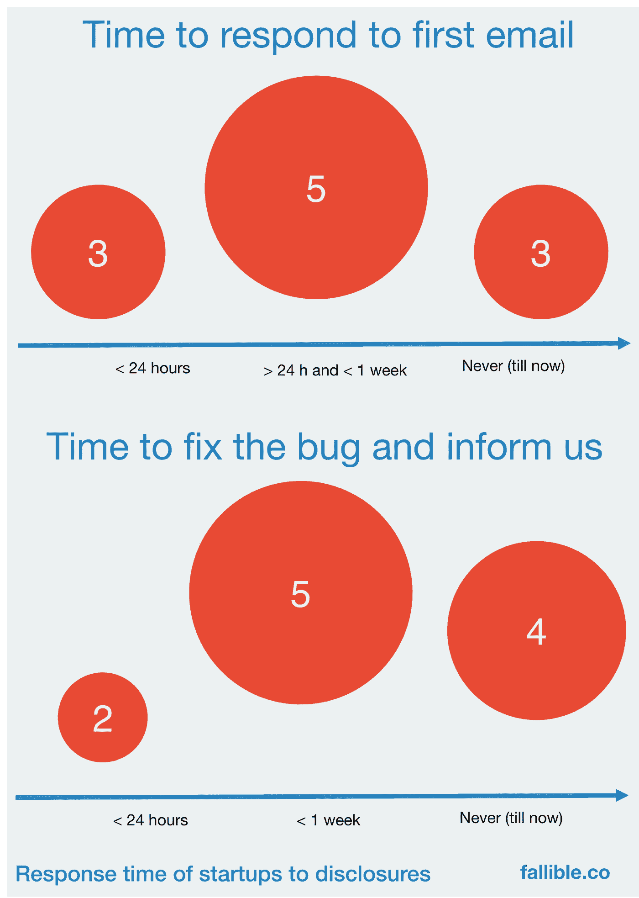

# 我们在一周内发现了价值超过 30 亿美元的 11 家初创公司的严重缺陷

> 原文：<https://medium.com/hackernoon/we-discovered-severe-bugs-in-11-startups-worth-3-billion-in-a-week-cf2a856edb94>

## 印度初创公司的多个漏洞来自用户数据泄露、用户帐户访问免费订单。

更新(10 月 23 日):上周我们又发现了 4 家初创公司的漏洞，几乎所有这些公司都在成为独角兽。当相应的错误修复后，我们将在我们的博客上公布详细信息。

# 为什么写这个帖子？

我们负责任地向各个初创公司的高管披露了这些漏洞。一些初创公司行动迅速，另一些公司需要多封电子邮件，但不幸的是，一些公司甚至在重复发送电子邮件后也没有回复，从而将敏感的用户数据和一些风投资金置于风险之中。有些错误有点微不足道，任何一个像样的工程师都可以获得你的个人数据，并在灰色市场上出售给经纪人。

这篇文章是为了引起那些还没有回复的公司的注意。也许社交媒体能有所帮助。需要说明的是，我们只是发现了现有的安全漏洞，并通知了相关公司。我们没有尝试或侵入任何人的外部或内部系统。

# 我们选择创业公司进行测试的标准

由于时间不足，我们无法检查所有初创公司的缺陷。我们纳入了融资超过 1000 万美元或价值超过 1 亿美元的初创公司。在印度，1 亿美元是一大笔钱，因为印度发生的最大的初创企业收购是[以 4 亿美元](http://articles.economictimes.indiatimes.com/2015-04-09/news/60979747_1_kunal-bahl-rohit-bansal-snapdeal)的价格免费收购的。所有的公司都是消费者创业公司，他们的服务每天都被成千上万的人使用。

大多数错误都是逻辑缺陷，理想情况下应该在白板阶段就被发现。这些漏洞无法通过自动漏洞扫描器检测出来，自动漏洞扫描器可以检测像 T4、SQL 注入和 XSS 这样的漏洞。坦率地说，我们没有试图全面检查 XSS 或 SQL 注入，因为我们发现了太多其他错误。

我们检查了 18 家初创公司的安全漏洞。其中，我们在 11 个中发现了错误。其中最严重的是用户数据泄露，发生在其中的 5 个网站上，共有约 265 万用户。泄露的数据包括地址、电话号码、电子邮件、订单历史，以及令人惊讶的是，其中两个文件中的未加盐密码散列。其中有四个与在线支付相关的错误，因此我们可以从所有的初创公司订购一些测试材料。有两家初创公司存在认证问题，一个是社交登录的实现方式，另一个是 OTPs 的实现方式，如果你知道任何人的电子邮件地址，就可以访问他们的账户。一个初创公司可能有一个 HTML 清理代码，它不能处理递归 XSS 测试字符串，导致 Nginx 服务器永远等待应用服务器响应，直到超时。人们可以利用这一点来轻松关闭服务器。在一家初创公司网站的桌面版本上有一个反射 XSS，例如，通过发送包含一些优惠代码的电子邮件，要求他们登录该初创公司域上看起来与登录页面完全相似的链接，并获取他们的密码，就可以利用该漏洞。一些手机浏览器甚至已经停止显示完整的网址，这将有助于达到目的。

我们还在调查一家支付网关提供商的潜在漏洞，几乎所有印度初创公司都将该支付网关作为处理在线支付的一种方式。

# 初创公司如何应对(或不应对)

> 我们目前是一个 2 人团队[马尼什](https://in.linkedin.com/pub/manish-kumar/38/1a3/774) & [阿布舍克](http://in.linkedin.com/in/abhishekfallible)。我们曾在大型互联网公司、小型创业公司和大型企业网络产品公司工作过。我们全职致力于创建 Fallible，这是一款帮助初创公司保护其系统的产品。我们持续监控您的设置，包括外部 API、应用程序漏洞和入侵检测的服务器日志，并在我们检测到生产中的代码更改时执行安全评估。我们尽可能利用现有工具实现自动化，并在需要时开发我们自己的工具。必要时，我们会进行人工检查(逻辑流程、付款)。我们还与外部安全研究人员合作，他们在您的系统中发现漏洞，并发放适当的奖金以保持他们的兴趣。我们已经签下了几个潜在的独角兽，并期待帮助更多的创业公司。我们的计划起价为每月 1400 美元，按年计费。点击此处查看价格和功能【https://fallible.co/pricing 或联系我们在 hello@fallible.co 免费扫描您的移动应用程序。如果你正在创业，并且在班加罗尔，我们很乐意见到你，只需在上面的邮件中留言。

> [黑客中午](http://bit.ly/Hackernoon)是黑客如何开始他们的下午。我们是 [@AMI](http://bit.ly/atAMIatAMI) 家庭的一员。我们现在[接受投稿](http://bit.ly/hackernoonsubmission)，并乐意[讨论广告&赞助](mailto:partners@amipublications.com)机会。
> 
> 如果你喜欢这个故事，我们推荐你阅读我们的[最新科技故事](http://bit.ly/hackernoonlatestt)和[趋势科技故事](https://hackernoon.com/trending)。直到下一次，不要把世界的现实想当然！

