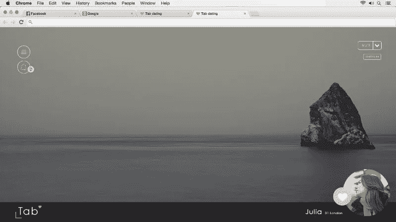
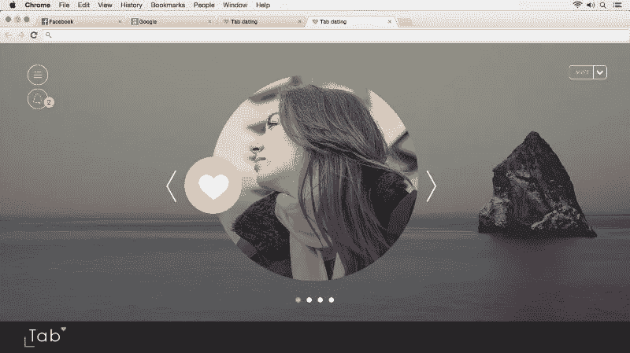
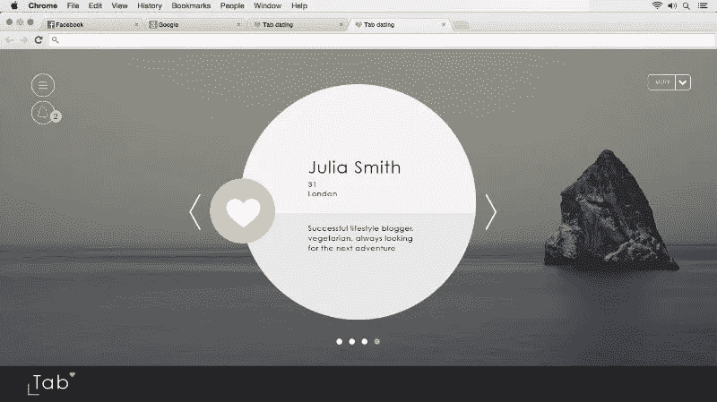
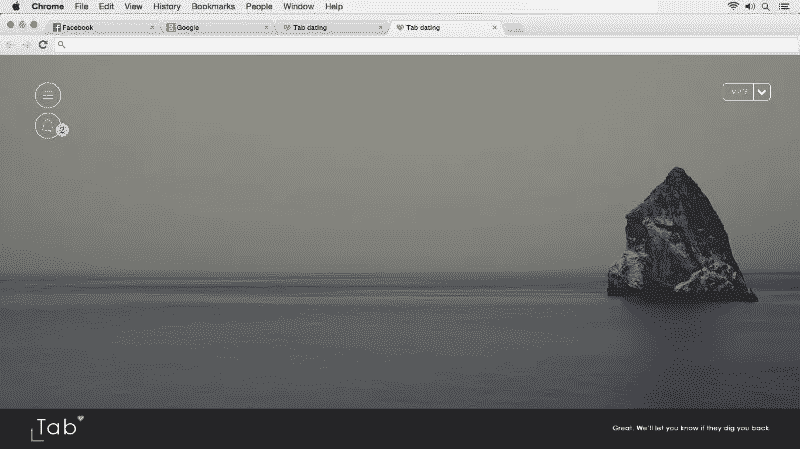

# 我们推出了 Tab——约会 chrome 扩展。

> 原文：<https://medium.com/hackernoon/we-launched-tab-the-dating-chrome-extension-c72b6459211d>

经过 6 个月的努力，3 个月的构建和 2 个月的测试，Tab Dating 现已正式在英国 Chrome 商店面向伦敦人推出。非常自豪能推出这个。你可以在 www.tabdating.com[的](http://www.tabdating.com/)免费安装

下面一些画面，还有[的反馈](https://hackernoon.com/tagged/feedback)多欢迎！

要学习的最新知识…

> [黑客中午](http://bit.ly/Hackernoon)是黑客如何开始他们的下午。我们是 [@AMI](http://bit.ly/atAMIatAMI) 家庭的一员。我们现在[接受投稿](http://bit.ly/hackernoonsubmission)并乐意[讨论广告&赞助](mailto:partners@amipublications.com)机会。
> 
> 如果你喜欢这个故事，我们推荐你阅读我们的[最新科技故事](http://bit.ly/hackernoonlatestt)和[趋势科技故事](https://hackernoon.com/trending)。直到下一次，不要把世界的现实想当然！

