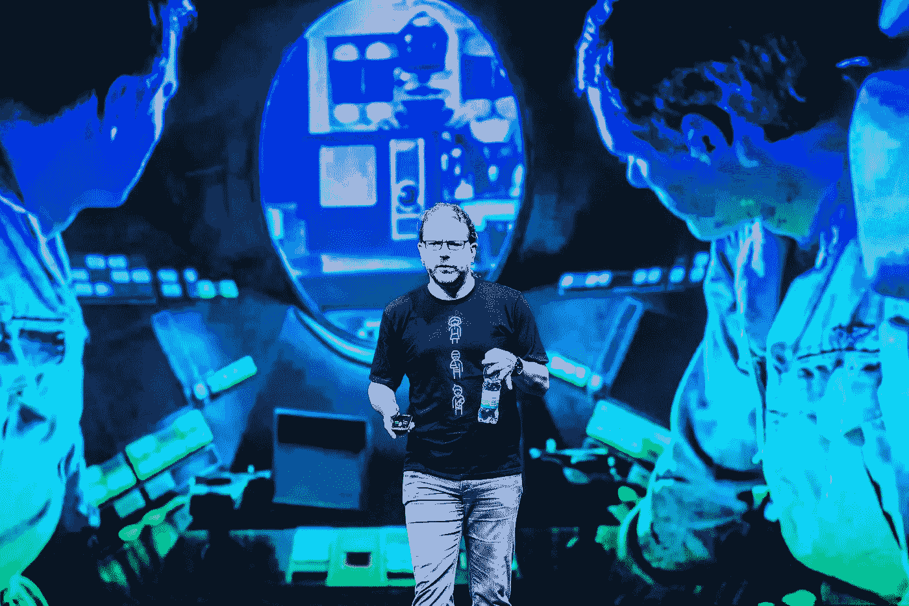
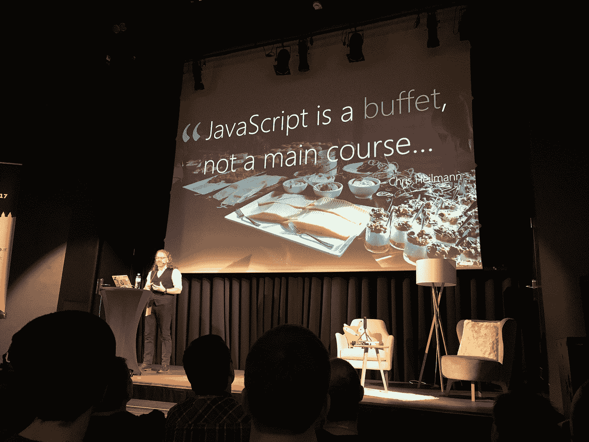

# 我们生活在未来——克里斯蒂安·海尔曼的肖像

> 原文：<https://medium.com/hackernoon/we-live-in-the-future-the-portrait-of-christian-heilmann-491a02018ab3>

*认识 IT 行业的传奇人物，*[*Christian heilmann*](https://medium.com/u/2902b181e2e9?source=post_page-----491a02018ab3--------------------------------)*，自 1997 年以来一直是一位魅力非凡的 web 开发人员，* [*技术*](https://hackernoon.com/tagged/technology) *倡导者，* **⭐** *️在世界各地的舞台上演讲，是一名记者，在* ***雅虎、*** *以及现在的*的职业生涯中，他卓有成效地帮助 web 发展

> “我从来没有回头想过我浪费了我的生命。网络对我很好，我认为为它工作是一个很好的赌注，将来会很开心。让人们听到，让人们去创造，这太棒了”，Heilmann 解释道。

Shift Developer Conference 2017 | Maksim Basic

他在一个农村小镇的工人家庭长大。即使没有大学文凭，克里斯蒂安说:

> “我仍然每天掐着自己的脖子，不相信我是如何在今天和明天的技术上为微软工作的”。

***基督徒是一个*** *巨星* ***，同时也是一个*** *人类* ***。我很高兴分享一些关于他和他所在行业的令人兴奋和有趣的发现。***

# 说说你职业生涯中尴尬的时刻？

我想目前为止我最喜欢的是我在去参加会议的路上出了点意外，把东西洒在了我的衬衫上。我在机场买了一个新的，穿上它，以为我已经解决了这个问题。我后来发现，它的侧面和背面仍然有一个“缩小”和“M 号苗条”的标签。我在演讲时一直穿着它，有很多照片可以证明这一点。其他经典不会暂停你的通知。这样你就可以在屏幕上弹出你的家人或同事的信息。还有一次，当我在舞台上的时候，我的父母打电话给我，抱怨我打电话的次数不够。

> 尴尬和错误时有发生。最重要的事情不是试图让他们闭嘴，而是承认并继续前进。

# 你认为自己是一个更有创造力的人还是保守的人？

我没有太多的保守。话又说回来，我缺乏足够的耐心来真正发挥创造力。艺术遵循工艺和技巧。狡猾意味着有动力重复做一件事，直到你做得很好。我不太擅长这样做。我对很多事情都没有耐心，需要的时候，我喜欢掠过表面，潜得更深。我想在网络上工作是一个很好的特点，因为事情发展得很快。

# 你能分享一件你从失败中学到的事情吗？

> 我几乎是通过反复试验学会了一切。我认为犯错是件好事，因为它会让你烦恼和受伤。你不太可能忘记一个错误，因为你会忘记一个成功。

让你的第一台服务器遭到黑客攻击，并在不知情的情况下托管了一段时间伟哥博客，这教会了我保持软件更新。它还帮助我不相信任何进入我系统的数据。将我的域名从谷歌的黑名单中删除是一项我不想重复的任务。这是一个我没有及时更新的 WordPress 实例。

# 你的工作环境中什么让你开心？

人们。我在家或在路上工作。比起坐在办公室的办公桌前，我在喧闹的咖啡馆里工作更有创造力。我喜欢激励和帮助他人。看到我辅导过的人变得成功是令人惊讶的。介绍那些一起创造好东西的人是很棒的。在别人第一次说话之前帮助他们克服怯场是一种很棒的经历。

> 我喜欢在网上工作，因为有了今天的技术，我可以随时随地工作。我只需要一台笔记本电脑和一个连接。这有多神奇？我们确实生活在未来。

Shift Developer Conference 2017 | Maksim Basic

# 作为一名演讲者，是什么让会议对你有吸引力？

我喜欢参加对演讲者挑剔的会议。我不喜欢在同一时间召开多日、十场有很多话题的会议。我也不太热衷于某个特定主题的集中的、竞争性的会议。一个好的组织者收集的演示文稿本身就是一个故事。他们还邀请花时间了解其他演讲者的演讲者。检查自己的贡献如何与其他人相契合的演示者。在组织方面，我不需要宠爱或特殊待遇。我希望我能轻松安全地往返于会场。这样我就可以专注于演讲和与与会者交流。毕竟，我是来娱乐、教育和倾听他们的。

# 作为与会者，是什么吸引了你？

和主持人差不多。我看不出有什么不同。我认为任何与会者迟早也可以成为一名主持人，如果他们选择走这条路的话。当然，你需要保护自己不要过度分娩。**你需要休息一下。**我认为一个好的会议会让在场的每个人都觉得他们可以做出贡献。我喜欢参加那些我不太可能发言的会议，看看接下来我还能做些什么。

> 任何会议都应该提供足够的时间来建立联系和交流。**这不是巡回演讲，而是帮助创造和灌输社区意识。**

ScriptConf 2017 in Linz | Horst Gutmann

# 你认为新一代人比 10 年前更倾向于学习编程吗？

这取决于我们对编程的定义。我认为修补方面是在一个向下的斜坡。编程是就业市场上一项抢手的技能。这就是为什么人们更有可能去获得一个学位，并尽快找到一份工作来赚钱。10 年前，我们的市场定义要少得多，人们更有可能以获得某个角色的经验为目标。

如今，受访者要求大量的福利和高薪。话说回来，十年前，住在旧金山或伦敦要便宜得多。

> 我们正处于市场的**炒作周期，没有足够的人来填补空缺。这使得市场变得更加公式化和保守。**

十年前，要求编写算法的白板面试是闻所未闻的。因为我们现在不得不在短时间内雇佣很多人，所以这种情况很常见。如今，开发人员也有很多现成的解决方案可供选择。当有几十个解决方案承诺你在很短的时间内取得很大成就时，为什么要强迫自己去理解基础知识呢？**我们的市场已经成为一个时间紧迫的市场。**

> 我们的要求是在更短的时间内创造更多。而不是创造出所有相关人员都能够理解、记录良好的东西。这是一种危险、浪费的工作方式，的确会让人精疲力竭。

# 微软正在采取什么举措来推动网络向前发展？

> 我们终于让**不再需要互联网浏览器**。我们发布了一款全新的、符合标准的常青树浏览器——Edge。

我们随时欢迎错误报告和改进请求。我们的发布时间表是公开的。我们分享我们发现的人们在网上做什么的数据，而不是假装我们可以告诉开发者使用什么。我们在 W3C 工作组中的人数比大多数其他浏览器制造商都多。我们定义了重要的新标准，如**支付和身份系统**以及**指针事件**。

不过最大的变化是开放并发布越来越多的开源产品。我们的 [JavaScript](https://hackernoon.com/tagged/jasvascript) 引擎已经开放，我们发布了 TypeScript。Visual Studio 代码是开放的，是学习如何编写干净代码的好工具。它会在你写的时候告诉你哪里做错了。这是只有商业 Visual Studio 和其他企业 ide 事先做的事情。

我的工作在很大程度上是帮助外部与产品团队的沟通，反之亦然。我很高兴我们活跃在 Slack/Twitter/GitHub/stack overflow 上，而不是试图将人们推入我们自己的交流渠道。

> 微软从惨痛的教训中认识到，把你的想法强加给别人，不遵守标准会孤立你。

现在，我们开始一切公开，并确保我们与其他浏览器制造商兼容。这是关于网络的，没有人会用浏览器赚钱。

# 像脸书这样的大公司雇佣这么多有影响力的开源开发者对社区来说是健康的吗？

那得看情况。如果他们雇佣他们来给他们的项目提供公司支持，那么这是一件好事。如果这意味着他们被雇佣去做一些已经结束的项目，并且不得不离开他们被雇佣的那个项目，那就不太好了。

> 有一种误解，认为开源是一个人写了一个很酷的东西，并让它可用。

一个成功的开源项目很大一部分是围绕它培养一个社区。让原来的开发者解放出来做别的事情。最后，每个最初的开发者都会继续前进。这就是 OSS 的美妙之处——你交出代码，就放弃了控制权。对于许多新的 OSS 开发者来说，这是一个艰难的步骤。

你在这里描述的场景的另一个问题是它树立了一个坏榜样。“如果你发布了一个成功的 OSS 项目，大公司会雇佣你”导致许多项目开始，而不是其他项目得到支持。我们市场上几乎每个大公司都有开源项目。如果你的目标是加入这些公司，从长远来看，在那里做贡献要容易得多。

# 网络的基本问题似乎永远不会改变:速度和可用性。为什么你认为我们仍然没有得到这些权利？

从来没有。摩尔定律和市场营销在这方面对我们不利。有一小部分幸运的人拥有最好的硬件和最快的连接。这些也有可能前期花很多钱。**长期收入在别处，但我们需要快速赚钱，否则我们的酷创业就失败了** *。*这就是我们用高保真接口迎合高端需求的原因。

界面太重，无法使用，加载时间太长，对运行的硬件要求太高。我们需要打破这个循环。我们需要在不确定的网络条件下测试糟糕的硬件。然后我们可以为每个人提供快速的产品。但是我们几乎没有时间去做，因为建造下一艘闪亮的更重要。

在可用性方面，我们也处于一个微妙的位置。我们知道该做什么。但是我们不能限制自己只做对一件事，我们必须创新。我们增加了新功能，使我们在竞争中脱颖而出。另一大绊脚石是法律。发布一个能卖东西的产品意味着你必须遵守旧的法律。这些迫使你构建过于复杂的接口。要解决这个问题，我们需要考虑改变这些需求。

# 世界更需要什么:浏览器供应商的多样性还是可预测的发展目标？换句话说，一家浏览器厂商占据大部分市场是健康的吗？我们能做些什么呢？

不，**只有一个浏览器**永远不会好。原因是浏览器制造商是有其他需求和交付的公司。标准化需要时间和努力。不同的浏览器制造商希望实现相同的功能，这意味着我们更有可能创建一些健壮的、文档化的和可重用的东西。我们已经讨论过了。

> 我们有 IE6 作为明显的市场领导者。我们仍然在遭受迎合这种死亡环境的可怕的网络产品。这必须停止。

作为开发者，我们给了浏览器太多的街头信誉。最终用户不关心他们使用哪一个。只要它不会让他们的机器陷入困境，并且能给他们想要的功能。Chrome 的成功是因为谷歌捆绑了令人惊叹的服务。Safari 仍然活着，因为它是 iOS 上的开箱即用浏览器。没有办法在上面运行另一个完整的浏览器——你需要使用他们的引擎。

> 标准和浏览器多样性是我们开发者的事情。所以**由我们来决定是否构建只针对其中一个的界面**。

# 你认为 AI 取代开发者的可能性有多大？

很有可能。

> 我们在自动化面前并不安全。**我们的工作越可预测，机器就越擅长做这件事。**

我们已经有了像 DeepCoder 这样的系统。像 Wix 这样的网站生成器使用深度学习来创建迎合需求的体验。但我不担心。我认为人工智能是一个很好的机会，可以创造我们想都不用想的无聊工作。

**这篇文章也在**[**http://www.netocratic.com/**](http://www.netocratic.com/christian-heilmann-111429)**发表，克罗地亚语版本可以在**[**http://www.netokracija.com/**](http://www.netokracija.com/christian-heilmann-136885)**找到。**

***感谢您的关注。如果你喜欢这篇文章，请给它一个掌声，并填写我的💚️with 乐了:)***

 [## 用 Peter Brussard — Rosetta Stone 扩展敏捷

### 采访 Rosetta Stone 公司产品高级副总裁 Peter Brussard，分享专业见解…

medium.com](/@scrumolina/scaling-agile-with-peter-brussard-rosetta-stone-cc592355404d)