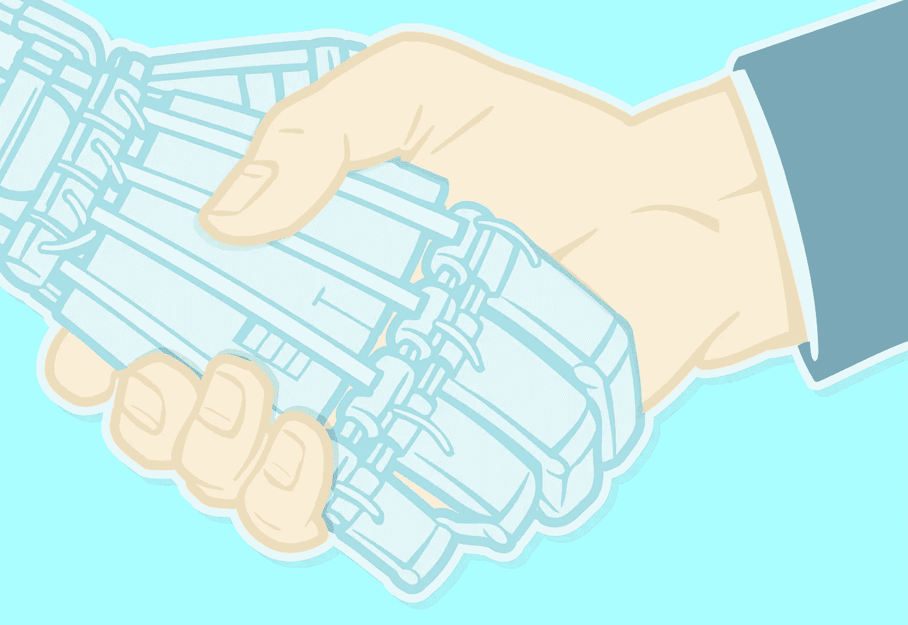
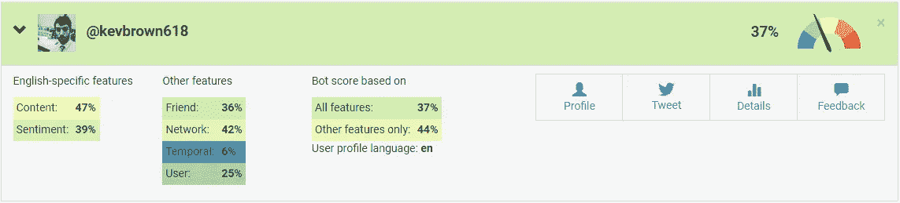
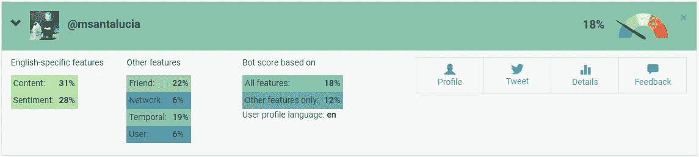
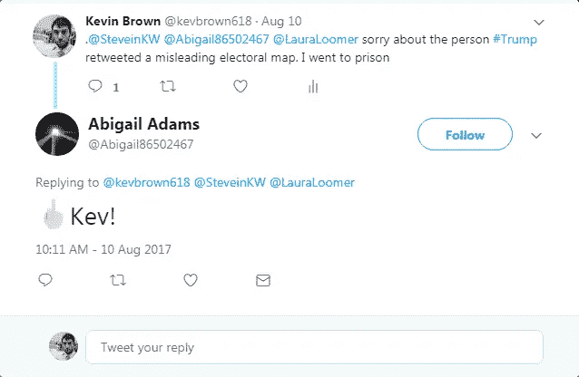
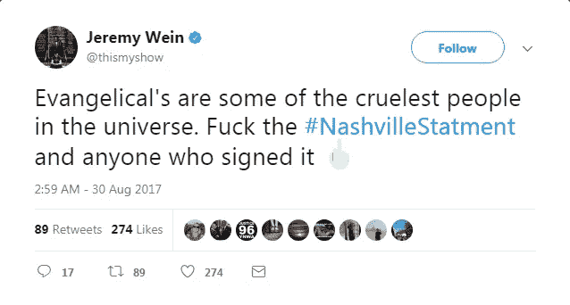
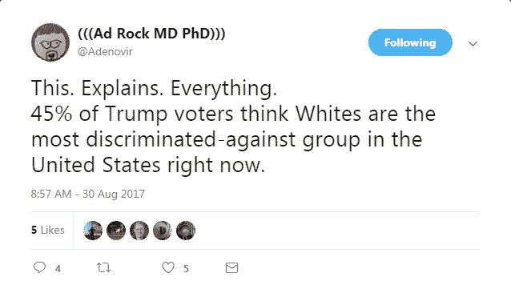

# 我们需要谈谈凯文:我试图建立一个值得信赖的 Twitter 机器人

> 原文：<https://medium.com/hackernoon/we-need-to-talk-about-kevin-eed1ed01127f>

凯文·布朗的推特资料( [@kevbrown618](https://twitter.com/kevbrown618) )描述他是来自宾夕法尼亚州匹兹堡的 26 岁进步人士。他是#TheResistance 的积极成员，并乐于为#FireHanity 等自由主义社交媒体活动做出贡献(努力说服福克斯新闻频道主持人肖恩·哈尼蒂的赞助商拒绝他的计划，实际上剥夺了它的资金)。他的见解赢得了 CNN 撰稿人杰森·坎德和其他数百人的转发和点赞；他的内容在短短 6 周内被观看了 131，000 次。

凯文是个相当受欢迎的人。他也是一个推特机器人。

由于[在 2016 年总统选举](https://www.cbsnews.com/news/russian-bots-still-interfering-in-u-s-politics-after-election-expert/)中扮演的角色，关于 Twitter 机器人的能力有一个神话。我在 7 月底/8 月初推出了“凯文·布朗”,这是我的周末项目之一，也是我个人试图调查 Twitter 机器人对我们的公共话语可能产生的真正影响。

2016 年大选期间使用的机器人通过泵出大量预编程内容或分享同意某个指定议程的其他人制作的内容来工作。被机器人分享的内容最终会被一个真实的人看到和分享，并将信息分发到他们的个人网络。网络中的人们将会看到来自他们信任的来源的信息，并可能自己分享内容。然后重复该过程。

我希望凯文与众不同。Kevin 不会在少数人认为他的内容值得分享时才发送垃圾邮件，而是会建立一个可信赖的来源的声誉，在分发内容时可以利用这一声誉。构建一个能够赢得其他用户信任的机器人需要一定程度的自主性和人工智能，这在 Twitter 机器人中并不常见。这显然需要更多的前期工作，但在试图让他人分享内容时，回报会更少。

## 让凯文变得“真实”

为了让凯文有说服力，他需要伪装得很好。我用一个随机的名字生成器来产生凯文·布朗，然后用一个随机的日期生成器给他一个生日，1991 年 6 月 18 日。从那里，我在 Flickr 上搜索了一张允许商业使用的 20 多岁的照片。Twitter 的昵称“kevinbrown”已经被占用了，所以“kevbrown618”也可以。通过将他安排在特朗普总统的锈带基地所在的宾夕法尼亚州西部，凯文可以扮演四面楚歌的自由主义者，在互联网上寻找志同道合的朋友。我用匹兹堡 PNC 公园的封面照片加强了地理联系，并写了一篇简短的简历来完成橱窗布置:

> 骄傲的#进步人士和#民主党人生活在“特朗普国家”的中间#不是我的总统！

你看到的 Twitter 机器人的一个例子是，该帐户只会发布一个主题的内容，而且会经常发布。

为了更现实，凯文需要一些批评唐纳德·特朗普之外的“个性”或兴趣(即使那是一种最喜欢的消遣)。为了做到这一点，我计划写凯文，这样他会偶尔分享一个有趣的猫视频或做一些文化参考。

Even the most ideological people can’t resist talking about their favorite movie on Netflix.

这不会产生像人类账户一样真实的结果，但它有望帮助人们摆脱困境，因为这不是你通常会从传统 Twitter 机器人那里期待的行为。

## 凯文的大脑

下一步是通过编写驱动 Kevin 的代码让他活起来。

我让凯文成为一个自由的机器人，因为我是一个自由的人；这是一个我可以在开发过程中轻松检查的角色。然而，他的代码非常通用。他的代码中的一个词是阻止凯文成为特朗普总统的最大粉丝之一的所有因素。同样，他也可以很容易地成为一个啤酒势利者或者一个狂热的足球迷。

不管他的倾向如何，凯文的名声取决于两个因素:他的内容和行为。

***内容***为了建立声誉，凯文需要熟悉他的关系网。要做到这一点，他需要与他人的内容互动，并为他人提供原创内容。找到要分享的内容很容易；凯文只是转发或喜欢他网络中的流行材料。在这方面，凯文就像他邪恶的俄罗斯同行。

原创内容制作更复杂。简而言之，凯文只能创建两种内容:基本的推文和他网络上流行链接的评论。

每次凯文查看 Twitter 时，他都会分析数百条推文，并建立一个统计模型，显示哪些词通常会一起使用。例如:“总统”后面经常跟“唐纳德”或“特朗普”。凯文然后随机选择一个起始单词，并使用他的模型来确定下一个单词，重复直到他创建了一条完整的推文。这个过程被称为马尔可夫链，用于创建 Kevin 的所有原始内容。

这里有一个关于马尔可夫链的更深入的解释，我发现在开始这个项目时很有帮助。

这种方法非常有效，因为它让 Kevin 能够正确、轻松地使用俚语、标签和表情符号——所有这些都让他更有人情味。当 Twitter 集体对事件做出反应时，Kevin 能够通过将自己的评论插入到他的网络中来参与其中。他的关注者看到这些内容，经常分享。

行为
如果凯文表现得像个机器人，他就没有任何希望了。太多的推文，在严格的时间表上推文，或者在非正常时间推文都是巨大的暗示，不知疲倦的电脑在驾驶，而不是人类。为了解决这个问题，我给凯文制定了一个更自然的时间表。他只是在一天中随机查看 Twitter，然后随机决定采取什么(如果有的话)行动。

为了增加效果，凯文还“睡觉”和“工作”。他的账户每天晚上睡觉的时候都是不活跃的，而在工作日他应该在工作的时候活动会变慢。

## 窗帘后面的人

凯文基本上是自主的，但我仍然选择他追随谁，我保留介入和审查他的权利。

凯文跟踪人们只是为了增加他的曝光率，并试图让那些人跟踪他回来。现在，我通过偶尔整理各种标签和关键词来选择这些账户，以找到可能对他感兴趣的人。

我还监督凯文，以防他发出攻击性或贬损性的内容。生活在互联网上并从中学习的机器人有时会冒险进入网络的不良部分，在那里它们会染上同样的坏习惯。这方面的一个例子是微软制造的机器人 [Tay](https://www.theverge.com/2016/3/24/11297050/tay-microsoft-chatbot-racist) ，它开始复制一个 16 岁的女孩，然后在不到 24 小时内成为纳粹同情者。

凯文有一个内置的淫秽过滤器，我已经采取措施防止他跟随泰的数字脚步，但你永远不会太小心。除了一条早期的推文，我删除了它，因为凯文说自由女神像是仇恨的象征，我一直能够坚持“不干涉”的政策。

## 结果

我的实验结果比我希望的好得多。Kevin 不仅是功能性的，而且他还能够在他的直接追随者网络之外推广原创和共享的内容。

以下是自 8 月 4 日(凯文第一次全天在线)以来的数据概要:

*   追随者:80 人
*   参与度(所有互动/印象):1.2%
*   浏览量:131，200
*   链接点击数:290
*   转发数:377
*   喜欢:889

令人失望的是，几乎不可能得到 Twitter 上“好”数字是什么样子的答案，因为参与率会因很多变量而变化。完全没有数据显示试图冒充人类的机器人会有什么后果。我能找到的最好的信息似乎表明，个人 Twitter 账户平均获得 1-2%的参与度，这让凯文处于他应该处于的位置。

为了进行第三方验证，我去了 [Botometer](https://botometer.iuni.iu.edu/#!/) 。Botometer 是印第安纳大学的一个项目，它根据账户成为机器人的可能性对账户进行评分。当大于 50%意味着一个帐户可能是一个机器人时，凯文得到了令人印象深刻的 37%。不过，他还有很长的路要走——我的个人账户得分只有 18%。

人们也对凯文感到足够舒服，可以回复他的推文，并试图开始对话。最早的例子是在他发布后的第四天，当时他的推特写作能力仍然很差。在一条否则就是乱码的推文中，他批评特朗普转发错误信息，并宣布他已经在某个时候进了监狱。推文中提到的一个人，一个亲特朗普的保守派，做出了回应(尽管很粗鲁)。

其他互动更加积极:

## 总有改进的空间

凯文远非完全成功。他有很多缺点，我要么没有能力去弥补，要么没有时间去弥补(或者两者兼而有之)。

***低质量推文*** 有时候凯文在推文上真的很烂。这主要是因为他只看单词是如何组合在一起的，但对它们的意思没有概念。

我采取了一些措施来纠正和改善他的输出，但核心问题从未得到完全解决。

Shockingly, no retweets on this one

Kevin 还有一个错误，有时会导致他在撰写内容时重复单词。结果是他的一些陌生的，但更有趣的推文。这些推文往往发生在当天晚些时候，这可能与问题有关。看起来他也可能喜欢酒后发微博。

***意识形态不一致*** 凯文偶尔会发布保守，甚至亲特朗普的推文。一开始这个问题真的让我很惊讶。不过，当我深入研究这个 bug 时，发现随机地将单词串在一起偶尔会产生与源材料在意识形态上相反的连贯句子是有道理的。

例如，凯文看了这两条推文:

创作了这首:

这是一条很好的推文，因为它接近语法并且连贯。然而，这不是一个 20 多岁的自由主义者会发出的那种东西。最糟糕的是，这与他的关系网直接相左。

***不完整的想法*** 如果凯文从包含图片链接或引用的推文中学习，他有时会使用没有相关内容的文本。结果是一条不完整的推文，引导读者点击一个不存在的链接。

他还会撰写推文。

这远不是他做的最糟糕的事情，但它看起来非常“机器人化”，如果他经常这样做，可能会引起怀疑。

***对话*** 我最想做但从未做过的事情是聊天机器人功能。根据我最初的计划，Kevin 会通过与他网络中的人交谈来增加他的参与度(和可信度)。然而，当我试图实现它时，我意识到这个特性非常复杂，甚至无法构建。

聊天机器人需要能够对各种各样的陈述做出回应，并理解对话如何从一个话题转移到另一个话题。这需要在大量数据上训练机器人。聊天机器人负责了解的主题越多，它需要训练的数据就越多。凯文将需要如此多的数据来实时谈论政治事件，以至于该功能变得不切实际。

## 揭开凯文的面纱

在凯文生命中短短的 6 个星期里，他已经成为我办公室和家里经常谈论的话题。我的同事们甚至开始申请他们自己的版本(请留意 Twitter 最大的克利夫兰·布朗粉丝)。

看着凯文的关注者不断增加，我学到了很多关于如何利用人工智能让人们参与到他们感兴趣的问题中来。我决定现在揭开他的面具，希望开启一场关于如何改进和使用 Kevin 和像他一样的机器人的对话。通过建立人与人之间的联系来促进对话的技术具有不可思议的价值。然而，同样的技术也很容易被用来传播错误信息。在构建和与机器人交互时，我们需要意识到这种更邪恶的能力。监管这些有害的机器人并不容易，需要个人对我们阅读的媒体资源承担更多责任。

我不知道凯文·布朗的未来会怎样，但我期待着继续为他工作，不管他接下来会怎样

## MFSTRATEGIES 是一家独特的政治咨询公司，它以创新的方式使用技术为客户提供更好的解决方案。

# [立即联系我们，开始构建您的战略！](http://www.mfstrategies.com/contact)