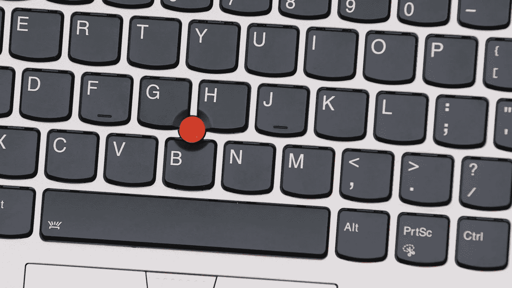
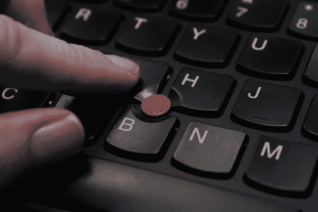
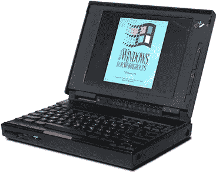
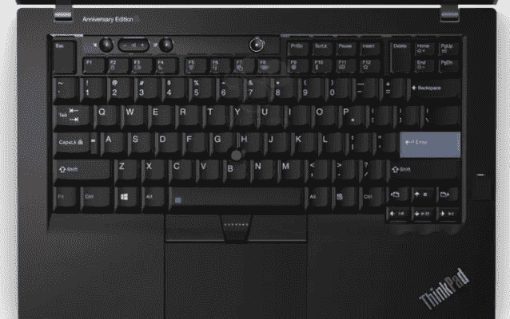
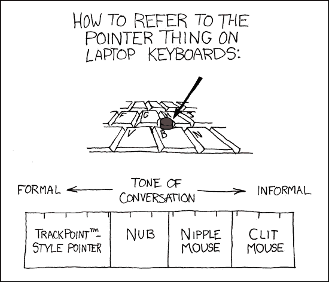

# 我们需要谈谈乳头鼠

> 原文：<https://medium.com/hackernoon/we-need-to-talk-about-the-nipple-mouse-50fc18cfcebf>

## 就是死不了。

这是[乳头鼠标](https://hackernoon.com/tagged/nipple-mouse)。如果你以前从未见过，很难猜测它实际上是做什么的。坐落在键盘的按键之间，橡胶红点像疼痛的拇指一样突出。

也被称为的*指点杆是一种控制笔记本电脑的方式。[由 IBM 在 80 年代开发的](https://www.youtube.com/watch?v=n4Ss6F1qIHU)作为触控板和鼠标的替代品，它旨在让你的手悬停在键盘上方。这样，你可以更快地在打字和移动光标之间切换，而不用移动你的手。*

Wiggle wiggle.

听起来很棒，对吧？如果你曾经用过它，你就会知道它是有史以来最糟糕的东西。乳头鼠标不仅丑得不可思议，而且很难使用。

要移动光标，你需要用手指紧紧按住圆点，并向你想要的方向摆动手指。然而，这个乳头非常敏感，这使得光标很难停留在它需要去的地方——相反，它往往会不受控制地飞过屏幕。

在 IBM 的发明之后，他们提炼了[技术](https://hackernoon.com/tagged/technology)，并将其放在其笔记本电脑上。现在被称为 TrackPoint，在整个 90 年代，数以百万计的消费者开始知道这个哑点——它被粘在该公司广受欢迎的 ThinkPad 电脑系列的键盘上。联想随后在 2005 年收购了 ThinkPad 系列。

Cute, except for that red dot.

指点杆从未获得商业上的成功——今天，触控板主宰了笔记本电脑市场。苹果曾经生产最好的笔记本电脑——它们很大，由玻璃制成，支持多点触控——但最近几年，其他制造商赶上来了，今天销售的大多数笔记本电脑都配有很棒的触控板。

一直以来，公司都在不断想出新的方法来与我们的设备进行交互。微软的 Surface Studio 推出了拨号盘，这是一个时髦的圆盘形控制器，非常适合创意人员。苹果的新 iPhone X 配备了一系列令人印象深刻的传感器，这些传感器可以映射你面部的肌肉，从而实现类似于 Animoji 的功能。

自始至终，由于某种原因，指点杆仍然活得好好的。

你没看错——[这款 2017 款联想 ThinkPad](https://www.amazon.com/Lenovo-Ultrabook-Professional-Certified-Refurbished/dp/B073WVRDJT/ref=sr_1_4?s=pc&ie=UTF8&qid=1506432981&sr=1-4&keywords=lenovo+thinkpad) 正面中央都有。你今天可以买一台新的笔记本电脑，但它仍然拥有有史以来最糟糕的技术之一。更糟糕的是，9 月 25 日，ThinkPad 的[25 周年纪念版泄露了](https://www.laptopmag.com/articles/lenovo-25th-anniversary-thinkpad)。猜猜它还有什么。

Whoomp, there is it!

当联想的首席设计官大卫·希尔[被问及](http://www.techradar.com/news/why-the-thinkpad-trackpoint-still-a-thing-according-to-lenovos-chief-designer)为什么该公司的一些笔记本电脑仍然带有奶嘴鼠标时，他回答道:

> 有些人得到了，有些人没有；有些人获得了味觉。这很难解释，但我仍然认为它是有用的。

大卫，你是认真的吗？来吧，伙计，是时候退休了。称它为乳头鼠标，称它为 TrackPoint 指点设备，我不在乎。这是老技术了，丑得不可思议，没人要。

三十年后，带着你的损失。触控板赢了。

XKCD knows best.