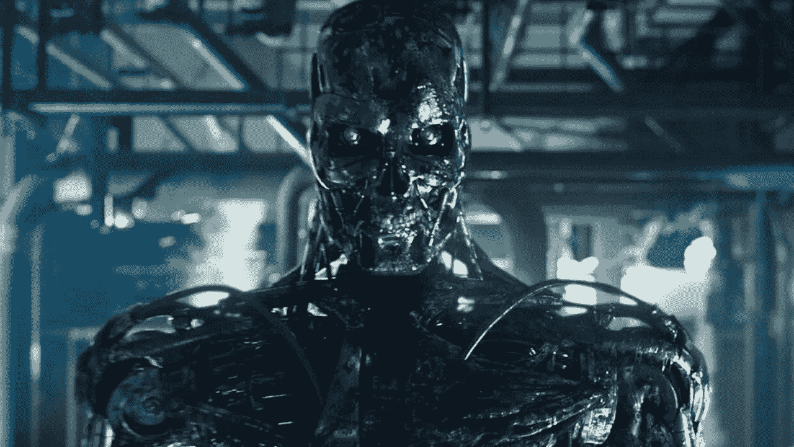
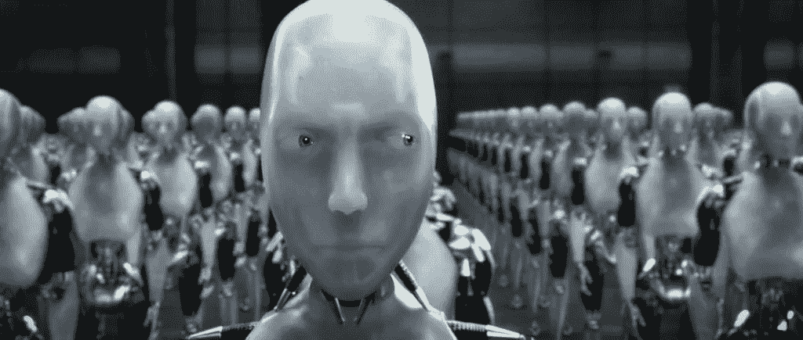

# 我们只有一次机会让 AI 正确…或者我们有吗？

> 原文：<https://medium.com/hackernoon/we-only-have-one-chance-to-get-ai-right-or-do-we-f56226980cac>

有很多关于 AI 接管世界的故事。

Terminator Genisys (2015)

有很多真正的专家担心人工智能会接管世界。

 [## 艾公开信-生命的未来研究所

### 点击这里查看其他语言的页面:中国人工智能(AI)研究已经探索了多种…

futureoflife.org](https://futureoflife.org/ai-open-letter/) 

这种观点认为，人工智能的困难在于，我们只有一次机会做对。如果我们造出一个比我们*聪明*和比我们*快*的人工智能，那么我们就受它的支配了。如果它开始以不符合我们最佳利益的方式行动，我们可能很难(不可能)阻止它。所以这就是为什么专家们一直呼吁在人工智能开发中要谨慎和规范。因为如果我们第一次就搞砸了，可能就完了。在这种情况下，如果有一个重置按钮就好了，我们可以再试一次…

## 你猜怎么着？

我们可以——算是吧。我们只有一个“真实”的世界，这是真的，但我们确实有能力创造近乎无限数量的模拟世界。随着时间的推移，这些模拟世界只会变得更加先进和真实。

我在说什么？想想现在的电子游戏。魔兽世界、模拟人生和星际争霸就是几个例子。这些游戏为人工智能提供了接近真实世界的环境。例如，要在星际争霸中赢得一场游戏，你必须掌握资源消耗、战争和战略。具有学习这些技能能力的人工智能在现实世界中有许多应用。顶级科技公司刚刚开始尝试这样做。为了了解更多关于 AI 玩游戏的信息，我在这里写了一些:

 [## 这是所有的乐趣和游戏，直到人工智能赢得所有

### 你玩过《突围》这个游戏吗？你知道，一种电子游戏，你把一个球弹入…

hackernoon.com](https://hackernoon.com/its-all-fun-games-until-ai-wins-them-all-d5d657b064be) 

## 现在让我们快进几年。

一家公司拥有一种先进的人工智能，希望在向世界发布之前进行测试。为了观察它的表现，他们把它放在一个模拟的世界里。在这里，人工智能在世界上“玩”了数百万次。目标是看看人工智能创造积极和消极结果的频率。然后，该公司将利用这些数据来改进人工智能，以便只出现积极的结果。一旦达到一定的安全界限，人工智能就可以在我们的世界里自由自在地生活了。

这在许多方面都有很强的吸引力。政府会接受这种方法，因为这将允许对众所周知难以监管的 T2 技术进行监管检查。科技公司将享受快速、以最小的前期成本对其人工智能的不同方面进行功能测试的能力。最后，消费者会喜欢这个，因为——嗯——他们不会死于机器人接管！大家都赢了！

坦率地说，这似乎是一种非常合乎逻辑的方式，既提供更安全的监管监督，又允许企业在人工智能领域保持极快的创新，以保持商业竞争力。有很多细节需要解决吗？是的，绝对是，但中心思想是健全的。

## 这真的没有那么牵强。

从《T4》Pong(1972 年的 T5)到《侠盗猎车手》(2013 年的 T6)等现代游戏，视频游戏的质量一直在提高，这些游戏拥有巨大的开放世界和许多自由度。然后是 [MMOs](https://en.wikipedia.org/wiki/Massively_multiplayer_online_game) ，支持一场比赛数千玩家同时在线。由于虚幻引擎等技术的进步，2017 年的游戏现在可以拥有令人惊叹的逼真图形。

我们在 45 年里从 pong 发展到 T10。所以，如果我们假设游戏设计和图形有任何进展，1000 年后我们会在哪里？不用说，我们最终将实现与现实、电子游戏或其他事物无法区分的虚拟世界。但是不要以为我说的是真的。这些想法来自埃隆·马斯克。

## 示例使用案例

想象一个城市规划游戏。或者更好的是，一个为了成为人工智能游乐场而建造的城市规划模拟。我们可以测试整合自动驾驶汽车、hyperloops、城市住房、公共交通和公园系统的最佳方式。这一工程的规模将是巨大的。当然，加载良好的样本数据至关重要。我们需要能够精确追踪人们在真实城市中的活动地点和方式的传感器。我们可以利用现有的智能手机来了解人们移动到哪里以及如何移动。但如果这太具侵入性，那么还有像芝加哥的一系列事物试图通过数据提供一个活生生的城市图像。

一旦收集起来，这样的数据集可以帮助人工智能通过虚拟建造数百万座城市并观察模拟人如何与它们互动来学习建造我们的理想城市。人工智能会在每次迭代中改进它的设计。最后，我们会吸取所有这些经验，甚至在拿起砖头之前，就完全知道我们将要建造最高效的城市设计。

## 你怎么想呢?

有没有安全测试人工智能的替代方法？这有用吗？能否围绕在虚拟世界中测试人工智能形成一个价值数百万美元的产业？请在评论中讨论！

iRobot