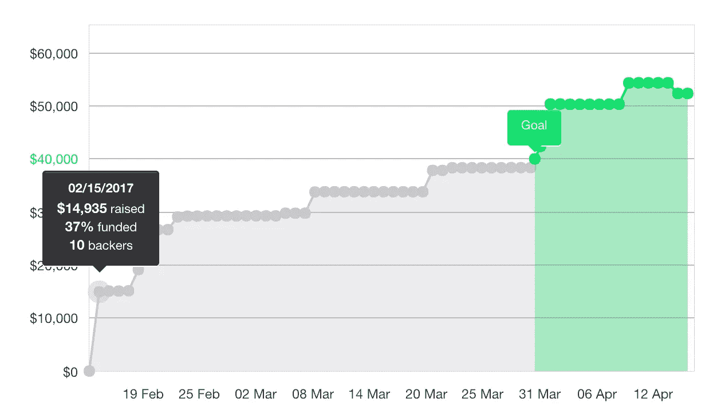
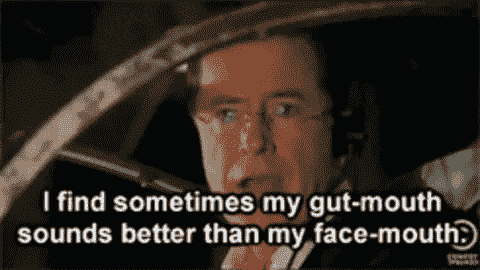
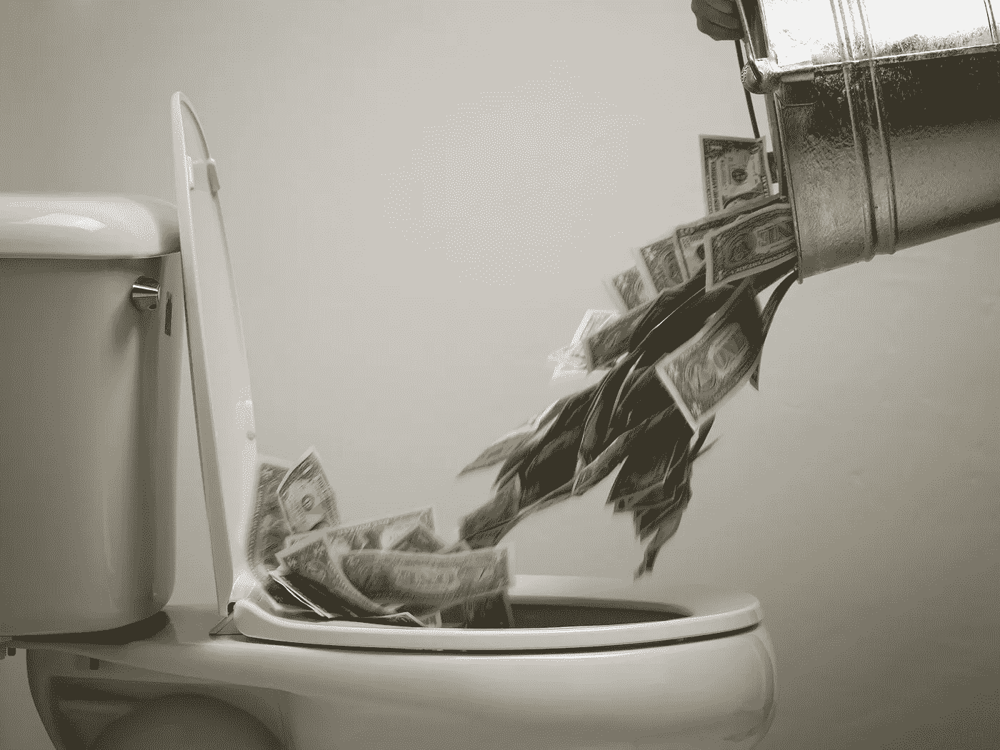
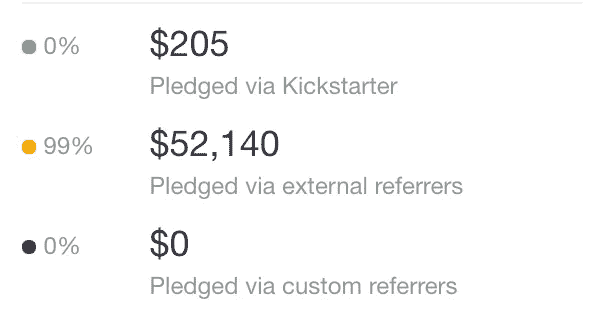
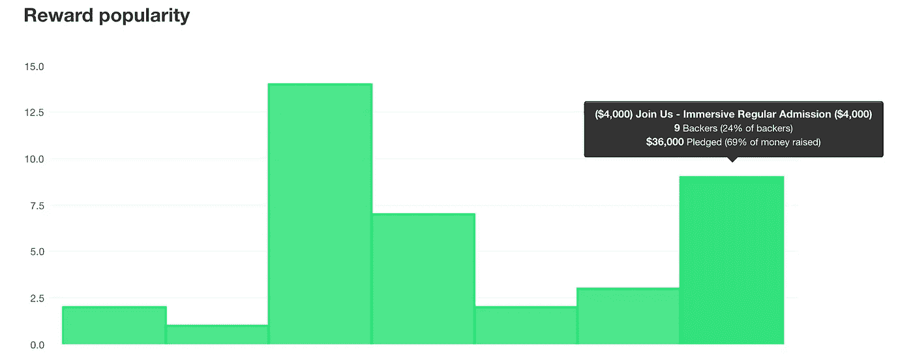
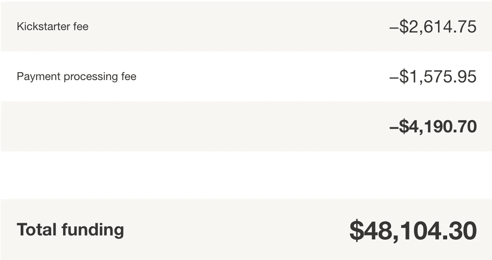
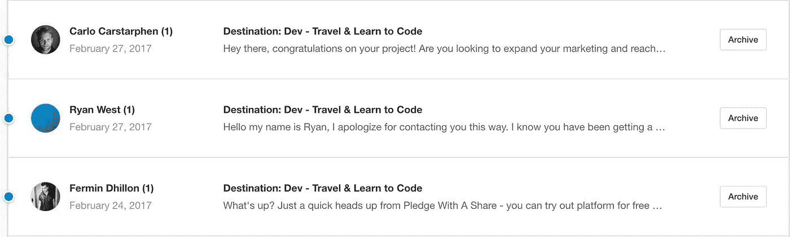

# 我们在 Kickstarter 上筹集了 52，345 美元。我们是这样做的。

> 原文：<https://medium.com/hackernoon/we-raised-52-345-on-kickstarter-heres-how-we-did-it-destination-dev-1ab9b13dbec7>

当我们在 2016 年 11 月构思出[目的地:开发](http://www.destinationdev.com/)的想法，并开始向人们展示时，我们知道我们正在做一些事情。[软件开发训练营模式在过去五年里非常成功，这是有充分理由的](https://hackernoon.com/the-bootcamp-education-model-works-heres-why-fd25825f4c0a)。然而，[我成为一名开发人员是为了能够从事我想做的事情，并且环游世界而不牺牲我的职业发展](https://hackernoon.com/being-a-freelance-software-developer-is-awesome-5849b7db59fe)，并且我知道还有很多像我一样有抱负的数字流浪者。我们开始为我们的课程建立一个 MVP 模型，并开始通过内容、社交媒体和口碑来推广它。然而，几个月后，零注册，我们清楚地意识到我们做错了。

我们相信我们的想法，但是我们认为最大的障碍是缺乏可信度和时间压力。经过一番头脑风暴后，我们决定将我们程序的价格降到最低，通过 [Kickstarter](https://hackernoon.com/tagged/kickstarter) 来验证和资助它可以帮助我们向自己证明我们有值得追求的东西。

四个月后，[我们的 Kickstarter 活动成功获得资助](https://www.kickstarter.com/projects/dmill/destination-dev-travel-and-learn-to-code)，我们刚刚在麦德林见到了我们的第一个完整班级的学生。在推动实现我们的目标的过程中，我们学到了很多东西，尽管我们筹集的金额与一些 Kickstarter 巨头(他们已经筹集了超过 100 万美元)相比并不算多，但当我查看 [Kickstarter 的统计数据](https://www.kickstarter.com/help/stats)时，我惊讶地得知我们的项目在所有项目中排名前 2-3 %,在所有项目中排名前 6-8%所以，很明显，我们找到了一个可行的方案，我认为分享我们的经验对任何考虑在 Kickstarter 上开展活动的人都是有益的。以下是我从一次成功资助的 Kickstarter 活动中总结的几点。

# 售前和验证

Presales started us off 37% funded on Day 1

在启动我们的 Kickstarter 活动之前，我们已经验证了我们的产品大约 4 个月。我们已经收集了大量关于定价、信息传递和销售周期的信息，并且已经很好地了解了哪些营销渠道对我们有效，哪些无效。我们将这一验证向前推进了一步，在我们的课程中收取了 14K 美元的预售款，并在发布前收取了不可退还的押金。这不仅保证了我们不会在活动中浪费时间，也给了我们很大的动力，因为我们的活动在第一天就获得了 37%的资金。Kickstarter 活动提供了时间压力，这可能对你有利，但你应该在发布前测试你的市场并做好准备。

# 设定一个可实现的目标

Don’t do this.

Kickstarter 活动要么全有，要么全无。如果你设定了一个过高的目标，并且获得了 80%的资金，那么运气不好——你一分钱也拿不到。因此，你的最初目标应该是使你的产品发布可行的最低要求。有一个适度目标的额外好处是，它会给那些持观望态度的潜在支持者信心，如果他们做出承诺，你会兑现的。如果有人看到你的项目有 90%的资金(或者更好的是 120%的资金)，这更像是他们在购买产品，而不是做出不确定的承诺。将你的初始目标定得低一点，然后增加延伸目标，一旦达到目标就提高更多。如果你在 Kickstarter 上筹集了相当多的资金，你还可以在活动结束时在 Kickstarter 之外进行一些额外的销售(我们这样做了，并额外筹集了 6000 美元)。

# 不要发射到蟋蟀身上

由于 Kickstarter 的时间压力，动量非常重要。你应该有一个强大的营销战略，为你的营销活动协调推出。如果你能在发布日发布一些原创内容、社交媒体活动、广告和媒体，你就能更好地提前造势。如果你能像我上面建议的那样做一些售前工作，那也会帮助你有一个好的开始。

# 跟随你的直觉

你会读到很多资料，包括直接来自 Kickstarter 和外部资源(比如这篇博客)，告诉你最佳实践。虽然你应该开诚布公地对待所有这些建议，但不应该把它们当成真理。这种建议通常是通用的，或者适用于特定类型的产品，您必须挑选哪些“最佳实践”适用于您的产品，哪些不适用。例如，Kickstarter 强调的一件事，也是我看到其他人经常建议的一件事，就是支持短期活动而不是长期活动(活动时间从 1 天到 60 天不等)。我们对此犹豫了很久，但最终决定这不是我们产品的正确策略。Kickstarter 上的许多产品主要是由 100 美元以下的认捐资助的，但我们的产品主要是由 3K+认捐资助的。这需要平均大约一周的销售周期，我们认为 30 天的时间不够，我们选择了 60 天的最长时间。事实证明，我们的直觉是正确的，就好像 30 天内我们不会达到目标一样。

# 不要浪费钱

很多团队在 Kickstarter 的专业视频和营销活动上花费数千美元。在我看来，如果你有足够的钱来支付专业的视频服务，这些服务实际上会产生有意义的影响，那么你可能根本就不需要为 Kickstarter 费心。我们发现，在品牌、新闻、设计、营销等领域的任何事情。在预算有限的情况下，最好是在内部免费完成。您将节省资金，变得更加敏捷，并最终获得更好的最终产品，因为低预算外包选项永远不会像您一样关心或了解您的产品。

# 保持透明

坦率地说出你是谁，你想完成什么，将有助于建立信任和与潜在支持者的个人联系。如果你把自己描述成一家不知名的公司，人们对匆忙制作的网站或低成本视频就不会那么宽容了。然而，如果你展示你和你的团队的个人故事，真诚地分享你为什么对你的项目充满热情，人们会支持你取得成功，并且更有可能相信你的早期想法。

# 外部营销

如果你看看上面的图表，你会发现我们筹集的资金几乎都不是直接来自 Kickstarter。Kickstarter 可能会投入一些工作来帮助推广他们最大的热门项目，但对于一般的活动来说，你必须自己驱动所有的流量。人们不会在 Kickstarter 上寻找白日梦来融资——你必须通过社交媒体、新闻报道等与潜在客户联系。

# 关注有效的方法

我们推出了几项奖励活动，还尝试了几种不同的营销渠道。我们没花多长时间就明白了什么有效，什么无效。我们没有担心调整我们的营销策略或增加新的奖励，而是加倍关注产生结果的东西。最终，我们筹集的近 90%的资金来自两个完全相同的奖励，这两个奖励代表了我们课程中景点的早期和常规价格等级。我们还通过媒体、谷歌广告、Twitter 广告和其他一些渠道测试了驾驶流量。最终，我们的绝大部分线索来自脸书/Instagram 内容/广告以及原创的长篇内容和视频(这也有助于 SEO，我们在 SEO 中获得了更多线索)。我们本可以花更多的时间来弄清楚如何让谷歌广告发挥作用，但当你处于压力之下，并且你已经找到了一个成功的公式时，你最好坚持下去。

# 过多出售

我将在下一节更详细地介绍这一点，但 Kickstarter 不以任何方式保证你会收到承诺的资金。如果你已经达到了你的目标，并且对此感到满意，那么继续前进以获得更多的承诺是很重要的，即使这会让你花钱。赞助者可以随时取消或修改他们的承诺，也不能保证在你的活动结束时他们所有的信用卡都能成功处理你的费用。如果 101%的资金到位，而仅仅因为一些人在最后一分钟取消了计划，让你低于目标，那就太糟糕了。我们有很多人取消了，但幸运的是这并不重要，因为我们在达到目标后继续销售。

# Kickstarter 警告

Kickstarter 的模式有一些问题，我希望在我的活动开始时就意识到了。

# 没有托管

首先，如上所述，Kickstarter 不保证你真的会收到承诺的资金。请原谅我的咆哮，但在我看来，这是 Kickstarter 的一个巨大的失败。在开展我们的活动之前，我们假设 Kickstarter 的模型中内置了托管服务。这将意味着，作为一个支持者，你承诺资金，只有在创造者的目标实现时才需要支付。作为一个创造者，你可以保证，如果有人向你的竞选活动认捐了钱，并且你成功地达到了你的目标，你将保证得到那些资金。事实并非如此。支持者有类似于托管担保的东西，但创作者没有任何保护。支持者可以取消或让他们的信用卡跳票，你将一无所获。对于像我们这样依赖少量大额承诺的项目来说，这可能是一个巨大的问题。如果我们运气不好，在最后一分钟有几个人退出，我们真的会被搞砸。令我失望的是，创作者充当 Kickstarter 的销售力量，必须向他们支付高额费用，却没有任何回报。对他们来说，这项技术将是一项投资，但在我看来，这是一项必要条件，让我寄希望于一家总部位于区块链、收费更低、有实际双向保证的竞争对手出现，给创作者带来更好的待遇。

# 费用！

这一点我不能责怪 Kickstarter(他们是一家公司，他们必须赚钱)，但我希望我对开展一场活动的成本有更多的准备。你将向 Kickstarter 支付的 5%的费用似乎是显而易见的，也是意料之中的，但不是他们将转嫁给你的额外信用卡处理费。当该说的都说了，该做的都做了，我们放弃了总费用的 8%,所以重要的是你要为此做好准备，并在设定目标时考虑到这一点。

# 罐头猪肉

做好准备，你的 Kickstarter 收件箱里会挤满了兜售者，他们试图向你推销他们的众筹[营销](https://hackernoon.com/tagged/marketing)计划、访问他们的专属电子邮件列表和媒体联系人。这是我希望 Kickstarter 解决的另一个大问题，因为关于你的活动的合法查询可能会在所有的垃圾邮件中丢失。小心你通过 Kickstarter 直接获得的任何未经请求的服务——我听说过一些糟糕的故事，其中一些人是纯粹的骗子。

尽管运行 Kickstarter 活动有一些限制和挑战，但我认为这对许多类型的产品和团队来说都是一个很好的选择。对我们来说，这真的有助于点燃我们屁股下的火，迫使我们向自己和世界证明，我们可以创造一些有价值的东西。如果你制定战略，尽早验证你的产品，并努力工作，Kickstarter 可以帮助你实现你的愿景。

[评论](http://www.destinationdev.com/blog/2017/6/16/we-raised-52345-on-kickstarter-heres-how-we-did-it#comments-outer-wrapper)

*最初发表于*[T5【www.destinationdev.com】](http://www.destinationdev.com/blog/2017/6/16/we-raised-52345-on-kickstarter-heres-how-we-did-it)*。*

> [黑客中午](http://bit.ly/Hackernoon)是黑客如何开始他们的下午。我们是阿妹家庭的一员。我们现在[接受投稿](http://bit.ly/hackernoonsubmission)并乐意[讨论广告&赞助](mailto:partners@amipublications.com)机会。
> 
> 如果你喜欢这个故事，我们推荐你阅读我们的[最新科技故事](http://bit.ly/hackernoonlatestt)和[趋势科技故事](https://hackernoon.com/trending)。直到下一次，不要把世界的现实想当然！

