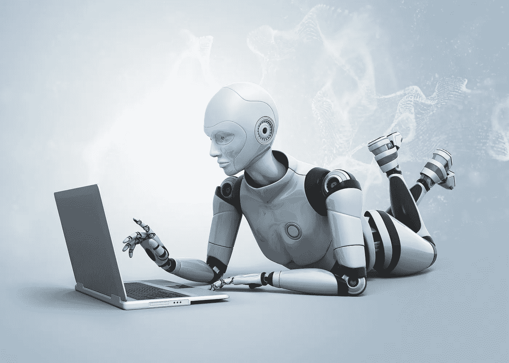

# 我们现在都是电子人了，这没关系…

> 原文：<https://medium.com/hackernoon/we-re-all-cyborgs-now-and-that-is-ok-6da1e705df78>

*作者 Jason Merkoski，* [创始人，*成为永远的我*](http://www.beForeverme.com) *本文原载于 2016 年 1 月 26 日*成为永远的我 [*博客*](http://www.beforeverme.com/blog/)

我们正处于个人讲故事和生活直播体验的进化边缘——将它们从生活黑客和研究科学家的有限领域转移到广泛的主流消费者接受和使用。

我相信新的消费技术已经改变了我们的生活，让我们的生活变得比以前更人性化。越来越小型化的可穿戴设备实时传输和捕捉的数据将使我们能够自动捕捉最真实的生活故事，而无需我们自己写或编辑一个词，或拍摄一张照片或视频。现在，我们正在进入一个个人叙事的新时代，我们的故事可以立即访问和搜索，持久和永久，引人入胜和邀请，启示和情感。

# 我对可穿戴消费技术的热爱

有了我的 iPhone、可穿戴蓝牙麦克风、微软 Band、叙事相机和 GoPro，我就像一个带着离散配件的电子人一样度过了我的一天——至少与前面提到的先驱相比是这样。我个人的兴趣是使用这 5 种设备来帮助我尽可能多地捕捉关于我的生活、我关心的人和我周围的世界的一切——每天尽可能自动地数字化。

有了它的 12 个传感器，我可以使用我的蓝牙微软手环来了解我的身体和我周围的世界。我最常使用它来无线传输我每晚的睡眠习惯到我的 iPhone，我把它放在我的床垫下。我的手机上有一个应用程序，可以监控我睡觉时翻来覆去的次数，并对床垫的压力变化很敏感。

我脖子上戴着一个蓝牙麦克风，看起来像一个时尚的银色狗牌。当我开始一天的工作时，它会忠实地记录我要说的话，并定期将记录上传到云端。我从来不需要去想它或者做任何事情来开始行动。只要我说话，它就会记录下来，每当我暂停时，它就会暂停。

我的叙事剪辑相机是我两年前在 Kickstarter 上订购的一个很酷的设备。这是一个简单的不显眼的别针，别在衬衫的翻领或衣领上。微型内置相机每 30 秒自动从我的角度拍摄一张照片，无论我在看什么。

当然还有我信赖的 GoPro。通常被攀岩者、冲浪者和极限运动爱好者使用，我把它用于更普通的目的——全天拍摄我的视频。我把相机架在房子里四个三脚架中的一个上，想说什么就说什么。如果我去外面的吊床上，我会带上 GoPro。如果我去慢跑，我会把它安装在一个头带上，这样它就可以鸟瞰周围的地形。如果我骑摩托车去兜风，我有一个坐骑，我可以在开车的时候把它对准我。

# 现在我们都是数据领域的公民

虽然我个人每年用这些设备创建的 2tb 的数据可能会让我处于前沿，但世界其他地方并没有落后太多。

相机和录音机、生物识别和生命记录设备的采用率每年至少增长 50%。这意味着越来越多的人使用这种设备来获取自己的数据。这些数据体现了他们的个人故事，流传并发布到互联网上。每个人都会比你意识到的更快地产生大规模的个人数据。这一切都将自动发生，无需你动一动手指。

随着我们都成为“数字数据原生者”，新技术驱动的能力将对自动生成的视频、照片和音频剪辑的数据带来秩序、意义和价值至关重要。数字故事和生活捕捉发展的这一阶段与早期努力的区别将在于深层背景的分层，以实现有意义的搜索、检索和互动——现在和未来几代人都是如此。其中包括:

*   录制内容的自动化元数据标记将实现远远超过手动标记的深度索引。
*   算法将用于在后台执行“上下文挖掘”,为我们的个人数据和故事仪表板添加一个全新的细微差别和参与层。
*   搜索和互动将由语音控制驱动，对话式搜索将提供与传统文本搜索完全不同的体验。

当谈到可穿戴消费技术时，社会和心理变化也伴随着技术变化。随着时间的推移，人们对隐私的态度也在不断变化，这一点在技术日益小型化的支持下尤其如此。当谈到自我记录和记录比以前感觉更像间谍活动时，人们变得更加宽容和接受。随着时间的推移，当我们遇到佩戴可穿戴设备的人时，我们甚至可能会形成一套全新的社交提示。当然，当我们都穿着它们时，这种情况又会发生变化。

# 不久的将来是人文主义，而不是自恋

科技和社会的变化让我们这些非常关注消费技术在个人数字讲故事中的应用，以及叙事和记忆的记录和保存的人产生了浓厚的兴趣。

每天醒来时，我的灵感都来自于帮助创造一个世界，在这个世界上，我们可以花时间去过真实的生活故事，而不是浪费时间去策划、编辑这些故事，把它们变成虚假的个人形象。如今，新兴的可穿戴消费技术飞速发展，推动了这种变化的很大一部分。这种技术能够以更流畅、更自然的录音体验，以不引人注目的方式收集故事(数据)。这实际上改善了而不是打乱了日常生活。展望未来，我们很快就能利用所有这些设备自动生成的巨大数据仓库，创建我们生活的仪表板，我对此也感到很兴奋。

在这个世界上，我们的故事讲的是人文主义，而不是自恋。消费科技和有创造力的人会让这成为可能。

