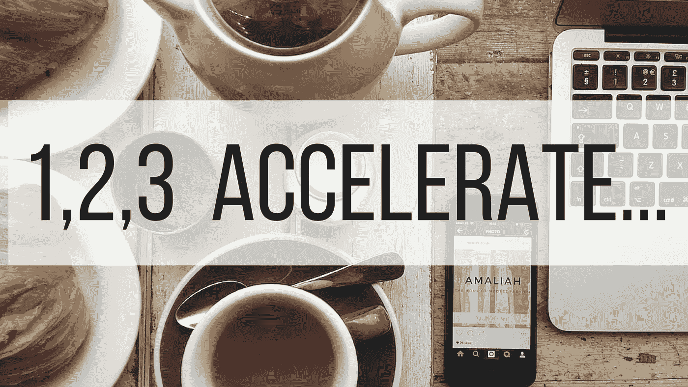
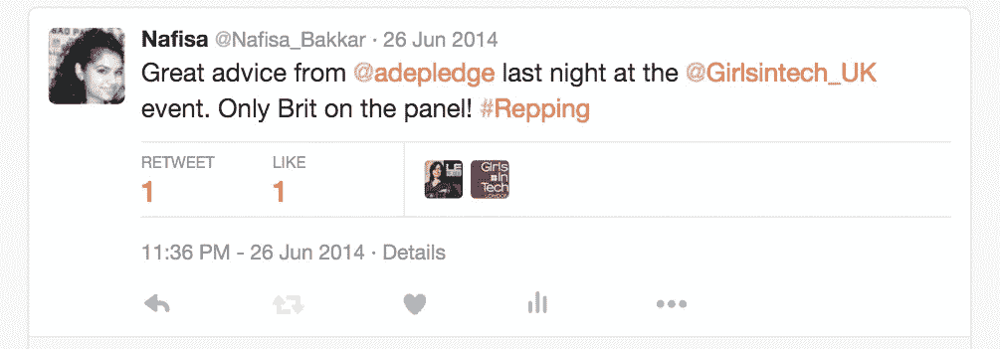

# 我们进去了。

> 原文：<https://medium.com/hackernoon/we-re-in-f2f5569f2aa5>

所以两个月前，我发现自己坐在我的前屋思考

# 我需要去找一份合适的工作。

我的姐姐和我正试图在我的前屋开一家 T2 创业公司。我从来没有过真正的“职业生涯”，只有大量的实习机会，所以我怎么可能不仅要创办一家公司，还要发展和维持它呢？！！？！？

这不是信任危机，这是一个逻辑思维过程，我真的没准备好。也许“他们”是对的。也许我需要先去获得行业经验。

然后就在第二天我遇到了 [**保罗·史密斯**](/@paul_a_smith) 。Ignite Accelerator 的首席执行官。我去寻求建议，我想应该是“当你寻求建议时，你会得到钱”这句话。在这种情况下，当你要钱的时候，你会得到建议。

向保罗投球后，他问道:“我能为你做些什么？”

**我:**告诉我我们需要做些什么来为加速器做好准备，我们需要做些什么来被考虑，以便我们可以朝着它努力。

保罗:我现在会考虑你。(他补充道，如果你同意的话？显然我不得不考虑它)

两周后，我参加了 ignite 的面试。3 个面板。其中一个是 Alex Depledge，她可能不知道，我已经跟踪了她一段时间，所以我是一个小小的创业追星族，是这样吗？两年前，我第一次在巴克莱加速器的“科技女孩”小组上看到她。她是小组中唯一的英国人，她直言不讳的天性让我想知道更多。我想你可以说她在招呼我。

最疯狂的是，我在网上看了 Ignite 的申请表后说，我们还没准备好，我们做这个还为时过早。那是一场信任危机。我写这篇文章的原因不是自吹自擂(嗯，可能有点)，而是想说

# 不要放弃。

是的，我们没有成功，但是我们比昨天走得更远了。我们听到的每一个“是”都离创造我们的愿景更近了一步。我越来越意识到，成功创业的几率取决于韧性。当数据、现实和你周围的人告诉你放弃的时候，你要坚持下去。继续前进。请不要放弃你的想法或梦想。这不是不可能的。这太难了。哦，永远去做你认为你做不到的事情。我永远不会告诉自己我不行。说到这里，我准备申请在网络峰会上发表关于印度或穆斯林市场的演讲。祝我好运。几率很低，但从现在开始，我将永远志存高远。

去找 it 人员吧。

> [黑客中午](http://bit.ly/Hackernoon)是黑客如何开始他们的下午。我们是 [@AMI](http://bit.ly/atAMIatAMI) 家庭的一员。我们现在[接受投稿](http://bit.ly/hackernoonsubmission)并乐意[讨论广告&赞助](mailto:partners@amipublications.com)机会。
> 
> 如果你喜欢这个故事，我们推荐你阅读我们的[最新科技故事](http://bit.ly/hackernoonlatestt)和[趋势科技故事](https://hackernoon.com/trending)。直到下一次，不要把世界的现实想当然！

