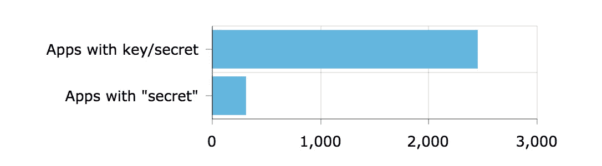
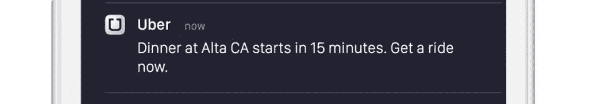
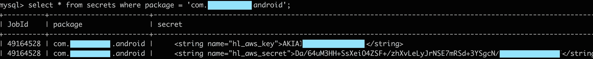
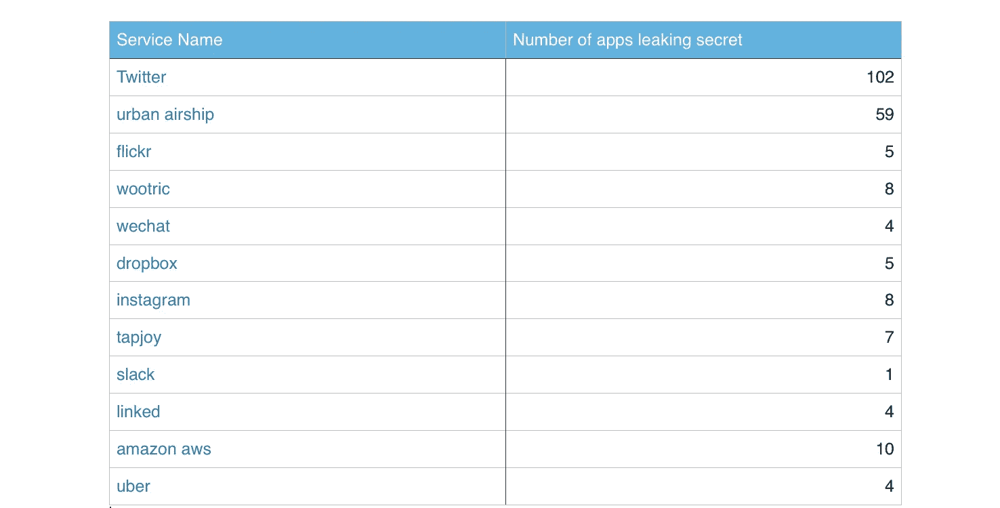

# 我们对 16k 应用程序进行了逆向工程，这是我们的发现

> 原文：<https://medium.com/hackernoon/we-reverse-engineered-16k-apps-heres-what-we-found-51bdf3b456bb>

2016 年 11 月，我们创建了一个在线工具来逆向工程任何 android 应用程序，以寻找秘密。这个工具是因为一个内部需求而构建的——我们经常被要求对我们的客户的应用程序进行逆向工程，以便从安全的角度对其进行检查。我们觉得这个过程可以自动化到我们可以创建一个任何人都可以使用的基于网络的工具。发布几个月后，用户已经逆向开发了大约 16，000 个应用程序，以下是一些有趣的发现。

Out of 16,000 apps — apps with keys or secrets

在 16，000 个应用程序中，大多数应用程序都没有任何密钥或秘密。大约 2500 个应用程序被发现在应用程序中硬编码了第三方服务的密钥或秘密。有些密钥是无害的，需要放在应用程序中，例如谷歌的 api 密钥，但也有很多 API 秘密，它们绝对不应该出现在应用程序中。有 304 个这样的应用程序。

这些秘密属于许多不同的第三方服务，例如优步的秘密可以用来通过优步应用程序发送应用程序内通知。

Sample reminder triggered using Uber API

此外，AWS 的秘密也硬编码在应用程序中。他们中的一些人拥有创建/删除实例的完全权限。

以下是一些热门服务的列表，它们的秘密都是在应用程序中发现的。

Popular services whose secrets were found

## 外卖食品

对于阅读本文的应用程序开发人员来说，每当您在应用程序中硬编码任何 API 密钥/令牌时，请仔细考虑您是否真的需要硬编码，在将其放入应用程序之前，了解 API 用法和令牌的读/写范围。

对于第三方服务，明确警告/指示开发者不要将这些秘密放在应用程序中。如果需要，创建多个具有不同范围的 API 秘密。

> [黑客中午](http://bit.ly/Hackernoon)是黑客如何开始他们的下午。我们是 [@AMI](http://bit.ly/atAMIatAMI) 家庭的一员。我们现在[接受投稿](http://bit.ly/hackernoonsubmission)并乐意[讨论广告&赞助](mailto:partners@amipublications.com)机会。
> 
> 如果你喜欢这个故事，我们推荐你阅读我们的[最新科技故事](http://bit.ly/hackernoonlatestt)和[趋势科技故事](https://hackernoon.com/trending)。直到下一次，不要把世界的现实想当然！

