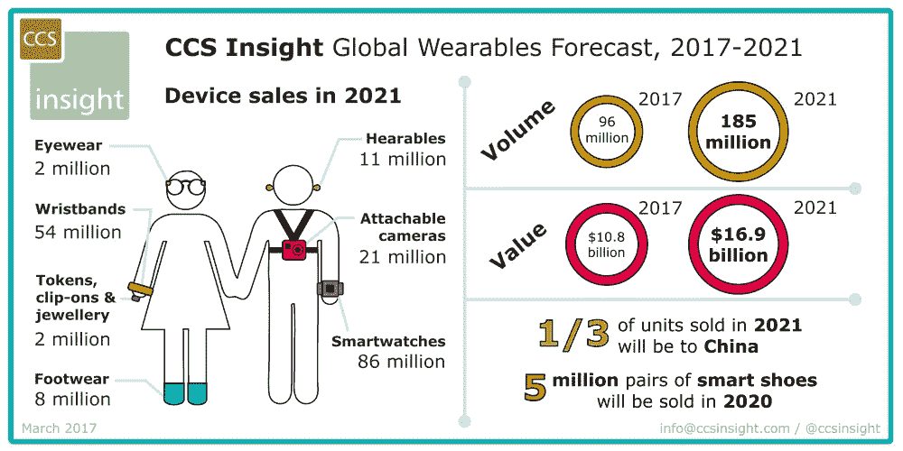

# 智能环境的可穿戴技术

> 原文：<https://medium.com/hackernoon/wearable-technologies-for-smart-environments-b55ee006a433>

> 由 [DataArt](https://www.dataart.com/industry/iot-and-m2m-solutions?utm_source=medium&utm_medium=social&utm_campaign=i-spring-2018) 的物联网主管 Igor Ilunin 撰写。

随着物联网(IoT)在我们的世界中迅速扩展，改善我们日常生活的可能性呈指数级增长。可穿戴设备的日益流行是对这一发展的理想补充，它有可能以多种令人兴奋且极具价值的方式与智能环境互动。

虽然家庭中的智能电器相对较新，但它们的使用正在快速增长，预计这一趋势将在未来几年继续显著扩大。可穿戴设备可以用来无缝连接到智能环境，让消费者节省大量时间。例如，许多人喜欢在看电视时把灯光调暗。当用户打开电视时，可穿戴设备可以用来自动调节房间内连接的 LED 灯的亮度，在没有任何人工干预的情况下提供完美的氛围。这一概念可以在智能家居中进一步推广，根据一天中的时间和阳光量，通过阻挡从窗户进入的光线在电视屏幕上产生眩光，从而创造出观看您最喜爱的电视节目或电影的完美环境。

这确实只是在不太遥远的将来有望实现的许多想法中的一个。另一个令人兴奋的概念是已经流行的可穿戴健康监测器的扩展。想象一个俱乐部，舞池里有一大群人。如果每个人都戴着复杂的设备，DJ 可以访问人群中所有人的心率，以帮助确定他们最容易接受的整体音乐，或者评估已经播放的音乐对俱乐部观众的影响。如果这对你来说还不够革命性，想象一下如果场馆可以利用可穿戴设备的数据让每个人同步跳舞，使用加速度计来协调你和俱乐部其他人的运动。这些只是这些日子里流传的一些创新想法，而可能性实际上是无限的。

物联网是关于连接的，而可穿戴设备是这项技术在我们的社区中扩展的关键之一。考虑到技术分析公司 CCS Insight 的预测，今年将售出 9500 万台可穿戴设备，到 2021 年将增加到 1.85 亿台，消费者和企业显然正在快速加入进来。这一令人印象深刻的增长，加上持续的物联网创新和发展，表明连接智能环境的可穿戴设备的未来即将到来。