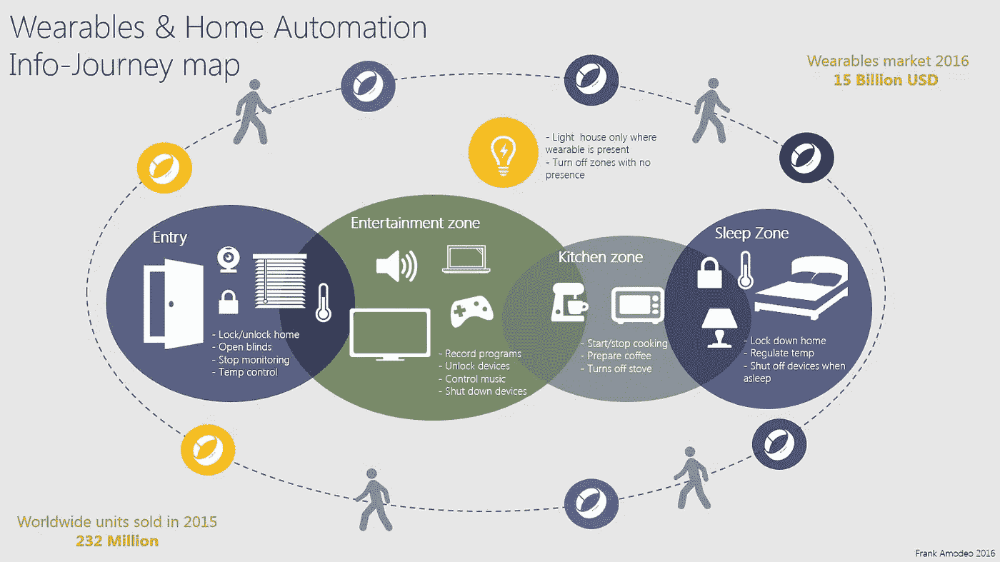

# 可穿戴设备和家庭自动化

> 原文：<https://medium.com/hackernoon/wearables-home-automation-a958e30dc7c8>

> “我们如何更好地利用可穿戴技术？”

每年我们都会接触到一系列新的[可穿戴](https://hackernoon.com/tagged/wearable)技术。每一个都承诺有更多的传感器和功能。几乎每一家公司都承诺提供一种可以监控并为您提供可操作数据的设备。当然，它可以跟踪我们的脚步、心跳、睡眠，现在还可以跟踪聊天、电子邮件和提醒。然而，它仍然不够令人信服。来自[奋进伙伴](http://endeavourpartners.net/white-papers/)的一份报告称，仅 6 个月后，三分之一的消费者就放弃了可穿戴设备。那么，我们如何从我们的可穿戴[技术](https://hackernoon.com/tagged/technology)中获得更多呢？

在我们开始扩充之前，让我们简单地谈谈今天的可穿戴市场。首先，它很大，而且越来越大。预计到 2017 年，TAM 将达到 150 亿美元。2016 年，智能手表、健身带和其他随身设备的全球销量有望达到 3.22 亿部。考虑到有问题的使用率和废弃率，这是一些严重的数字。很明显，对一种能够通知、跟踪和响应我们身体的设备有很大的需求。

可穿戴设备提供个性化可操作健康和健身建议的那一天很快就会到来。

与此同时，这些都是小设备，长时间佩戴舒适，通常使用简单的用户界面。它们可以用于其他用途。今天，我建议我们将这种应用扩展到家庭自动化。我相信他们在这一领域有独特的价值主张，因为他们大部分时间都是 24x7 全天候与我们合作。

> “2016 年，健身手环和其他随身设备的全球销量有望达到 3.22 亿台。”

# 可穿戴时代的生活

上面的信息图/旅程图展示了可穿戴设备及其佩戴者的一天生活。乐队带着你穿越不同的空间(区域),每个空间都有独特的技术，乐队可以手动或自动与之互动。场景示例:当你走近公寓时，门开了，百叶窗嗖的一声打开了。灯光的开启取决于你的位置和一天中的时间(添加心率，为每种情绪提供不同的照明)。温度控制根据您的腕带皮肤传感器(如果有)进行调整。你把手伸向你的手机/笔记本电脑/平板电脑，它会解锁以供使用，当你用完它时会再次锁定。如果某项活动需要操作，请轻触乐队来更改正在播放的歌曲或电影。当您离开该区域时，照明和电器会关闭，以节省宝贵的电力。当您晚上睡觉时，照明、安全和温度控制会自动启动。早上，类似的场景会发生，特定的需求会得到满足，比如煮咖啡，出门上班时锁好门。

这个流程示例只是这些强大的可穿戴设备与我们的家用电器结合使用的开始。我相信你能想出更多的主意。

弗兰克·阿莫多奥 2016 年 2 月

> [黑客中午](http://bit.ly/Hackernoon)是黑客如何开始他们的下午。我们是 [@AMI](http://bit.ly/atAMIatAMI) 家庭的一员。我们现在[接受投稿](http://bit.ly/hackernoonsubmission)，并乐意[讨论广告&赞助](mailto:partners@amipublications.com)机会。
> 
> 如果你喜欢这个故事，我们推荐你阅读我们的[最新科技故事](http://bit.ly/hackernoonlatestt)和[趋势科技故事](https://hackernoon.com/trending)。直到下一次，不要把世界的现实想当然！

