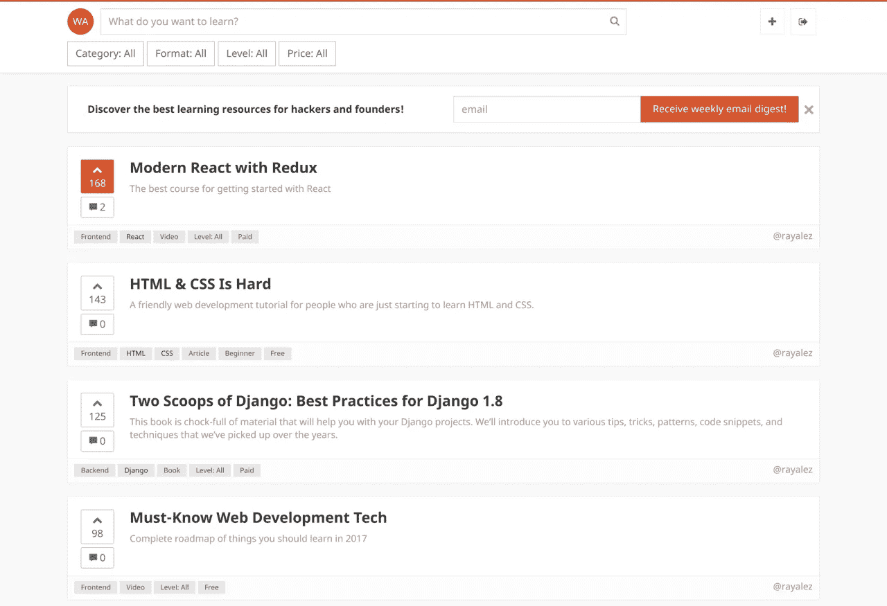

# 网络学院

> 原文：<https://medium.com/hackernoon/web-academy-bba87365c905>

## 为网络开发人员和初创公司创始人发现最好的学习资源

我刚刚启动了一个新项目——[http://web academy . io](http://webacademy.io)。我们的目的是帮助人们学习 Web 开发——我想收集所有最棒的学习资源，并让发现它们变得容易。我想你们会发现它很有用！

该项目是开源的，你可以在这里找到回购。

我真的为它的结果感到自豪，但我想继续努力，改进它，直到它绝对令人敬畏。如果你有任何反馈/建议/想法，请在评论中留下，它们真的可以帮助我改进这个项目！

> [黑客中午](http://bit.ly/Hackernoon)是黑客如何开始他们的下午。我们是 [@AMI](http://bit.ly/atAMIatAMI) 家庭的一员。我们现在[接受投稿](http://bit.ly/hackernoonsubmission)并乐意[讨论广告&赞助](mailto:partners@amipublications.com)机会。
> 
> 如果你喜欢这个故事，我们推荐你阅读我们的[最新科技故事](http://bit.ly/hackernoonlatestt)和[趋势科技故事](https://hackernoon.com/trending)。直到下一次，不要把世界的现实想当然！

