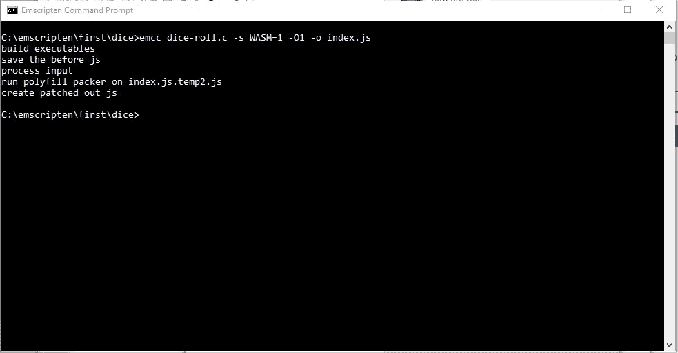
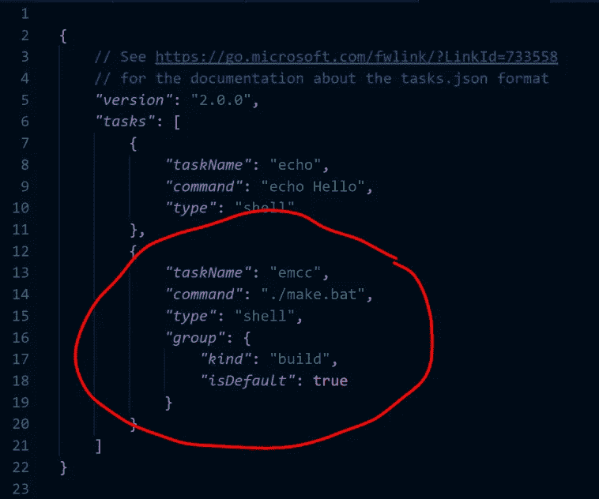

# 使用 Emscripten 和 VS 代码的 Web 程序集概念验证

> 原文：<https://medium.com/hackernoon/web-assembly-proof-of-concept-with-emscripten-vs-code-530e69eb4de0>

TL；DR:我对 Web Assembly 感兴趣有一段时间了，最后坐下来做了一点概念验证，看看我能走多远。我对这个结果感到高兴和鼓舞。

您可能会发现这对您自己的研究很有用。

# 上蜡历史

如果你只是想得到技术位，跳过这一节。

我对用除了 JavaScript 之外的语言编写 web 应用的潜力越来越感兴趣。当然，这已经发生了。我没有用普通的 JS 写过任何重要的东西，因为…我不确定。我清楚地记得在 2013 年用普通 JS 写了一个应用程序(！)就这样。

从那以后，我开始从事[打字稿](https://hackernoon.com/tagged/typescript)的工作。我很喜欢 TS(我最近[出版了一本关于它的免费书籍](https://goo.gl/fk12K2)，但是说到底，它基本上只是 JavaScript，不足以[改善我对 SmallTalk 的嫉妒](https://hackernoon.com/the-wonderful-consequences-of-javascript-as-the-virtual-machine-language-of-the-web-3a65cbf887fa):)。我玩了一下[闭包](https://clojurescript.org/guides/quick-start)，但是我被这篇关于系统程序员的[*有趣的文章转移了话题。你真的应该现在就看。](https://www.usenix.org/system/files/1311_05-08_mickens.pdf)

说真的。就[去读吧](https://www.usenix.org/system/files/1311_05-08_mickens.pdf)。

我是一个自学成才的 C 程序员，从 Kernighan 和 Ritchie 的开创性著作(第一版，不算少)的第一版中学习。大约 20 年前，我买了 Borland 的 C++编译器并开始使用。这些天我离那些根很远:(。不要误解我——我喜欢我所做的事情，但是如此直接地与记忆一起工作并且如此接近硬件真的很有趣和令人兴奋。

因此，这篇有趣的文章让我想起了那些有趣的日子，我决定看看编写 C/C++代码并将其作为 web 应用程序的一部分进行部署是否可行。

# 概念验证

我是从查《web 组装教程》开始的，偶然看到这篇文章:[https://tutorial zine . com/2017/06/getting-started-with-web-assembly](https://tutorialzine.com/2017/06/getting-started-with-web-assembly)

这篇文章在很大程度上起了作用，但我认为一些底层基础设施已经发生了变化。我必须在 JavaScript 方面做一些改动，才能让这篇文章的代码正常工作。然后我把它延长了一点。

我在 windows 10 笔记本电脑上完成了所有这些工作。

这是在高层次上发生的事情:

*   你生成一些 Wasm 代码。Wasm 是一些浏览器可以理解的二进制格式。在我写这篇文章的时候，Chrome 可以加载和使用 WASM。其他人也可以，但我只用过 Chrome。
*   您可以通过各种方式生成 Wasm 二进制文件。我选择了使用 [Emscripten](http://kripken.github.io/emscripten-site/index.html) 。我认为还有其他选择。
*   Emscripten 将获取您的 C 或 C++代码，编译它并为您生成 Wasm 二进制文件。我确信这不仅仅需要*任何* C/C++代码。我不知道这些界限是什么。
*   Emscripten 还生成了大量的 JavaScript。TutorialZine 文章的作者将其称为“胶水代码”。此外，这个生成的 JS 知道如何加载和启动 Wasm 二进制文件。它还为您提供了许多生命周期挂钩。加载和初始化过程异步运行。我使用其中一个钩子宣布(通过一个普通的 JS 事件)我的 C 代码已经可以投入使用了。
*   一旦它被加载，你就像调用普通的 JS 函数一样调用你的 C/C++例程。您的 C 代码可以调用您的 JavaScript 函数，您甚至可以让您的 C 代码调用一个 JS 函数来调用另一个 C 函数。为什么这么做？当然是为了纯粹的快乐！

# 步骤 1:安装 Emscripten

我发现这很容易，也不需要很长时间。到这里:[https://kri pken . github . io/EMS cripten-site/docs/getting _ started/downloads . html](https://kripken.github.io/emscripten-site/docs/getting_started/downloads.html)。

使用 web 安装程序。

等一会儿就好了。

# 第二步:写一些 C 代码

我使用 TutorialZine 代码作为测试的基础，并添加了一点:

如您所见，第 8 行有一个常规的 C main()函数。

还有三个附加功能:

*   roll_dice:这是来自 TutorialZine 的文章。它产生一个从 1 到 6 的随机数。当用户点击 CSS 渲染的骰子并根据结果重新绘制自己时，JS UI 调用这个。
*   请注意这里有一个标记，EMSCRIPTEN_KEEPALIVE。我不完全确定这是如何工作的，但是…它基本上保持了后加载的功能。如果你没有用这个标记来修饰你的函数，你就不能从 JavaScript 调用它。
*   我有一个函数，sayHi()。这个做了几件事:

1.  第 19 行:emscripten _ run _ script(" console . log(' hi3！)");emscript_run_script 执行相关的 JavaScript。
2.  在第 20 行，它调用函数 _sayXyzzy()。_sayXyzzy 实际上是 C 程序中的另一个函数，它只是注销到控制台，“Xyzzy”(同样，通过 emscripten_run_script —参见代码中的第 24 行)。

它做得不多，但对于这个循序渐进的概念验证来说已经足够好了。

# 编译 C 代码

我是通过 Emscripten 命令行(web 安装程序的一部分)开始这样做的，非常简单:

You can always tell those developers who come from the ee cummings branch of CompSci.

我第一次运行该命令时，它进行了大量的初始化，并出现了一些可怕的警告。然而，一切都解决了。我觉得其实就是编译一堆标准 C 库，可能先下载。后续运行看起来像上面的截图。

您应该阅读完整的 Emscripten 文档，了解有关选项的详细信息。这个命令编译一个 C 文件，dice-roll.c。它生成一个 WASM 文件(WASM=1)。它只做很少的优化(-O1 —注意，O 代表优化，0 代表零)。它还生成了那个 glue JS 文件，并将其命名为“index.js”。

此后不久，我就转而使用 VS 代码。VS Code 告诉我有一个插件可以查看 C/C++文件，我安装了这个插件。然后，我为上述内容创建了一个任务。我最终用实际命令创建了一个. bat 文件。My tasks.json 看起来是这样的:

# 让它在浏览器中工作

让它在 Chrome 中工作非常简单。只是创建一个准系统。html 文件(如 index.html ),并包含 emcc 命令在前面步骤中生成的 index.js 文件。

那个 index.js 文件是……什么的:)。在我的 env 里，有 6111 行长:)。这不是很好的记录，但足以帮助我找出。这是一个很好的起点:[https://kri pken . github . io/emscripten-site/docs/API _ reference/module . html # module](https://kripken.github.io/emscripten-site/docs/api_reference/module.html#module)。

在大约 1000 个其他东西中，它加载 Wasm 文件并创建一个全局可用的对象 Module。事实上，如果您已经创建了模块，它是模块的补充。我认为你总是想这样做，这样你就可以影响初始化的生命周期。

这个 index.js plus 模块对象允许我做几件重要的事情:

*   首先加载 Wasm
*   将函数添加到模块的“postRun”数组中。一旦 Wasm 被加载和初始化，index.js 初始化代码就运行这些 postRun 函数。
*   提供了一个有用的包装器，让我调用 C 代码函数。

这是我的 HTML:

很多都是直接来自 TutorialZine 的文章。我通过添加对“prerun.js”的引用进行了修改。

Emscripten 创建了 index.js 文件(第 18 行),这就是 6100 行的胶水怪物。

剩下的来自 TutorialZine。它引用了一些在显示骰子方面做得很好的 CSS。它在 click 上添加了一个事件监听器，调度一个匿名函数调用第 31 行的 C 代码:

> *var* 结果=模块。_ roll _ dice()；

如果您还记得，实际的 C 函数的名称是 roll_dice(没有前导下划线)。Emscripten index.js 文件用所有 C 函数填充 Module 对象(记住它们必须用那个 EMSCRIPTEN_KEEPALIVE 标记来修饰)。本质上，这些是代理 JavaScript 函数。Emscripten 在 C 函数的名称前插入一个下划线。如果你的 C 代码中有函数“somawesomefunction”，那么 JS 模块对象将有一个函数，_ someAwesomeFunction()供你在需要时调用。

第 21 行实际上抛出了一个运行时错误。That _sayHi() JS 函数，它是 C 中 sayHi()函数的代理，现在还不存在。index.js 文件异步工作。它最终是可用的，当我开始点击骰子时，它确实可用了。第 33 行从不失败，但第 21 行总是失败。

很明显想知道 C 代码什么时候能用。这就是“prerun.js”发挥作用的地方。

下面是从第 17 行加载的 prerun.js:

第一行，我定义了一个空的模块对象。

然后我定义了几个函数(sayAbc()、sayXyz()、sayInit())。

当 index.js 粘合代码执行时，它将补充已经存在的模块对象，或者创建一个新的模块对象。在这种情况下，我已经创建了它，所以它补充它。

事实上，它不仅仅是补充。我可以通过提供一些在特定时间执行的函数来影响模块的生命周期，比如 preRun[]、onInit[]、postRun[]，甚至更多。在线文档为我指明了方向，postRun[]是我能够可靠地开始运行我的 C 代码的地方。

你可以看到我在第 18 行有一个函数 notifyReady()。它只是创建一个事件并将其发布到窗口对象上。

在第 25 行，我有一个事件监听器。当它获得事件时，它记录一条快乐的消息，然后调用模块。_sayHi()。

我在第 23 行的 postRun[]数组中添加了两个函数。

# 总结

当你像这样详细地把它拼写出来时，可能会觉得有点难以理解，但实际上并没有那么复杂。

1.  安装 Emscripten。
2.  写点 C 代码。
3.  用某种构建过程来 emcc 你的 C 代码。当然，有一百万种方法可以做到这一点。
4.  使用生成的 JS“glue”代码来加载和处理 Wasm。
5.  利用生命周期数组钩子来安全地执行 C 函数。

一旦我得到了基本的工具，这是小菜一碟。编辑我的 C 文件，按 control-shift-B。等待，然后在浏览器上按 F5。

(关于浏览器的快速说明—您需要使用一个真正的 web 服务器，因为 Wasm 文件是通过 fetch()d/XHR 处理的。Chrome 不会让你无法通过 file://协议从文件系统中获取文件，所以你需要一个真正的 web 服务器来做这件事。我用[菲尼克斯](http://fenixwebserver.com/)来处理这类事情——它简单得可笑。).

就是这样！在这一点上，这似乎是一个非常可行的尝试。我不完全确定下一步去哪里。我想我可能会尝试实现一个奇特的排序算法，并与普通的 JS 进行一些比较/对比。

我最近出版了一本关于 TypeScript 的书！这是免费的，你可以在这里获得:[https://www . git book . com/book/pagal vin/yet-another-typescript-book/details](https://www.gitbook.com/book/pagalvin/yet-another-typescript-book/details)