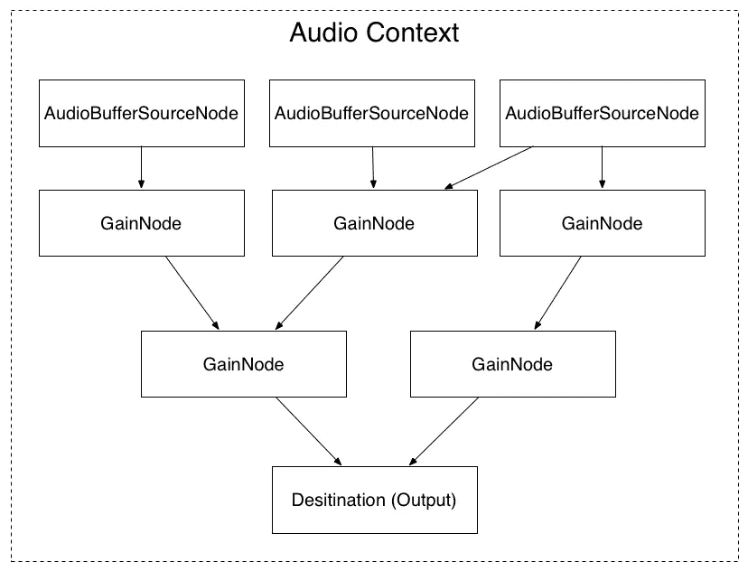
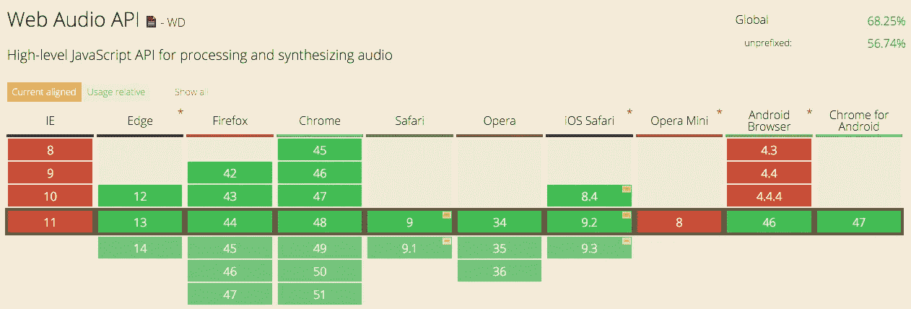

# 网络音频 API 系列 1 —简介

> 原文：<https://medium.com/hackernoon/web-audio-api-series-1-introduction-d073fca62e1d>



您也可以在以下网址找到我:

我的博客:[http://haochuan.io/](http://haochuan.io/)

github:【https://github.com/haochuan 

在本 *Web Audio API 系列*中，我们将介绍如何在 Web 浏览器中处理和合成声音，将涵盖 Web Audio API 80%以上的特性，以及一些乐理、音频、声音、信号处理的基础常识:

*   **简介**
*   **合成基础知识**

1.  4 个不同的声音单元
2.  时机和节奏
3.  基本音阶和和弦
4.  信封
5.  过滤

*   **音频**

1.  解码和回放
2.  样品
3.  绘制时域波形
4.  绘制频域频谱

*   **音效**

1.  颤音
2.  过驱动/失真
3.  情商
4.  耽搁
5.  混响

## 什么是网络音频 API

Web Audio API 是一个高级 JavaScript API，用于在 Web 应用程序中处理和合成音频。该 API 的目标是包含现代游戏音频引擎中的功能，以及现代桌面音频制作应用程序中的一些混合、处理和过滤任务。接下来是使用这个强大 API 的简单介绍。你可以在网络音频 API 文档中找到更多细节:[http://webaudio.github.io/web-audio-api/](http://webaudio.github.io/web-audio-api/)

## 网络音频 API 和 HTML5 音频标签的区别

HTML5 `audio '标签为开发人员提供了一种处理基本音频播放功能(加载、播放、暂停、停止)以及音量控制器的方法。然而，网络音频 API 用于在网络浏览器中处理和合成音频。假设你是一个吉他手，你可能需要一些吉他效果踏板(overdrive，delay，reverb)来获得你喜欢的摇滚声音，这正是 Web Auiod API 在浏览器中的作用。

*   例:[纯电吉他声]([https://soundcloud.com/haochuan/guitar1?in = Hao chuan/sets/test-1/s-pqdGV](https://soundcloud.com/haochuan/guitar1?in=haochuan/sets/test-1/s-pqdGV)
*   例子:【带混响效果的电吉他声】([https://soundcloud.com/haochuan/reverb?in = Hao chuan/sets/test-1/s-pqdGV](https://soundcloud.com/haochuan/reverb?in=haochuan/sets/test-1/s-pqdGV)
*   例子:[带有低音合成器效果的电子吉他声]([https://soundcloud.com/haochuan/bass-synth?in = Hao chuan/sets/test-1/s-pqdGV](https://soundcloud.com/haochuan/bass-synth?in=haochuan/sets/test-1/s-pqdGV)

我想你可以从例子中得到大概的意思。使用 Web Audio API，如果我们有第一个示例的文件，我们可以编写自己的音频效果代码来生成示例 2 和 3 中的声音。

## 目前我们可以在哪里使用网络音频 API

目前所有的现代浏览器都支持网络音频 API，包括 Chrome、FireFox 和 Safari 的桌面版和移动版。



## 音频环境

*AudioContext* 是浏览器中所有神奇音频发生的地方。它是一个小容器，我们所有的声音都将在里面。它提供了对 Web Audio API 的访问，这反过来让我们可以访问一些非常强大的功能。下面是在浏览器中初始化全局 *AudioContext* 变量的 Javascript 代码。

```
var audioContext;
try {
   // Fix up for prefixing
   window.AudioContext = window.AudioContext||window.webkitAudioContext;
   audioContext = new AudioContext();
} catch(e) {
   alert(‘Web Audio API is not supported in this browser’);
}
```

## 音频节点

我们还是再举一个吉他手的例子。当演奏者想弹奏他的吉他时，他从他的吉他上取下一根导线，并将其连接到一个类似失真踏板的效果踏板上。然后，他将失真踏板的另一根导线连接到另一个效果或放大器。这使得声音从他的吉他中传出，经过处理，然后输出到扬声器，这样人们就可以听到他的摇滚即兴演奏。这正是网络音频 API 的工作方式。声音从一个节点传递到下一个节点，在最终输出到扬声器之前，声音会被处理。这里有一个基本的例子。

```
var node1 = audioContext.someFunction() // create first node (input)
var node2 = audioContext.someFunction(); // create second node
var node3 = audioContext.someFunction(); // create another node
node1.connect(node2);
node1.connect(node3);
node2.connect(audioContext.destination); // audioContext.destination is the system output
node3.connect(audioContext.destination); //
/*
node1 — — — node 2
 |            |
 |            |
 |            | 
node3 — — — destination
 */
```

仅此而已。如果你想了解更多细节，请在你喜欢的搜索引擎中搜索*网络音频 API* 。希望你喜欢，并在我的网络音频 API 系列的下一篇文章中看到你。