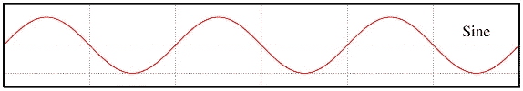
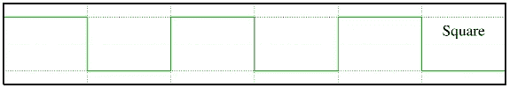
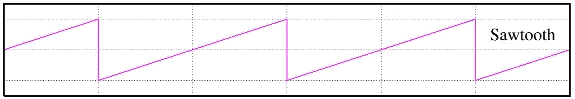
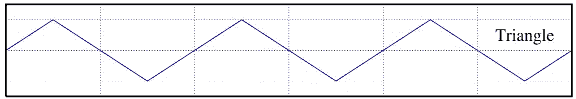

# 网络音频 API 系列 2 —振荡器

> 原文：<https://medium.com/hackernoon/web-audio-api-series-2-oscillator-d0fb38d0ca7c>

你也可以在下面找到我:

我的博客:http://haochuan.io/

github:[https://github.com/haochuan](https://github.com/haochuan)

在本 *Web Audio API 系列*中，我们将介绍如何在 Web 浏览器中处理和合成声音，这将涵盖 Web Audio API 超过 80%的特性，以及一些关于音乐理论、音频、声音和信号处理的基本常识:

*   **简介**
*   **合成基础**

1.  4 种不同的声音单位
2.  时机与节奏
3.  基本比例和弦
4.  信封
5.  过滤

*   **音响**

1.  解码和回放
2.  样品
3.  绘制时域波形
4.  绘制频域频谱

*   **音效**

1.  颤音
2.  过驱/失真
3.  情商
4.  耽搁
5.  混响

## 什么是振荡器

振荡器是产生重复振荡信号的电路。与音频滤波器和音频控制器一样，音频振荡器是现代模拟减法合成器所需的基本元件之一。

振荡器有两个基本参数:类型和频率。类型定义了声音的音调，而频率则意味着声音的音调。假设你在吉他和钢琴上同时演奏中间的 C 音，这两个声音的类型不同，但频率相同。

## 振荡器的四种波形

**正弦**



[440Hz 正弦波音频]([https://soundcloud.com/haochuan/sine/s-6bb9b?in =浩川/集/网络-音频-系列-osc/s-PgUGl](https://soundcloud.com/haochuan/sine/s-6bb9b?in=haochuan/sets/web-audio-series-osc/s-PgUGl) )

**广场**



[440Hz 方波音频]([https://soundcloud.com/haochuan/square/s-FtUUN?in =豪川/集/网络-音频-系列-osc/s-PgUGl](https://soundcloud.com/haochuan/square/s-FtUUN?in=haochuan/sets/web-audio-series-osc/s-PgUGl) )

**锯齿**



[440Hz 锯齿波音频]([https://soundcloud.com/haochuan/sawtooth/s-mT39a?in =豪川/集/网络-音频-系列-osc/s-PgUGl](https://soundcloud.com/haochuan/sawtooth/s-mT39a?in=haochuan/sets/web-audio-series-osc/s-PgUGl) )

**三角**



[440Hz 三角波音频]([https://soundcloud.com/haochuan/triangle/s-OTq6H?in =浩川/集/网络-音频-系列-osc/s-PgUGl](https://soundcloud.com/haochuan/triangle/s-OTq6H?in=haochuan/sets/web-audio-series-osc/s-PgUGl) )

## 网络音频 API 中的振荡器

Web Audio API 允许我们非常容易地生成振荡波形:*振荡器节点*接口表示周期性波形。

**创建振荡器节点**

*   audioContext.createOscillator()

请注意， *audioContext* 应该在初始化 Web Audio API 时创建为全局变量。

**属性**

*   振荡器节点.频率
*   振荡器节点类型

**方法**

*   振荡器节点. start()
*   振荡器节点. stop()

请注意，我已经列出了我们将在本教程中使用的一些属性和方法。你可以在【网络音频 API 文档】([http://webaudio.github.io/web-audio-api/](http://webaudio.github.io/web-audio-api/))中找到更多细节。

## 演示

我们在*网络音频 API 系列 1* 中谈到了*音频节点*连接。对于本振荡器演示，连接如下:

振荡器音频节点— -> audioContext.destination(系统输出)

还有一点需要说明的是，当我们试图改变振荡器音频节点的频率时，我们不能只做*` oscillator node . frequency = 100*`。原因是“frequency”是一个“AudioParam”*而不是一个“T20”数字*。设置新频率值的方法是使用“*振荡器节点.频率.值= 100* ”。

```
 // init web audio apivar audioContext;
try {
 // Fix up for prefixing
 window.AudioContext = window.AudioContext||window.webkitAudioContext;
 audioContext = new AudioContext();
} catch(e) {
 alert(‘Web Audio API is not supported in this browser’);
}// create a oscillator audio node
var oscNode = audioContext.createOscillator();
oscNode.type = ‘sine’; // sine, square, sawtooth, triangle// set a value in an AudioParam
oscNode.frequency.value = 440;// be sure to connect the osc node to destination before starting itoscNode.connect(audioContext.destination);oscNode.start(0); // start nowoscNode.stop(2); // stop in 2 seconds 
```

可以在这里查看现场试玩:【浩川的笔杆子】([http://codepen.io/haochuan/full/PZaEXo/](http://codepen.io/haochuan/full/PZaEXo/))

仅此而已。如果你想了解更多细节，请在你喜欢的搜索引擎中搜索*网络音频 API* 。希望你喜欢，并在我的网络音频 API 系列的下一篇文章中看到你。