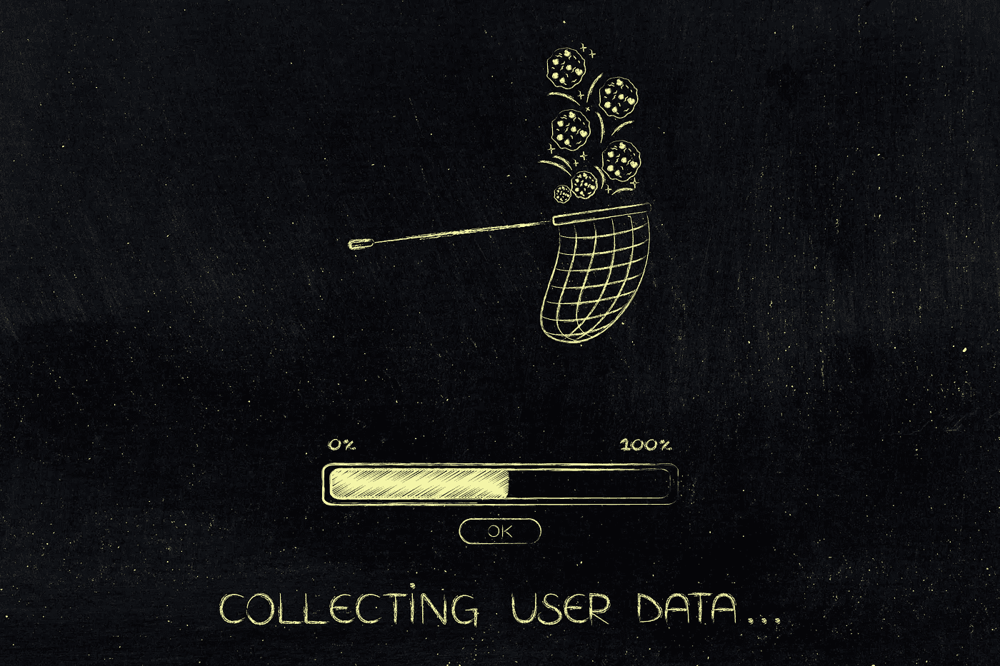
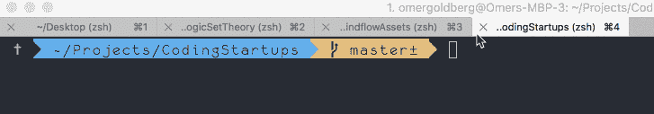
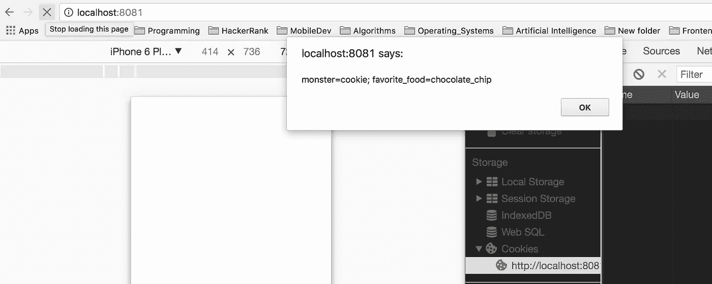
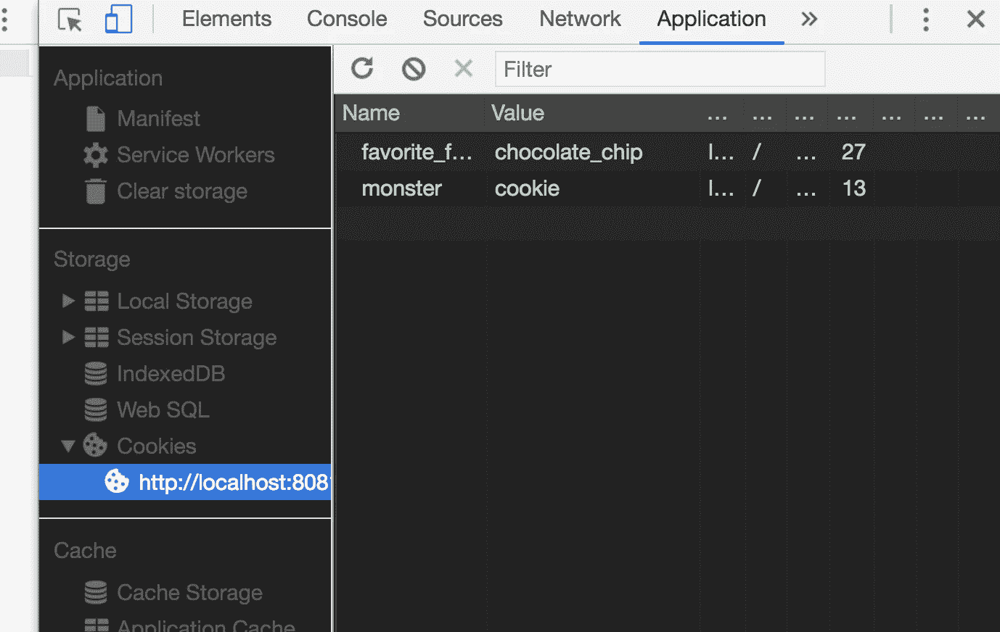
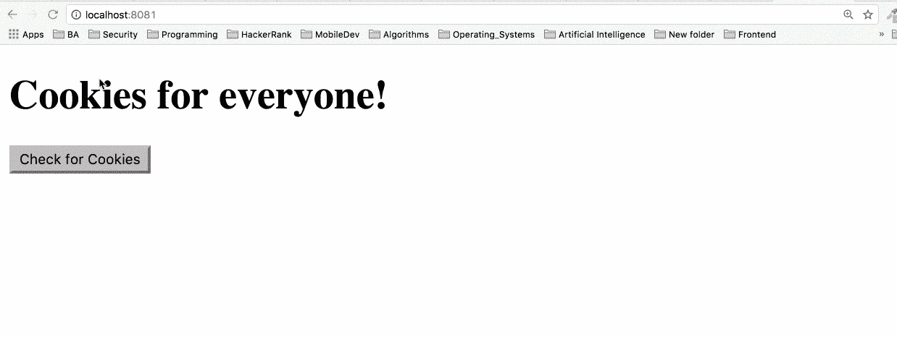
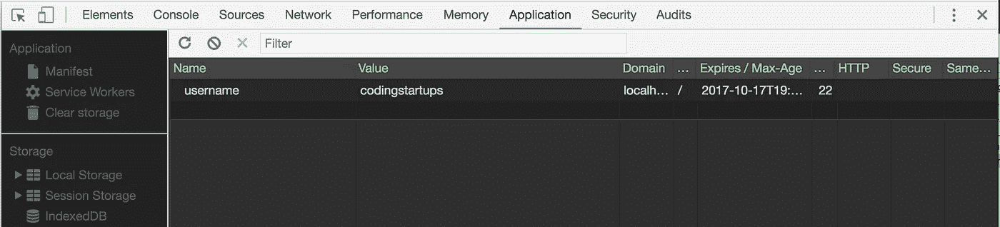

# 面向所有人的网络 Cookies

> 原文：<https://medium.com/hackernoon/web-cookies-for-everyone-a047a055419e>

网络行话！有时候很难跟上。最糟糕的是，那些本应简单的术语被随意使用，而你只是像这样坐在会议上。

Doctor Who like whaaaat?

网络曲奇绝对是其中之一。这篇文章的目的是以一种简单的方式解释网络 cookies。我们将关注核心概念，这样你以后可以在任何项目中应用它，不管你可能选择哪个框架或库。在这篇文章的结尾，你应该能够非常自信地区分真实的 cookie 和网络 cookie；)

# 饼干？！？你什么意思

web cookie 是由服务器发送到您的浏览器的一小段文本。cookies 的目的是携带一些有用的信息，这些信息是关于你和设置它们的网站之间的互动的。浏览器可以存储它并将它与下一个请求一起发送回同一个服务器。这样，服务器可以区分两个请求是否来自同一个浏览器。

Cookies 是特定于 web 浏览器的。因此，如果您使用不同的计算机，打开不同的浏览器或删除您的 cookie，网站将会把您视为第一次到达(并且会设置一个新的 cookie)。

# 饼干是用来做什么的？

Cookies 可用于各种原因:

1.  **记住你在网站上的设置。**比如你是先看最老的还是最新的评论；视频播放器的音量、你在某个帖子上停留的时间、你的购物车状态、游戏分数等等。

2.**了解你和其他用户是如何使用网站的。**例如，讲述当天最受欢迎的新闻故事。或者告诉你有多想要一张机票。邪恶！

3.**认证** **服务**如登录服务或确保您安全登录(这些 cookies 可能包含您的电子邮件地址和姓名等信息，这些信息是您在注册时提供的。您注册的网站是唯一可以访问此信息的网站。)

# 实践中的饼干

让我们通过设置我们的第一个 cookie 并在浏览器中检查它来开始查看实际情况。

需要注意的是，Chrome 浏览器不会存储来自本地网页的 cookies 集。因此，我们将设置一个简单的节点服务器，允许我们在 localhost 域下工作。要在本地工作，从这个 github repo 克隆 repo，并运行 npm install。然后导航到项目目录并运行

Call it maaagic

Simple Express Server

太好了！现在我们有了本地开发环境设置，可以开始玩 cookies 了。

让我们朝着类似真实生活场景的方向努力。假设我们想创建一个站点，在用户第一次访问时提示他/她输入自己的名字。当用户输入他的名字时，我们希望保存它(通过网络 cookie)，这样在用户下次访问时，我们可以给他们一个热烈的欢迎:)

下面是我们将在这个实验中使用的基本标记:

让我们从设置和获取最基本形式的 cookie 开始。

现在让我们重新启动服务器，这样我们就可以看到新的变化。瞧啊。

Our snazzy alert message

Viewing cookies via Chrome Developer tools

因此，当我们显示文档的 cookies 时，我们得到的内容几乎与我们设置的完全相同。有什么细微的区别？看到两个键值对之间的分号了吗？嗯（表示踌躇等）..我们没有明确地设置它。这是一个浏览器如何区分不同 cookies 的例子。通过添加一个分号！

# 获取、设置和检查 cookies 的方法

好吧，好吧。至此，我们已经看到 cookies 被内置到全局文档对象中。我们可以通过向 document 传递一个字符串键值对来设置它们。饼干。我们可以通过访问 *document.cookie* 来查看我们当前所有的网页 cookie。让我们通过创建一些 [Javascript](https://hackernoon.com/tagged/javascript) 方法，尝试构建一个更具伸缩性的获取和设置 cookies 的方法。

就像我们在上面的小例子中看到的，cookie 被保存为一个字符串并用分号分隔。因此，我们将使用一些内置的 Javascript 字符串方法来获取我们的 cookie。

*   [indexOf(str)](https://www.w3schools.com/Jsref/jsref_indexof.asp)
*   [子串(startIndex，endIndex)](https://www.w3schools.com/jsref/jsref_substring.asp)

# fetchCookie()

我们的第一个方法将检查我们的 cookie 中是否有一个带有*用户名*键的 cookie，如果存在就返回它。

# getUserData()

该方法将在浏览器中检查带有“用户名”关键字的 cookie。如果它存在，我们将欢迎用户。否则，我们会提示他/她输入他们的姓名。

# setCookie()

我们的 setter 方法将接受 3 个参数。密钥、值和截止日期。

# 现在都在一起

# 最后的结果

# 包扎

Cookies 是 web 开发的一个重要组成部分，也是我们作为消费者日常使用的东西。希望知道这在开发方面是如何工作的，能让你对一些你喜欢的网站的内部工作有更多的了解。

如果你想要一个大图视图，这里是我们的 GitHub 账户上的[完整代码。](https://github.com/CodingStartups/WebCookiesForAll)

如果你喜欢这个，别忘了鼓掌！👏 👏 👏

请随时关注我的 Instagram、T2、LinkedIn 或 T4 Github，我会定期在这些网站上发布创业和科技相关的内容。

这篇文章是使用令人惊叹的总结工具 [Mindflow.ai 创建的！](https://arieg419.wixsite.com/mindflow) [现在就报名加入 alpha 发布吧！](https://arieg419.wixsite.com/mindflow)

这篇文章最初发表在 [CodingStartups](https://codingstartups.com) 上。我们正在建立一个建设者社区，重点是教授帮助你一步到位的技能。订阅！

直到下一次✌️