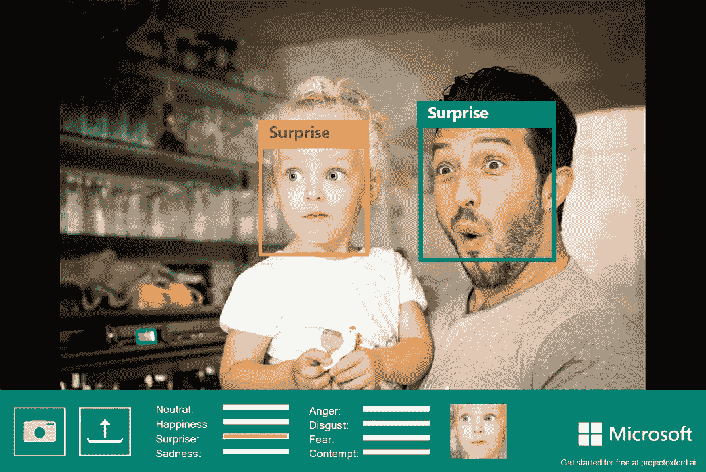
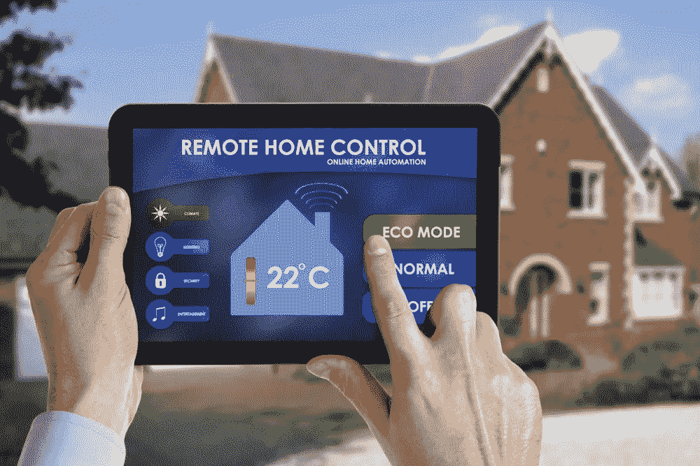
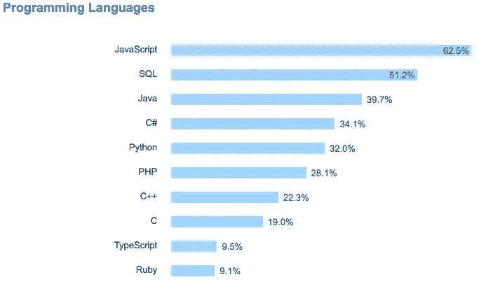
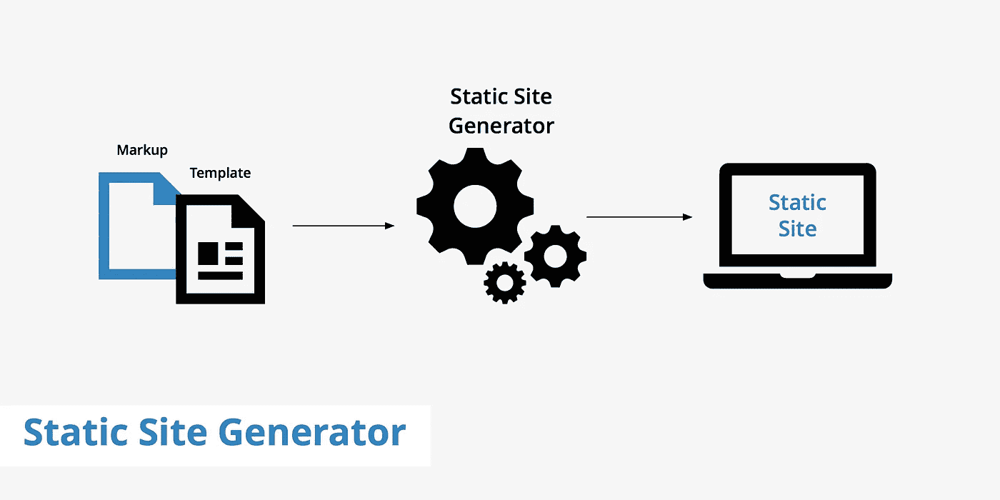
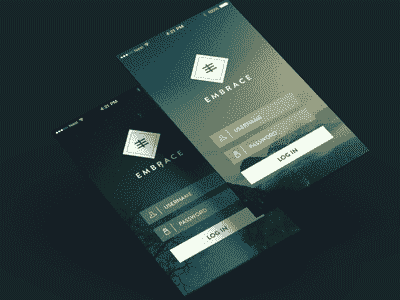

# 2017 年网络发展趋势

> 原文：<https://medium.com/hackernoon/web-development-trends-2017-387421cf9c23>

如今，Web 开发正以令人难以置信的速度发展，2016 年的热门趋势在今天将被视为过时。用户拥有了更多的控制权和权力，公司也在根据用户需求转移服务，这可能是不可预测的。在这篇文章中，我们将涵盖最大和最有前途的 web 开发趋势。

# 人工智能

人工智能正在动摇现代 IT 世界，各公司正在相互竞争，以雇佣和保留该行业最优秀的专业人员。由脸书和谷歌开创的人工智能如今被应用在越来越多的应用程序中，让设备更像人类一样思考和行动。基本的人工智能例子是人脸识别，它广泛应用于脸书照片标签。人工智能的重要性在于，它允许设备在没有人力的情况下独立工作，从而提高效率、准确性和整体更好的用户体验。

在 DashBouquet，我们最近体验了基于计算机视觉的广告技术解决方案。查看我们的[案例研究](https://hackernoon.com/case-study-dashbouquet-experience-in-computer-vision-based-ad-tech-solution-51cee02fd477)。

# 物联网

[**物联网**](https://hackernoon.com/the-most-promising-internet-of-things-trends-for-2018-10a852ccd189) 就是让设备变得智能，让它们能够相互通信。我们已经熟悉智能房屋，现在拥有越来越多的设备，使我们的生活变得更加轻松，并能够收集任何可以收集的数据。

至于网络开发，未来开发人员可能希望开发能够远程控制家用设备并有助于设备通信和数据分析的应用程序。

我们目前的一个项目基于物联网技术。我们将与您分享我们的案例研究。

# JavaScript 的崛起

JavaScript 自 2016 年以来一直在崛起，其快速增长允许开发者致力于聊天机器人、虚拟现实和许多其他趋势性的东西。

编写应用程序的语言语法和效率都得到了提高，总体而言，JS 现在是全栈开发人员中最受欢迎的语言。

查看我们关于 GitHub 上[最受欢迎的 JavaScript 项目的文章。](https://hackernoon.com/top-10-most-popular-javascript-projects-on-github-cc5152e6d4a1)

# 静态站点生成器

这些生成器能够从存储在文件而不是数据库中的文本创建网站。这减少了网站加载时间，提供了更好的安全性，并使内容和模板的部署更加容易。

在这里你可以找到 2017 年十大静态网站生成器的[列表。](https://www.netlify.com/blog/2017/05/25/top-ten-static-site-generators-of-2017/)

# 虚拟现实

我们通常会将虚拟现实与电子游戏联系在一起。然而，大玩家(如谷歌)已经开始致力于旨在帮助虚拟现实过渡到网络的 API。正如我们所说，市场需求旺盛，因此今年可能会给我们带来涉及虚拟现实的应用程序(例如，像房地产旅游)。这种创新可能会将用户体验提升到一个新的水平，并将成为公司强大的营销优势。

# GIFS

我们知道 gif 是在我们的信使和对话中使用的一种有趣和简单的方式，但是开发者想更进一步，在 web 应用中使用 gif 来更好地与用户互动。因为大多数人对视觉信息的感知要比纯文本好得多，所以如今视频非常受欢迎。然而，它们也很重，所以 gif 是吸引注意力同时讲述故事的完美方式。

# 蝇蛆病

我们已经习惯了无聊和老式的机器人，但 2017 年似乎让它们变得更好。现在，机器人打算变得更加个性化，以提供更好的用户体验，这也是一个巨大的营销优势。

机器人现在能够做出更“像人类”的反应，并给出个性化的建议，例如在购物时。开发者试图消除你在和机器对话的感觉，相反，把和机器人的对话变成有趣和有用的过程。

可以看出，整个 web 开发都在朝着可能的用户需求前进，尽量做到主动。有很多东西需要探索，也有很多东西需要实现——尽管如此，开发者的创造力也在他们的应用程序的“受欢迎程度”中扮演着重要角色。我们能给出的最好的建议是——永远倾听你的客户，不要试图让他们适应某些标准。每个客户都有自己的需求，所以作为开发人员，你的首要任务是了解他们想要什么，并一起想出最好的方法来实现它。

[*德米特里·武科写的*](https://www.linkedin.com/in/dmitrybudko/\)

*想了解更多信息？* [*查看此处*](https://dashbouquet.com/blog)